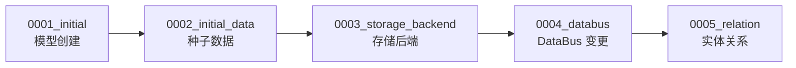

# 04-模型

> **专家**: 任务调度与运维专家
> **文档类型**: 实现层 — 数据模型
> **创建时间**: 2026-07-28

---

## 一、任务相关模型

> 本专家不定义独立的任务模型。Celery 任务直接操作 metadata 模块的核心业务模型（DataSource、ResultTable、ESStorage、InfluxDBStorage、Space 等），这些模型由元数据核心模型专家、存储与数据链路专家、空间与自定义上报专家覆盖。

### 1.1 任务操作的核心模型

| 模型 | 定义位置 | 覆盖专家 | 本专家操作方式 |
|------|---------|---------|--------------|
| `DataSource` | `models/data_source.py` | 元数据核心模型→数据源管理 | 查询、更新 `mq_config`、`is_platform_data_id` |
| `ResultTable` | `models/result_table.py` | 元数据核心模型→结果表管理 | 查询、调用 `refresh_etl_config()` |
| `ESStorage` | `models/storage.py` | 存储与数据链路→存储引擎 | 索引生命周期管理 |
| `InfluxDBStorage` | `models/storage.py` | 存储与数据链路→存储引擎 | 路由刷新 |
| `InfluxDBHostInfo` | `models/influxdb_cluster.py` | 存储与数据链路→存储引擎 | 主机配置刷新 |
| `InfluxDBClusterInfo` | `models/influxdb_cluster.py` | 存储与数据链路→存储引擎 | 集群配置刷新 |
| `ClusterInfo` | `models/storage.py` | 存储与数据链路→存储引擎 | 集群信息查询/创建 |
| `Space` | `models/space/space.py` | 空间与自定义上报→空间管理 | 空间创建/更新/禁用 |
| `EventGroup` | `models/` | 元数据核心模型 | 事件维度同步 |
| `TimeSeriesGroup` | `models/` | 空间与自定义上报→自定义上报 | 时序指标更新 |
| `BkBaseResultTable` | `models/bkdata/result_table.py` | 存储与数据链路 | 计算平台接入 |
| `DataLink` | `models/data_link/data_link.py` | 存储与数据链路→数据链路 | 数据链路状态刷新 |
| `BCSClusterInfo` | `models/bcs/cluster.py` | API与工具库→BCS | BCS 监控信息刷新 |
| `ResourceDefinition` | `models/entity_relation.py` | 元数据核心模型 | Redis 缓存刷新 |
| `RelationDefinition` | `models/entity_relation.py` | 元数据核心模型 | Redis 缓存刷新 |

### 1.2 任务常量

文件：`task/constants.py:1-74`

```python
# 计算平台 V4 链路 KIND-STORAGE 映射
BKBASE_V4_KIND_STORAGE_CONFIGS: list[dict[str, Any]] = [
    {
        "kind": "elasticsearch",
        "namespace": "bk_log",
        "field_mappings": {"domain_name": "host", "port": "port", ...},
        "cluster_type": ClusterInfo.TYPE_ES,
    },
    {
        "kind": "vmstorage",
        "namespace": "bk_monitor",
        "field_mappings": {"domain_name": "insertHost", "port": "insertPort", ...},
        "cluster_type": ClusterInfo.TYPE_VM,
    },
    {
        "kind": "doris",
        "namespace": "bk_log",
        "field_mappings": {"domain_name": "host", "port": "port", ...},
        "cluster_type": ClusterInfo.TYPE_DORIS,
    },
    {
        "kind": "kafkachannel",
        "namespace": "bk_log",
        "field_mappings": {"domain_name": "host", "port": "port", ...},
        "cluster_type": ClusterInfo.TYPE_KAFKA,
    },
    {
        "kind": "kafkachannel",
        "namespace": "bk_monitor",
        "field_mappings": {"domain_name": "host", "port": "port", ...},
        "cluster_type": ClusterInfo.TYPE_KAFKA,
    },
]
```

---

## 二、种子数据结构

### 2.1 结果表种子数据

文件：`data/init_data.json` (177 KB)

```json
{
  "result_table_list": [
    {
      "table_id": "system.cpu_summary",
      "table_name_zh": "CPU",
      "is_custom_table": false,
      "schema_type": "fixed",
      "default_storage": "influxdb",
      "bk_biz_id": 0,
      "label": "os",
      "field_list": [
        {
          "field_name": "usage",
          "field_type": "double",
          "description": "CPU使用率",
          "unit": "percent",
          "tag": "metric"
        }
      ]
    }
  ]
}
```

### 2.2 数据源种子数据

文件：`data/init_datasource.json` (11 KB)

```json
[
  {
    "bk_data_id": 1001,
    "data_name": "system_cpu_summary",
    "data_description": "CPU summary data source",
    "is_platform_data_id": true,
    "etl_config": "bk_standard_v2"
  }
]
```

### 2.3 标签种子数据

文件：`data/init_label.json` (4 KB)

```json
[
  {
    "label_id": "os",
    "label_name": "操作系统",
    "label_type": "system"
  }
]
```

### 2.4 集群信息种子数据

文件：`data/init_cluster_info.json` (666 B)

```json
[
  {
    "cluster_name": "default",
    "cluster_type": "influxdb",
    "is_default_cluster": true
  }
]
```

### 2.5 K8s 指标种子数据

文件：`data/k8s_metrics/*.yaml` (24 个 YAML 文件)

```yaml
# 示例：k8s_metrics/apiserver.yaml
- metric_name: "apiserver_request_total"
  description: "API Server 请求总数"
  dimensions:
    - name: "verb"
      description: "HTTP 动词"
    - name: "resource"
      description: "资源类型"
```

---

## 三、数据库迁移策略

### 3.1 迁移文件结构

| 迁移文件 | 大小 | 类型 | 内容 |
|---------|------|------|------|
| `0001_initial.py` | 115 KB | 模型创建 | 所有 metadata 模型的初始 DDL |
| `0002_initial_data.py` | 7 KB | 数据加载 | 种子数据（label/cluster/datasource/resulttable/storage） |
| `0003_init_storage_backend_info.py` | 3 KB | 数据加载 | 存储后端信息初始化 |
| `0004_*.py` | 4 KB | 模型变更 | DataBusConfig/DataIdConfig 字段变更 |
| `0005_*.py` | 16 KB | 模型变更 | RelationDefinition/ResourceDefinition 新增 |

### 3.2 迁移执行策略



- **前向迁移**: `python manage.py migrate metadata`
- **回滚**: `python manage.py migrate metadata 0003`（回滚到 0003）
- **初始数据幂等**: `0002_initial_data.py` 中通过检查数据是否存在来保证幂等

### 3.3 migration_util 数据加载模式

文件：`migration_util.py`

```python
# 标准加载模式
def add_datasource(models, data_id, data_name, ...):
    """创建数据源，如果已存在则跳过"""
    DataSource = models["DataSource"]
    if not DataSource.objects.filter(bk_data_id=data_id).exists():
        DataSource.objects.create(...)

def add_resulttable(models, table_id, ...):
    """创建结果表及其字段、选项"""
    ResultTable = models["ResultTable"]
    if not ResultTable.objects.filter(table_id=table_id).exists():
        rt = ResultTable.objects.create(...)
        # 创建字段
        for field in field_list:
            ResultTableField.objects.create(table_id=table_id, ...)
        # 创建选项
        for option in option_list:
            ResultTableOption.objects.create(table_id=table_id, ...)
```

### 3.4 迁移注意事项

- `0001_initial.py` 是自动生成的，不应手动修改
- `0002_initial_data.py` 依赖 `data/` 目录下的 JSON 文件，确保文件存在
- 迁移文件中的 `batch_size=500` 用于控制批量写入大小
- `ClusterInfo` 的域名和端口在迁移时写入占位信息，实际值由 `sync_cluster_config` 命令刷入
