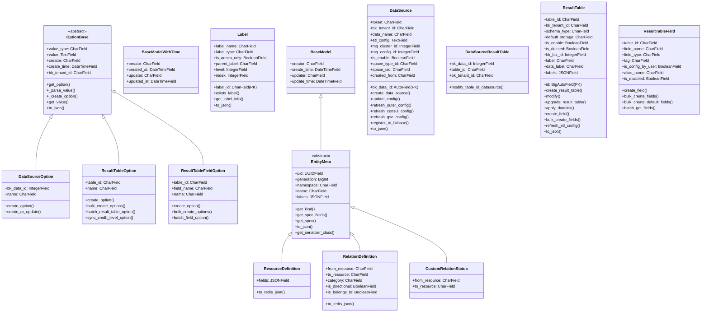
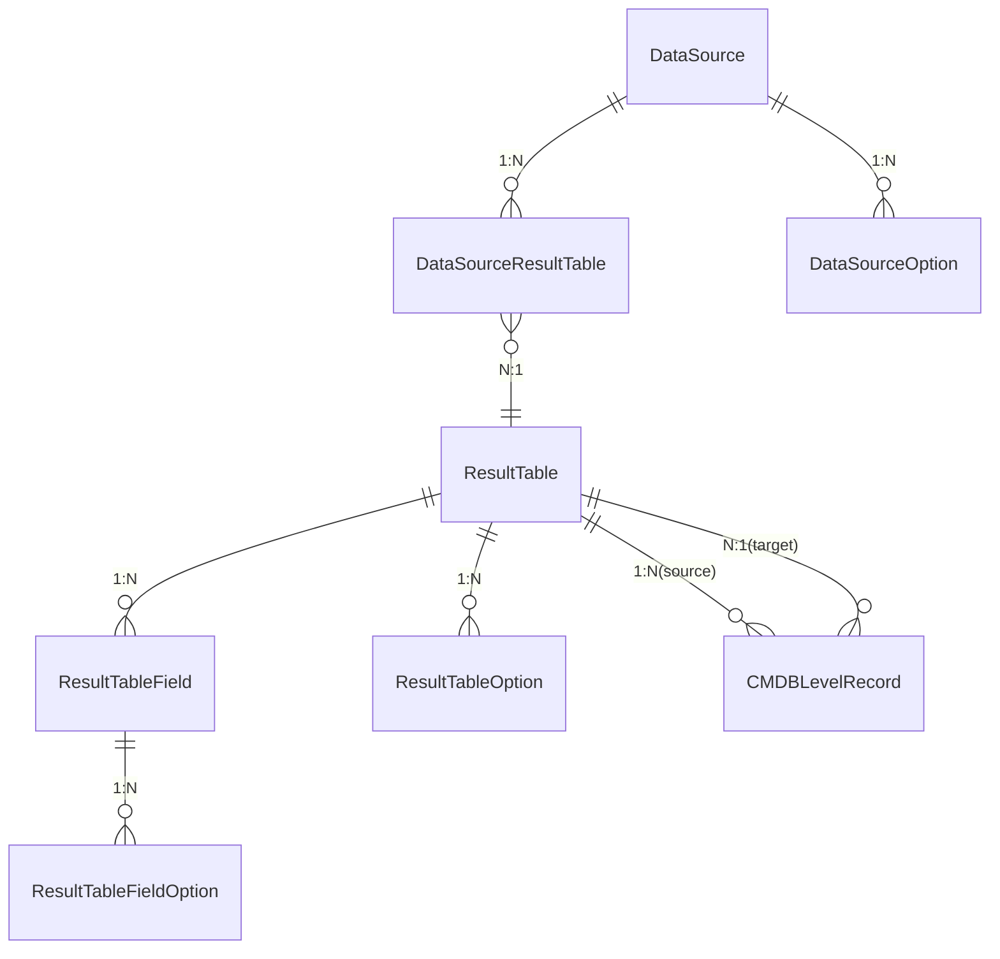

# 01-架构

> **专家**: 元数据核心模型专家
> **类型**: 实现层文档
> **创建时间**: 2026-07-28

---

## 一、模型层整体架构

### 1.1 类层次结构



### 1.2 模型间关系



## 二、继承体系

### 2.1 审计字段抽象

两个抽象基类提供审计字段，不创建数据库表：

- **BaseModel** (`common.py` 行 230-240): `creator`, `create_time`, `updater`, `update_time` — 被 EntityMeta 继承
- **BaseModelWithTime** (`common.py` 行 243-260): `creator`, `created_at`, `updater`, `updated_at` — 用于需要不同时间字段命名的模型

### 2.2 选项体系

**OptionBase** (`common.py` 行 120-228) 是所有选项配置的抽象基类：

```
OptionBase (abstract)
├── DataSourceOption  — 数据源选项
├── ResultTableOption — 结果表选项
└── ResultTableFieldOption — 结果表字段选项
```

核心机制：
- `_parse_value(value)`: 自动识别值类型（bool/list/dict/int/string），转为 JSON 存储
- `get_value()`: 根据 `value_type` 自动反序列化
- `to_json()`: 返回 `{name: value}` 格式

### 2.3 实体元数据体系

**EntityMeta** (`entity_relation.py` 行 25-120) 是类似 Kubernetes 资源模型的抽象基类：

```
EntityMeta (abstract, extends BaseModel)
├── ResourceDefinition  — 资源类型定义
├── RelationDefinition  — 关联关系定义
└── CustomRelationStatus — 自定义关联状态
```

核心设计：
- `get_kind()`: 返回实体类型（默认类名）
- `get_spec_fields()`: 排除 metadata 字段后的规格字段列表
- `get_spec()`: 获取规格字典
- `to_json()`: 生成类似 K8s 的 `{kind, metadata, spec}` 结构
- `get_serializer_class()`: 动态生成 DRF Serializer（带缓存）

### 2.4 存储映射

ResultTable 通过 `REAL_STORAGE_DICT` 类属性维护存储类型到存储类的映射：

```python
REAL_STORAGE_DICT = {
    "elasticsearch": ESStorage,
    "doris": DorisStorage,
    "influxdb": InfluxDBStorage,
    "redis": RedisStorage,
    "kafka": KafkaStorage,
    "bkdata": BkDataStorage,
    "argus": ArgusStorage,
}
```

## 三、关键设计模式

### 3.1 懒加载属性

DataSource 的 `mq_cluster` 和 `mq_config` 使用懒加载模式：

```python
# data_source.py 行 160-175
@property
def mq_cluster(self):
    if self._mq_cluster is None:
        self._mq_cluster = ClusterInfo.objects.get(...)
    return self._mq_cluster
```

ResultTable 的 `data_source` 同理（`result_table.py` 行 228-235）。

### 3.2 事务原子性

关键写操作使用 `@atomic(config.DATABASE_CONNECTION_NAME)` 确保一致性：

- `DataSource.create_data_source()` — 创建数据源 + MQ 配置 + option
- `ResultTable.create_result_table()` — 创建结果表 + 字段 + 存储 + 数据源映射
- `ResultTable.modify()` — 修改结果表 + 字段重建 + option 更新
- `ResultTable.upgrade_result_table()` — 升级 + 字段迁移 + 存储迁移

### 3.3 批量操作

为避免 N+1 查询，关键查询使用批量模式：

- `ResultTableField.batch_get_fields()` — 批量获取字段
- `ResultTableOption.batch_result_table_option()` — 批量获取选项
- `ResultTable.batch_to_json()` — 批量序列化
- `DataSource.to_json()` 中批量获取 `real_table_ids`、`table_id_option_dict`、`table_field_dict`

### 3.4 延迟任务

数据链路应用使用 `on_commit` 确保事务提交后再执行异步任务：

```python
# result_table.py 行 650-660
on_commit(
    func=lambda: access_bkdata_vm.delay(...),
    using=config.DATABASE_CONNECTION_NAME,
)
```

---

> **下一步**: 查阅 [02-实现.md](02-实现.md) 了解核心实现细节。
