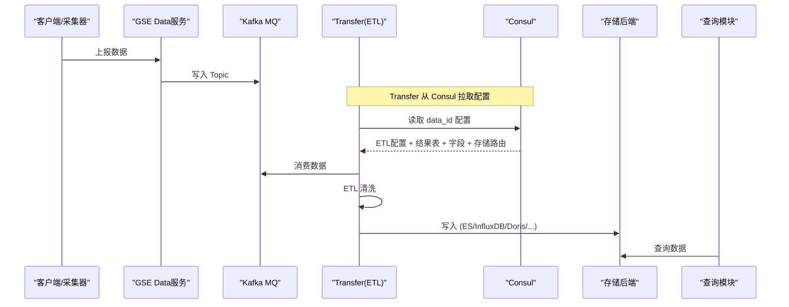
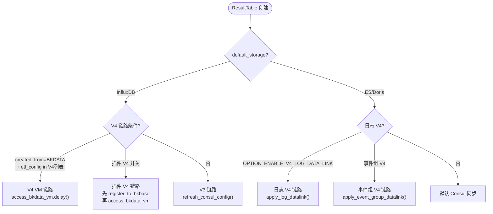
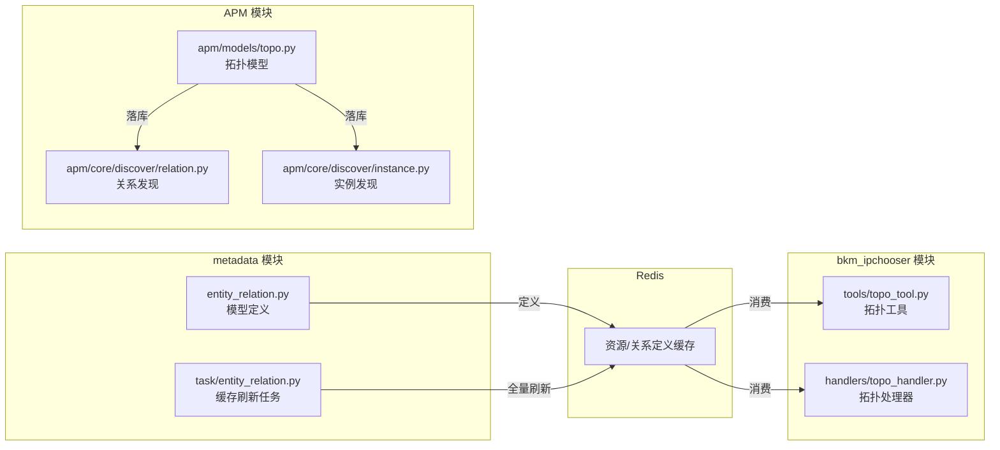
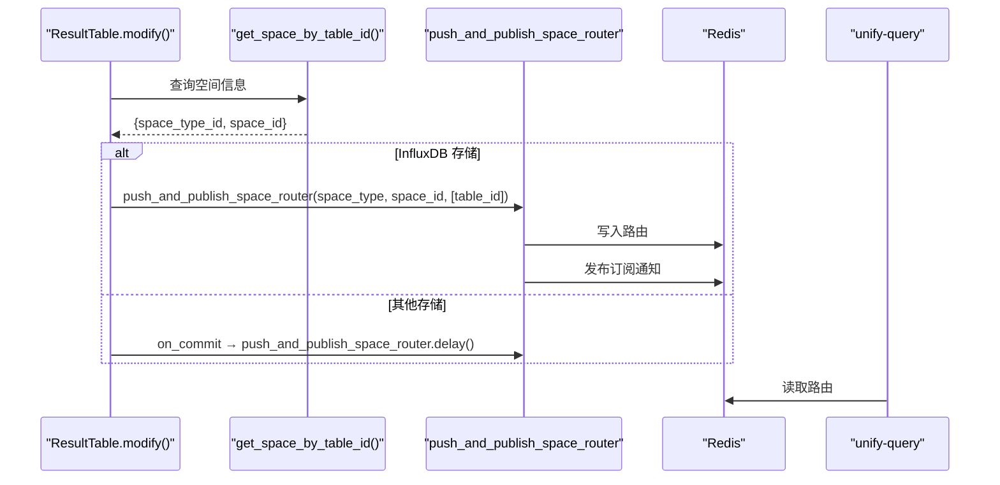

# 03-数据流转

> **专家**: 元数据核心模型专家
> **类型**: 实现层文档
> **创建时间**: 2026-07-28

---

## 一、数据源→结果表→存储引擎 数据链路

### 1.1 整体数据流



### 1.2 DataSource 配置同步到 Consul

**触发时机**:
- 数据源创建 (`create_data_source` → `refresh_outer_config`)
- 数据源更新 (`update_config` → `refresh_outer_config`)
- 结果表创建/修改 (`refresh_etl_config` → `data_source.refresh_consul_config`)

**Consul 路径**: `{CONSUL_PATH}/data_id/{transfer_cluster_id}/{data_id}`

**同步内容** (`DataSource.to_json(is_consul_config=True)`):
```json
{
  "bk_data_id": 1001,
  "bk_tenant_id": "system",
  "mq_config": {
    "storage_config": {"topic": "xxx", "partition": 1},
    "batch_size": 1000,
    "cluster_config": {...}
  },
  "etl_config": "bk_standard",
  "option": {...},
  "result_table_list": [
    {
      "bk_biz_id": 2,
      "result_table": "system.cpu_summary",
      "shipper_list": [{"cluster_type": "influxdb", ...}],
      "field_list": [...],
      "schema_type": "free",
      "option": {...}
    }
  ]
}
```

### 1.3 GSE 路由同步

**触发时机**: `refresh_gse_config()` → `refresh_gse_config_to_gse()`

**流程**:
1. 查询 GSE 现有路由
2. MD5 比对新旧配置
3. 不一致则调用 `api.gse.update_route()` 更新

**路由配置** (`DataSource.gse_route_config`):
```json
{
  "name": "stream_to_{plat_name}_{mq_type}_{topic}",
  "stream_to": {
    "stream_to_id": 1,
    "kafka": {"topic_name": "xxx"}
  }
}
```

## 二、ResultTable 创建时的数据链路选择

### 2.1 链路决策树



### 2.2 V4 链路条件详解

**必须同时满足**:
1. `settings.metadata.enable_v2_vm_data_link` 为 True（或 `enable_influxdb_storage` 为 False）
2. `DataSource.etl_config` 在 `ENABLE_V4_DATALINK_ETL_CONFIGS` 列表中
3. `DataSource.created_from == DataIdCreatedFromSystem.BKDATA.value`

**插件 V4 额外条件**:
- `ResultTableOption.OPTION_ENABLE_PLUGIN_V4_DATA_LINK` 为 True
- `DataSource.etl_config` 为 `bk_exporter` 或 `bk_standard`
- 如果 `created_from == BKGSE`，先调用 `register_to_bkbase()`

### 2.3 日志 V4 链路

**条件**: `default_storage` 为 ES 或 Doris，且 `OPTION_ENABLE_V4_LOG_DATA_LINK` 为 True

**执行**: `apply_log_datalink(bk_tenant_id, table_id)`

### 2.4 事件组 V4 链路

**条件**: `DataSource.etl_config == bk_standard_v2_event`

**执行**: `apply_event_group_datalink(bk_tenant_id, table_id)`

## 三、EntityRelation 跨模块数据流

### 3.1 整体架构



### 3.2 数据流向

1. **定义阶段**: metadata 侧通过 `ResourceDefinition` / `RelationDefinition` 定义实体类型和关系
2. **缓存阶段**: `task/entity_relation.py` 全量刷新任务将定义写入 Redis，通过发布订阅通知消费者
3. **发现阶段**: APM 侧通过 OTLP Span 自动发现拓扑节点、关系和实例
4. **查询阶段**: bkm_ipchooser 通过 Redis 缓存查询实体关系

### 3.3 本专家范围边界

| 层 | 位置 | 本专家覆盖 |
|----|------|-----------|
| 模型定义 | `metadata/models/entity_relation.py` | ✅ 全部 |
| 缓存刷新 | `metadata/task/entity_relation.py` | ❌ 归任务调度与运维专家 |
| APM 发现 | `apm/core/discover/` | ❌ 归 APM 模块 |
| 拓扑查询 | `bkm_ipchooser/` | ❌ 归 bkm_ipchooser 模块 |

## 四、空间路由数据流

### 4.1 结果表启用时的路由推送



### 4.2 数据源的空间归属

数据源通过 `SpaceDataSource` 表维护空间归属关系：
- `from_authorization=False`: 归属空间
- `from_authorization=True`: 授权空间

---

> **下一步**: 查阅 [04-模型.md](04-模型.md) 了解数据模型定义。
