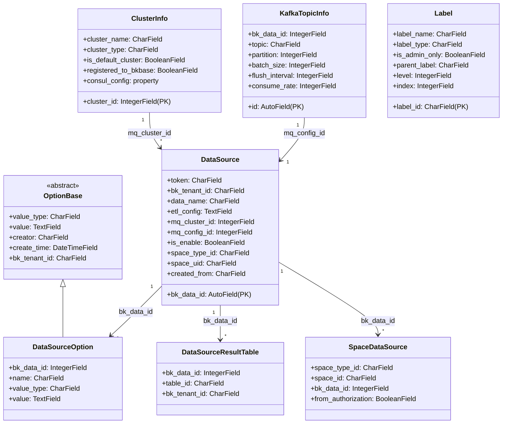
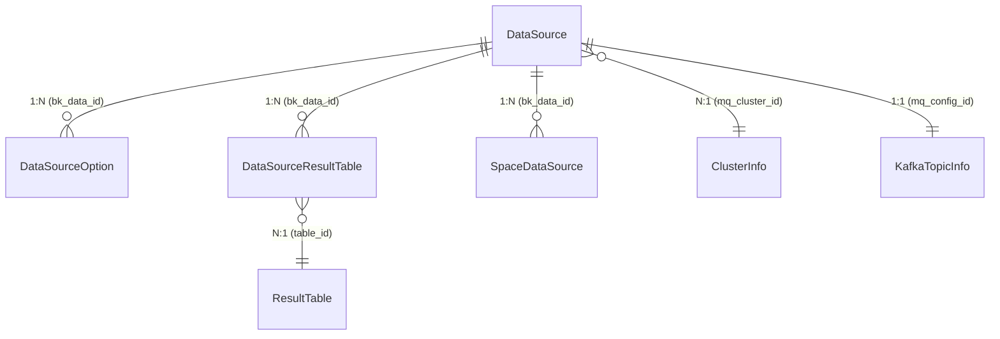

# 01-架构

> **子专家**: 数据源管理子专家
> **类型**: 实现层文档
> **创建时间**: 2026-07-28

---

## 一、DataSource 模型架构

### 1.1 类层次结构



### 1.2 模型间关系



## 二、继承体系

### 2.1 DataSource 直接继承

DataSource 直接继承 `models.Model`（Django 标准模型），不经过任何抽象基类。审计字段（`creator`、`create_time`、`last_modify_user`、`last_modify_time`）直接在模型内定义。

**文件**: `data_source.py` 行 60-130

### 2.2 DataSourceOption 继承

```
OptionBase (abstract, common.py 行 120-228)
└── DataSourceOption (data_source.py 行 1275-1360)
```

DataSourceOption 通过 OptionBase 获得：
- `_parse_value(value)`: 自动识别值类型
- `get_value()`: 自动反序列化
- `to_json()`: 返回 `{name: value}`

### 2.3 DataSourceResultTable 直接继承

直接继承 `models.Model`，是数据源与结果表的纯映射表。

## 三、关键设计模式

### 3.1 懒加载属性

DataSource 的 `mq_cluster` 和 `mq_config` 使用懒加载模式，首次访问时才查询数据库：

```python
# data_source.py 行 160-175
@property
def mq_cluster(self):
    if self._mq_cluster is None:
        self._mq_cluster = ClusterInfo.objects.get(
            bk_tenant_id=self.bk_tenant_id, cluster_id=self.mq_cluster_id
        )
    return self._mq_cluster
```

**设计意图**：避免每次实例化 DataSource 都触发额外的数据库查询。仅在需要集群信息时才加载。

### 3.2 事务原子性

`create_data_source()` 使用 `@atomic(config.DATABASE_CONNECTION_NAME)` 确保以下操作在同一事务中：
- 创建 DataSource 记录
- 创建 KafkaTopicInfo（MQ 配置）
- 回填 `mq_config_id`
- 创建 DataSourceOption

**文件**: `data_source.py` 行 635-680

### 3.3 自增 ID 范围校验

由于 DataID 可能由外部系统（GSE/BkData）分配，自增 ID 需要校验范围：

```python
# data_source.py 行 640-660
if data_source.bk_data_id < config.MIN_DATA_ID:
    if cls.objects.filter(bk_data_id=config.MIN_DATA_ID).exists():
        raise ValueError("数据源ID生成异常")
    data_source.delete()
    data_source.bk_data_id = config.MIN_DATA_ID
    data_source.save()

if data_source.bk_data_id > config.MAX_DATA_ID:
    raise ValueError("数据源ID分配达到最大上限")
```

### 3.4 配置同步策略

`refresh_outer_config()` 是配置同步的统一入口，但仅对特定条件的数据源生效：

```python
# data_source.py 行 1250-1270
def refresh_outer_config(self):
    if not self.can_refresh_consul_and_gse():
        return True  # 跳过：未启用 或 非 BKGSE 来源
    self.refresh_gse_config()   # GSE ZK 路由
    self.refresh_consul_config() # Consul ETL 配置
```

`can_refresh_consul_and_gse()` 检查条件：
- `is_enable == True`
- `created_from == BKGSE`

### 3.5 空间 UID 推导

DataSource 创建时，`space_uid` 可以从多个来源推导：

```python
# data_source.py 行 670-690
if space_uid:
    # 直接提供：解析 space_type_id__space_id 格式
    space_type_id, space_id = space_uid.split(SPACE_UID_HYPHEN)
elif bk_biz_id:
    # 从业务ID推导：查询 Space 表
    if bk_biz_id > 0:
        space = Space.objects.get(space_type_id=SpaceTypes.BKCC.value, space_id=str(bk_biz_id))
    else:
        space = Space.objects.get(id=-bk_biz_id)
    data_source.space_uid = space.space_uid
```

---

> **下一步**: 查阅 [02-实现.md](02-实现.md) 了解 DataSource 的核心实现细节。
