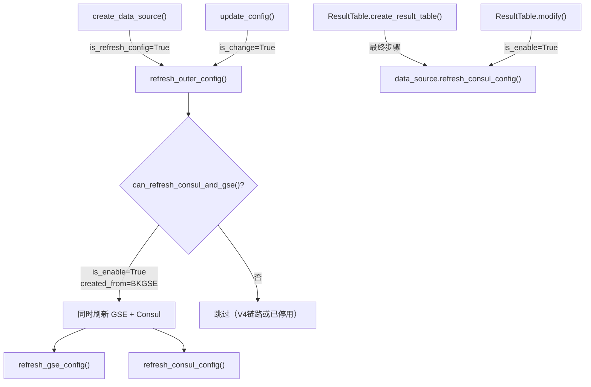
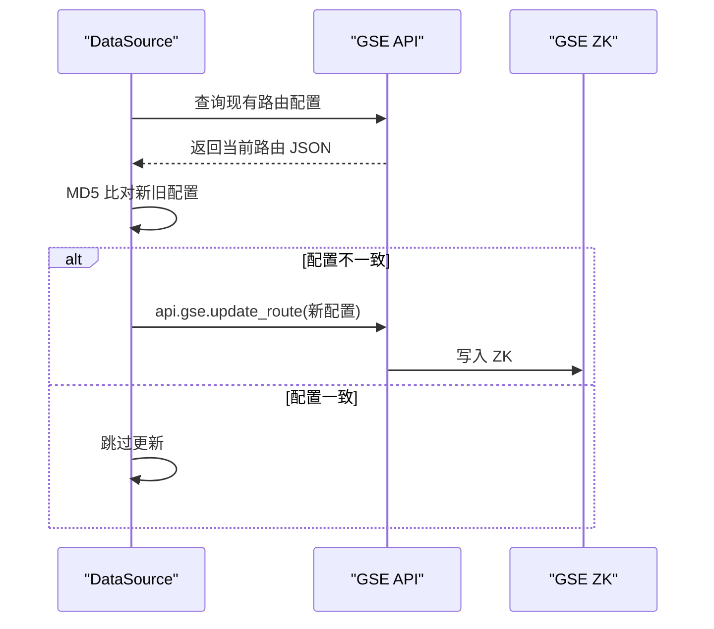
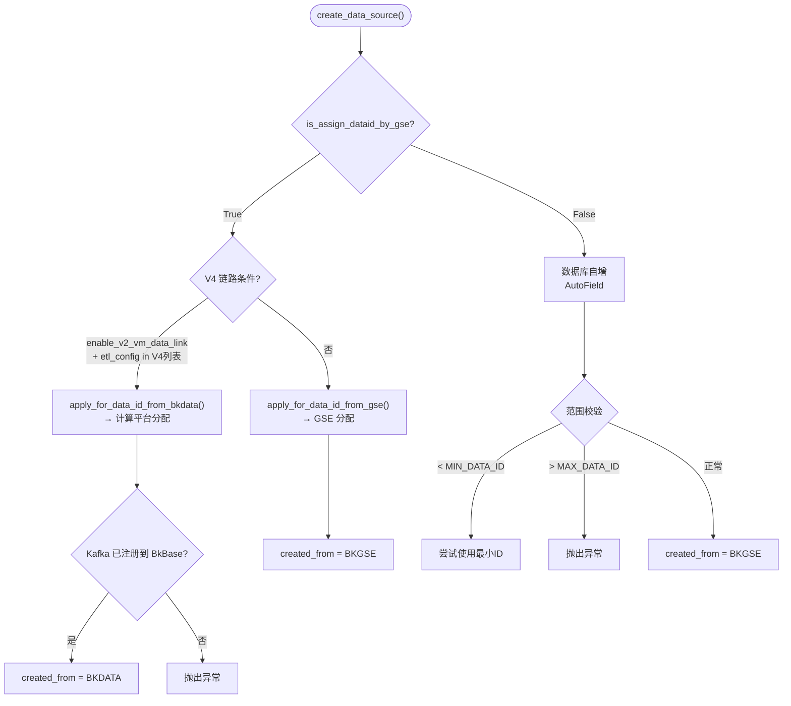
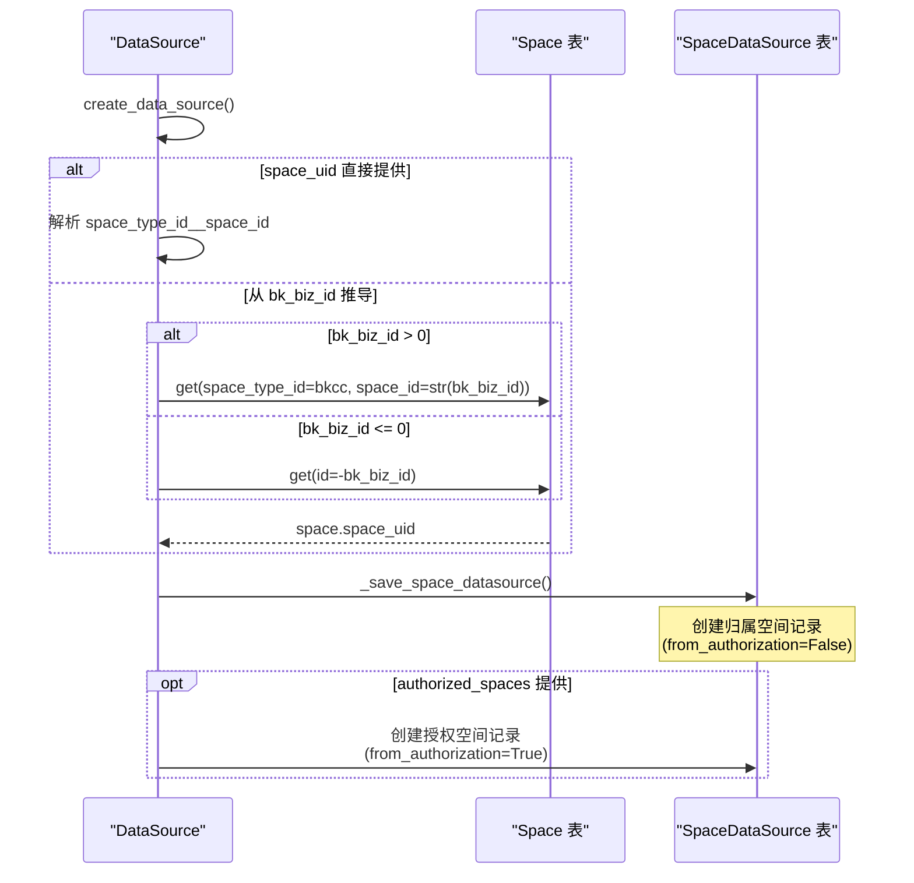
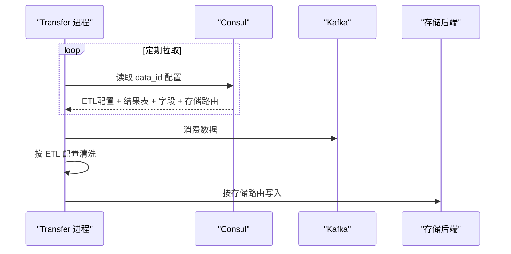

# 03-数据流转

> **子专家**: 数据源管理子专家
> **类型**: 实现层文档
> **创建时间**: 2026-07-28

---

## 一、配置同步全景图

### 1.1 同步触发时机



### 1.2 同步内容对比

| 同步目标 | 方法 | 内容 | 消费者 |
|---------|------|------|--------|
| **Consul** | `refresh_consul_config()` | DataSource 完整配置（含结果表列表、字段、存储路由） | Transfer（ETL 清洗进程） |
| **GSE ZK** | `refresh_gse_config()` | Kafka 路由配置（topic、partition） | GSE Data 服务 |

## 二、Consul 配置同步

### 2.1 同步路径

```
Consul 路径: {CONSUL_PATH}/data_id/{transfer_cluster_id}/{data_id}
```

其中：
- `CONSUL_PATH` 为 Consul 配置根路径
- `transfer_cluster_id` 为 Transfer 集群 ID（默认 `"default"`）
- `data_id` 为数据源 ID

### 2.2 同步内容

`to_json(is_consul_config=True)` 生成的 Consul 配置：

```json
{
  "bk_data_id": 1001,
  "data_id": 1001,
  "bk_tenant_id": "system",
  "mq_config": {
    "storage_config": {"topic": "bkmonitor_1001", "partition": 1},
    "batch_size": 1000,
    "flush_interval": 1000,
    "consume_rate": 1000,
    "cluster_config": {
      "host": "kafka-broker:9092",
      "port": 9092,
      "version": "2.4"
    }
  },
  "etl_config": "bk_standard_v2_time_series",
  "option": {
    "drop_metrics_etl_configs": true,
    "time_precision": "ms"
  },
  "type_label": "time_series",
  "source_label": "custom",
  "token": "xxxx",
  "transfer_cluster_id": "default",
  "data_name": "my_metric",
  "is_platform_data_id": false,
  "space_type_id": "bkcc",
  "space_uid": "bkcc__2",
  "bk_biz_id": 2,
  "result_table_list": [
    {
      "bk_biz_id": 2,
      "bk_tenant_id": "system",
      "result_table": "my_metric",
      "shipper_list": [
        {
          "cluster_type": "influxdb",
          "cluster_config": {...}
        }
      ],
      "field_list": [
        {"field_name": "time", "field_type": "timestamp", "tag": "timestamp"},
        {"field_name": "value", "field_type": "float", "tag": "metric"}
      ],
      "schema_type": "free",
      "option": {"segmented_query_enable": true}
    }
  ]
}
```

### 2.3 同步实现

```python
# data_source.py 行 1200-1250
def refresh_consul_config(self):
    # 跳过黑名单中的数据源
    if self.bk_data_id in IGNORED_CONSUL_SYNC_DATA_IDS:
        logger.info("data_id->[%s] is in ignored list, skip consul sync", self.bk_data_id)
        return
    
    consul_path = self.consul_config_path
    consul_config = self.to_json(is_consul_config=True)
    
    # 写入 Consul
    hash_consul.put(consul_path, consul_config)
```

### 2.4 Consul 配置删除

当数据源停用时，删除 Consul 配置：

```python
# data_source.py 行 880-885
if not is_enable:
    consul_client = consul.BKConsul()
    consul_client.kv.delete(self.consul_config_path)
```

## 三、GSE 路由同步

### 3.1 同步流程



### 3.2 路由配置结构

```python
# data_source.py 行 1090-1120
@property
def gse_route_config(self):
    return {
        "name": f"stream_to_{plat_name}_{mq_type}_{topic}",
        "stream_to": {
            "stream_to_id": self.bk_data_id,
            "kafka": {
                "topic_name": self.mq_config.topic,
                "partition": self.mq_config.partition,
            }
        }
    }
```

### 3.3 同步实现

```python
# data_source.py 行 1150-1200
def refresh_gse_config_to_gse(self):
    # 1. 查询 GSE 现有路由
    existing_routes = api.gse.get_route()
    
    # 2. 构建新路由配置
    new_route = self.gse_route_config
    
    # 3. MD5 比对
    existing_md5 = md5(json.dumps(existing_routes))
    new_md5 = md5(json.dumps(new_route))
    
    if existing_md5 != new_md5:
        # 4. 更新路由
        api.gse.update_route(new_route)
```

## 四、DataID 分配数据流

### 4.1 三种分配策略



### 4.2 V4 链路 DataID 申请

```python
# data_source.py 行 580-610
# V4 链路条件
if (settings.metadata.enable_v2_vm_data_link
    and etl_config in ENABLE_V4_DATALINK_ETL_CONFIGS) \
   or enabled_custom_event_v4:
    
    # 前置条件：Kafka 已注册
    if not mq_cluster.registered_to_bkbase:
        raise ValueError("kafka cluster is not registered to bkbase")
    
    # 判断数据类型
    if etl_config in SYSTEM_BASE_DATA_ETL_CONFIGS:
        is_base = True
    if etl_config in LOG_EVENT_ETL_CONFIGS:
        event_type = "log"
    else:
        event_type = "metric"
    
    bk_data_id = cls.apply_for_data_id_from_bkdata(
        bk_tenant_id=bk_tenant_id,
        data_name=data_name,
        bk_biz_id=bk_biz_id,
        is_base=is_base,
        event_type=event_type,
        prefer_kafka_cluster_name=mq_cluster.cluster_name,
    )
    created_from = DataIdCreatedFromSystem.BKDATA.value
```

## 五、空间归属数据流

### 5.1 空间关系建立



### 5.2 _save_space_datasource 实现

```python
# data_source.py 行 1435-1480
def _save_space_datasource(self, creator, space_type_id, space_id,
                            bk_tenant_id, bk_data_id, authorized_spaces=None):
    # 创建归属空间记录
    SpaceDataSource.objects.get_or_create(
        bk_data_id=bk_data_id,
        bk_tenant_id=bk_tenant_id,
        from_authorization=False,
        defaults={
            "space_id": space_id,
            "space_type_id": space_type_id,
        }
    )
    
    # 处理授权空间
    if authorized_spaces:
        for auth_space in authorized_spaces:
            SpaceDataSource.objects.get_or_create(
                bk_data_id=bk_data_id,
                bk_tenant_id=bk_tenant_id,
                space_id=auth_space["space_id"],
                space_type_id=auth_space["space_type_id"],
                from_authorization=True,
            )
```

## 六、Consul 配置消费端

### 6.1 Transfer 消费流程



### 6.2 配置变更感知

Transfer 通过 Consul Watch 机制感知配置变更，无需重启即可应用新的 ETL 配置。

---

> **下一步**: 查阅 [04-模型.md](04-模型.md) 了解 DataSource 相关数据模型定义。
