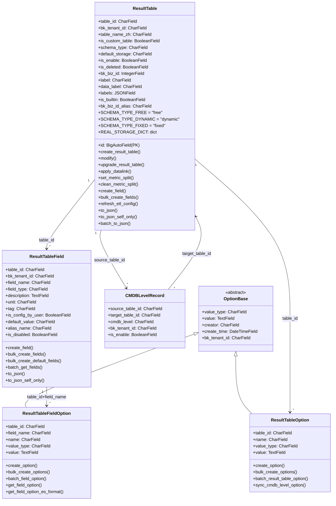
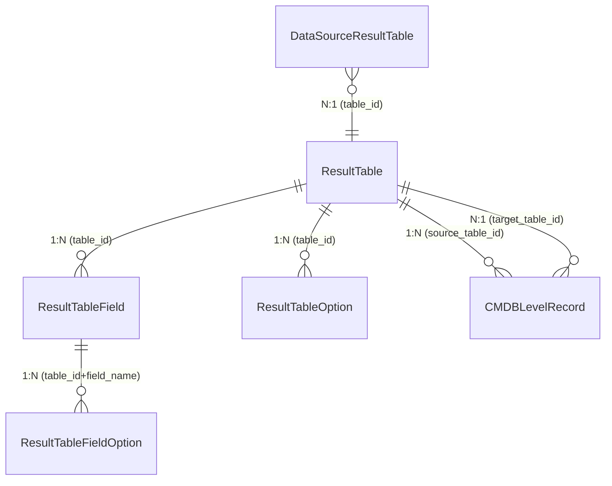

# 01-架构

> **子专家**: 结果表管理子专家
> **类型**: 实现层文档
> **创建时间**: 2026-07-28

---

## 一、ResultTable 模型架构

### 1.1 类层次结构



### 1.2 模型间关系



## 二、继承体系

### 2.1 ResultTable 直接继承

ResultTable 直接继承 `models.Model`（Django 标准模型），不经过任何抽象基类。审计字段（`creator`、`create_time`、`last_modify_user`、`last_modify_time`）直接在模型内定义。

**文件**: `result_table.py` 行 58-117

### 2.2 选项体系继承

```
OptionBase (abstract, common.py 行 120-228)
├── ResultTableOption (result_table.py 行 2860-2960)
└── ResultTableFieldOption (result_table.py 行 3000-3150)
```

### 2.3 存储映射

ResultTable 通过 `REAL_STORAGE_DICT` 类属性维护存储类型到存储类的映射：

```python
# result_table.py 行 120-140
REAL_STORAGE_DICT = {
    "elasticsearch": ESStorage,
    "doris": DorisStorage,
    "influxdb": InfluxDBStorage,
    "redis": RedisStorage,
    "kafka": KafkaStorage,
    "bkdata": BkDataStorage,
    "argus": ArgusStorage,
}
```

## 三、关键设计模式

### 3.1 懒加载属性

ResultTable 通过 `get_related_datasource()` 懒加载关联的 DataSource：

```python
# result_table.py 行 228-235
def get_related_datasource(self, refresh=False):
    if self._data_source is None or refresh:
        ds_rt = DataSourceResultTable.objects.filter(
            table_id=self.table_id, bk_tenant_id=self.bk_tenant_id
        ).first()
        if ds_rt:
            self._data_source = DataSource.objects.get(
                bk_data_id=ds_rt.bk_data_id, bk_tenant_id=self.bk_tenant_id
            )
    return self._data_source
```

### 3.2 事务原子性

关键写操作使用 `@atomic(config.DATABASE_CONNECTION_NAME)` 确保一致性：

- `create_result_table()` — 创建结果表 + 字段 + 存储 + 数据源映射
- `modify()` — 修改结果表 + 字段重建 + option 更新
- `upgrade_result_table()` — 升级 + 字段迁移 + 存储迁移

### 3.3 批量操作

为避免 N+1 查询，关键查询使用批量模式：

- `ResultTableField.batch_get_fields()` — 批量获取字段
- `ResultTableOption.batch_result_table_option()` — 批量获取选项
- `ResultTableFieldOption.batch_field_option()` — 批量获取字段选项
- `ResultTable.batch_to_json()` — 批量序列化

### 3.4 延迟任务

数据链路应用使用 `on_commit` 确保事务提交后再执行异步任务：

```python
# result_table.py 行 650-660
on_commit(
    func=lambda: access_bkdata_vm.delay(
        bk_tenant_id, target_bk_biz_id, table_id, bk_data_id,
        is_v4_datalink_etl_config, force_update=force_update,
    ),
    using=config.DATABASE_CONNECTION_NAME,
)
```

### 3.5 raw_delete 绕过 Django ORM

对于需要高性能批量删除的场景，使用 `raw_delete` 绕过 Django ORM：

```python
# result_table.py 行 200-210
@staticmethod
def raw_delete(qs, using=config.DATABASE_CONNECTION_NAME):
    """使用原始 SQL 批量删除，绕过 Django 的 model.delete()"""
    qs._raw_delete(using)
```

### 3.6 重试机制

部分外部 API 调用使用 `tenacity` 库的重试机制：

```python
# result_table.py 行 30-35
@retry(stop=stop_after_attempt(3), wait=wait_exponential(multiplier=1, min=2, max=10))
def some_external_call():
    ...
```

---

> **下一步**: 查阅 [02-实现.md](02-实现.md) 了解 ResultTable 的核心实现细节。
