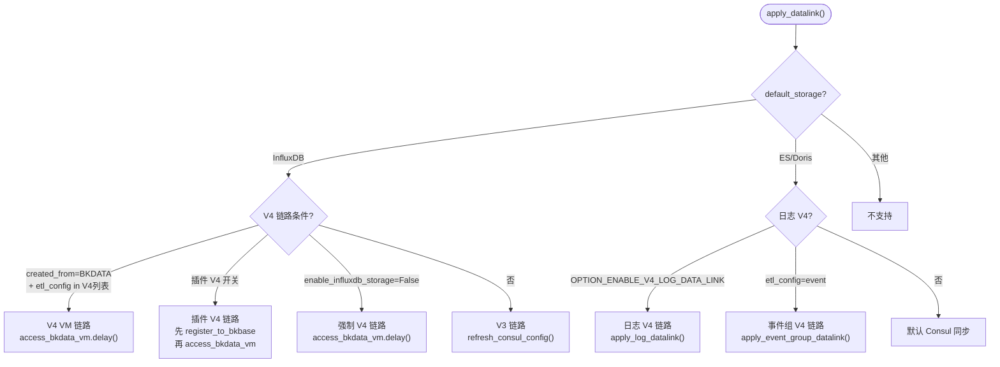
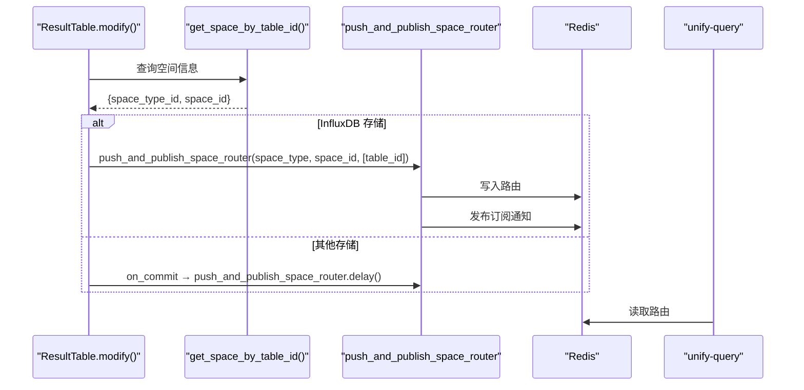
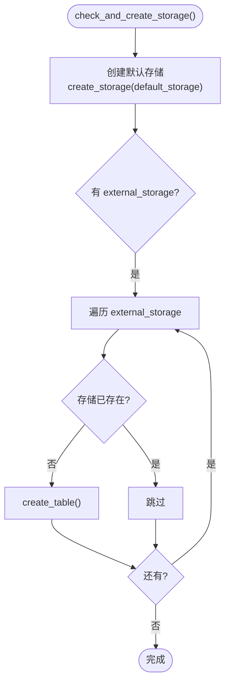
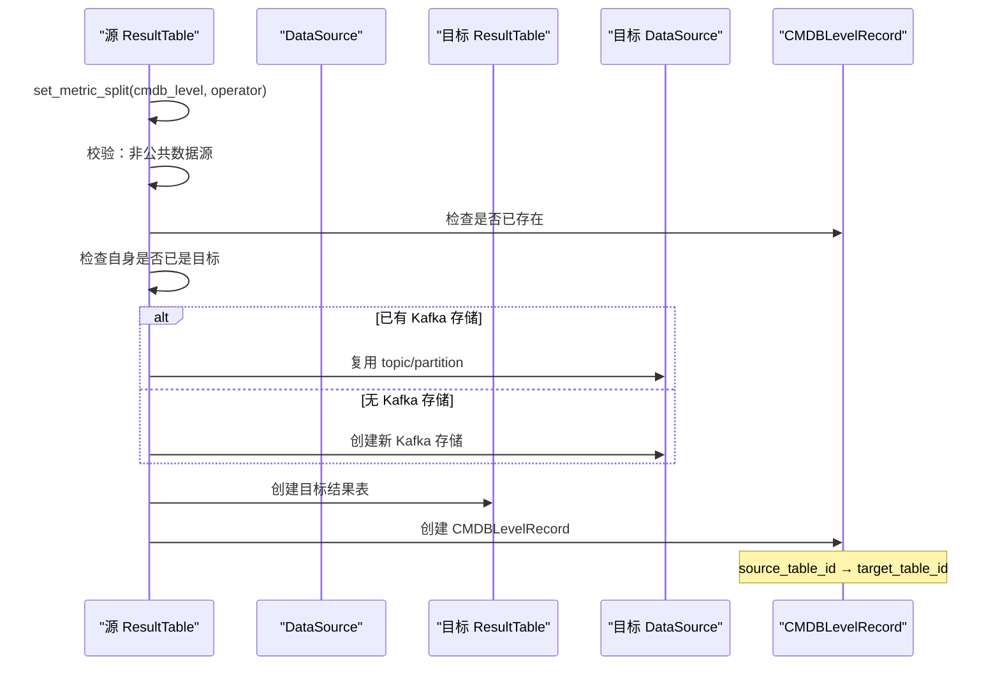

# 03-数据流转

> **子专家**: 结果表管理子专家
> **类型**: 实现层文档
> **创建时间**: 2026-07-28

---

## 一、数据链路选择决策树

### 1.1 完整决策树



### 1.2 V4 链路条件详解

**必须同时满足**:
1. `settings.metadata.enable_v2_vm_data_link` 为 True（或 `enable_influxdb_storage` 为 False）
2. `DataSource.etl_config` 在 `ENABLE_V4_DATALINK_ETL_CONFIGS` 列表中
3. `DataSource.created_from == DataIdCreatedFromSystem.BKDATA.value`

**关键代码** (`result_table.py` 行 620-640):
```python
is_v4_datalink_etl_config = (
    datasource.created_from == DataIdCreatedFromSystem.BKDATA.value
    and datasource.etl_config in ENABLE_V4_DATALINK_ETL_CONFIGS
)
```

### 1.3 插件 V4 链路额外条件

- `ResultTableOption.OPTION_ENABLE_PLUGIN_V4_DATA_LINK` 为 True
- `DataSource.etl_config` 为 `bk_exporter` 或 `bk_standard`
- 如果 `created_from == BKGSE`，先调用 `register_to_bkbase()`

```python
# result_table.py 行 642-650
is_plugin_v4_datalink = options.get(
    ResultTableOption.OPTION_ENABLE_PLUGIN_V4_DATA_LINK, False
) and datasource.etl_config in [EtlConfigs.BK_EXPORTER.value, EtlConfigs.BK_STANDARD.value]

if is_plugin_v4_datalink and not is_v4_datalink_etl_config:
    is_v4_datalink_etl_config = True
```

### 1.4 日志 V4 链路

**条件**: `default_storage` 为 ES 或 Doris，且 `OPTION_ENABLE_V4_LOG_DATA_LINK` 为 True

```python
# result_table.py 行 670-675
elif self.default_storage in [ClusterInfo.TYPE_ES, ClusterInfo.TYPE_DORIS]:
    if options and options.get(ResultTableOption.OPTION_ENABLE_V4_LOG_DATA_LINK, False):
        apply_log_datalink(bk_tenant_id=self.bk_tenant_id, table_id=self.table_id)
```

### 1.5 事件组 V4 链路

**条件**: `DataSource.etl_config == bk_standard_v2_event`

```python
# result_table.py 行 676-678
elif datasource.etl_config == EtlConfigs.BK_STANDARD_V2_EVENT.value:
    apply_event_group_datalink(bk_tenant_id=self.bk_tenant_id, table_id=self.table_id)
```

## 二、空间路由数据流

### 2.1 结果表启用时的路由推送



### 2.2 路由推送实现

```python
# result_table.py 行 1390-1410
space_info = get_space_by_table_id(self.table_id, bk_tenant_id=self.bk_tenant_id)
space_type, space_id = space_info.get("space_type_id"), space_info.get("space_id")

if self.default_storage == ClusterInfo.TYPE_INFLUXDB:
    if space_id and space_type:
        # 同步推送
        push_and_publish_space_router(space_type, space_id, table_id_list=[self.table_id])
    else:
        # 异步推送（on_commit）
        on_commit(
            func=lambda: push_and_publish_space_router.delay(
                space_type, space_id, table_id_list=[self.table_id]
            ),
            using=config.DATABASE_CONNECTION_NAME,
        )
```

## 三、ETL 配置刷新

### 3.1 触发时机

- 结果表创建：`create_result_table()` → `apply_datalink()` → `refresh_consul_config()`
- 结果表修改：`modify()` → `is_enable=True` → `apply_datalink()` → `refresh_consul_config()`
- 字段创建：`create_field()` → `refresh_etl_config()`

### 3.2 refresh_etl_config 实现

```python
# result_table.py 行 1100-1145
def refresh_etl_config(self):
    """刷新 ETL 配置到 Consul"""
    datasource = self.get_related_datasource()
    if datasource and datasource.can_refresh_consul_and_gse():
        datasource.refresh_consul_config()
    return True
```

## 四、存储创建数据流

### 4.1 check_and_create_storage



### 4.2 存储创建实现

```python
# result_table.py 行 800-880
def check_and_create_storage(self, is_sync_db, external_storage=None,
                              default_storage_config=None, bk_tenant_id=DEFAULT_TENANT_ID):
    # 1. 创建默认存储
    self.create_storage(
        storage=self.default_storage,
        is_sync_db=is_sync_db,
        bk_tenant_id=bk_tenant_id,
        **default_storage_config,
    )
    
    # 2. 创建额外存储
    external_storage = external_storage or {}
    for storage_type, storage_config in external_storage.items():
        storage_class = self.REAL_STORAGE_DICT[storage_type]
        if storage_class.objects.filter(table_id=self.table_id, bk_tenant_id=bk_tenant_id).exists():
            continue  # 已存在，跳过
        self.create_storage(
            storage=storage_type,
            is_sync_db=is_sync_db,
            bk_tenant_id=bk_tenant_id,
            **storage_config,
        )
```

## 五、CMDB 层级拆分数据流

### 5.1 拆分流程



### 5.2 级联更新

当源结果表修改字段时，所有 CMDB 拆分目标表级联更新：

```python
# result_table.py 行 1220-1240
record_list = CMDBLevelRecord.enable_object.filter(
    source_table_id=self.table_id, bk_tenant_id=self.bk_tenant_id
)
for record in record_list:
    target_table = ResultTable.objects.get(
        table_id=record.target_table_id, bk_tenant_id=self.bk_tenant_id
    )
    target_table.modify(operator=operator, field_list=field_list, include_cmdb_level=True)
```

---

> **下一步**: 查阅 [04-模型.md](04-模型.md) 了解 ResultTable 相关数据模型定义。
