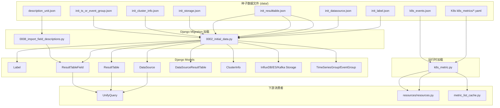
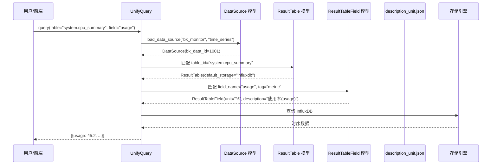

# 01-架构

> **专家**: 元数据种子数据与数据字典专家
> **层级**: 实现层
> **最后更新**: 2026-07-29

---

**本文引用的文件**

| 文件 | 路径 |
|------|------|
| 种子数据目录 | [file:///root/bk-monitor/bk-monitor-base/src/bk_monitor_base/metadata/data/](file:///root/bk-monitor/bk-monitor-base/src/bk_monitor_base/metadata/data/) |
| Migration 加载入口 | [file:///root/bk-monitor/bk-monitor-base/src/bk_monitor_base/metadata/migrations/0002_initial_data.py](file:///root/bk-monitor/bk-monitor-base/src/bk_monitor_base/metadata/migrations/0002_initial_data.py) |
| 旧版 Migration | [file:///root/bk-monitor/bkmonitor/metadata/migrations/0002_create_initial_metadata.py](file:///root/bk-monitor/bkmonitor/metadata/migrations/0002_create_initial_metadata.py) |
| description_unit 导入 | [file:///root/bk-monitor/bkmonitor/metadata/migrations/0008_import_field_descriptions.py](file:///root/bk-monitor/bkmonitor/metadata/migrations/0008_import_field_descriptions.py) |
| K8s 指标加载（base） | [file:///root/bk-monitor/bk-monitor-base/src/bk_monitor_base/metadata/utils/k8s_metric.py](file:///root/bk-monitor/bk-monitor-base/src/bk_monitor_base/metadata/utils/k8s_metric.py) |
| K8s 指标加载（bkmonitor） | [file:///root/bk-monitor/bkmonitor/bkmonitor/utils/k8s_metric.py](file:///root/bk-monitor/bkmonitor/bkmonitor/utils/k8s_metric.py) |
| K8s 指标消费 | [file:///root/bk-monitor/bkmonitor/metadata/resources/resources.py](file:///root/bk-monitor/bkmonitor/metadata/resources/resources.py) |
| UnifyQuery 消费示例 | [file:///root/bk-monitor/bkmonitor/packages/monitor_web/cc/resources/cmdb.py](file:///root/bk-monitor/bkmonitor/packages/monitor_web/cc/resources/cmdb.py) |

---

## 目录

- 一、种子数据目录结构
- 二、数据源 → 结果表 → 字段的三层映射架构
- 三、加载机制架构
- 四、与 UnifyQuery 的对接架构
- 五、Mermaid 架构图

---

## 一、种子数据目录结构

种子数据全部位于 `bk-monitor-base/src/bk_monitor_base/metadata/data/` 下，按功能分为以下几类：

```
data/
├── 核心种子数据（Migration 加载）
│   ├── init_label.json          # 标签分类体系
│   ├── init_datasource.json     # 内置数据源定义
│   ├── init_resulttable.json    # 内置结果表及字段定义
│   ├── init_storage.json        # Kafka 存储路由
│   ├── init_cluster_info.json   # 集群初始化配置
│   └── init_ts_or_event_group.json # 时序组/事件组
├── 旧版综合种子数据
│   └── init_data.json           # 旧版 Migration 使用（含 result_table_list + datasource_list + cluster_list）
├── 指标描述与单位
│   └── description_unit.json    # 指标中文描述与单位
├── K8s 内置指标/事件
│   ├── k8s_metrics/             # 25 个 YAML 文件
│   │   ├── apiserver.yaml       # 2695 行，最大单文件
│   │   ├── etcd.yaml            # 次大
│   │   ├── kube.yaml
│   │   ├── node.yaml
│   │   ├── container.yaml
│   │   ├── kubelet.yaml
│   │   ├── coredns.yaml
│   │   └── ... (共 25 个)
│   └── k8s_events.json          # 26 个 K8s 内置事件
├── BKCI 数据
│   └── bkci_data.json           # BKCI 构建机指标
└── 速查文件
    └── metadata_resulttablefield.txt  # 表字段速查（制表符分隔）
```

**章节来源**: [data/](file:///root/bk-monitor/bk-monitor-base/src/bk_monitor_base/metadata/data/) 目录结构

---

## 二、数据源 → 结果表 → 字段的三层映射架构

种子数据构建了监控系统的"数据字典"三层映射：

```
Layer 1: 数据源 (DataSource)
  ├── source_label: "bk_monitor"  ──→  数据来源标识
  ├── type_label: "time_series"   ──→  数据类型标识
  └── bk_data_id: 1000-1099       ──→  数据 ID

         ↓ DataSourceResultTable (关联)

Layer 2: 结果表 (ResultTable)
  ├── table_id: "system.cpu_summary"  ──→  表标识
  ├── default_storage: "influxdb"     ──→  存储引擎
  └── label: "os"                     ──→  分类标签

         ↓ field_list (嵌套)

Layer 3: 字段 (ResultTableField)
  ├── field_name: "usage"      ──→  字段名
  ├── tag: "metric"            ──→  角色（metric/dimension/timestamp）
  ├── unit: "%"                ──→  单位
  └── description: "CPU使用率"  ──→  描述
```

**设计维度分析**：

**维度 1：数据隔离** — 数据源通过 `source_label` + `type_label` 组合确定数据来源和类型，结果表通过 `bk_data_id` 关联数据源，实现数据源级别的隔离。不同 `source_label` 的数据源互不干扰。

**维度 2：存储路由** — 结果表的 `default_storage` 决定数据写入哪个存储引擎（InfluxDB/ES），`init_storage.json` 进一步指定哪些表需要额外的 Kafka 存储。这种双层路由设计允许同一结果表同时写入 InfluxDB（时序查询）和 Kafka（实时告警）。

**维度 3：字段角色** — `tag` 字段区分 metric（可聚合指标）、dimension（分组维度）、timestamp（时间），这是 UnifyQuery 查询引擎正确构建聚合查询的基础。

**章节来源**: [init_datasource.json](file:///root/bk-monitor/bk-monitor-base/src/bk_monitor_base/metadata/data/init_datasource.json) + [init_resulttable.json](file:///root/bk-monitor/bk-monitor-base/src/bk_monitor_base/metadata/data/init_resulttable.json)

---

## 三、加载机制架构

种子数据通过两种机制加载到数据库：

### 3.1 Django Migration 加载（首次部署）

```
Django migrate
  └── 0002_initial_data.py (bk-monitor-base 侧)
       ├── init_label_data()          → Label 表
       ├── init_cluster_info()        → ClusterInfo 表
       ├── init_datasource()          → DataSource + DataSourceOption 表
       ├── init_resulttable()         → ResultTable + ResultTableField + DataSourceResultTable
       │                                + InfluxDBStorage/ESStorage + KafkaStorage
       └── init_ts_or_event_group()   → TimeSeriesGroup + EventGroup 表

Django migrate
  └── 0008_import_field_descriptions.py (bkmonitor 侧)
       └── import_description()       → 更新 ResultTableField.description/unit
```

**旧版 Migration（互斥）**：

```
Django migrate
  └── 0002_create_initial_metadata.py (bkmonitor 侧，旧版)
       └── init_data()                → 读取 init_data.json（综合格式）
```

两套 Migration 属于不同 Django app（`old_metadata` vs `metadata`），互斥使用。

### 3.2 运行时加载（K8s 指标/事件）

```
API 请求
  └── resources/resources.py
       ├── get_built_in_k8s_metrics()  → 首次调用时遍历 k8s_metrics/*.yaml → 全局缓存
       └── get_built_in_k8s_events()   → 首次调用时读取 k8s_events.json → 全局缓存
```

**设计维度分析**：

**维度 1：加载时机** — Migration 加载在部署时一次性执行，运行时加载在首次 API 调用时懒加载。前者保证数据库中有完整的元数据，后者避免启动时的 I/O 开销。

**维度 2：缓存策略** — K8s 指标/事件使用模块级全局变量缓存，进程生命周期内只加载一次。这适用于种子数据不会在运行时变更的场景，但如果需要热更新则需重启进程。

**章节来源**: [0002_initial_data.py](file:///root/bk-monitor/bk-monitor-base/src/bk_monitor_base/metadata/migrations/0002_initial_data.py) L33-L168 + [k8s_metric.py](file:///root/bk-monitor/bk-monitor-base/src/bk_monitor_base/metadata/utils/k8s_metric.py) L13-L42

---

## 四、与 UnifyQuery 的对接架构

种子数据在 UnifyQuery 查询链路中充当"数据字典"层：

```
用户查询请求
  │
  ├── load_data_source("bk_monitor", "time_series")
  │     └── 匹配 init_datasource.json 中 source_label + type_label
  │
  ├── table="system.cpu_summary"
  │     └── 匹配 init_resulttable.json 中 table_id
  │
  ├── field="usage"
  │     └── 匹配 field_list 中 field_name="usage" + tag="metric"
  │
  └── 单位/描述
        └── 匹配 description_unit.json 中 result_table_id + item
             → conversion_unit="%" + item_display="使用率(usage)"
```

**设计维度分析**：

**维度 1：查询路由** — UnifyQuery 通过 `source_label` + `type_label` 确定数据源类型，再通过 `table_id` 确定结果表，最后通过 `field_name` + `tag` 确定可查询的指标。这个三层路由完全依赖种子数据。

**维度 2：元数据补充** — `description_unit.json` 作为独立的数据字典层，在 Migration 阶段将 `item_display` 和 `conversion_unit` 写入 `ResultTableField` 的 `description` 和 `unit` 字段。查询时直接从 `ResultTableField` 读取，无需再查 JSON 文件。

**章节来源**: [cmdb.py](file:///root/bk-monitor/bkmonitor/packages/monitor_web/cc/resources/cmdb.py) L52-L58 + [description_unit.json](file:///root/bk-monitor/bk-monitor-base/src/bk_monitor_base/metadata/data/description_unit.json)

---

## 五、Mermaid 架构图

### 5.1 种子数据加载架构



**图表来源**: 综合分析 [0002_initial_data.py](file:///root/bk-monitor/bk-monitor-base/src/bk_monitor_base/metadata/migrations/0002_initial_data.py) + [k8s_metric.py](file:///root/bk-monitor/bk-monitor-base/src/bk_monitor_base/metadata/utils/k8s_metric.py) + [resources.py](file:///root/bk-monitor/bkmonitor/metadata/resources/resources.py)

### 5.2 UnifyQuery 数据字典查询链路



**图表来源**: 综合分析 [cmdb.py](file:///root/bk-monitor/bkmonitor/packages/monitor_web/cc/resources/cmdb.py) L52-L58 + [init_resulttable.json](file:///root/bk-monitor/bk-monitor-base/src/bk_monitor_base/metadata/data/init_resulttable.json) + [description_unit.json](file:///root/bk-monitor/bk-monitor-base/src/bk_monitor_base/metadata/data/description_unit.json)
