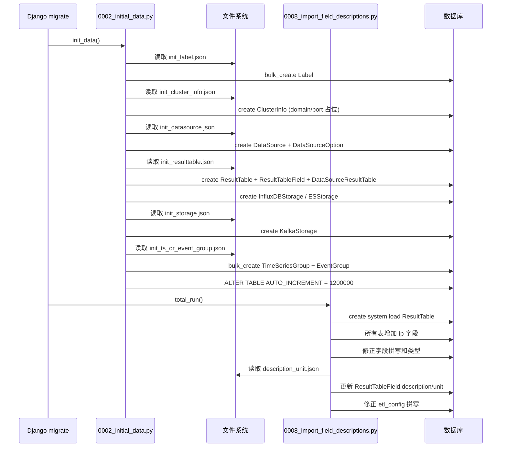
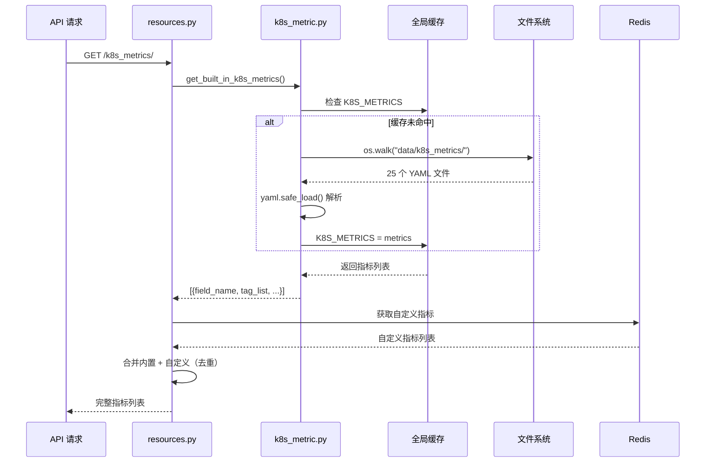

# 03-数据流转

> **专家**: 元数据种子数据与数据字典专家
> **层级**: 实现层
> **最后更新**: 2026-07-29

---

**本文引用的文件**

| 文件 | 路径 |
|------|------|
| Migration 加载 | [file:///root/bk-monitor/bk-monitor-base/src/bk_monitor_base/metadata/migrations/0002_initial_data.py](file:///root/bk-monitor/bk-monitor-base/src/bk_monitor_base/metadata/migrations/0002_initial_data.py) |
| description_unit 导入 | [file:///root/bk-monitor/bkmonitor/metadata/migrations/0008_import_field_descriptions.py](file:///root/bk-monitor/bkmonitor/metadata/migrations/0008_import_field_descriptions.py) |
| K8s 指标加载 | [file:///root/bk-monitor/bk-monitor-base/src/bk_monitor_base/metadata/utils/k8s_metric.py](file:///root/bk-monitor/bk-monitor-base/src/bk_monitor_base/metadata/utils/k8s_metric.py) |
| K8s 指标消费 | [file:///root/bk-monitor/bkmonitor/metadata/resources/resources.py](file:///root/bk-monitor/bkmonitor/metadata/resources/resources.py) |
| UnifyQuery 消费 | [file:///root/bk-monitor/bkmonitor/packages/monitor_web/cc/resources/cmdb.py](file:///root/bk-monitor/bkmonitor/packages/monitor_web/cc/resources/cmdb.py) |

---

## 目录

- 一、全链路数据流转概览
- 二、阶段一：JSON 文件 → Django Model
- 三、阶段二：Django Model → 数据库
- 四、阶段三：数据库 → UnifyQuery 查询
- 五、阶段四：K8s 指标运行时加载
- 六、Mermaid 序列图

---

## 一、全链路数据流转概览

种子数据从 JSON 文件到最终被 UnifyQuery 查询使用，经历四个阶段：

```
阶段一: JSON 文件 ──Migration──→ Django Model 实例
阶段二: Django Model ──ORM──→ 数据库表
阶段三: 数据库表 ──UnifyQuery──→ 查询结果
阶段四: K8s YAML/JSON ──运行时加载──→ 全局缓存 ──API──→ 前端
```

**章节来源**: 综合分析 [0002_initial_data.py](file:///root/bk-monitor/bk-monitor-base/src/bk_monitor_base/metadata/migrations/0002_initial_data.py) + [k8s_metric.py](file:///root/bk-monitor/bk-monitor-base/src/bk_monitor_base/metadata/utils/k8s_metric.py)

---

## 二、阶段一：JSON 文件 → Django Model

### 2.1 数据源加载

```
init_datasource.json
  └── for data_source in data_source_list:
       ├── add_datasource(data_id, data_name, etl_config, source_label, type_label, ...)
       │    └── DataSource.objects.create(bk_data_id=..., data_name=..., ...)
       │         └── 同时创建 KafkaTopicInfo (MQ 配置)
       └── add_datasource_option(data_id, items=option_list)
            └── DataSourceOption.objects.create(data_id=..., name=..., value=..., ...)
```

### 2.2 结果表加载

```
init_resulttable.json
  └── for result_table in result_table_list:
       ├── add_resulttable(table_id, table_name_zh, label, default_storage, ...)
       │    └── ResultTable.objects.create(table_id=..., ...)
       ├── add_resulttable_option(table_id, items=option_list)
       │    └── ResultTableOption.objects.create(...)
       ├── add_resulttablefield(table_id, field_item_list)
       │    └── for field in field_list:
       │         └── ResultTableField.objects.create(
       │              table_id=..., field_name=..., field_type=...,
       │              tag=..., unit=..., description=..., ...)
       ├── add_datasourceresulttable(data_id, table_id)
       │    └── DataSourceResultTable.objects.create(bk_data_id=..., table_id=...)
       └── add_influxdbstorage / add_esstorage
            └── InfluxDBStorage.objects.create(table_id=..., database=..., real_table_name=..., source_duration_time="90d")
            或  ESStorage.objects.create(table_id=...)
```

### 2.3 指标描述导入

```
description_unit.json
  └── for field_info in field_list:
       ├── table_id = 下划线转点号(field_info["result_table_id"])
       │    例: "system_cpu_summary" → "system.cpu_summary"
       ├── field = ResultTableField.objects.get(table_id=table_id, field_name=field_info["item"])
       ├── field.description = field_info["item_display"]   # "使用率(usage)"
       ├── field.unit = field_info["conversion_unit"]        # "%"
       └── field.save()
```

**设计维度分析**：

**维度 1：数据完整性** — 种子数据加载是顺序依赖的：先创建 Label → 再创建 DataSource → 再创建 ResultTable（引用 Label）→ 再创建 ResultTableField（引用 ResultTable）→ 再创建 DataSourceResultTable（引用两者）→ 最后创建 Storage（引用 ResultTable）。这个顺序由 `init_data()` 函数中的调用顺序保证。

**维度 2：错误处理** — `import_description()` 对不存在的字段使用 `DoesNotExist` 异常捕获并 `continue`，不会中断整个导入流程。但 `init_resulttable()` 等函数没有类似的容错机制。

**章节来源**: [0002_initial_data.py](file:///root/bk-monitor/bk-monitor-base/src/bk_monitor_base/metadata/migrations/0002_initial_data.py) L55-L127 + [0008_import_field_descriptions.py](file:///root/bk-monitor/bkmonitor/metadata/migrations/0008_import_field_descriptions.py) L48-L67

---

## 三、阶段二：Django Model → 数据库

Django ORM 自动将 Model 实例持久化到数据库表：

| Model | 数据库表 | 关键字段 |
|-------|---------|---------|
| `Label` | `metadata_label` | label_id, label_name, label_type, parent_label, level |
| `DataSource` | `metadata_datasource` | bk_data_id, data_name, source_label, type_label, etl_config |
| `DataSourceOption` | `metadata_datasourceoption` | data_id, name, value, value_type |
| `ResultTable` | `metadata_resulttable` | table_id, table_name_zh, default_storage, label, schema_type |
| `ResultTableField` | `metadata_resulttablefield` | table_id, field_name, field_type, tag, unit, description |
| `DataSourceResultTable` | `metadata_datasourceresulttable` | bk_data_id, table_id |
| `ClusterInfo` | `metadata_clusterinfo` | cluster_name, cluster_type, domain_name, port |
| `InfluxDBStorage` | `metadata_influxdbstorage` | table_id, database, real_table_name, source_duration_time |
| `ESStorage` | `metadata_esstorage` | table_id, storage_cluster_id |
| `KafkaStorage` | `metadata_kafkastorage` | table_id, topic, partition |
| `TimeSeriesGroup` | `metadata_timeseriesgroup` | bk_data_id, table_id, label, max_rate |
| `EventGroup` | `metadata_eventgroup` | bk_data_id, table_id, label |

**章节来源**: [0002_initial_data.py](file:///root/bk-monitor/bk-monitor-base/src/bk_monitor_base/metadata/migrations/0002_initial_data.py) L33-L168

---

## 四、阶段三：数据库 → UnifyQuery 查询

### 4.1 查询流程

```
用户请求: query(table="system.cpu_summary", field="usage")
  │
  ├── 1. load_data_source("bk_monitor", "time_series")
  │     └── SELECT * FROM metadata_datasource
  │          WHERE source_label='bk_monitor' AND type_label='time_series'
  │     → DataSource(bk_data_id=1001, data_name="snapshot", ...)
  │
  ├── 2. 匹配 table_id
  │     └── SELECT * FROM metadata_resulttable
  │          WHERE table_id='system.cpu_summary'
  │     → ResultTable(table_id="system.cpu_summary", default_storage="influxdb", ...)
  │
  ├── 3. 匹配 field
  │     └── SELECT * FROM metadata_resulttablefield
  │          WHERE table_id='system.cpu_summary' AND field_name='usage' AND tag='metric'
  │     → ResultTableField(field_name="usage", unit="%", description="使用率(usage)", ...)
  │
  └── 4. 查询存储引擎
        └── InfluxDB: SELECT AVG("usage") FROM "system"."cpu_summary" WHERE ...
```

### 4.2 实际代码

**位置**: [cmdb.py](file:///root/bk-monitor/bkmonitor/packages/monitor_web/cc/resources/cmdb.py) L52-L58

```python
data_source_class = load_data_source(DataSourceLabel.BK_MONITOR_COLLECTOR, DataTypeLabel.TIME_SERIES)
data_source = data_source_class(
    bk_biz_id=bk_biz_id,
    interval=180,
    metrics=[{"field": "usage", "method": "AVG", "alias": "A"}],
    table="system.cpu_summary",
    group_by=["bk_host_id", "bk_target_ip", "bk_target_cloud_id"],
)
query = UnifyQuery(data_sources=[data_source], bk_biz_id=bk_biz_id, expression="a")
records = query.query_data(start_time=now - 180000, end_time=now, instant=True)
```

**章节来源**: [cmdb.py](file:///root/bk-monitor/bkmonitor/packages/monitor_web/cc/resources/cmdb.py) L52-L58

---

## 五、阶段四：K8s 指标运行时加载

### 5.1 加载流程

```
API 请求: GET /api/metadata/k8s_metrics/
  │
  └── resources/resources.py::GetK8sMetricListResource
       └── get_built_in_k8s_metrics()
            ├── 检查全局缓存 K8S_METRICS
            │    ├── 有缓存 → 直接返回
            │    └── 无缓存 ↓
            ├── os.walk("data/k8s_metrics/")
            ├── 遍历 25 个 YAML 文件
            │    └── yaml.safe_load(file_content)
            │         → [{field_name, description, tag_list: [...]}, ...]
            ├── metrics.extend(所有指标)
            ├── K8S_METRICS = metrics  # 写入缓存
            └── return metrics
```

### 5.2 消费流程

**位置**: [resources.py](file:///root/bk-monitor/bkmonitor/metadata/resources/resources.py) L1965-L1988

```python
# 通过文件获取内置指标数据
k8s_metrics = get_built_in_k8s_metrics()

# 业务id为0时，获取 k8s 系统内置指标
if bk_biz_ids and 0 in bk_biz_ids and not (dimension_name and dimension_value):
    self._refine_built_in_metric_dimensions(metric_datas, k8s_metrics)

built_in_metric_field_list = [metric["field_name"] for metric in k8s_metrics]
# 获取自定义及内置指标
self._refine_metric_dimensions_from_redis(
    bk_tenant_id, bk_biz_ids, cluster_ids,
    dimension_name, dimension_value, metric_datas, built_in_metric_field_list,
)
```

**设计维度分析**：

**维度 1：内置与自定义的合并** — K8s 指标查询时，先获取内置指标（从 YAML 文件），再通过 `_refine_metric_dimensions_from_redis` 获取自定义指标（从 Redis），两者合并返回。`built_in_metric_field_list` 用于去重。

**维度 2：事件补充** — K8s 事件查询时，`_compose_in_event()` 将内置事件（从 `k8s_events.json`）补充到自定义事件列表中，确保前端始终能看到完整的 K8s 事件集合。

**章节来源**: [resources.py](file:///root/bk-monitor/bkmonitor/metadata/resources/resources.py) L978 + L1965-L1988

---

## 六、Mermaid 序列图

### 6.1 种子数据 Migration 加载全链路



**图表来源**: [0002_initial_data.py](file:///root/bk-monitor/bk-monitor-base/src/bk_monitor_base/metadata/migrations/0002_initial_data.py) L33-L201 + [0008_import_field_descriptions.py](file:///root/bk-monitor/bkmonitor/metadata/migrations/0008_import_field_descriptions.py) L48-L227

### 6.2 K8s 指标运行时加载与消费



**图表来源**: [k8s_metric.py](file:///root/bk-monitor/bk-monitor-base/src/bk_monitor_base/metadata/utils/k8s_metric.py) L13-L42 + [resources.py](file:///root/bk-monitor/bkmonitor/metadata/resources/resources.py) L1965-L1988
