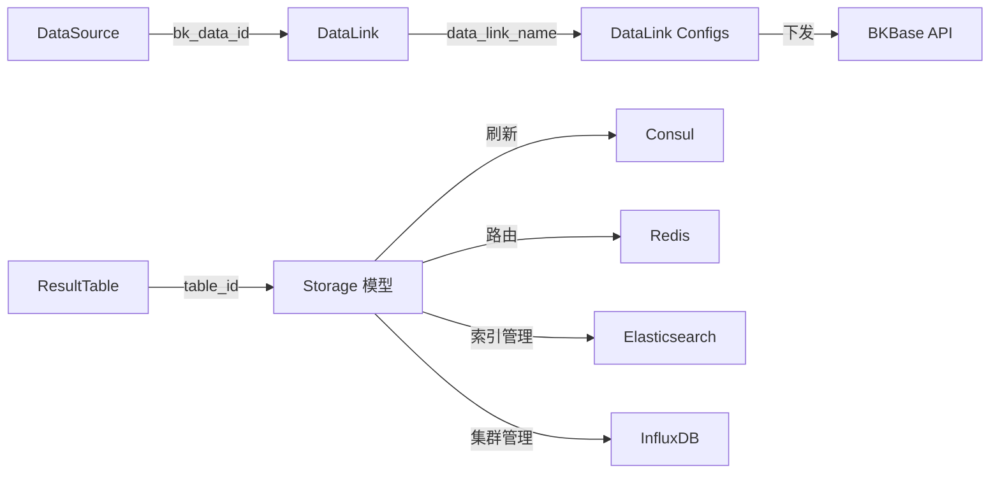

# C0-使用总览

> **专家**: 存储与数据链路专家
> **层级**: 契约层（黑盒使用文档）
> **最后更新**: 2026-07-28

---

## 一、存储引擎类型

bk-monitor 支持以下存储引擎，每种引擎对应不同的数据类型和查询场景：

| 存储引擎 | 模型类 | 存储类型常量 | 适用场景 |
|---------|--------|------------|---------|
| InfluxDB | `InfluxDBStorage` | `ClusterInfo.TYPE_INFLUXDB` | 时序指标数据（metric），支持降样、tag 分区、proxy 路由 |
| Elasticsearch | `ESStorage` | `ClusterInfo.TYPE_ES` | 日志数据、事件数据，支持索引分片、暖数据迁移、快照 |
| Kafka | `KafkaStorage` | `ClusterInfo.TYPE_KAFKA` | 实时告警数据流，短期保留（默认 30 分钟） |
| VictoriaMetrics | `AccessVMRecord` / `SpaceVMInfo` | `ClusterInfo.TYPE_VM` | 新时序引擎，替代 InfluxDB，支持 BCS 集群指标、自定义指标 |
| Redis | `RedisStorage` | `ClusterInfo.TYPE_REDIS` | 缓存/临时数据 |
| Argus | `ArgusStorage` | `ClusterInfo.TYPE_ARGUS` | Argus 监控存储 |
| Doris | `DorisStorage` | `ClusterInfo.TYPE_DORIS` | OLAP 分析型存储，支持主键模型和明细模型 |

## 二、数据链路能力

### 2.1 链路策略

数据链路（DataLink）按策略组装 BKBase 组件，实现从数据采集到存储的完整编排：

| 策略 | 场景 | 存储类型 |
|------|------|---------|
| `BK_STANDARD_V2_TIME_SERIES` | 标准单指标单表时序 | VM |
| `BK_EXPORTER_TIME_SERIES` | 采集插件时序（Exporter） | VM |
| `BK_STANDARD_TIME_SERIES` | 采集插件时序（Standard） | VM |
| `BCS_FEDERAL_PROXY_TIME_SERIES` | 联邦代理集群时序 | VM |
| `BCS_FEDERAL_SUBSET_TIME_SERIES` | 联邦子集群时序 | VM |
| `BASEREPORT_TIME_SERIES_V1` | 主机基础采集时序 | VM |
| `BASE_EVENT_V1` | 基础事件 | ES |
| `SYSTEM_PROC_PERF` | 系统进程性能 | VM |
| `SYSTEM_PROC_PORT` | 系统进程端口 | VM |
| `BK_LOG` | 日志链路 | ES + Doris |
| `BK_STANDARD_V2_EVENT` | 标准自定义事件 | ES |

### 2.2 链路组件

每条链路由以下组件按策略组装：

- **DataIdConfig** — 数据源配置（对应 BKBase DataId）
- **ResultTableConfig** — 结果表配置（对应 BKBase ResultTable）
- **VMStorageBindingConfig** — VM 存储绑定
- **ESStorageBindingConfig** — ES 存储绑定
- **DorisStorageBindingConfig** — Doris 存储绑定
- **DataBusConfig** — 清洗任务配置
- **ConditionalSinkConfig** — 条件路由（按标签分流到不同存储）

### 2.3 链路生命周期

```
创建: compose_configs → update_or_create 本地 → compose_config 渲染 → BKBase API 下发 → sync_metadata
删除: 逆序遍历组件 → delete_config (BKBase + 本地) → 删除 DataLink
查询: component_status / component_config → BKBase API 实时查询
```

## 三、集群管理能力

### 3.1 ClusterInfo 统一集群管理

`ClusterInfo` 是统一的集群信息模型，支持以下集群类型：

- InfluxDB / Kafka / Redis / Elasticsearch / Argus / VictoriaMetrics / Doris

每个集群记录包含：域名、端口、认证信息、SSL/TLS 配置、SASL 认证、GSE 注册、用途标签等。

### 3.2 InfluxDB 集群管理

- `InfluxDBClusterInfo` — 集群拓扑信息
- `InfluxDBHostInfo` — 集群主机信息
- `InfluxDBProxyStorage` — Proxy 与后端存储映射
- `InfluxDBTagInfo` — Tag 分区配置

### 3.3 ES 快照管理

- `EsSnapshot` — 快照配置（表级快照天数和状态）
- `EsSnapshotRepository` — 快照仓库管理
- `EsSnapshotIndice` — 快照索引记录
- `EsSnapshotRestore` — 快照恢复记录

## 四、典型使用场景

### 场景 1：创建时序数据存储

1. 注册 VM 集群（`ClusterInfo.create_cluster`）
2. 创建 DataLink（`DataLink.apply_data_link`，策略 `BK_STANDARD_V2_TIME_SERIES`）
3. 链路自动创建 DataId → ResultTable → VMStorageBinding → DataBus
4. 数据经 Kafka → DataBus 清洗 → VM 存储

### 场景 2：创建日志存储

1. 注册 ES/Doris 集群
2. 创建 DataLink（策略 `BK_LOG`）
3. 链路自动创建 ESStorageBinding + DorisStorageBinding
4. 日志数据经清洗后写入 ES + Doris

### 场景 3：ES 索引管理

1. `ESStorage.create_table` 创建 ES 存储配置
2. `ESStorage.create_es_index` 创建物理索引
3. `ESStorage.refresh_consul_table_config` 刷新 Consul 路由
4. `EsSnapshot` 管理快照备份

### 场景 4：InfluxDB 集群路由

1. 配置 `InfluxDBProxyStorage`（proxy ↔ 后端存储映射）
2. 配置 `InfluxDBTagInfo`（tag 分区路由）
3. `InfluxDBStorage.create_table` 关联 proxy_cluster_name
4. 数据按 tag 分区路由到指定 InfluxDB 集群

## 五、关键组件交互



## 六、范围边界

- **本专家覆盖**：metadata 模型定义层（`models/storage.py`、`models/data_link/`、`models/es_snapshot.py`、`models/influxdb_cluster.py`、`models/vm/`）
- **不覆盖**：APM 层的数据链路操作服务（`apm/views.py`、`apm/models/config.py`、`apm/core/discover/precalculation/storage.py`）
- **不覆盖**：task/ 层的后台任务调度（归任务调度与运维专家）
- **不覆盖**：resources/ 和 service/ 的 API 层（归 API 与工具库专家）
