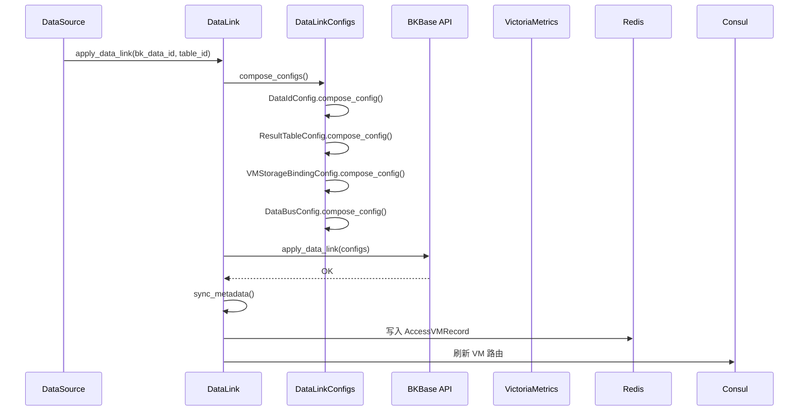
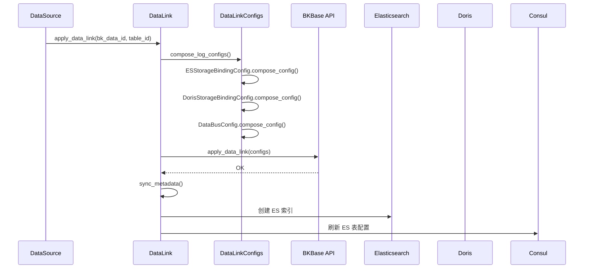
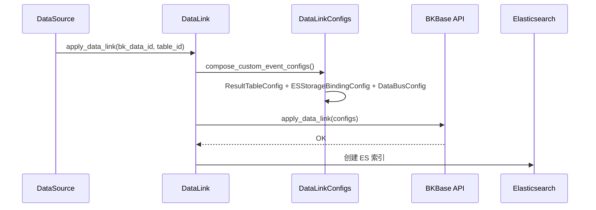

# 03-数据流转

> **专家**: 存储与数据链路专家
> **层级**: 实现层
> **最后更新**: 2026-07-28

---

## 一、数据从结果表到存储引擎的配置链路

### 1.1 时序数据流转（VM 链路）



### 1.2 日志数据流转（ES + Doris 链路）



### 1.3 事件数据流转（ES 链路）



---

## 二、数据链路清洗/汇聚/流转

### 2.1 清洗阶段（DataBus）

DataBus 组件负责数据清洗，通过 `DataBusConfig.compose_config` 渲染清洗规则：

- **标准时序**：使用 `DEFAULT_METRIC_TRANSFORMER_FORMAT = "bkmonitor_standard_v2"`
- **采集插件**：使用 `BK_EXPORTER_TRANSFORMER_FORMAT` 或 `BK_STANDARD_TRANSFORMER_FORMAT`
- **基础采集**：使用 `BASEREPORT_DATABUS_FORMAT`
- **自定义事件**：使用 `CUSTOM_EVENT_CLEAN_RULES` 预定义清洗规则

清洗规则通过 `spec.sources` 关联 DataId，通过 `spec.sinks` 关联存储绑定。

### 2.2 汇聚阶段（StorageBinding）

StorageBinding 将清洗后的数据绑定到具体存储集群：

- `VMStorageBindingConfig` 绑定 VM 集群（`vm_cluster_name`）
- `ESStorageBindingConfig` 绑定 ES 集群（`storage_cluster_name`）
- `DorisStorageBindingConfig` 绑定 Doris 集群

### 2.3 条件路由（ConditionalSink）

`ConditionalSinkConfig` 实现按标签路由到不同存储：

- 基础采集链路：按 `__result_table` 标签路由到不同 VM Binding
- 联邦子集群链路：按集群标签路由到不同 VM Binding

---

## 三、Consul 配置刷新链路

### 3.1 集群配置刷新

```
ClusterInfo.refresh_consul_storage_config()
  ├── 查询所有 ClusterInfo
  ├── 遍历构建 refresh_dict
  ├── 写入 Consul: {CONSUL_PATH}/unify-query/data/storage/{cluster_id}
  └── 更新版本: {CONSUL_PATH}/unify-query/version/storage
```

### 3.2 ES 表配置刷新

```
ESStorage.refresh_consul_table_config()
  ├── 查询所有 ESStorage
  ├── 过滤已启用的结果表
  ├── 写入 Consul: {CONSUL_PATH}/unify-query/data/es/info/{table_id}
  ├── 清理已废弃表的 Consul 路径
  └── 更新版本: {CONSUL_PATH}/unify-query/version/es/info
```

### 3.3 InfluxDB Tag 配置刷新

```
InfluxDBTagInfo → Consul: {CONSUL_PATH}/influxdb_info/tag_info
InfluxDBClusterInfo → Consul: {CONSUL_PATH}/influxdb_info/cluster_info
InfluxDBHostInfo → Consul: {CONSUL_PATH}/influxdb_info/host_info
```

---

## 四、Redis 路由推送链路

### 4.1 InfluxDB 路由

```
InfluxDBStorage.create_table()
  └── InfluxDBTool.push_to_redis()
        ├── Redis Key: {INFLUXDB_KEY_PREFIX}:{key}
        ├── hset field=table_id, value=路由JSON
        └── publish channel={INFLUXDB_KEY_PREFIX}
```

### 4.2 VM 路由

```
AccessVMRecord.refresh_vm_router()
  └── InfluxDBTool.push_to_redis()
        ├── Redis Key: {INFLUXDB_KEY_PREFIX}:{QUERY_VM_STORAGE_ROUTER_KEY}
        ├── hset field=table_id, value=路由JSON
        └── publish channel={INFLUXDB_KEY_PREFIX}
```

### 4.3 ES 路由

```
StorageResultTable.update_storage() [ES 集群迁移时]
  └── SpaceTableIDRedis.push_es_table_id_detail()
        └── 刷新 RESULT_TABLE_DETAIL 路由（含虚拟 RT）
```

---

## 五、数据链路生命周期

### 5.1 创建阶段

```
1. 预创建 BkBaseResultTable（状态 Initializing）
2. compose_configs() 策略分发
3. 事务内 update_or_create 各组件
4. compose_config() 渲染下发 JSON
5. apply_data_link_with_retry() 下发 BKBase（4 次指数退避）
6. sync_metadata() 同步元数据
7. 组件状态轮询（Initializing → Creating → Pending → OK）
```

### 5.2 删除阶段

```
1. 从 STRATEGY_RELATED_COMPONENTS 取组件列表
2. 逆序遍历组件类型
3. 对每个组件：delete_config()（先删 BKBase，再删本地）
4. 删除 DataLink 自身
```

### 5.3 状态查询

```
component_status → get_data_link_component_status() → BKBase API（4 次重试）
component_config → get_data_link_component_config() → BKBase API
```

---

## 六、ES 快照数据流

```
ES 索引数据
  └── EsSnapshot（快照配置）
        ├── snapshot_days > 0: 定期快照
        ├── snapshot_days = 0: 永久保留
        └── status = stopped: 暂停快照

快照恢复流程:
  EsSnapshotRestore → EsSnapshotIndice → ES 集群恢复
```
