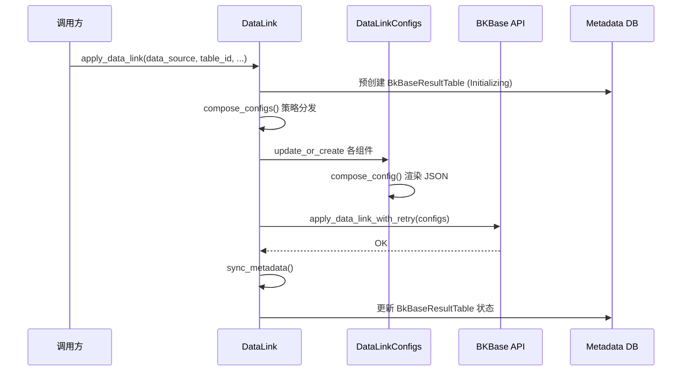

# 03-数据流转

> **子专家**: 数据链路子专家
> **层级**: 实现层
> **最后更新**: 2026-07-28

---

## 一、链路创建完整流程



## 二、标准时序链路数据流

```
DataSource (bk_data_id)
  └── DataLink.apply_data_link(strategy=BK_STANDARD_V2_TIME_SERIES)
        ├── DataIdConfig → BKBase DataId
        ├── ResultTableConfig → BKBase ResultTable
        ├── VMStorageBindingConfig → VM 存储绑定
        └── DataBusConfig → 清洗任务
              ├── sources: [DataId]
              ├── sinks: [VMStorageBinding]
              └── transformer: log_to_metric (bkmonitor_standard_v2)
```

## 三、基础采集链路数据流

```
DataSource (bk_data_id)
  └── DataLink.apply_data_link(strategy=BASEREPORT_TIME_SERIES_V1)
        ├── 遍历 BASEREPORT_USAGES (11 个 usage)
        │     ├── 每个 usage 生成普通 RT + VMBinding
        │     └── 每个 usage 生成 _cmdb RT + VMBinding
        ├── ConditionalSinkConfig → 按 __result_table 路由
        └── DataBusConfig → 统一消费
```

## 四、日志链路数据流

```
DataSource (bk_data_id)
  └── DataLink.apply_data_link(strategy=BK_LOG)
        ├── ResultTableConfig
        ├── ESStorageBindingConfig → ES 存储
        ├── DorisStorageBindingConfig → Doris 存储
        └── DataBusConfig
              ├── sources: [DataId]
              └── sinks: [ESStorageBinding, DorisStorageBinding]
```

## 五、链路删除数据流

```
DataLink.delete_data_link()
  └── 逆序遍历 STRATEGY_RELATED_COMPONENTS
        ├── DataBusConfig.delete_config()
        │     ├── api.bkdata.delete_data_link(kind=databus, name=...)
        │     └── self.delete()
        ├── VMStorageBindingConfig.delete_config()
        ├── ResultTableConfig.delete_config()
        └── DataIdConfig.delete_config()
  └── self.delete()
```

## 六、状态查询数据流

```
config.component_status
  └── service.get_data_link_component_status(bk_tenant_id, kind, name, namespace)
        └── get_bkbase_component_status_with_retry (4 次指数退避)
              └── api.bkdata.get_data_link(kind, namespace, name)
                    └── 解析 status.phase
```

## 七、关联重建数据流

```
rebuild_bkbase_v4_datalink_relation(bk_tenant_id, namespace)
  └── 遍历所有 data_link_name 为空的 DataBusConfig
        └── rebuild_databus_relation(databus, dry_run=False)
              ├── 通过 data_id_name → DataIdConfig → DataSource
              ├── 通过 etl_config → data_link_strategy
              ├── 通过 sink_names → 存储绑定
              ├── 通过 bkbase_result_table_name → ResultTableConfig
              └── 创建/更新 DataLink (data_link_name = rebuilt__{bk_data_id}_{strategy})
```
