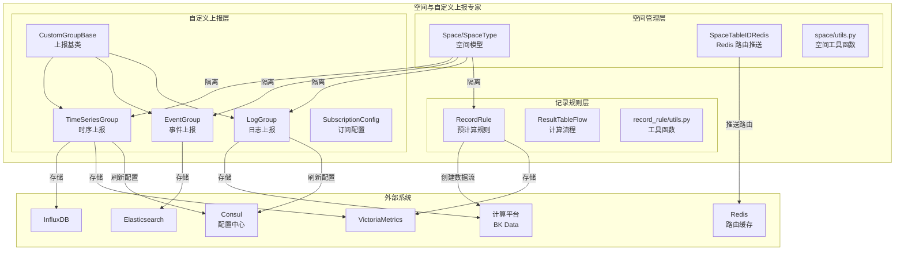
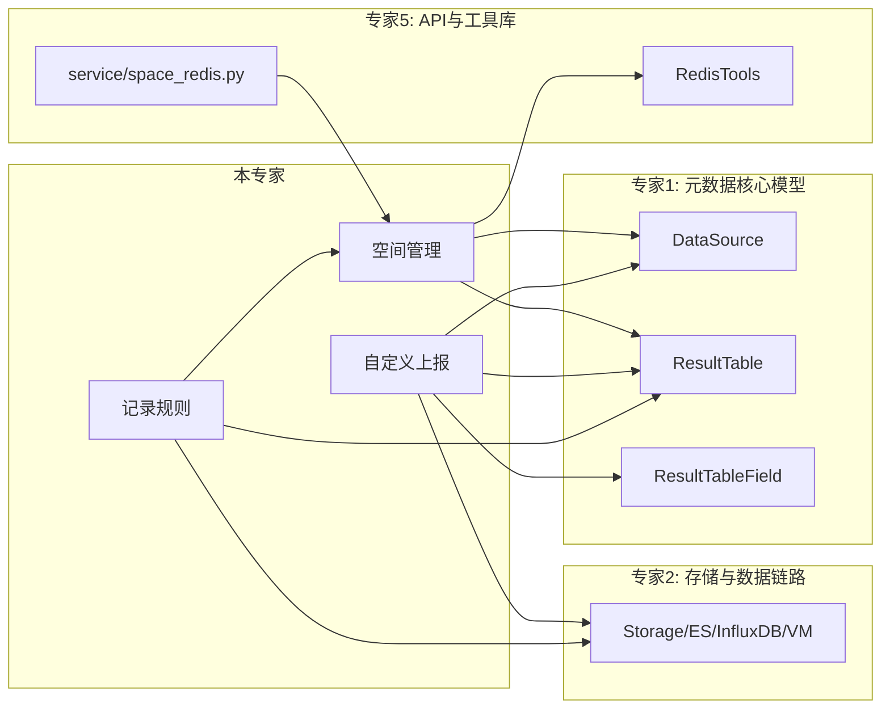

# 01-架构

**本文引用的文件**
- [space.py](file://bk-monitor-base/src/bk_monitor_base/metadata/models/space/space.py)
- [space_table_id_redis.py](file://bk-monitor-base/src/bk_monitor_base/metadata/models/space/space_table_id_redis.py)
- [base.py](file://bk-monitor-base/src/bk_monitor_base/metadata/models/custom_report/base.py)
- [time_series.py](file://bk-monitor-base/src/bk_monitor_base/metadata/models/custom_report/time_series.py)
- [event.py](file://bk-monitor-base/src/bk_monitor_base/metadata/models/custom_report/event.py)
- [log.py](file://bk-monitor-base/src/bk_monitor_base/metadata/models/custom_report/log.py)
- [rules.py](file://bk-monitor-base/src/bk_monitor_base/metadata/models/record_rule/rules.py)

## 目录
1. [简介](#简介)
2. [模块分层架构](#模块分层架构)
3. [子专家划分说明](#子专家划分说明)
4. [依赖关系](#依赖关系)
5. [契约层索引](#契约层索引)
6. [实现层切面索引](#实现层切面索引)
7. [关键发现与风险](#关键发现与风险)
8. [术语表](#术语表)

## 简介

空间与自定义上报专家覆盖 metadata 模块中三个紧密关联的功能域：空间管理（Space）、自定义上报（CustomReport）、记录规则（RecordRule）。三者的核心关系是：**Space 提供多租户隔离能力，CustomReport 在空间隔离下管理自定义数据上报，RecordRule 基于空间内的已有数据创建预计算规则**。

章节来源：[space.py:1-223](file://bk-monitor-base/src/bk_monitor_base/metadata/models/space/space.py#L1-L223)、[base.py:1-503](file://bk-monitor-base/src/bk_monitor_base/metadata/models/custom_report/base.py#L1-L503)、[rules.py:1-399](file://bk-monitor-base/src/bk_monitor_base/metadata/models/record_rule/rules.py#L1-L399)

## 模块分层架构

图表来源：[space.py:39-223](file://bk-monitor-base/src/bk_monitor_base/metadata/models/space/space.py#L39-L223)、[base.py:30-500](file://bk-monitor-base/src/bk_monitor_base/metadata/models/custom_report/base.py#L30-L500)、[time_series.py:50-2593](file://bk-monitor-base/src/bk_monitor_base/metadata/models/custom_report/time_series.py#L50-L2593)、[event.py:30-470](file://bk-monitor-base/src/bk_monitor_base/metadata/models/custom_report/event.py#L30-L470)、[rules.py:39-399](file://bk-monitor-base/src/bk_monitor_base/metadata/models/record_rule/rules.py#L39-L399)

## 子专家划分说明

空间与自定义上报专家按功能域拆分为两个子专家：

| 子专家 | 覆盖范围 | 核心文件 | 拆分理由 |
|--------|---------|---------|---------|
| 空间管理子专家 | `space/` 全包 | `space_table_id_redis.py`(74KB) | 空间路由推送逻辑独立且复杂，涉及多种空间类型的差异化处理 |
| 自定义上报子专家 | `custom_report/` + `record_rule/` | `time_series.py`(106KB) | 三种上报类型共享基类，记录规则依赖自定义上报的结果表 |

**边界约定**：
- 空间管理子专家负责：Space/SpaceType/SpaceDataSource/SpaceResource 模型 + SpaceTableIDRedis 路由推送 + space/utils.py 工具
- 自定义上报子专家负责：CustomGroupBase 基类 + TimeSeriesGroup/EventGroup/LogGroup 子类 + SubscriptionConfig + RecordRule/ResultTableFlow
- 交叉部分：RecordRule 的 `get_src_table_ids` 依赖空间管理子专家的 `get_space_table_id_data_id`，由自定义上报子专家在实现文档中引用

## 依赖关系

图表来源：[space_table_id_redis.py:61-117](file://bk-monitor-base/src/bk_monitor_base/metadata/models/space/space_table_id_redis.py#L61-L117)、[base.py:180-350](file://bk-monitor-base/src/bk_monitor_base/metadata/models/custom_report/base.py#L180-L350)、[rules.py:100-160](file://bk-monitor-base/src/bk_monitor_base/metadata/models/record_rule/rules.py#L100-L160)

## 契约层索引

- [C0-使用总览.md](../C0-使用总览.md) — 能力清单、边界、已知坑、子专家导航
- [C1-能力契约.md](../C1-能力契约.md) — Space/CustomReport/RecordRule API 契约

## 实现层切面索引

- [02-实现.md](./02-实现.md) — 核心实现：Space Redis 缓存映射、时序自定义上报全链路、记录规则匹配
- [03-数据流转.md](./03-数据流转.md) — 数据流转：自定义上报数据从接入→校验→存储→查询的完整链路
- [04-模型.md](./04-模型.md) — 数据模型：Space/CustomReport/RecordRule 模型字段定义
- [05-接口.md](./05-接口.md) — 接口说明：模型对外暴露的方法签名

## 关键发现与风险

| 发现 | 详情 | 风险等级 |
|------|------|---------|
| `space_table_id_redis.py` 74KB 单文件 | 所有空间类型的路由推送逻辑集中在一个类中，包含 BKCC/BCS/BKCI/BKSAAS 四种类型的差异化处理 | 中 — 修改任一类型路由逻辑需理解全类 |
| `time_series.py` 106KB 单文件 | TimeSeriesGroup 包含指标同步、分表逻辑、维度过滤等大量方法 | 中 — 方法间耦合度高 |
| 多租户模式通过开关控制 | `enable_multi_tenancy` 开关影响 table_id 生成、Redis 键拼接、数据过滤等多处逻辑 | 高 — 开关切换可能导致路由不匹配 |
| 自定义上报与结果表强耦合 | CustomGroupBase._create 内部调用 ResultTable.create_result_table | 中 — 结果表创建失败会导致上报组创建失败 |
| 记录规则源表自动发现依赖过期时间 | `get_src_table_ids` 通过 `time_series_metric_expired_seconds` 过滤过期指标 | 低 — 过期配置不当可能导致源表为空 |

## 术语表

| 术语 | 说明 |
|------|------|
| Space UID | 空间唯一标识，格式 `{space_type_id}__{space_id}` |
| CustomGroupBase | 自定义上报抽象基类，定义 create/modify/delete 通用流程 |
| TimeSeriesGroup | 自定义时序上报组，三层模型：Group → Scope → Metric |
| EventGroup | 自定义事件上报组，存储于 ES |
| LogGroup | 自定义日志上报组，存储于计算平台 |
| RecordRule | 预计算规则，将 PromQL 转为计算平台 BKSQL 数据流 |
| ResultTableFlow | 记录规则对应的计算平台数据流（stream_source → promql_v2 → vm_storage） |
| Split Measurement | 单指标单表模式，每个指标独立结果表 |
| SpaceTableIDRedis | 空间路由推送器，将空间-结果表映射写入 Redis 并发布通知 |
| data_label | 数据标签，用于跨空间类型的结果表路由 |
