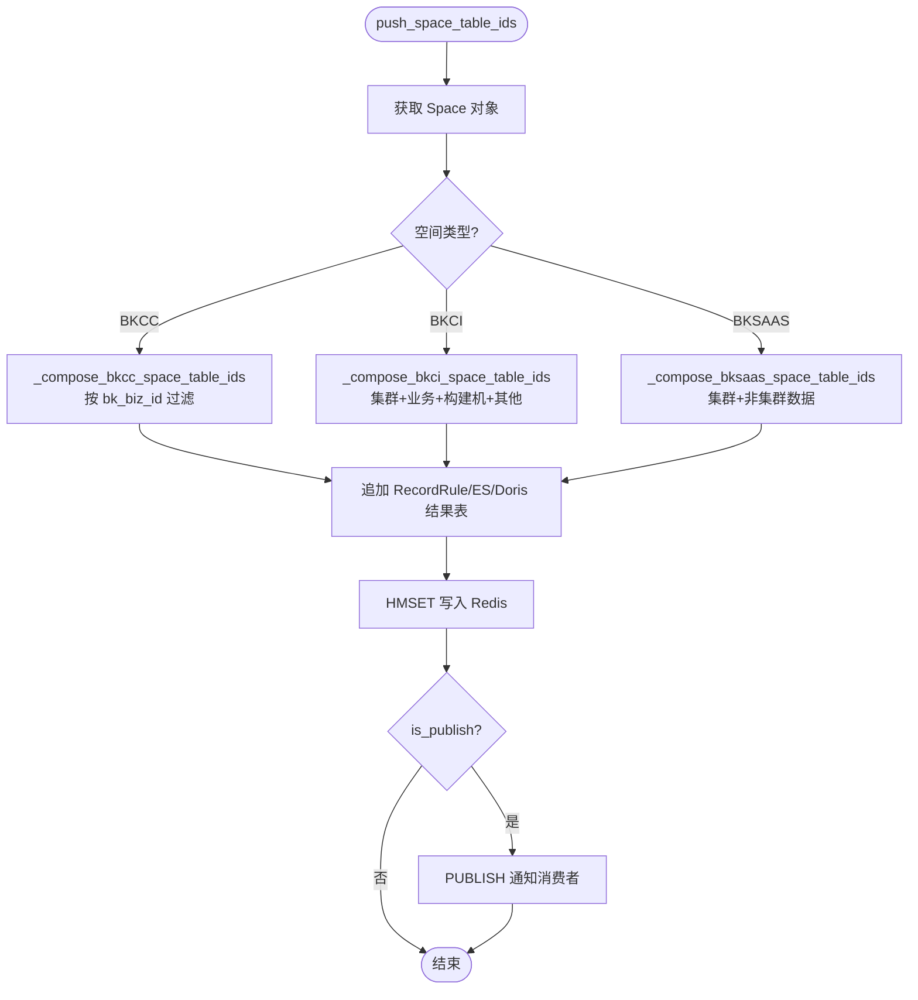
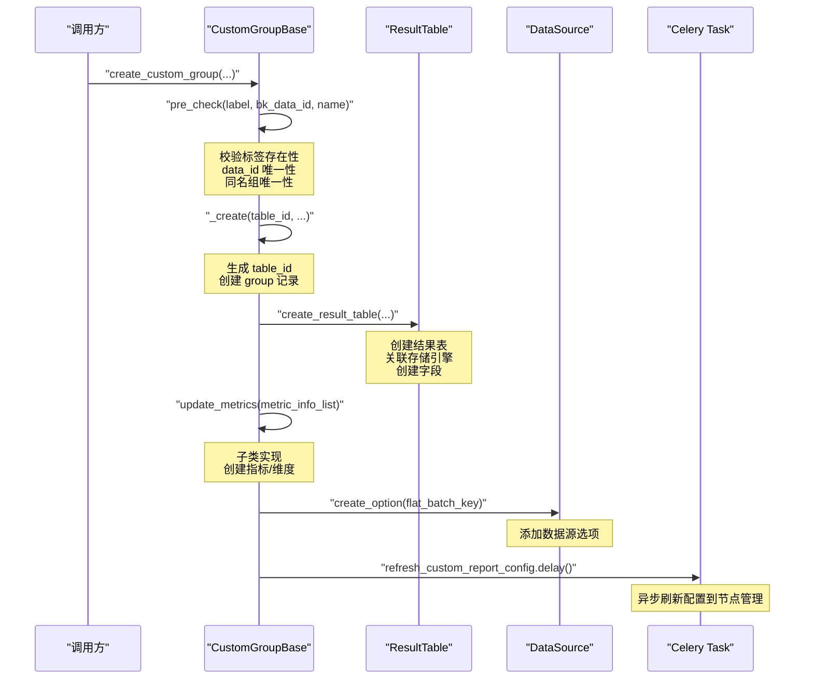
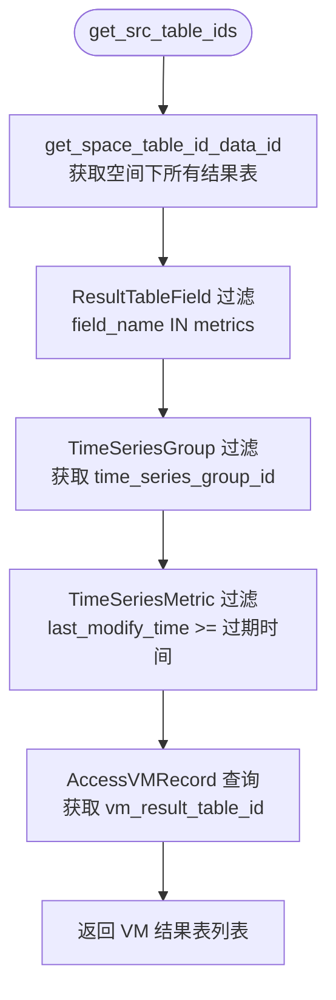

# 02-实现

**本文引用的文件**
- [space_table_id_redis.py](file://bk-monitor-base/src/bk_monitor_base/metadata/models/space/space_table_id_redis.py)
- [base.py](file://bk-monitor-base/src/bk_monitor_base/metadata/models/custom_report/base.py)
- [time_series.py](file://bk-monitor-base/src/bk_monitor_base/metadata/models/custom_report/time_series.py)
- [event.py](file://bk-monitor-base/src/bk_monitor_base/metadata/models/custom_report/event.py)
- [rules.py](file://bk-monitor-base/src/bk_monitor_base/metadata/models/record_rule/rules.py)
- [utils.py](file://bk-monitor-base/src/bk_monitor_base/metadata/models/space/utils.py)

## 目录
1. [简介](#简介)
2. [Space Redis 缓存映射机制](#space-redis-缓存映射机制)
3. [自定义上报全链路](#自定义上报全链路)
4. [记录规则匹配与执行](#记录规则匹配与执行)
5. [结论](#结论)

## 简介

本章聚焦空间与自定义上报专家的三大核心实现：Space Redis 路由推送机制、自定义上报（时序/事件/日志）的完整生命周期、记录规则的 PromQL→BKSQL 转换与计算平台对接。

章节来源：[space_table_id_redis.py:61-500](file://bk-monitor-base/src/bk_monitor_base/metadata/models/space/space_table_id_redis.py#L61-L500)、[base.py:30-500](file://bk-monitor-base/src/bk_monitor_base/metadata/models/custom_report/base.py#L30-L500)、[time_series.py:50-500](file://bk-monitor-base/src/bk_monitor_base/metadata/models/custom_report/time_series.py#L50-L500)、[rules.py:39-399](file://bk-monitor-base/src/bk_monitor_base/metadata/models/record_rule/rules.py#L39-L399)

## Space Redis 缓存映射机制

### 路由推送架构

SpaceTableIDRedis 是空间路由推送的核心类，负责将空间关联的结果表映射写入 Redis 三个哈希键：

| Redis 键 | 内容 | 通道 |
|----------|------|------|
| `SPACE_TO_RESULT_TABLE_KEY` | `{space_uid: {table_id: {filters: [...]}}}` | `SPACE_TO_RESULT_TABLE_CHANNEL` |
| `DATA_LABEL_TO_RESULT_TABLE_KEY` | `{data_label: [table_id, ...]}` | `DATA_LABEL_TO_RESULT_TABLE_CHANNEL` |
| `RESULT_TABLE_DETAIL_KEY` | `{table_id: {db, measurement, storage_type, fields, ...}}` | `RESULT_TABLE_DETAIL_CHANNEL` |

### 按空间类型的差异化路由



图表来源：[space_table_id_redis.py:67-117](file://bk-monitor-base/src/bk_monitor_base/metadata/models/space/space_table_id_redis.py#L67-L117)

### BKCC 空间路由核心逻辑

`_compose_bkcc_space_table_ids` 是 BKCC 类型空间路由的核心方法，流程如下：

1. 调用 `_compose_data` 获取空间关联的结果表和数据源
2. 通过 `_refine_table_ids` 过滤仅写入 InfluxDB/VM/ES 的结果表
3. 通过 `_is_need_filter_for_bkcc` 判断每条结果表是否需要添加 `bk_biz_id` 过滤条件：
   - 自定义时序且属于当前空间：不需要过滤
   - 平台级自定义时序且不在当前空间：需要过滤
   - 非自定义时序：始终需要过滤
4. 追加 RecordRule/ES/Doris 结果表
5. 追加关联的 BKCI 空间 ES 结果表（适配 ES 多空间功能）

章节来源：[space_table_id_redis.py:500-700](file://bk-monitor-base/src/bk_monitor_base/metadata/models/space/space_table_id_redis.py#L500-L700)

### 多租户键名拼接

当 `enable_multi_tenancy=True` 时，所有 Redis 键名追加租户 ID：

```python
# 空间路由键
space_redis_key = f"{space_type}__{space_id}|{bk_tenant_id}"

# data_label 路由键
rt_dl_map = {f"{data_label}|{bk_tenant_id}": table_ids}

# 结果表详情键
_table_id_detail = {f"{key}|{bk_tenant_id}": value}
```

章节来源：[space_table_id_redis.py:97-116](file://bk-monitor-base/src/bk_monitor_base/metadata/models/space/space_table_id_redis.py#L97-L116)

## 自定义上报全链路

### 创建流程

CustomGroupBase.create_custom_group 定义了所有自定义上报类型的统一创建流程：



图表来源：[base.py:180-350](file://bk-monitor-base/src/bk_monitor_base/metadata/models/custom_report/base.py#L180-L350)

### 时序自定义上报 (TimeSeriesGroup)

TimeSeriesGroup 是最复杂的自定义上报类型，核心特点：

**三层数据模型**：
- `TimeSeriesGroup`：数据源级别，关联一个 `bk_data_id`
- `TimeSeriesScope`：指标分组级别，支持多级维度分组
- `TimeSeriesMetric`：具体指标，关联 scope 和 field

**指标同步双通道**：
- Redis 通道（Transfer 上报）：从 `BK_MONITOR_TRANSFER` Redis 的 ZSET 中拉取指标
- BkData 通道（计算平台）：通过 `query_metric_and_dimension` API 获取

**单指标单表模式** (`is_split_measurement=True`)：
- 每个指标独立生成 `table_id`：`bk_k8s_{group_name}_{field_name}`
- 查询时按指标名路由到对应结果表

章节来源：[time_series.py:50-500](file://bk-monitor-base/src/bk_monitor_base/metadata/models/custom_report/time_series.py#L50-L500)

### 事件自定义上报 (EventGroup)

EventGroup 存储于 Elasticsearch，核心特点：

- 固定字段结构：`event`(object)、`target`(keyword)、`dimensions`(object)、`event_name`(keyword)
- 自动 ES 文档 ID 配置：`[event, target, dimensions, event_name, time]`
- 维度自动发现：通过 ES 聚合查询 `event_name` 和 `dimensions` 字段
- 默认启用 V4 事件组数据链路

章节来源：[event.py:30-300](file://bk-monitor-base/src/bk_monitor_base/metadata/models/custom_report/event.py#L30-L300)

### 日志自定义上报 (LogGroup)

LogGroup 是最简单的自定义上报类型：

- 无子指标模型（无 `update_metrics` 实现）
- 自动生成 `bk_data_token` 用于上报鉴权
- 创建/修改后下发配置到 BkCollector
- 不允许修改 `log_group_name`（避免 token 变化）

章节来源：[log.py:1-152](file://bk-monitor-base/src/bk_monitor_base/metadata/models/custom_report/log.py#L1-L152)

## 记录规则匹配与执行

### PromQL → BKSQL 转换

RecordRule.transform_bk_sql_and_metrics 是规则配置解析的入口：

1. YAML 解析：`yaml.safe_load(rule_config)` 获取 `rules` 列表和 `interval`
2. 遍历每条规则，调用 `utils.refine_bk_sql_and_metrics(expr, all_rule_record)` 将 PromQL 转为结构化 SQL
3. 提取指标集合和指标别名映射
4. 组装 BKSQL 配置列表，每项含 `name/count_freq/sql/metric_name/label`

章节来源：[rules.py:60-97](file://bk-monitor-base/src/bk_monitor_base/metadata/models/record_rule/rules.py#L60-L97)

### 源表自动发现

`get_src_table_ids` 通过指标反查源 VM 结果表：



图表来源：[rules.py:100-160](file://bk-monitor-base/src/bk_monitor_base/metadata/models/record_rule/rules.py#L100-L160)

### 计算平台数据流

ResultTableFlow 组装三节点数据流：

| 节点 | 类型 | 职责 |
|------|------|------|
| source | `stream_source` | 从源 VM 结果表读取数据 |
| process | `promql_v2` | 执行 BKSQL 预计算 |
| storage | `vm_storage` | 将计算结果写入目标 VM 结果表 |

章节来源：[rules.py:277-395](file://bk-monitor-base/src/bk_monitor_base/metadata/models/record_rule/rules.py#L277-L395)

## 结论

空间与自定义上报专家通过 SpaceTableIDRedis 实现多空间类型的差异化路由推送，通过 CustomGroupBase 统一自定义上报的创建/修改/删除流程，通过 RecordRule + ResultTableFlow 实现 PromQL 预计算规则的完整生命周期管理。三者通过 Space 隔离机制紧密协作，共同支撑监控系统的多租户数据管理能力。
