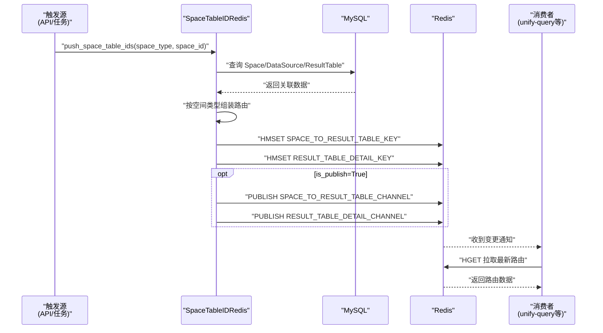
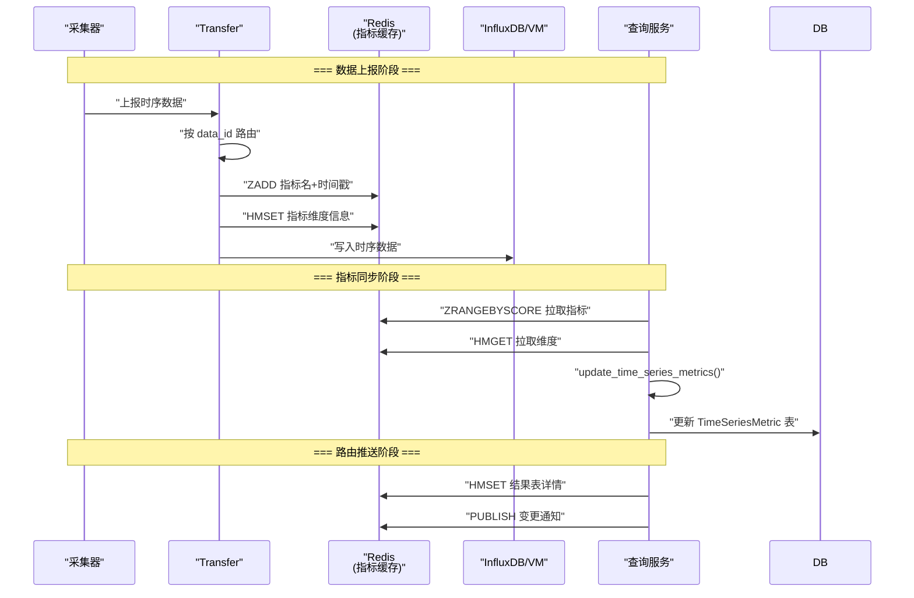
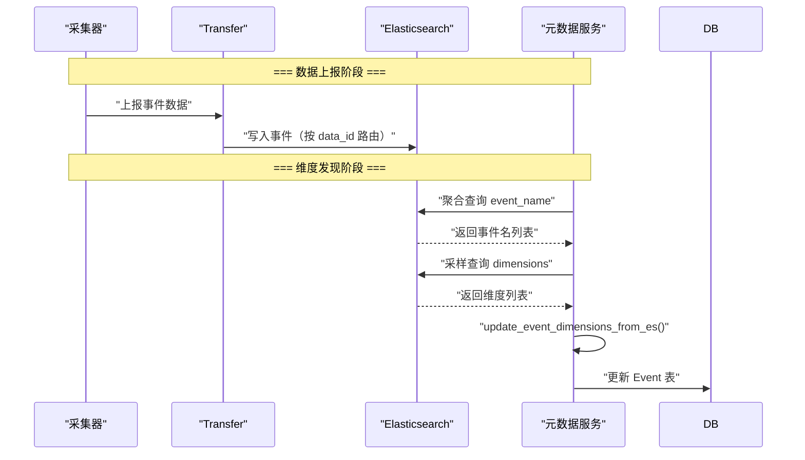
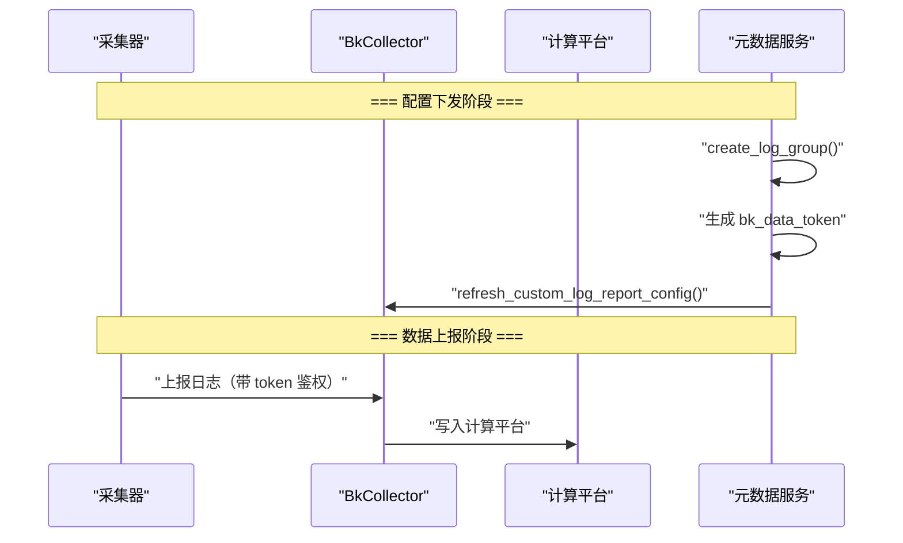
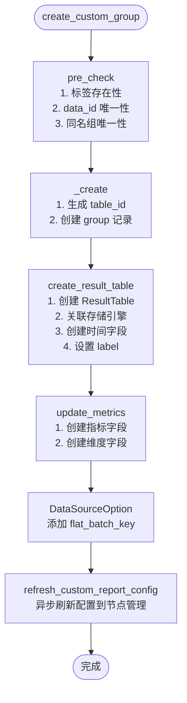
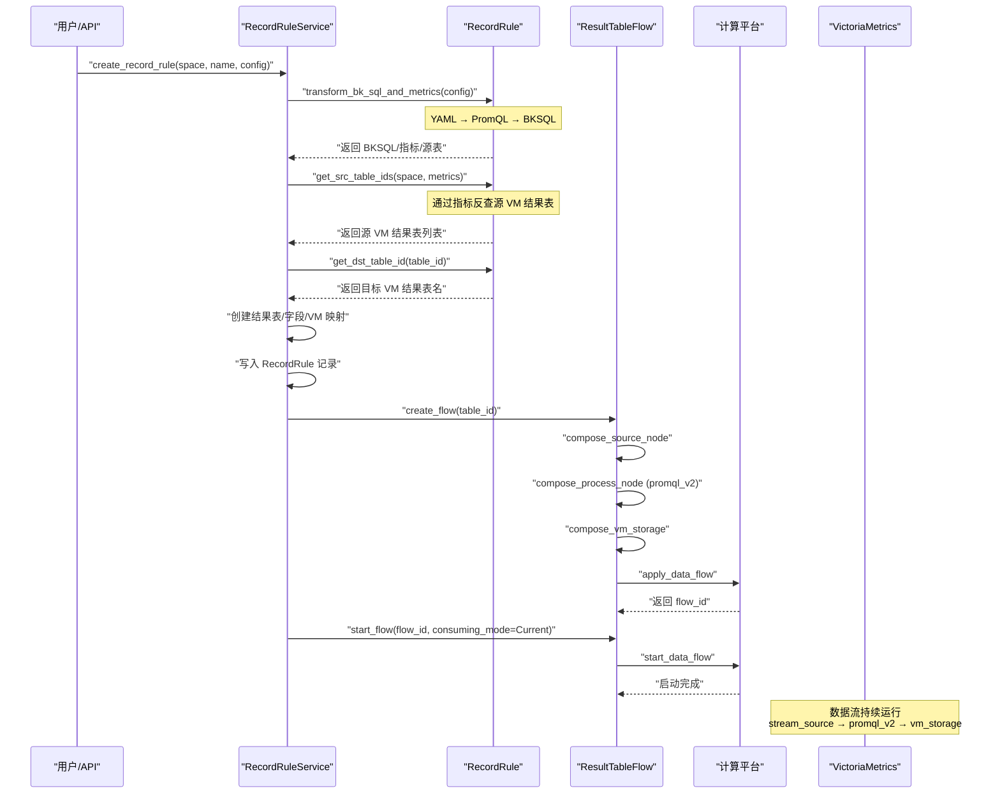
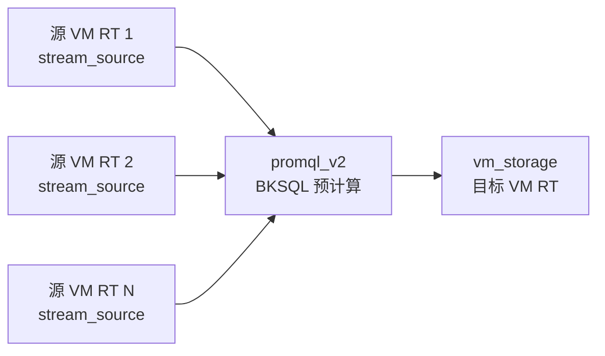

# 03-数据流转

**本文引用的文件**
- [space_table_id_redis.py](file://bk-monitor-base/src/bk_monitor_base/metadata/models/space/space_table_id_redis.py)
- [base.py](file://bk-monitor-base/src/bk_monitor_base/metadata/models/custom_report/base.py)
- [time_series.py](file://bk-monitor-base/src/bk_monitor_base/metadata/models/custom_report/time_series.py)
- [event.py](file://bk-monitor-base/src/bk_monitor_base/metadata/models/custom_report/event.py)
- [rules.py](file://bk-monitor-base/src/bk_monitor_base/metadata/models/record_rule/rules.py)

## 目录
1. [简介](#简介)
2. [空间路由推送数据流](#空间路由推送数据流)
3. [自定义上报数据流](#自定义上报数据流)
4. [记录规则数据流](#记录规则数据流)
5. [结论](#结论)

## 简介

本章描述空间与自定义上报专家覆盖的三条核心数据流：空间路由从 DB → Redis → 消费者的推送链路、自定义上报从接入 → 校验 → 存储 → 查询的完整链路、记录规则从配置 → 计算平台 → 结果存储的执行链路。

## 空间路由推送数据流

### 整体流程

图表来源：[space_table_id_redis.py:67-117](file://bk-monitor-base/src/bk_monitor_base/metadata/models/space/space_table_id_redis.py#L67-L117)

### 三类路由数据

| 路由类型 | 写入方法 | 数据格式 | 消费者用途 |
|---------|---------|---------|-----------|
| 空间-结果表 | `push_space_table_ids` | `{space_uid: {table_id: {filters: [...]}}}` | 空间数据查询隔离 |
| 数据标签-结果表 | `push_data_label_table_ids` | `{data_label: [table_id, ...]}` | 按标签跨空间查询 |
| 结果表详情 | `push_table_id_detail` | `{table_id: {db, measurement, storage_type, fields, ...}}` | 结果表存储路由 |

章节来源：[space_table_id_redis.py:67-500](file://bk-monitor-base/src/bk_monitor_base/metadata/models/space/space_table_id_redis.py#L67-L500)

## 自定义上报数据流

### 时序自定义上报全链路

图表来源：[time_series.py:500-1000](file://bk-monitor-base/src/bk_monitor_base/metadata/models/custom_report/time_series.py#L500-L1000)

### 事件自定义上报全链路

图表来源：[event.py:200-300](file://bk-monitor-base/src/bk_monitor_base/metadata/models/custom_report/event.py#L200-L300)

### 日志自定义上报全链路

图表来源：[log.py:30-152](file://bk-monitor-base/src/bk_monitor_base/metadata/models/custom_report/log.py#L30-L152)

### 自定义上报创建完整数据流

图表来源：[base.py:180-350](file://bk-monitor-base/src/bk_monitor_base/metadata/models/custom_report/base.py#L180-L350)

## 记录规则数据流

### 规则创建到数据流启动

图表来源：[rules.py:39-399](file://bk-monitor-base/src/bk_monitor_base/metadata/models/record_rule/rules.py#L39-L399)

### 数据流节点拓扑

图表来源：[rules.py:277-352](file://bk-monitor-base/src/bk_monitor_base/metadata/models/record_rule/rules.py#L277-L352)

## 结论

空间与自定义上报专家的三条数据流形成闭环：空间路由推送确保消费者能正确路由到各空间的数据，自定义上报管理数据从采集到存储的元数据配置，记录规则在已有数据基础上创建预计算加速查询。三条流通过 Space 隔离机制和 Redis Pub/Sub 通知机制协同工作。
