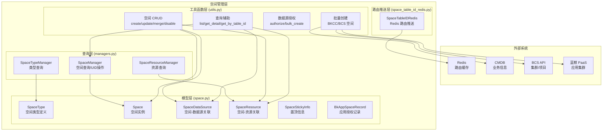
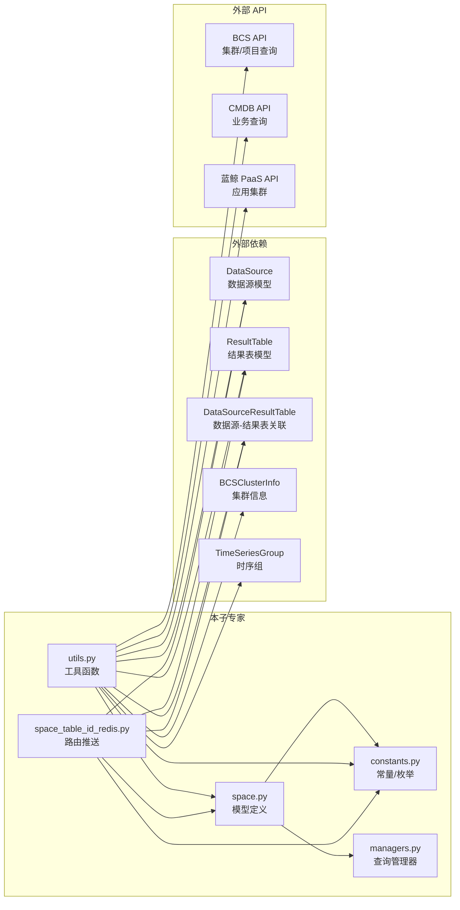

# 01-架构

**本文引用的文件**
- [space.py](file://bk-monitor-base/src/bk_monitor_base/metadata/models/space/space.py) — Space/SpaceType/SpaceDataSource/SpaceResource/SpaceStickyInfo/BkAppSpaceRecord 模型
- [constants.py](file://bk-monitor-base/src/bk_monitor_base/metadata/models/space/constants.py) — 空间常量、枚举、Redis 键空间定义
- [managers.py](file://bk-monitor-base/src/bk_monitor_base/metadata/models/space/managers.py) — SpaceManager/SpaceTypeManager/SpaceResourceManager
- [space_table_id_redis.py](file://bk-monitor-base/src/bk_monitor_base/metadata/models/space/space_table_id_redis.py) — SpaceTableIDRedis 路由推送核心类
- [utils.py](file://bk-monitor-base/src/bk_monitor_base/metadata/models/space/utils.py) — 空间工具函数

## 目录
1. [简介](#简介)
2. [模块分层架构](#模块分层架构)
3. [文件职责划分](#文件职责划分)
4. [依赖关系](#依赖关系)
5. [契约层索引](#契约层索引)
6. [实现层切面索引](#实现层切面索引)
7. [关键发现与风险](#关键发现与风险)
8. [术语表](#术语表)

## 简介

空间管理子专家覆盖 `space/` 包的全部 6 个文件，负责业务空间隔离模型的定义、查询、路由推送和批量管理。核心职责分为三层：**模型层**（Space/SpaceType 等 6 个 Django Model）、**路由推送层**（SpaceTableIDRedis 将空间-结果表映射写入 Redis 并发布 Pub/Sub 通知）、**工具函数层**（空间 CRUD、批量创建、数据源授权）。

章节来源：[space.py:1-223](file://bk-monitor-base/src/bk_monitor_base/metadata/models/space/space.py#L1-L223)、[constants.py:1-197](file://bk-monitor-base/src/bk_monitor_base/metadata/models/space/constants.py#L1-L197)、[managers.py:1-171](file://bk-monitor-base/src/bk_monitor_base/metadata/models/space/managers.py#L1-L171)、[space_table_id_redis.py:1-1684](file://bk-monitor-base/src/bk_monitor_base/metadata/models/space/space_table_id_redis.py#L1-L1684)、[utils.py:1-1161](file://bk-monitor-base/src/bk_monitor_base/metadata/models/space/utils.py#L1-L1161)

## 模块分层架构

图表来源：[space.py:1-223](file://bk-monitor-base/src/bk_monitor_base/metadata/models/space/space.py#L1-L223)、[managers.py:1-171](file://bk-monitor-base/src/bk_monitor_base/metadata/models/space/managers.py#L1-L171)、[space_table_id_redis.py:61-500](file://bk-monitor-base/src/bk_monitor_base/metadata/models/space/space_table_id_redis.py#L61-L500)、[utils.py:1-1161](file://bk-monitor-base/src/bk_monitor_base/metadata/models/space/utils.py#L1-L1161)

## 文件职责划分

| 文件 | 行数 | 大小 | 职责 |
|------|------|------|------|
| `space.py` | 223 | 8KB | 6 个 Django Model 定义：SpaceType/Space/SpaceDataSource/SpaceResource/SpaceStickyInfo/BkAppSpaceRecord |
| `constants.py` | 197 | 7KB | 枚举（SpaceTypes/SpaceStatus/MeasurementType/EtlConfigs/BCSClusterTypes）、Redis 键常量、数据源配置 |
| `managers.py` | 171 | 7KB | 3 个 Manager：SpaceManager（UID 操作/列表查询/业务 ID 互转）、SpaceTypeManager、SpaceResourceManager |
| `space_table_id_redis.py` | 1684 | 74KB | SpaceTableIDRedis 核心类：按空间类型的差异化路由推送、多租户键名拼接、ES/Doris/BkBase 详情推送 |
| `utils.py` | 1161 | 46KB | 空间 CRUD 工具函数、批量创建（BKCC/BCS）、数据源授权、查询辅助、缓存函数 |

## 依赖关系

图表来源：[space.py:1-20](file://bk-monitor-base/src/bk_monitor_base/metadata/models/space/space.py#L1-L20)、[utils.py:1-40](file://bk-monitor-base/src/bk_monitor_base/metadata/models/space/utils.py#L1-L40)、[space_table_id_redis.py:1-60](file://bk-monitor-base/src/bk_monitor_base/metadata/models/space/space_table_id_redis.py#L1-L60)

## 契约层索引

- [C0-使用总览.md](../C0-使用总览.md) — 能力清单、边界、已知坑
- [C1-能力契约.md](../C1-能力契约.md) — Space/Manager/SpaceTableIDRedis/工具函数 API 契约

## 实现层切面索引

- [02-实现.md](./02-实现.md) — 核心实现：Space Redis 路由推送机制、空间 CRUD 流程、批量创建
- [03-数据流转.md](./03-数据流转.md) — 数据流转：空间路由从 DB → Redis → 消费者的推送链路
- [04-模型.md](./04-模型.md) — 数据模型：6 个 Space 模型字段定义
- [05-接口.md](./05-接口.md) — 接口说明：模型/Manager/工具函数的方法签名

## 关键发现与风险

| 发现 | 详情 | 风险等级 |
|------|------|---------|
| `space_table_id_redis.py` 74KB 单文件 | 所有空间类型的路由推送逻辑集中在一个类中，包含 BKCC/BCS/BKCI/BKSAAS 四种类型的差异化处理 | 中 — 修改任一类型路由逻辑需理解全类 |
| `utils.py` 1161 行 | 空间 CRUD、批量创建、数据源授权、查询辅助全部集中在一个文件 | 中 — 函数间耦合度高，修改需谨慎 |
| 多租户模式通过开关控制 | `enable_multi_tenancy` 开关影响 Redis 键拼接、数据过滤等多处逻辑 | 高 — 开关切换可能导致路由不匹配 |
| BKCC 过滤逻辑复杂 | `_is_need_filter_for_bkcc` 需判断平台级/空间级/自定义时序等多种场景 | 中 — 过滤条件遗漏会导致数据泄露或查询范围放大 |
| 空间合并有数据一致性风险 | `merge_space` 涉及数据源迁移、资源合并、源空间禁用，任一环节失败可能导致数据不一致 | 中 — 虽有 `@atomic` 装饰器，但外部 API 调用不在事务内 |

## 术语表

| 术语 | 说明 |
|------|------|
| Space UID | 空间唯一标识，格式 `{space_type_id}__{space_id}` |
| SpaceType | 空间类型定义，含 `type_id/type_name/dimension_fields/allow_merge/allow_bind` |
| SpaceDataSource | 空间与数据源的关联关系，含 `from_authorization` 标记是否来源于授权 |
| SpaceResource | 空间与资源的关联关系，含 `dimension_values` 关键维度值 |
| SpaceStickyInfo | 用户空间置顶信息 |
| BkAppSpaceRecord | 蓝鲸应用与空间的授权记录 |
| SpaceTableIDRedis | 空间路由推送器，将空间-结果表映射写入 Redis 三个哈希键并通过 Pub/Sub 通知消费者 |
| platform_data_id | 平台级数据源，`is_platform_data_id=True`，可被所有或同类型空间访问 |
| BKCC 过滤 | BKCC 空间类型下，对结果表添加 `bk_biz_id` 过滤条件，防止跨业务数据泄露 |
| BKCI 1001 授权 | BKCI 空间类型自动授权 data_id=1001 的数据源（唯一跨空间类型查询场景） |
