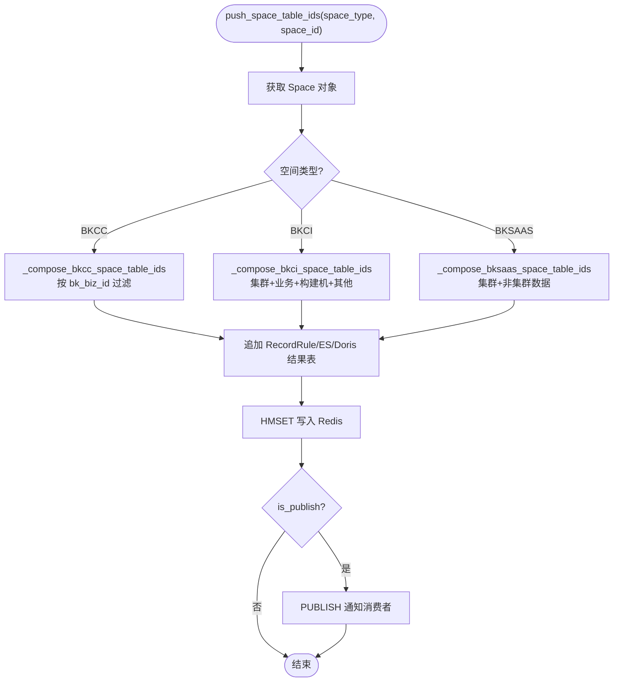
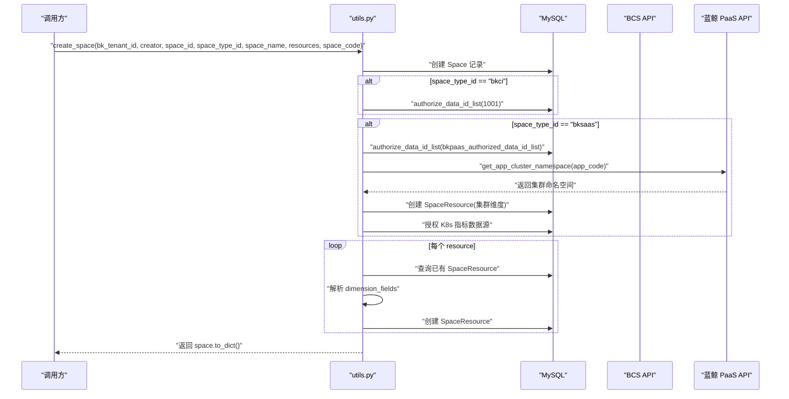

# 02-实现

**本文引用的文件**
- [space_table_id_redis.py](file://bk-monitor-base/src/bk_monitor_base/metadata/models/space/space_table_id_redis.py) — SpaceTableIDRedis 路由推送核心类
- [utils.py](file://bk-monitor-base/src/bk_monitor_base/metadata/models/space/utils.py) — 空间工具函数
- [managers.py](file://bk-monitor-base/src/bk_monitor_base/metadata/models/space/managers.py) — 空间查询管理器
- [constants.py](file://bk-monitor-base/src/bk_monitor_base/metadata/models/space/constants.py) — 常量定义

## 目录
1. [简介](#简介)
2. [Space Redis 路由推送机制](#space-redis-路由推送机制)
3. [空间 CRUD 流程](#空间-crud-流程)
4. [批量创建空间](#批量创建空间)
5. [数据源授权机制](#数据源授权机制)
6. [结论](#结论)

## 简介

本章聚焦空间管理子专家的四大核心实现：SpaceTableIDRedis 的按空间类型差异化路由推送、空间 CRUD 工具函数的完整流程、BKCC/BCS 空间的批量创建、数据源授权机制。

章节来源：[space_table_id_redis.py:61-1684](file://bk-monitor-base/src/bk_monitor_base/metadata/models/space/space_table_id_redis.py#L61-L1684)、[utils.py:1-1161](file://bk-monitor-base/src/bk_monitor_base/metadata/models/space/utils.py#L1-L1161)、[managers.py:14-171](file://bk-monitor-base/src/bk_monitor_base/metadata/models/space/managers.py#L14-L171)

## Space Redis 路由推送机制

### 路由推送架构

SpaceTableIDRedis 将空间关联的结果表映射写入 Redis 三个哈希键，并通过 Pub/Sub 通知消费者（如 unify-query）：

| Redis 键 | 写入方法 | 数据格式 | 消费者用途 |
|----------|---------|---------|-----------|
| `SPACE_TO_RESULT_TABLE_KEY` | `push_space_table_ids` | `{space_uid: {table_id: {filters: [...]}}}` | 空间数据查询隔离 |
| `DATA_LABEL_TO_RESULT_TABLE_KEY` | `push_data_label_table_ids` | `{data_label: [table_id, ...]}` | 按标签跨空间查询 |
| `RESULT_TABLE_DETAIL_KEY` | `push_table_id_detail` | `{table_id: {db, measurement, storage_type, fields, ...}}` | 结果表存储路由 |

### 按空间类型的差异化路由

`push_space_table_ids` 是路由推送的入口，根据空间类型调用不同的组装方法：



图表来源：[space_table_id_redis.py:67-117](file://bk-monitor-base/src/bk_monitor_base/metadata/models/space/space_table_id_redis.py#L67-L117)

### BKCC 空间路由核心逻辑

`_compose_bkcc_space_table_ids` 是 BKCC 类型空间路由的核心方法：

1. 调用 `_compose_data` 获取空间关联的结果表和数据源
2. 通过 `_refine_table_ids` 过滤仅写入 InfluxDB/VM/ES 的结果表
3. 通过 `_is_need_filter_for_bkcc` 判断每条结果表是否需要添加 `bk_biz_id` 过滤条件：
   - 自定义时序且属于当前空间：不需要过滤
   - 平台级自定义时序且不在当前空间：需要过滤
   - 非自定义时序：始终需要过滤
4. 追加 RecordRule/ES/Doris 结果表
5. 追加关联的 BKCI 空间 ES 结果表（适配 ES 多空间功能）

章节来源：[space_table_id_redis.py:500-700](file://bk-monitor-base/src/bk_monitor_base/metadata/models/space/space_table_id_redis.py#L500-L700)

### BKCI 空间路由核心逻辑

`_compose_bkci_space_table_ids` 处理容器监控空间的路由：

1. 获取空间关联的集群信息（通过 SpaceResource 的 `dimension_values`）
2. 按集群维度组装结果表路由
3. 追加关联的 BKCC 业务数据（通过 SpaceResource 的 `resource_type=bkcc`）
4. 追加 BKCI 空间级数据源
5. 追加构建机相关结果表

### BKSAAS 空间路由核心逻辑

`_compose_bksaas_space_table_ids` 处理 SaaS 应用空间的路由：

1. 按集群维度过滤结果表
2. 非集群数据不添加过滤条件（全量访问）
3. 追加 BKSAAS 空间级数据源

### 多租户键名拼接

当 `enable_multi_tenancy=True` 时，所有 Redis 键名追加租户 ID：

```python
# 空间路由键
space_redis_key = f"{space_type}__{space_id}|{bk_tenant_id}"

# data_label 路由键
rt_dl_map = {f"{data_label}|{bk_tenant_id}": table_ids}

# 结果表详情键
_table_id_detail = {f"{key}|{bk_tenant_id}": value}
```

章节来源：[space_table_id_redis.py:97-116](file://bk-monitor-base/src/bk_monitor_base/metadata/models/space/space_table_id_redis.py#L97-L116)

## 空间 CRUD 流程

### 创建空间

`create_space()` 是空间创建的入口函数，流程如下：



图表来源：[utils.py:280-370](file://bk-monitor-base/src/bk_monitor_base/metadata/models/space/utils.py#L280-L370)

### 更新空间

`update_space()` 修改空间名称、空间编码、绑定资源：

1. 更新 `space_name`（如果提供）
2. 更新 `space_code`（如果提供），自动设置 `is_bcs_valid=True`
3. 遍历 `resources`，对每个资源调用 `update_or_create`：
   - 查询已有 SpaceResource 获取 `dimension_values`
   - 如果资源不存在，通过 `dimension_fields` 设置默认维度值
   - 更新或创建 SpaceResource 记录

### 合并空间

`merge_space()` 将源空间的数据源和资源迁移到目标空间：

1. 校验源和目标空间同类型资源 ID 一致（不一致抛 ValueError）
2. 查询源空间的数据源（`from_authorization=False`）
3. 将源空间独有的数据源以 `from_authorization=True` 添加到目标空间
4. 将源空间独有的资源迁移到目标空间
5. 禁用源空间（`status=disabled`）

约束：使用 `@atomic` 装饰器确保事务一致性，但外部 API 调用不在事务内。

### 禁用空间

`disable_space()` 批量设置空间状态为 disabled：

1. 根据 `space_type_id` 和 `space_id` 组装 Q 过滤条件
2. 批量更新 `status=disabled`
3. 返回被禁用的空间详情列表

## 批量创建空间

### BKCC 空间批量创建

`create_bkcc_spaces()` 为业务列表批量创建 BKCC 空间：

1. 遍历业务列表，组装 Space 对象（`space_type_id=bkcc, space_id=str(bk_biz_id)`）
2. `bulk_create` 批量写入
3. 如果启用了 V2 VM 数据链路和空间内置数据链路：
   - 异步创建 basereport 数据链路
   - 异步创建 base_event 数据链路
   - 异步创建 system_proc 数据链路

### BCS 空间批量创建

`create_bcs_spaces()` 为项目列表批量创建 BCS 空间：

1. 组装 Space 对象（`space_type_id=bkci, space_id=project_code, space_code=project_id`）
2. 查询每个项目关联的 BKCC 业务数据源
3. 查询每个项目的集群列表（通过 BCS API）
4. 区分独享集群和共享集群的数据源授权
5. 创建 SpaceResource（BKCC 业务资源 + BCS 集群资源）
6. 在事务中批量创建 Space、SpaceDataSource、SpaceResource

## 数据源授权机制

### 授权层级

数据源授权分为三个层级：

| 层级 | 获取方法 | 说明 |
|------|---------|------|
| 平台级 | `get_platform_data_id_list()` | `is_platform_data_id=True, space_type_id="all"`，所有空间类型可访问 |
| 空间级 | `get_space_data_id_list(space_type_id)` | `is_platform_data_id=True, space_type_id=指定类型`，同类型空间可访问 |
| 空间专属 | SpaceDataSource（`from_authorization=False`） | 仅当前空间可访问 |

### 授权流程

`authorize_data_id_list()` 批量授权数据源给空间：

1. 查询已授权的数据源（`from_authorization` 不限）
2. 计算需要新增的数据源（差集）
3. 调用 `bulk_create_space_data_source()` 批量创建

### BKCI 特殊授权

BKCI 空间创建时自动授权 `BKCI_AUTHORIZED_DATA_ID_LIST = [1001]`，这是唯一跨空间类型查询的场景（BKCI 访问 BKCC 的 1001 数据源）。

### BKSAAS 特殊授权

BKSAAS 空间创建时：
1. 授权 `settings.metadata.bkpaas_authorized_data_id_list` 中的数据源
2. 调用蓝鲸 PaaS API 获取应用集群命名空间
3. 创建 SpaceResource（集群维度）
4. 授权集群的 K8s 内置指标数据源

## 结论

空间管理子专家通过 SpaceTableIDRedis 实现四种空间类型的差异化路由推送，通过 `utils.py` 中的工具函数实现空间 CRUD 和批量创建，通过三级数据源授权机制实现灵活的数据访问控制。多租户模式通过 `enable_multi_tenancy` 开关控制 Redis 键名拼接，确保跨租户隔离。
