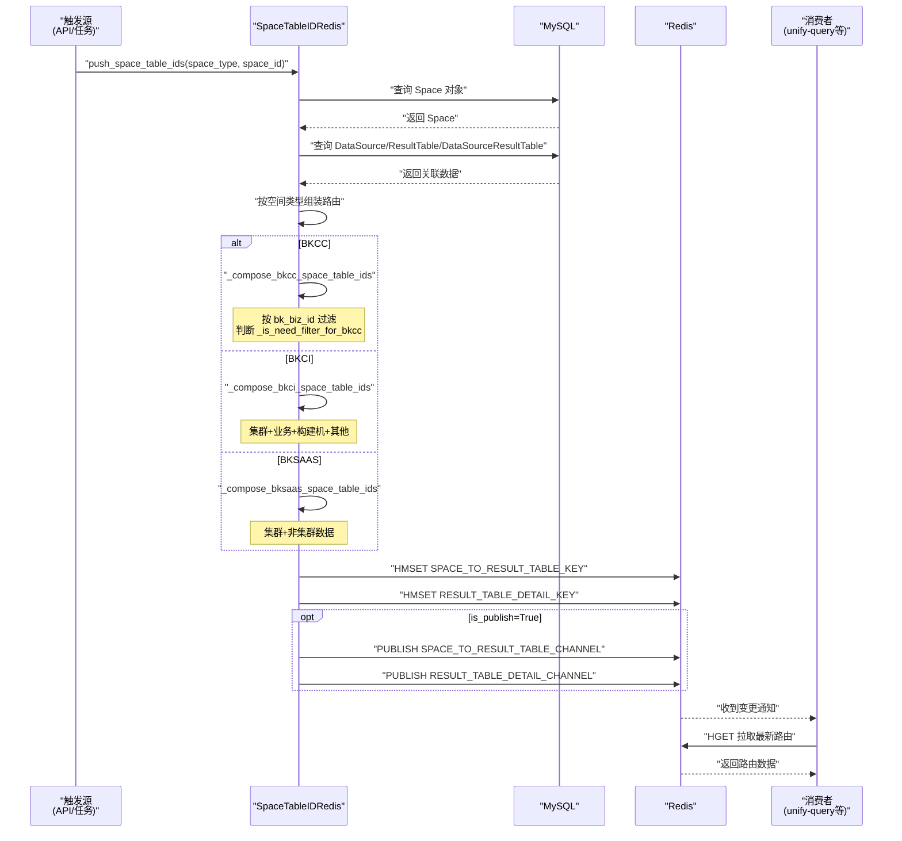
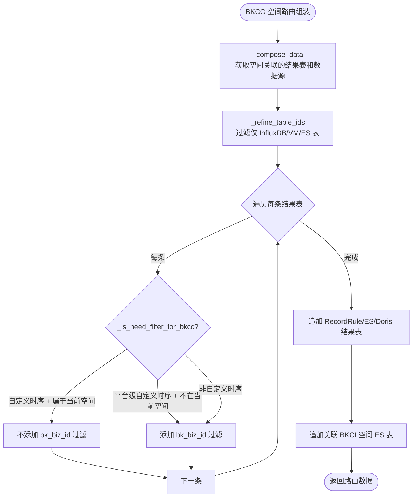
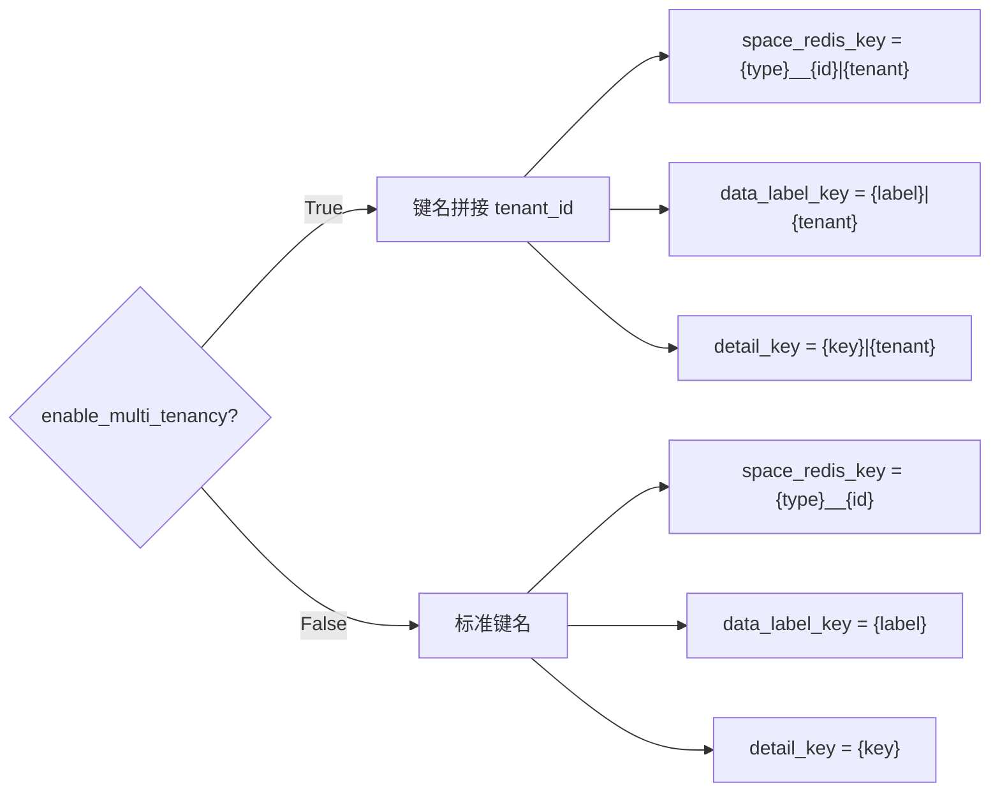
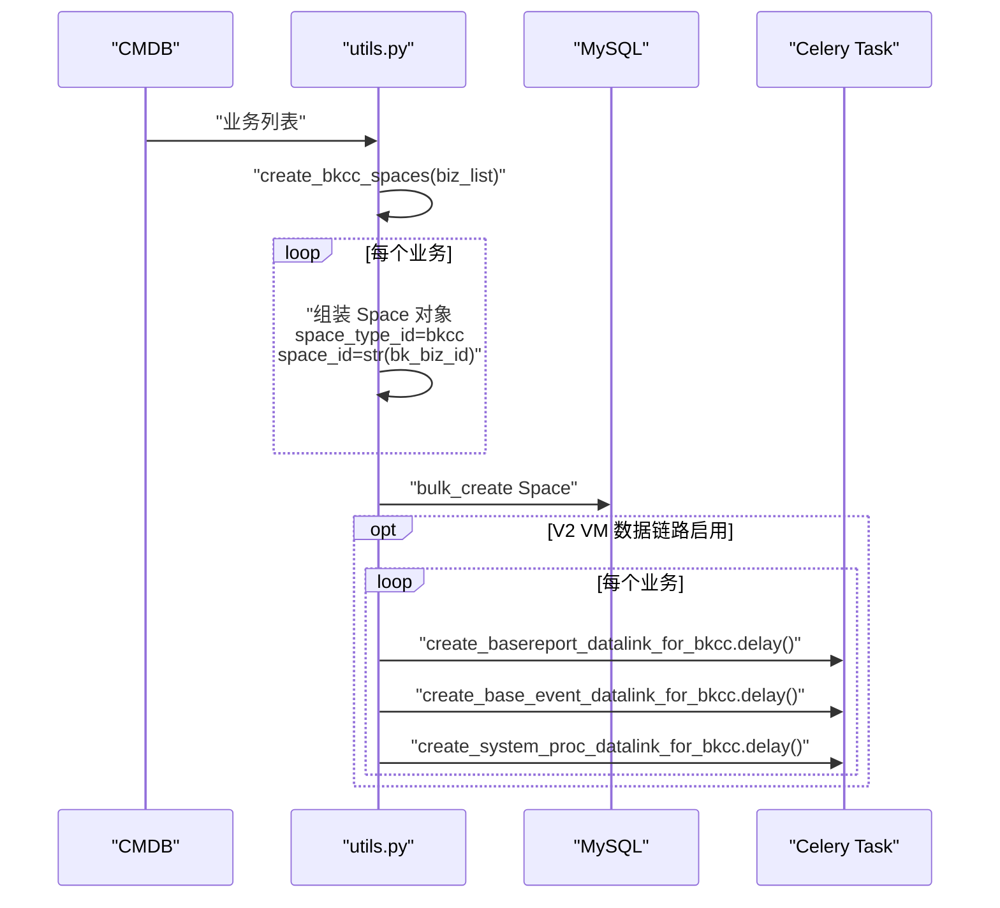
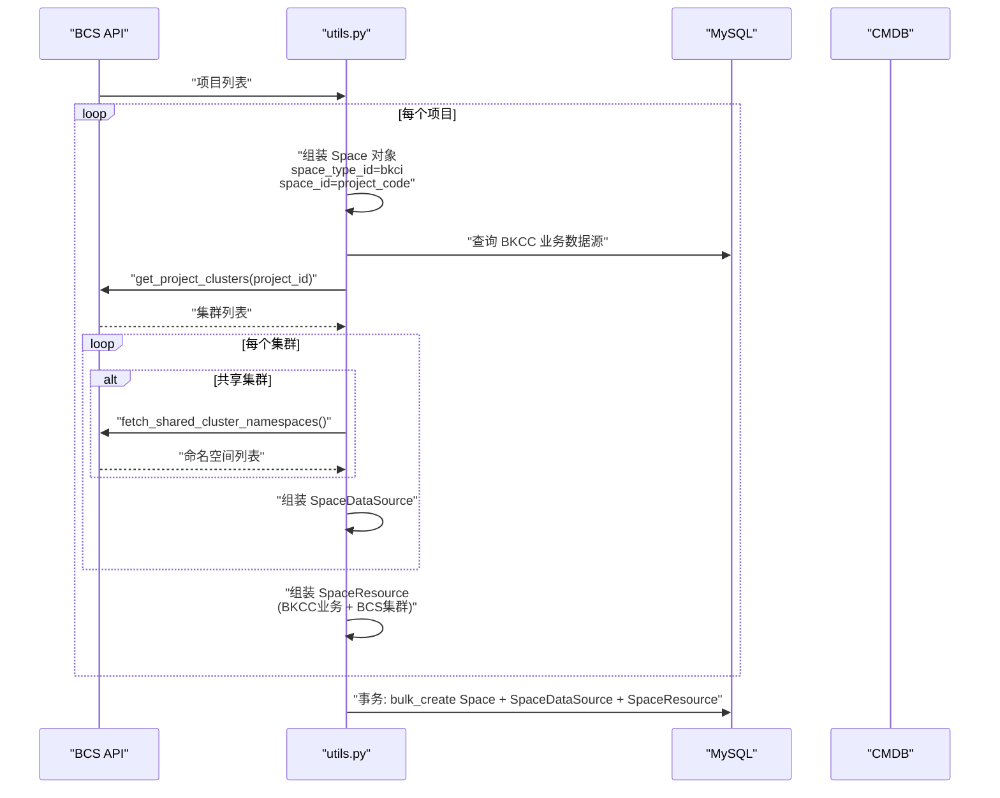
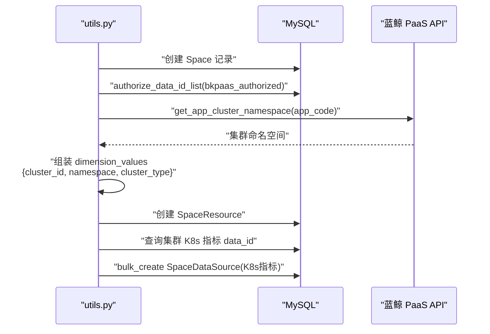
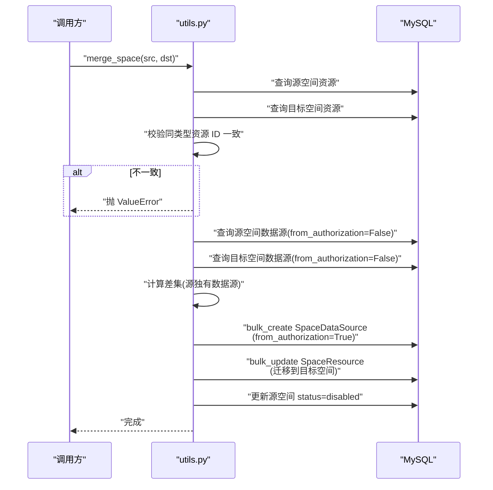

# 03-数据流转

**本文引用的文件**
- [space_table_id_redis.py](file://bk-monitor-base/src/bk_monitor_base/metadata/models/space/space_table_id_redis.py)
- [utils.py](file://bk-monitor-base/src/bk_monitor_base/metadata/models/space/utils.py)
- [constants.py](file://bk-monitor-base/src/bk_monitor_base/metadata/models/space/constants.py)

## 目录
1. [简介](#简介)
2. [空间路由推送数据流](#空间路由推送数据流)
3. [空间创建数据流](#空间创建数据流)
4. [空间合并数据流](#空间合并数据流)
5. [结论](#结论)

## 简介

本章描述空间管理子专家覆盖的三条核心数据流：空间路由从 DB → Redis → 消费者的推送链路、空间创建从 API → 模型 → 资源关联的完整链路、空间合并的数据迁移链路。

## 空间路由推送数据流

### 整体流程

图表来源：[space_table_id_redis.py:67-500](file://bk-monitor-base/src/bk_monitor_base/metadata/models/space/space_table_id_redis.py#L67-L500)

### 三类路由数据流

| 路由类型 | 写入方法 | 写入 Redis 键 | 数据格式 | 消费者用途 |
|---------|---------|-------------|---------|-----------|
| 空间-结果表 | `push_space_table_ids` | `SPACE_TO_RESULT_TABLE_KEY` | `{space_uid: {table_id: {filters: [...]}}}` | 空间数据查询隔离 |
| 数据标签-结果表 | `push_data_label_table_ids` | `DATA_LABEL_TO_RESULT_TABLE_KEY` | `{data_label: [table_id, ...]}` | 按标签跨空间查询 |
| 结果表详情 | `push_table_id_detail` | `RESULT_TABLE_DETAIL_KEY` | `{table_id: {db, measurement, storage_type, fields, ...}}` | 结果表存储路由 |

### BKCC 过滤逻辑数据流

图表来源：[space_table_id_redis.py:500-700](file://bk-monitor-base/src/bk_monitor_base/metadata/models/space/space_table_id_redis.py#L500-L700)

### 多租户键名数据流

图表来源：[space_table_id_redis.py:97-116](file://bk-monitor-base/src/bk_monitor_base/metadata/models/space/space_table_id_redis.py#L97-L116)

## 空间创建数据流

### BKCC 空间创建链路

图表来源：[utils.py:1000-1060](file://bk-monitor-base/src/bk_monitor_base/metadata/models/space/utils.py#L1000-L1060)

### BCS 空间创建链路

图表来源：[utils.py:800-990](file://bk-monitor-base/src/bk_monitor_base/metadata/models/space/utils.py#L800-L990)

### BKSAAS 空间创建链路

图表来源：[utils.py:370-420](file://bk-monitor-base/src/bk_monitor_base/metadata/models/space/utils.py#L370-L420)

## 空间合并数据流

图表来源：[utils.py:490-550](file://bk-monitor-base/src/bk_monitor_base/metadata/models/space/utils.py#L490-L550)

## 结论

空间管理子专家的三条数据流覆盖了空间路由推送、空间创建和空间合并的完整链路。路由推送通过 Redis Pub/Sub 机制实现消费者实时感知空间变更，空间创建通过事务确保模型和资源的一致性，空间合并通过数据源差集计算和资源迁移实现无缝合并。
