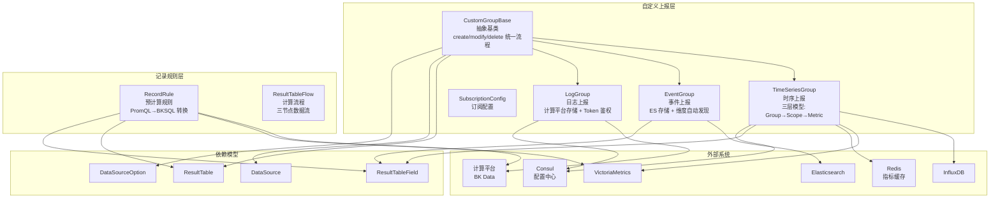
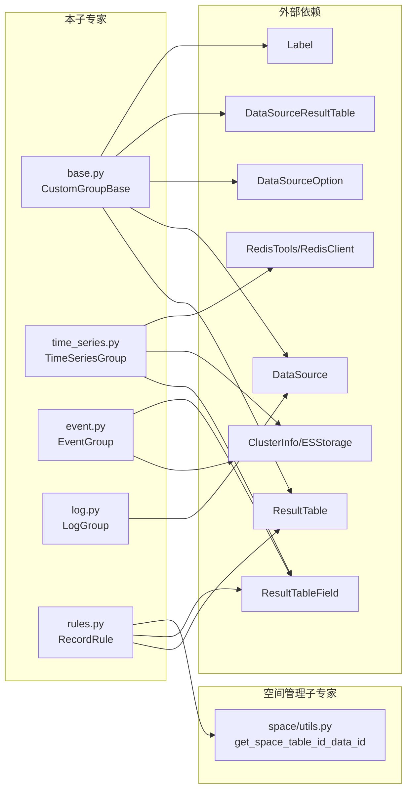

# 01-架构

**本文引用的文件**
- [base.py](file://bk-monitor-base/src/bk_monitor_base/metadata/models/custom_report/base.py) — CustomGroupBase 抽象基类
- [time_series.py](file://bk-monitor-base/src/bk_monitor_base/metadata/models/custom_report/time_series.py) — TimeSeriesGroup 时序上报
- [event.py](file://bk-monitor-base/src/bk_monitor_base/metadata/models/custom_report/event.py) — EventGroup 事件上报
- [log.py](file://bk-monitor-base/src/bk_monitor_base/metadata/models/custom_report/log.py) — LogGroup 日志上报
- [rules.py](file://bk-monitor-base/src/bk_monitor_base/metadata/models/record_rule/rules.py) — RecordRule + ResultTableFlow

## 目录
1. [简介](#简介)
2. [模块分层架构](#模块分层架构)
3. [文件职责划分](#文件职责划分)
4. [依赖关系](#依赖关系)
5. [契约层索引](#契约层索引)
6. [实现层切面索引](#实现层切面索引)
7. [关键发现与风险](#关键发现与风险)
8. [术语表](#术语表)

## 简介

自定义上报子专家覆盖 `custom_report/` 包全部 5 个文件和 `record_rule/` 包全部 4 个文件，负责自定义上报（时序/事件/日志）的完整生命周期管理和记录规则的预计算管理。核心职责分为两层：**自定义上报层**（CustomGroupBase 抽象基类 + TimeSeriesGroup/EventGroup/LogGroup 三个子类）和**记录规则层**（RecordRule 规则管理 + ResultTableFlow 计算平台数据流）。

章节来源：[base.py:1-503](file://bk-monitor-base/src/bk_monitor_base/metadata/models/custom_report/base.py#L1-L503)、[time_series.py:1-2593](file://bk-monitor-base/src/bk_monitor_base/metadata/models/custom_report/time_series.py#L1-L2593)、[event.py:1-471](file://bk-monitor-base/src/bk_monitor_base/metadata/models/custom_report/event.py#L1-L471)、[log.py:1-153](file://bk-monitor-base/src/bk_monitor_base/metadata/models/custom_report/log.py#L1-L153)、[rules.py:1-399](file://bk-monitor-base/src/bk_monitor_base/metadata/models/record_rule/rules.py#L1-L399)

## 模块分层架构

图表来源：[base.py:30-500](file://bk-monitor-base/src/bk_monitor_base/metadata/models/custom_report/base.py#L30-L500)、[time_series.py:50-200](file://bk-monitor-base/src/bk_monitor_base/metadata/models/custom_report/time_series.py#L50-L200)、[event.py:30-200](file://bk-monitor-base/src/bk_monitor_base/metadata/models/custom_report/event.py#L30-L200)、[log.py:20-153](file://bk-monitor-base/src/bk_monitor_base/metadata/models/custom_report/log.py#L20-L153)、[rules.py:39-399](file://bk-monitor-base/src/bk_monitor_base/metadata/models/record_rule/rules.py#L39-L399)

## 文件职责划分

| 文件 | 行数 | 大小 | 职责 |
|------|------|------|------|
| `base.py` | 503 | 21KB | CustomGroupBase 抽象基类：统一创建/修改/删除流程、pre_check 校验、table_id 生成、结果表关联 |
| `time_series.py` | 2593 | 106KB | TimeSeriesGroup：三层模型、指标同步（Redis+BkData 双通道）、单指标单表、维度过滤、序列化 |
| `event.py` | 471 | 19KB | EventGroup + Event：ES 存储、固定字段结构、维度自动发现、事件管理 |
| `log.py` | 153 | 5KB | LogGroup：计算平台存储、Token 生成、配置下发 |
| `rules.py` | 399 | — | RecordRule：PromQL→BKSQL 转换、源表反查；ResultTableFlow：三节点数据流管理 |

## 依赖关系

图表来源：[base.py:1-40](file://bk-monitor-base/src/bk_monitor_base/metadata/models/custom_report/base.py#L1-L40)、[time_series.py:1-50](file://bk-monitor-base/src/bk_monitor_base/metadata/models/custom_report/time_series.py#L1-L50)、[rules.py:1-40](file://bk-monitor-base/src/bk_monitor_base/metadata/models/record_rule/rules.py#L1-L40)

## 契约层索引

- [C0-使用总览.md](../C0-使用总览.md) — 能力清单、边界、已知坑
- [C1-能力契约.md](../C1-能力契约.md) — CustomGroupBase/TimeSeriesGroup/EventGroup/LogGroup/RecordRule API 契约

## 实现层切面索引

- [02-实现.md](./02-实现.md) — 核心实现：自定义上报全链路、时序指标同步、记录规则匹配
- [03-数据流转.md](./03-数据流转.md) — 数据流转：时序/事件/日志上报数据流、记录规则数据流
- [04-模型.md](./04-模型.md) — 数据模型：CustomReport 模型族 + RecordRule 模型族
- [05-接口.md](./05-接口.md) — 接口说明：所有模型对外暴露的方法签名

## 关键发现与风险

| 发现 | 详情 | 风险等级 |
|------|------|---------|
| `time_series.py` 106KB 单文件 | TimeSeriesGroup 包含指标同步、分表逻辑、维度过滤、JSON 序列化等大量方法 | 中 — 方法间耦合度高 |
| 自定义上报与结果表强耦合 | CustomGroupBase._create 内部调用 ResultTable.create_result_table | 中 — 结果表创建失败会导致上报组创建失败 |
| 时序指标同步有双通道竞争 | Redis 通道和 BkData 通道可能返回不一致的指标数据 | 低 — 最终以数据库为准 |
| 事件维度自动发现依赖 ES 可用性 | `update_event_dimensions_from_es` 需要 ES 客户端连接正常 | 中 — ES 不可用时维度无法更新 |
| 记录规则源表自动发现依赖过期时间 | `get_src_table_ids` 通过 `time_series_metric_expired_seconds` 过滤过期指标 | 低 — 过期配置不当可能导致源表为空 |
| 日志组名称不可修改 | `modify_log_group` 不允许修改 `log_group_name`，避免 token 变化 | 低 — 设计约束，非 bug |

## 术语表

| 术语 | 说明 |
|------|------|
| CustomGroupBase | 自定义上报抽象基类，定义 create/modify/delete 通用流程 |
| TimeSeriesGroup | 自定义时序上报组，三层模型：Group → Scope → Metric |
| TimeSeriesScope | 时序指标分组，按维度 key 分组 |
| TimeSeriesMetric | 时序具体指标，关联 scope 和 field |
| EventGroup | 自定义事件上报组，存储于 ES |
| Event | 事件描述，含 event_name 和 dimension_list |
| LogGroup | 自定义日志上报组，存储于计算平台 |
| RecordRule | 预计算规则，将 PromQL 转为计算平台 BKSQL 数据流 |
| ResultTableFlow | 记录规则对应的计算平台数据流（stream_source → promql_v2 → vm_storage） |
| Split Measurement | 单指标单表模式，每个指标独立结果表 |
| bk_data_token | 日志上报鉴权 Token，由 data_id + bk_biz_id + app_name 加密生成 |
| flat_batch_key | 数据源选项，指定 Transfer 需要拆解的字段名 |
