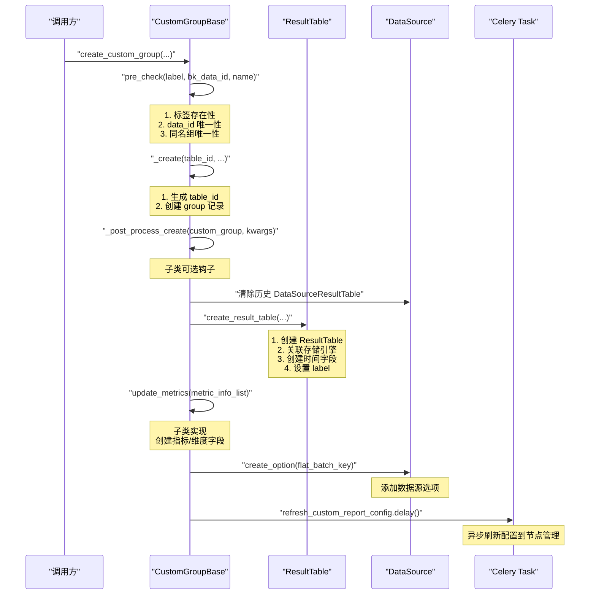
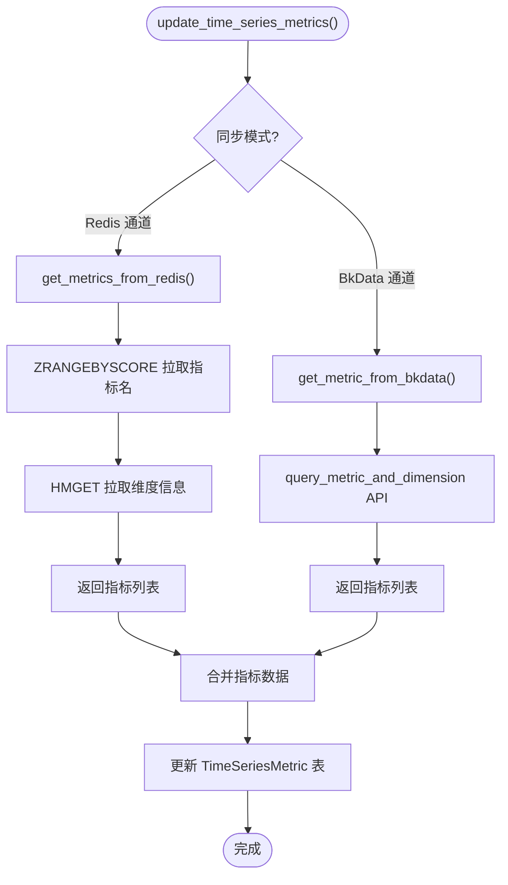
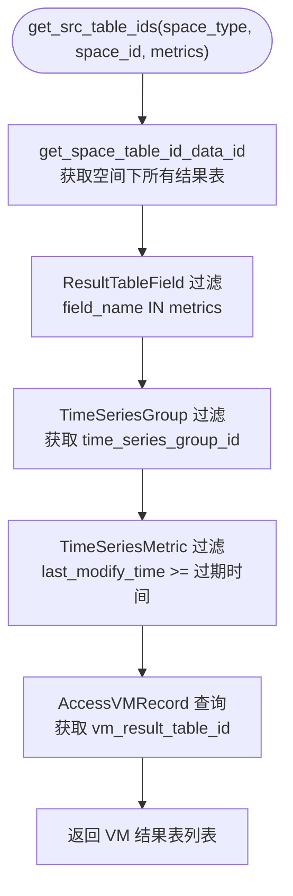

# 02-实现

**本文引用的文件**
- [base.py](file://bk-monitor-base/src/bk_monitor_base/metadata/models/custom_report/base.py) — CustomGroupBase 抽象基类
- [time_series.py](file://bk-monitor-base/src/bk_monitor_base/metadata/models/custom_report/time_series.py) — TimeSeriesGroup 时序上报
- [event.py](file://bk-monitor-base/src/bk_monitor_base/metadata/models/custom_report/event.py) — EventGroup 事件上报
- [log.py](file://bk-monitor-base/src/bk_monitor_base/metadata/models/custom_report/log.py) — LogGroup 日志上报
- [rules.py](file://bk-monitor-base/src/bk_monitor_base/metadata/models/record_rule/rules.py) — RecordRule + ResultTableFlow

## 目录
1. [简介](#简介)
2. [自定义上报全链路](#自定义上报全链路)
3. [时序自定义上报](#时序自定义上报)
4. [事件自定义上报](#事件自定义上报)
5. [日志自定义上报](#日志自定义上报)
6. [记录规则匹配与执行](#记录规则匹配与执行)
7. [结论](#结论)

## 简介

本章聚焦自定义上报子专家的五大核心实现：CustomGroupBase 统一创建流程、TimeSeriesGroup 时序上报全链路（含指标同步双通道）、EventGroup 事件上报与维度自动发现、LogGroup 日志上报与 Token 管理、RecordRule 的 PromQL→BKSQL 转换与计算平台对接。

章节来源：[base.py:30-500](file://bk-monitor-base/src/bk_monitor_base/metadata/models/custom_report/base.py#L30-L500)、[time_series.py:50-2593](file://bk-monitor-base/src/bk_monitor_base/metadata/models/custom_report/time_series.py#L50-L2593)、[event.py:30-471](file://bk-monitor-base/src/bk_monitor_base/metadata/models/custom_report/event.py#L30-L471)、[log.py:20-153](file://bk-monitor-base/src/bk_monitor_base/metadata/models/custom_report/log.py#L20-L153)、[rules.py:39-399](file://bk-monitor-base/src/bk_monitor_base/metadata/models/record_rule/rules.py#L39-L399)

## 自定义上报全链路

### 统一创建流程

CustomGroupBase.create_custom_group 定义了所有自定义上报类型的统一创建流程：



图表来源：[base.py:180-350](file://bk-monitor-base/src/bk_monitor_base/metadata/models/custom_report/base.py#L180-L350)

### 统一修改流程

CustomGroupBase.modify_custom_group 支持按需修改：

1. 检查 `is_delete` 标志（已删除不可修改）
2. 按需修改：`custom_group_name`、`label`、`is_enable`、`metric_info_list`、`max_rate`
3. 处理 `enable_field_black_list` 选项
4. 合并结果表选项（`field_list`、`data_label`、`rt_options`）
5. 保存修改

### 统一删除流程

CustomGroupBase.delete_custom_group：

1. 检查 `is_delete` 标志
2. 调用 `remove_metrics()` 删除关联指标/事件
3. 设置 `is_delete=True` 并保存
4. 调用 `set_table_id_disable()` 废弃关联结果表

## 时序自定义上报

### 三层数据模型

TimeSeriesGroup 采用三层模型组织指标数据：

```
TimeSeriesGroup (数据源级)
  └── TimeSeriesScope (指标分组级)
        └── TimeSeriesMetric (具体指标)
```

- **TimeSeriesGroup**：关联一个 `bk_data_id`，配置 `metric_group_dimensions`（分组维度 key）
- **TimeSeriesScope**：按维度值分组，`scope_name` 由维度值拼接（如 `service_name:api||scope_name:prod`）
- **TimeSeriesMetric**：具体指标，关联 scope 和 field，含 `last_modify_time` 用于过期判断

### 指标同步双通道



图表来源：[time_series.py:500-1000](file://bk-monitor-base/src/bk_monitor_base/metadata/models/custom_report/time_series.py#L500-L1000)

### 单指标单表模式

当 `is_split_measurement=True` 时：
- 每个指标独立生成 `table_id`：`bk_k8s_{group_name}_{field_name}`
- 查询时按指标名路由到对应结果表
- `to_split_json()` 返回按指标拆分的 JSON 列表

### 维度过滤

`get_ts_metrics_by_dimension(dimension_name, dimension_value)` 按维度名/值过滤指标，用于前端按维度筛选展示。

## 事件自定义上报

### 固定字段结构

EventGroup 的 ES 存储采用固定字段结构：

| 字段 | ES 类型 | 说明 |
|------|---------|------|
| `event` | object | 事件内容，含 `content`(text) 和 `count`(integer) |
| `target` | keyword | 事件目标 |
| `dimensions` | object | 动态维度，`es_dynamic=True` |
| `event_name` | keyword | 事件名称 |
| `time` | date (epoch_millis) | 时间戳 |

### ES 文档 ID 配置

创建事件组时自动设置 `OPTION_ES_DOCUMENT_ID = [event, target, dimensions, event_name, time]`，确保相同事件去重。

### 维度自动发现

`update_event_dimensions_from_es()` 从 ES 聚合查询更新事件和维度：

1. 聚合查询 `event_name` 字段，获取所有事件名
2. 对每个事件名，采样查询最新一条记录
3. 提取 `dimensions` 对象的 key 列表
4. 调用 `Event.modify_event_list()` 更新（新旧维度合并）

### 事件管理

`Event.modify_event_list(event_group_id, event_info_list)` 批量管理事件：
- 不存在的事件：创建新 Event 记录
- 已存在的事件：合并新旧维度列表
- 自动确保 `target` 维度存在

## 日志自定义上报

### 创建流程

LogGroup.create_log_group 与基类流程不同，有独立的实现：

1. `pre_check` 校验参数
2. `_create` 创建 LogGroup 记录
3. 刷新 Consul 配置触发 Transfer 更新
4. 生成 `bk_data_token`（通过 `transform_data_id_to_token` 加密）
5. 异步下发配置到 BkCollector

### Token 生成

`get_bk_data_token()` 通过 `transform_data_id_to_token` 加密生成：
- 输入：`log_data_id`、`bk_biz_id`、`app_name`（即 `log_group_name`）
- 约束：`log_group_name` 不可修改，避免 token 变化

### 配置下发

创建/修改后调用 `refresh_custom_log_report_config.delay(log_group_id)` 异步下发配置到 BkCollector。

## 记录规则匹配与执行

### PromQL → BKSQL 转换

RecordRule.transform_bk_sql_and_metrics 是规则配置解析的入口：

1. YAML 解析：`yaml.safe_load(rule_config)` 获取 `rules` 列表和 `interval`
2. 遍历每条规则，调用 `utils.refine_bk_sql_and_metrics(expr, all_rule_record)` 将 PromQL 转为结构化 SQL
3. 提取指标集合和指标别名映射
4. 组装 BKSQL 配置列表，每项含 `name/count_freq/sql/metric_name/label`

章节来源：[rules.py:60-97](file://bk-monitor-base/src/bk_monitor_base/metadata/models/record_rule/rules.py#L60-L97)

### 源表自动发现

`get_src_table_ids` 通过指标反查源 VM 结果表：



图表来源：[rules.py:100-160](file://bk-monitor-base/src/bk_monitor_base/metadata/models/record_rule/rules.py#L100-L160)

### 计算平台数据流

ResultTableFlow 组装三节点数据流：

| 节点 | 类型 | 职责 |
|------|------|------|
| source | `stream_source` | 从源 VM 结果表读取数据 |
| process | `promql_v2` | 执行 BKSQL 预计算 |
| storage | `vm_storage` | 将计算结果写入目标 VM 结果表 |

创建流程：
1. `compose_source_node(vm_table_ids)` — 组装源节点列表
2. `compose_process_node(bk_tenant_id, table_id, vm_table_ids)` — 组装 promql_v2 处理节点
3. `compose_vm_storage(bk_tenant_id, table_id, process_id)` — 组装 vm_storage 存储节点
4. `apply_data_flow` — 提交到计算平台
5. `start_flow(flow_id, consuming_mode="Current")` — 尾部消费启动

章节来源：[rules.py:277-395](file://bk-monitor-base/src/bk_monitor_base/metadata/models/record_rule/rules.py#L277-L395)

## 结论

自定义上报子专家通过 CustomGroupBase 统一三种上报类型的创建/修改/删除流程，通过 TimeSeriesGroup 实现最复杂的时序指标管理（双通道同步 + 单指标单表），通过 EventGroup 实现 ES 事件存储与维度自动发现，通过 LogGroup 实现轻量级日志上报，通过 RecordRule + ResultTableFlow 实现 PromQL 预计算规则的完整生命周期管理。
