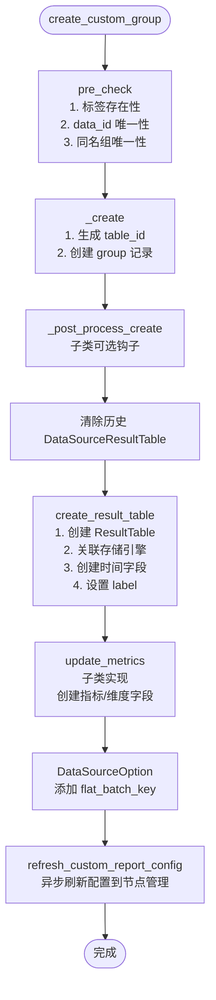
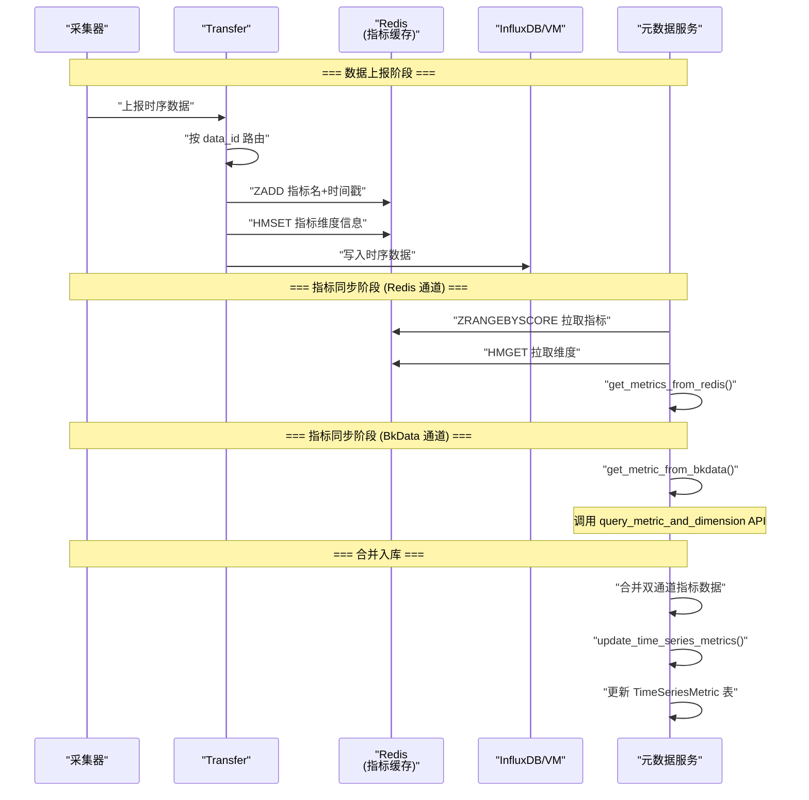
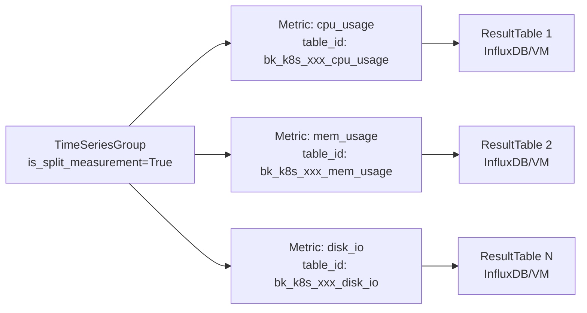
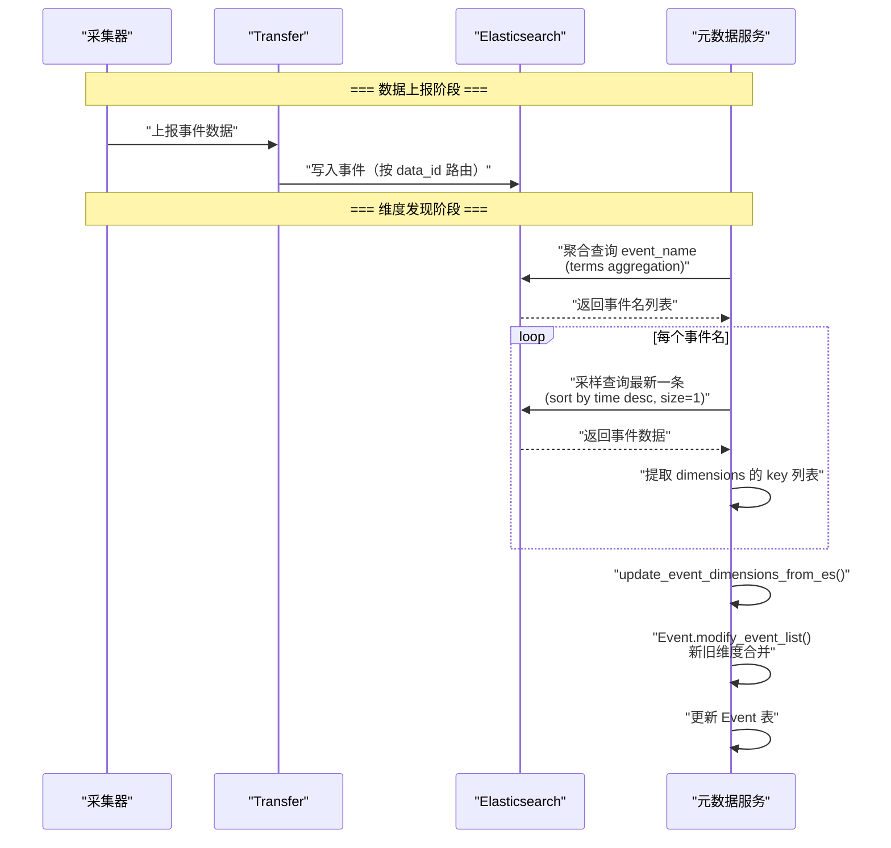
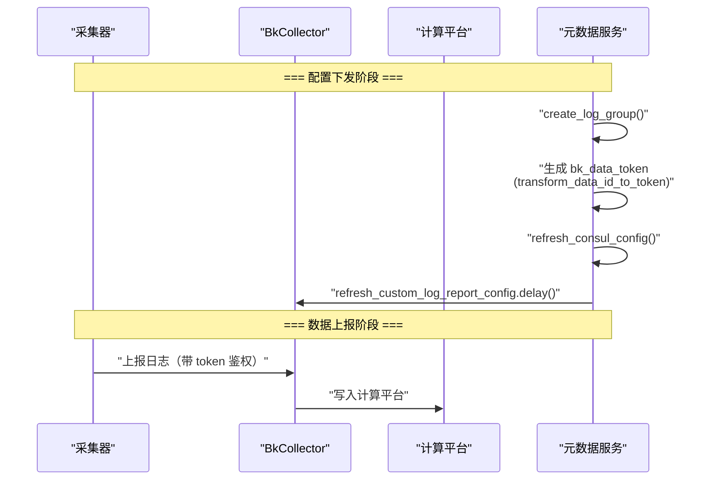
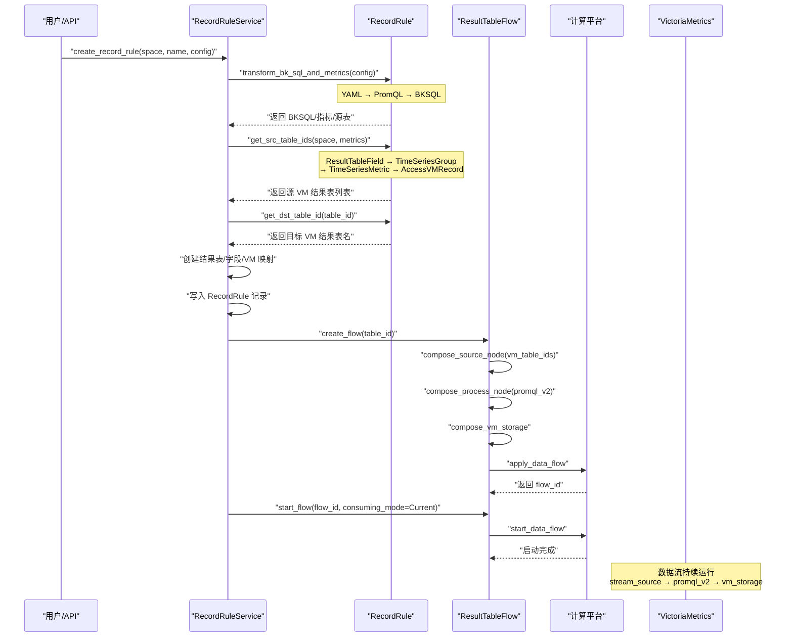
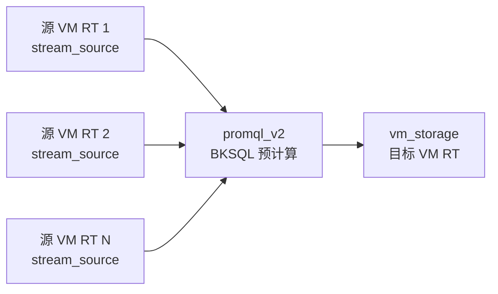

# 03-数据流转

**本文引用的文件**
- [base.py](file://bk-monitor-base/src/bk_monitor_base/metadata/models/custom_report/base.py)
- [time_series.py](file://bk-monitor-base/src/bk_monitor_base/metadata/models/custom_report/time_series.py)
- [event.py](file://bk-monitor-base/src/bk_monitor_base/metadata/models/custom_report/event.py)
- [log.py](file://bk-monitor-base/src/bk_monitor_base/metadata/models/custom_report/log.py)
- [rules.py](file://bk-monitor-base/src/bk_monitor_base/metadata/models/record_rule/rules.py)

## 目录
1. [简介](#简介)
2. [自定义上报创建数据流](#自定义上报创建数据流)
3. [时序自定义上报数据流](#时序自定义上报数据流)
4. [事件自定义上报数据流](#事件自定义上报数据流)
5. [日志自定义上报数据流](#日志自定义上报数据流)
6. [记录规则数据流](#记录规则数据流)
7. [结论](#结论)

## 简介

本章描述自定义上报子专家覆盖的四条核心数据流：自定义上报从接入→校验→存储→查询的完整链路、时序指标同步的双通道数据流、事件维度自动发现数据流、记录规则从配置→计算平台→结果存储的执行链路。

## 自定义上报创建数据流

图表来源：[base.py:180-350](file://bk-monitor-base/src/bk_monitor_base/metadata/models/custom_report/base.py#L180-L350)

## 时序自定义上报数据流

### 数据上报与指标同步

图表来源：[time_series.py:500-1000](file://bk-monitor-base/src/bk_monitor_base/metadata/models/custom_report/time_series.py#L500-L1000)

### 单指标单表数据流

图表来源：[time_series.py:150-200](file://bk-monitor-base/src/bk_monitor_base/metadata/models/custom_report/time_series.py#L150-L200)

## 事件自定义上报数据流

### 数据上报与维度发现

图表来源：[event.py:200-350](file://bk-monitor-base/src/bk_monitor_base/metadata/models/custom_report/event.py#L200-L350)

## 日志自定义上报数据流

图表来源：[log.py:30-153](file://bk-monitor-base/src/bk_monitor_base/metadata/models/custom_report/log.py#L30-L153)

## 记录规则数据流

### 规则创建到数据流启动

图表来源：[rules.py:39-399](file://bk-monitor-base/src/bk_monitor_base/metadata/models/record_rule/rules.py#L39-L399)

### 数据流节点拓扑

图表来源：[rules.py:277-352](file://bk-monitor-base/src/bk_monitor_base/metadata/models/record_rule/rules.py#L277-L352)

## 结论

自定义上报子专家的四条数据流覆盖了从数据接入到存储查询的完整链路。时序上报通过 Redis+BkData 双通道实现指标自动发现，事件上报通过 ES 聚合查询实现维度自动发现，日志上报通过 Token 鉴权实现安全上报，记录规则通过计算平台三节点数据流实现 PromQL 预计算。
