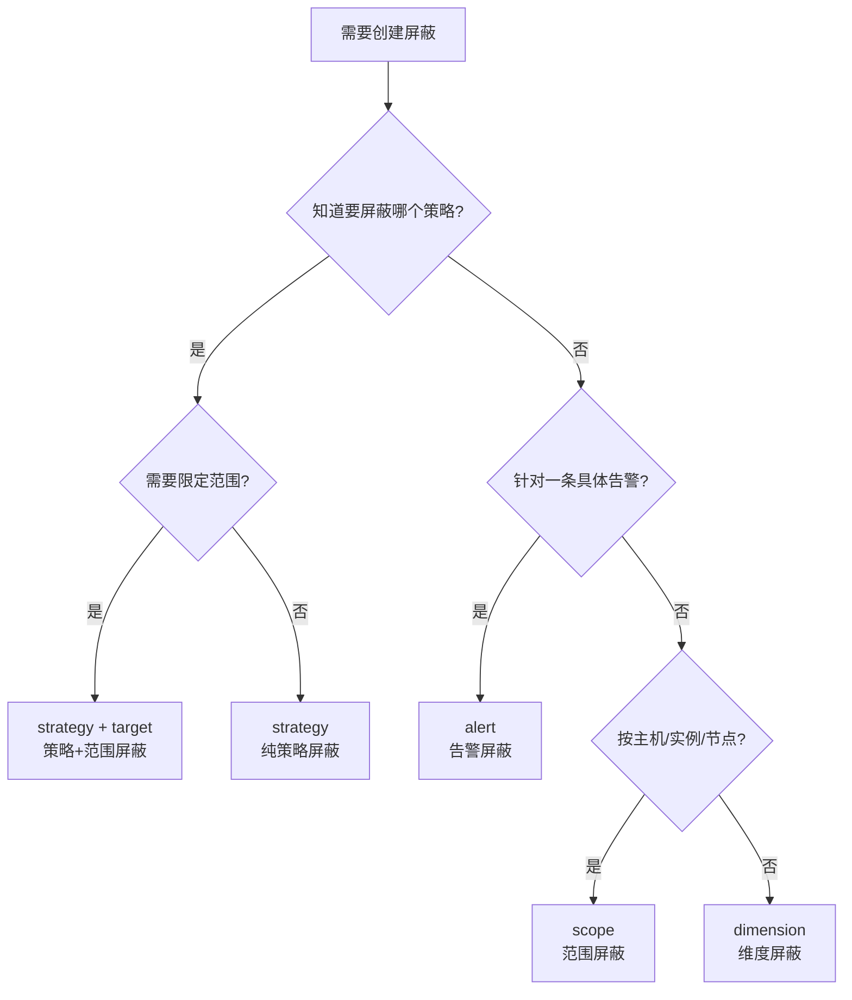

# 告警屏蔽专家 — 能力契约

**本文引用的文件**:
- `bkmonitor/packages/monitor_web/shield/views.py`
- `bkmonitor/packages/monitor_web/shield/resources/backend_resources.py`
- `bkmonitor/packages/monitor_web/shield/resources/frontend_resources.py`
- `bkmonitor/packages/monitor_web/shield/resources/celery_resources.py`
- `bkmonitor/packages/monitor_web/shield/serializers.py`
- `bkmonitor/packages/monitor_web/shield/utils.py`
- `bkmonitor/alarm_backends/service/converge/shield/shield_obj.py`
- `bkmonitor/alarm_backends/service/converge/shield/shielder/saas_config.py`
- `bkmonitor/alarm_backends/service/converge/shield/manager.py`
- `bkmonitor/alarm_backends/core/cache/shield.py`
- `bkmonitor/alarm_backends/service/converge/shield/tasks.py`
- `bkmonitor/bkmonitor/models/base.py`
- `bkmonitor/bkmonitor/utils/shield.py`
- `bkmonitor/constants/shield.py`
- `bkmonitor/packages/weixin/event/resources.py`
- `bkmonitor/packages/weixin/event/views.py`
- `bkmonitor/packages/fta_web/alert/resources.py`
- `bkmonitor/packages/fta_web/alert/views.py`

## 目录

1. [Web API 端点契约](#1-web-api-端点契约)
2. [ShieldListResource — 屏蔽列表查询](#2-shieldlistresource)
3. [AddShieldResource — 新增屏蔽](#3-addshieldresource)
3a. [五种屏蔽类型对比 — 匹配配置与行为差异](#3a-五种屏蔽类型对比--匹配配置与行为差异)
4. [BulkAddAlertShieldResource — 批量告警屏蔽](#4-bulkaddalertshieldresource)
5. [EditShieldResource — 编辑屏蔽](#5-editshieldresource)
6. [DisableShieldResource — 解除屏蔽](#6-disableshieldresource)
7. [FrontendShieldListResource — 前端列表](#7-frontendshieldlistresource)
8. [FrontendShieldDetailResource — 前端详情](#8-frontendshielddetailresource)
9. [ShieldDetectManager — Web 层屏蔽检测](#9-shielddetectmanager)
10. [ShieldObj — 引擎层屏蔽匹配](#10-shieldobj)
11. [AlertShieldObj — 告警维度屏蔽匹配](#11-alertshieldobj)
12. [ShieldManager — 引擎层屏蔽管理器](#12-shieldmanager)
13. [ShieldCacheManager — 屏蔽缓存管理](#13-shieldcachemanager)
14. [handle_shield_time — 时间处理函数](#14-handle_shield_time)

---

## 1. Web API 端点契约

| Endpoint | Method | Resource | 权限 | 说明 |
|----------|--------|----------|------|------|
| `shield_list` | POST | `ShieldListResource` | VIEW_DOWNTIME | 通用屏蔽列表 |
| `frontend_shield_list` | POST | `FrontendShieldListResource` | VIEW_DOWNTIME | 前端屏蔽列表（含展示增强） |
| `shield_detail` | GET | `ShieldDetailResource` | VIEW_DOWNTIME | 通用屏蔽详情 |
| `frontend_shield_detail` | GET | `FrontendShieldDetailResource` | VIEW_DOWNTIME | 前端屏蔽详情（含维度翻译） |
| `frontend_clone_info` | GET | `FrontendCloneInfoResource` | VIEW_DOWNTIME | 克隆信息 |
| `shield_snapshot` | POST | `ShieldSnapshotResource` | VIEW_DOWNTIME | 快照详情 |
| `add_shield` | POST | `AddShieldResource` | MANAGE_DOWNTIME | 新增屏蔽 |
| `bulk_add_alert_shield` | POST | `BulkAddAlertShieldResource` | MANAGE_DOWNTIME | 批量告警屏蔽 |
| `edit_shield` | POST | `EditShieldResource` | MANAGE_DOWNTIME | 编辑屏蔽 |
| `disable_shield` | POST | `DisableShieldResource` | MANAGE_DOWNTIME | 解除屏蔽 |
| `update_failure_shield_content` | GET | `UpdateFailureShieldContentResource` | — | Celery 定时任务 |

### 快捷屏蔽接口（独立 ViewSet）

| Endpoint | Method | Resource | 权限 | 说明 |
|----------|--------|----------|------|------|
| `quick_shield` | POST | `resource.weixin.event.quick_shield` | `AlertPermissionResource` | 快速屏蔽事件（支持 scope/strategy/event 三种类型） |
| `alert/quick_shield` | GET | `resource.alert.quick_alert_shield` | `QuickActionTokenResource`(token 验证) | 快捷告警屏蔽（默认3小时，通过通知链接触发） |
| `alert/quick_ack` | GET | `resource.alert.quick_alert_ack` | `QuickActionTokenResource`(token 验证) | 快捷告警确认（通过通知链接触发） |

> 快捷屏蔽接口不在 `ShieldViewSet` 中，而是分别注册在 `weixin/event/views.py` 的 `EventViewSet`（`quick_shield`）和 `fta_web/alert/views.py` 的 `QuickAlertHandleViewSet`（`alert/quick_shield`、`alert/quick_ack`）。`QuickAlertHandleViewSet` 使用 `PlainTextRenderer` 渲染器，返回重定向 HTML 或纯文本结果。

章节来源 [ShieldViewSet](file://bkmonitor/packages/monitor_web/shield/views.py#L19-L51)

---

## 2. ShieldListResource

**类名**: `ShieldListResource`
**文件**: `bkmonitor/packages/monitor_web/shield/resources/backend_resources.py`
**职责**: 通用屏蔽列表查询，支持多条件过滤、分页

### 请求参数

| 参数 | 类型 | 必填 | 默认值 | 说明 |
|------|------|------|--------|------|
| bk_biz_id | int | 否 | — | 不传则查当前用户所有业务 |
| is_active | bool | 否 | True | True=屏蔽中, False=已失效 |
| order | str | 否 | "-id" | 排序字段 |
| categories | list | 否 | [] | 屏蔽类型过滤 |
| conditions | list | 否 | [] | 附加条件 |
| time_range | str | 否 | — | 时间范围 |
| page | int | 否 | 0 | 页码（0=不分页） |
| page_size | int | 否 | 0 | 每页条数（0=不分页） |

### 返回

```python
{
    "count": int,
    "shield_list": [
        {
            "id": int,
            "bk_biz_id": int,
            "category": str,  # scope/strategy/event/alert/dimension
            "status": int,    # 1=屏蔽中 2=已过期 3=被解除
            "begin_time": str,
            "end_time": str,
            "failure_time": str,
            "is_enabled": bool,
            "scope_type": str,
            "dimension_config": dict,
            "content": str,
            "cycle_config": dict,
            "shield_notice": bool,
            "notice_config": str,
            "description": str,
            "source": str,
            "update_user": str,
            "label": str,
        }
    ]
}
```

### 异常
- 无特定异常，条件过滤异常时返回空列表

章节来源 [ShieldListResource](file://bkmonitor/packages/monitor_web/shield/resources/backend_resources.py#L72-L184)

---

## 3. AddShieldResource

**类名**: `AddShieldResource(Resource, EventDimensionMixin)`
**文件**: `bkmonitor/packages/monitor_web/shield/resources/backend_resources.py`
**职责**: 新增屏蔽配置，支持 5 种屏蔽类型

### 请求参数（通用字段）

| 参数 | 类型 | 必填 | 说明 |
|------|------|------|------|
| bk_biz_id | int | 是 | 业务ID |
| category | str | 是 | 屏蔽类型: scope/strategy/event/alert/dimension |
| begin_time | str | 是 | 屏蔽开始时间 |
| end_time | str | 是 | 屏蔽结束时间 |
| dimension_config | dict | 是 | 维度配置（结构随 category 变化） |
| cycle_config | dict | 否 | 周期配置 |
| shield_notice | bool | 是 | 是否有屏蔽通知 |
| notice_config | dict | 否 | 通知配置 |
| description | str | 否 | 屏蔽原因 |
| is_quick | bool | 否 | 是否快捷屏蔽 |
| label | str | 否 | 标签 |
| verify_user_permission | bool | 否 | apigw 场景额外验证权限 |

### dimension_config 按 category 分类

**scope（范围屏蔽）**:
```python
{
    "scope_type": "instance|ip|node|biz|dynamic_group",
    "target": [...],  # 目标列表
    "metric_id": [...]  # 可选
}
```

**strategy（策略屏蔽）**:
```python
{
    "id": [int],  # 策略ID列表
    "level": [str],  # 屏蔽等级，默认 ["1", "2", "3"]
    "scope_type": "instance|ip|node|...",
    "target": [...],
    "dimension_conditions": [
        {"key": str, "value": [str], "method": "eq", "condition": "and", "name": str}
    ]
}
```

**alert/event（告警屏蔽）**:
```python
{
    "alert_id": str,  # 单个告警
    "alert_ids": [str],  # 多个告警（批量）
    "dimensions": dict,  # 可选，保留维度
    "bk_topo_node": dict  # 可选，拓扑节点
}
# 顶层还可传 dimension_keys: [str] 用于动态删除维度
```

**dimension（维度屏蔽）**:
```python
{
    "dimension_conditions": [
        {"key": str, "value": [str], "method": "eq", "condition": "and", "name": str}
    ]
}
```

### 返回

```python
{"id": int}  # 新建的 Shield ID
```

### 异常

| 异常 | 触发条件 |
|------|----------|
| `ValidationError` | category 不存在或参数校验失败 |
| `DuplicateQuickShieldError` | 策略屏蔽时检测到已存在有效屏蔽 |
| `ShieldNotExist` | 不会触发（新建） |

### 真实代码示例

```python
# 新增策略屏蔽
result = resource.shield.add_shield(
    bk_biz_id=2,
    category="strategy",
    begin_time="2026-07-28 10:00:00",
    end_time="2026-07-28 18:00:00",
    dimension_config={
        "id": [123],
        "level": ["1", "2"],
        "dimension_conditions": []
    },
    cycle_config={"type": 1, "week_list": [], "day_list": [], "begin_time": "", "end_time": ""},
    shield_notice=False,
    description="维护屏蔽",
    is_quick=False,
)
# 返回: {"id": 999}
```

章节来源 [AddShieldResource](file://bkmonitor/packages/monitor_web/shield/resources/backend_resources.py#L218-L330)

---

## 3a. 五种屏蔽类型对比 — 匹配配置与行为差异

五种屏蔽类型（scope / strategy / alert / dimension / event）的**核心区别**在于：屏蔽的是"什么范围的对象"以及"如何匹配告警"。理解这些差异是正确选择屏蔽类型的前提。

### 总览对比

| 维度 | scope（范围） | strategy（策略） | alert（告警） | dimension（维度） | event（事件） |
|------|-------------|----------------|-------------|-----------------|-------------|
| **屏蔽对象** | 一批主机/实例/节点 | 某个策略产生的告警 | 某个具体告警及其同类 | 满足自定义维度条件的告警 | 同 alert（存储时转换） |
| **dimension_config 核心字段** | `scope_type` + `target` + `metric_id` | `id`(策略) + `level` + `dimension_conditions` + 可选范围 | 告警维度键值对 + `_alert_id` 等展示字段 | `dimension_conditions` + `_strategy_id` | 同 alert |
| **引擎匹配方式** | 每个维度 key 做 EqualCondition AND 匹配 | dimension_conditions 条件树 + strategy_id/level + 范围字段 | 告警维度键值对 EqualCondition AND 匹配 | 仅 dimension_conditions 条件树匹配 | 同 alert |
| **是否更新 ES** | 否 | 否 | 是（`AlertDocument.is_shielded=True`） | 否 | 是 |
| **重复检查** | 无 | 有（同策略已存在有效屏蔽则报错） | 无 | 无 | 无 |
| **典型场景** | "屏蔽 10.0.0.1 这台机器的所有告警" | "屏蔽策略#123 在今天维护窗口内的告警" | "屏蔽这条 CPU 告警，后续相同维度也屏蔽" | "屏蔽所有 device_name=GPU-01 的告警" | 移动端快捷入口，同 alert |

### 3a.1 scope — 范围屏蔽

**屏蔽的是"谁"**：按主机 IP、服务实例、拓扑节点、动态分组或整个业务，屏蔽这些目标上的**所有告警**（可选限定 metric_id）。

**dimension_config 构造**（[handle_scope](file://bkmonitor/packages/monitor_web/shield/resources/backend_resources.py#L252-L268)）：

```python
# scope_type 决定存储键名
# instance      → service_instance_id: [{service_instance_id}]
# ip            → bk_target_ip: [{bk_target_ip, bk_target_cloud_id}]
# node          → bk_topo_node: [{bk_obj_id, bk_inst_id}]
# dynamic_group → dynamic_group: [{dynamic_group_id}]
# biz           → {}（空，匹配整个业务）
# 可选: metric_id: [...] 限定指标
```

**引擎匹配**（[ShieldObj._parse_dimension_config](file://bkmonitor/alarm_backends/service/converge/shield/shield_obj.py#L98-L140)）：
- 每个键值对转为 `EqualCondition`，全部 AND 连接
- dynamic_group 特殊处理：查询 CMDB 获取动态分组下的主机列表，转为 `bk_host_id` 匹配
- 告警的维度必须**同时满足**所有键值对才算命中

**Web 层匹配**（[ShieldDetectManager.is_shielded](file://bkmonitor/utils/shield.py#L64-L95)）：
- 集合交集匹配：`bk_target_ip` 格式化为 `ip|cloud_id`，`bk_topo_node` 格式化为 `obj_id|inst_id`
- 所有维度都命中才返回 True

**使用场景**：
- 机器维护：屏蔽某台主机的所有告警
- 服务发布：屏蔽某个服务实例的所有告警
- 机房割接：屏蔽某个拓扑节点下所有告警

### 3a.2 strategy — 策略屏蔽

**屏蔽的是"什么策略"**：屏蔽某个告警策略产生的告警，可叠加范围限定和维度条件。

**dimension_config 构造**（[handle_strategy](file://bkmonitor/packages/monitor_web/shield/resources/backend_resources.py#L270-L290)）：

```python
{
    "strategy_id": [123],           # 策略ID列表
    "level": ["1", "2", "3"],       # 屏蔽的告警级别
    "dimension_conditions": [...],  # 可选，额外维度条件
    # 如果指定了 target，还会追加范围字段：
    "service_instance_id": [...] | "bk_target_ip": [...] | "bk_topo_node": [...]
}
```

**引擎匹配**（[ShieldObj._parse_dimension_config](file://bkmonitor/alarm_backends/service/converge/shield/shield_obj.py#L109-L120)）：
- 先解析 `dimension_conditions` 为条件树（OrCondition/AndCondition）
- 再追加 `strategy_id`、`level` 为 EqualCondition
- 如果指定了范围（target），追加范围字段的 EqualCondition
- 特殊：node 范围时，如果只有一个 biz 级别的节点，会移除 bk_topo_node（因为等于没限定）

**重复检查**：创建前调用 `ShieldDetectManager` 检查同策略是否已有生效屏蔽，有则抛 `DuplicateQuickShieldError`。

**使用场景**：
- "策略#123 的告警太多，先屏蔽 2 小时"
- "策略#456 在 10.0.0.1 这台机器上的告警屏蔽掉"（策略 + 范围）
- "策略#789 中 level=提醒 的告警屏蔽"（策略 + 级别过滤）

### 3a.3 alert — 告警屏蔽

**屏蔽的是"哪条告警"**：针对一条具体告警，提取其维度（IP、云区域、服务实例等），后续具有**相同维度**的告警也会被匹配。

**dimension_config 构造**（[handle_alert](file://bkmonitor/packages/monitor_web/shield/resources/backend_resources.py#L298-L320)）：

```python
{
    "ip": "10.0.0.1",              # 从告警中提取的维度键值对
    "bk_cloud_id": 0,
    "service_instance_id": 123,
    # ... 其他告警维度
    "dimension_conditions": [...],  # 可选，额外维度过滤条件（regex/nregex 等）
    "_alert_id": "abc123",         # 以下划线开头，不参与匹配，仅展示
    "strategy_id": 456,
    "_severity": 1,
    "_alert_message": "CPU 使用率过高",
    "_dimensions": "ip=10.0.0.1, 云区域=0",
}
```

**引擎匹配**（[ShieldObj._clean_dimension](file://bkmonitor/packages/monitor_web/shield/shield_obj.py#L143-L198)）：
- `_` 开头的键被清理，不参与匹配
- 剩余维度键值对转为 EqualCondition，全部 AND 连接
- 告警的维度必须**同时包含**屏蔽配置中的所有键值对

**ES 状态同步**：创建时更新 `AlertDocument.is_shielded=True`，前端可据此展示"已屏蔽"状态。

**维度裁剪** — `dimension_keys`：`dimension_keys` 是一个白名单过滤参数，用于控制从告警中提取**哪些维度键名**参与屏蔽匹配。原理是：告警通常有多个维度（如 `ip`、`bk_cloud_id`、`device_name`、`mount` 等），`dimension_keys` 限定只保留列表中指定的维度键，其余维度被丢弃。

> **机制**（[handle_alert L314-319](file://bkmonitor/packages/monitor_web/shield/resources/backend_resources.py#L306-L319)）：遍历 `alert.dimensions`，仅当 `dimension_keys is None`（不传=保留全部）或 `dimension_data["key"] in dimension_keys` 时才保留该维度。

**效果**：保留的维度越少，屏蔽匹配范围越广——因为匹配引擎要求告警必须**同时满足** `dimension_config` 中的所有键值对。去掉 `device_name` 后，该 IP 上所有 device_name 的同类告警都会被屏蔽。

**示例**：

| 告警维度 | `dimension_keys` | 屏蔽后的 dimension_config | 匹配范围 |
|----------|-------------|--------------------------|----------|
| `{ip: 10.0.0.1, device: cpu0, mount: /data}` | `None`（不传） | `ip + device + mount` 全部 | 仅精确匹配这三个维度的告警 |
| 同上 | `["ip"]` | 仅 `ip` | 该 IP 上所有 device/mount 的同类告警 |
| 同上 | `["ip", "device"]` | `ip + device` | 该 IP 上该 device 的所有 mount 告警 |

**与 `dimension_conditions` 的区别**：

| | `dimension_keys` | `dimension_conditions` |
|--|--|--|
| 控制粒度 | **维度键名级别**：选哪些键参与匹配 | **维度值级别**：每个键的值如何匹配（eq/regex/nregex...） |
| 作用 | 白名单过滤，决定"匹配哪些维度" | 条件树，决定"维度的值怎样算命中" |
| 适用类型 | alert / event | strategy / dimension / scope / alert（5 种全类型） |
| 典型场景 | "只按 IP 屏蔽，不看 device" | "屏蔽 device_name 匹配正则 `GPU-\\d+` 的告警" |

**使用场景**：
- "这条 CPU 告警先屏蔽 1 小时"
- "屏蔽这条告警，但只按 IP 维度匹配"（dimension_keys=["ip"]）

### 3a.4 dimension — 维度屏蔽

**屏蔽的是"满足条件的告警"**：不绑定具体目标或策略，纯粹按自定义维度条件匹配。最灵活也最通用。

**dimension_config 构造**（[handle_dimension](file://bkmonitor/packages/monitor_web/shield/resources/backend_resources.py#L322-L325)）：

```python
{
    "dimension_conditions": [
        {
            "key": "device_name",
            "value": ["GPU-01", "GPU-02"],
            "method": "eq",         # eq/neq/contain/not_contain/...
            "condition": "and",     # and/or（与下一条的关系）
            "name": "设备名"
        },
        {
            "key": "bk_target_ip",
            "value": ["10.0.0.1"],
            "method": "eq",
            "condition": "and",
        }
    ],
    "_strategy_id": 0,             # 原 strategy_id 重命名，不参与匹配
}
```

**引擎匹配**（[ShieldObj._parse_dimension_config](file://bkmonitor/packages/monitor_web/shield/shield_obj.py#L105-L108)）：
- `is_dimension_scope=True`，**仅**解析 `dimension_conditions`
- 不追加任何其他 EqualCondition
- 条件树支持 AND/OR 组合，比简单的键值对匹配更灵活

**Web 层匹配**：`ShieldDetectManager` 遇到 `dimension_conditions` 直接 break（不处理），因为 Web 层的简单集合交集无法处理条件树。

**使用场景**：
- "屏蔽所有 device_name=GPU-01 的告警"
- "屏蔽所有 bk_target_ip=10.0.0.1 且 device_name 包含 'GPU' 的告警"

### 3a.5 event — 事件屏蔽

**本质是 alert**：在 `AddShieldResource.perform_request` 中 `category=event` 被**立即转换**为 `category=alert`（[backend_resources.py#L335](file://bkmonitor/packages/monitor_web/shield/resources/backend_resources.py#L335)），数据库中不保留 event 类别。行为与 alert 完全一致。

### 选择决策流程



> **核心原则**：scope 屏蔽"谁"，strategy 屏蔽"什么策略"，alert 屏蔽"哪条告警"，dimension 屏蔽"满足条件的"。选择时从具体到通用：先看是否针对具体告警/策略/目标，都不是才用 dimension。

章节来源 [AddShieldResource handlers](file://bkmonitor/packages/monitor_web/shield/resources/backend_resources.py#L252-L325)
章节来源 [ShieldObj._parse_dimension_config](file://bkmonitor/alarm_backends/service/converge/shield/shield_obj.py#L98-L140)
章节来源 [ShieldObj._clean_dimension](file://bkmonitor/alarm_backends/service/converge/shield/shield_obj.py#L143-L198)
章节来源 [ShieldDetectManager.is_shielded](file://bkmonitor/packages/monitor_web/shield/utils.py#L64-L95)

---

## 4. BulkAddAlertShieldResource

**类名**: `BulkAddAlertShieldResource(AddShieldResource)`
**文件**: `bkmonitor/packages/monitor_web/shield/resources/backend_resources.py`
**职责**: 批量为多个告警创建屏蔽配置

### 请求参数

| 参数 | 类型 | 必填 | 说明 |
|------|------|------|------|
| bk_biz_id | int | 是 | 业务ID |
| category | str | 是 | 通常为 "alert" |
| begin_time | str | 是 | 开始时间 |
| end_time | str | 是 | 结束时间 |
| dimension_config.alert_ids | list[str] | 是 | 告警ID列表 |
| dimension_config.dimensions | dict | 否 | 每个告警保留的维度 key 列表 |
| dimension_config.bk_topo_node | dict | 否 | 每个告警的拓扑节点 |
| shield_notice | bool | 是 | 是否通知 |
| cycle_config | dict | 否 | 周期配置 |

### 返回

```python
{"message": "success"}
```

### 关键行为
- 每条告警独立处理维度，可独立配置保留维度和拓扑节点
- 有 `bk_topo_node` 的告警会自动降级为 `scope` 类型
- 批量更新 AlertDocument 的 `is_shielded` 状态

章节来源 [BulkAddAlertShieldResource](file://bkmonitor/packages/monitor_web/shield/resources/backend_resources.py#L332-L430)

---

## 5. EditShieldResource

**类名**: `EditShieldResource`
**文件**: `bkmonitor/packages/monitor_web/shield/resources/backend_resources.py`
**职责**: 编辑屏蔽配置（仅时间/周期/通知/标签/描述，不改维度）

### 请求参数

| 参数 | 类型 | 必填 | 说明 |
|------|------|------|------|
| id | int | 是 | 屏蔽ID |
| bk_biz_id | int | 是 | 业务ID |
| begin_time | str | 是 | 开始时间 |
| end_time | str | 是 | 结束时间 |
| cycle_config | dict | 是 | 周期配置 |
| shield_notice | bool | 是 | 是否通知 |
| notice_config | dict | 否 | 通知配置 |
| level | list | 否 | 策略屏蔽等级 |
| description | str | 否 | 描述 |
| label | str | 否 | 标签 |

### 返回

```python
{"id": int}
```

### 异常

| 异常 | 触发条件 |
|------|----------|
| `ShieldNotExist` | 指定 ID 的屏蔽不存在 |

章节来源 [EditShieldResource](file://bkmonitor/packages/monitor_web/shield/resources/backend_resources.py#L432-L480)

---

## 6. DisableShieldResource

**类名**: `DisableShieldResource`
**文件**: `bkmonitor/packages/monitor_web/shield/resources/backend_resources.py`
**职责**: 批量解除屏蔽

### 请求参数

| 参数 | 类型 | 必填 | 说明 |
|------|------|------|------|
| id | list[int] | 是 | 屏蔽ID列表（支持单个或批量） |
| bk_biz_id | int | 否 | 业务ID（过滤用） |
| verify_user_permission | bool | 否 | apigw 权限验证 |

### 返回

```python
"success"  # 字符串
```

### 关键行为
- 设置 `is_enabled=False`、`failure_time=now()`
- 记录操作人 `update_user`
- 不存在的 ID 仅记日志不报错

### 真实代码示例

```python
# 解除屏蔽
result = resource.shield.disable_shield(
    bk_biz_id=2,
    id=[101, 102, 103],
)
# 返回: "success"
```

章节来源 [DisableShieldResource](file://bkmonitor/packages/monitor_web/shield/resources/backend_resources.py#L482-L530)

---

## 7. FrontendShieldListResource

**类名**: `FrontendShieldListResource`
**文件**: `bkmonitor/packages/monitor_web/shield/resources/frontend_resources.py`
**职责**: 前端屏蔽列表，在通用列表基础上增加展示增强

### 特有参数

| 参数 | 类型 | 说明 |
|------|------|------|
| search | str | 模糊搜索（匹配 id/content/description/label 等字段） |
| conditions[].key = "strategy_id" | — | 按策略ID过滤 |
| conditions[].key = "query" | — | 模糊搜索词 |

### 返回增强字段

比 `ShieldListResource` 多以下字段：

| 字段 | 说明 |
|------|------|
| category_name | 中文类型名 |
| status_name | 中文状态名 |
| shield_cycle | 周期描述（如 "每周一/三 (09:00 ~ 18:00)"） |
| cycle_duration | 时长描述（如 "8小时/次"） |
| current_cycle_ramaining_time | 当前周期剩余时间 |

### 关键行为
- 模糊搜索在内存中执行（后端不分页，先全量再搜索再分页）
- 使用 `SimpleShieldDisplayManager`（列表不展示具体名称，仅计数）
- 使用 `ThreadPoolExecutor(max_workers=20)` 并行增强

章节来源 [FrontendShieldListResource](file://bkmonitor/packages/monitor_web/shield/resources/frontend_resources.py#L30-L180)

---

## 8. FrontendShieldDetailResource

**类名**: `FrontendShieldDetailResource`
**文件**: `bkmonitor/packages/monitor_web/shield/resources/frontend_resources.py`
**职责**: 前端屏蔽详情，将 dimension_config 翻译为可读内容

### 关键方法

| 方法 | 说明 |
|------|------|
| `handle_dimension_config(shield)` | 按 category 和 scope_type 翻译维度 |
| `handle_notice_config(notice_config)` | 解析 `type#id` 格式的通知接收人 |

### 维度翻译规则

| scope_type | 翻译方式 |
|------------|----------|
| instance | 调用 CMDB 获取服务实例名 |
| ip | 直接取 `bk_target_ip` |
| node | 调用 CMDB 获取节点路径，用 `/` 连接 |
| dynamic_group | 调用 CMDB 获取动态分组名 |
| biz | 获取业务名 |

章节来源 [FrontendShieldDetailResource](file://bkmonitor/packages/monitor_web/shield/resources/frontend_resources.py#L182-L300)

---

## 9. ShieldDetectManager

**类名**: `ShieldDetectManager`
**文件**: `bkmonitor/packages/monitor_web/shield/utils.py`
**职责**: Web 层快速检测告警是否被屏蔽（非引擎层精确匹配）

### 方法契约

| 方法 | 签名 | 说明 |
|------|------|------|
| `__init__` | `(bk_biz_id: int, category: str)` | 加载当前业务生效的屏蔽列表 |
| `check_shield_status` | `(match_info: dict) -> dict` | 检测是否被屏蔽 |
| `is_shielded` | `(shield_obj, match_info: dict) -> bool` | 检测单个屏蔽是否命中 |

### 返回

```python
{
    "is_shielded": bool,
    "shield_ids": [int],  # 命中的屏蔽ID列表
    "id": int  # 第一个命中的ID（兼容旧结构）
}
```

### 匹配逻辑
- 遍历 `dimension_config` 的每个键值对
- 以 `_` 开头的键跳过
- 用集合交集判断是否命中
- 所有维度都命中才返回 True

### 与引擎层的区别
| | ShieldDetectManager (Web层) | ShieldObj (引擎层) |
|--|------|------|
| 匹配方式 | 集合交集 | 条件树 (AndCondition/OrCondition) |
| 维度条件 | 不支持 dimension_conditions | 支持 |
| 时间检查 | check_time 静态方法 | TimeMatch 类 |
| 用途 | 策略页快速判断 | 告警引擎精确匹配 |

章节来源 [ShieldDetectManager](file://bkmonitor/packages/monitor_web/shield/utils.py#L32-L140)

---

## 10. ShieldObj

**类名**: `ShieldObj`
**文件**: `bkmonitor/alarm_backends/service/converge/shield/shield_obj.py`
**职责**: 告警引擎中的屏蔽匹配核心对象

### 方法契约

| 方法 | 签名 | 说明 |
|------|------|------|
| `__init__` | `(config: dict)` | 解析屏蔽配置，构建维度条件树和时间匹配器 |
| `is_match` | `(alarm) -> bool` | 判断告警是否命中此屏蔽（时间+维度双校验） |
| `can_send_start_notice` | `() -> bool` | 是否满足发送开始通知条件 |
| `can_send_end_notice` | `() -> bool` | 是否满足发送结束通知条件 |
| `check_and_send_notice` | `() -> tuple` | 检查并发送通知 |
| `send_notice` | `(notice_type: str) -> dict` | 发送通知 |

### 匹配流程

```python
shield_obj = ShieldObj(config)
is_matched = shield_obj.is_match(alarm)
# is_match = time_check.is_match(now) and dimension_check.is_match(dimension)
```

### 维度匹配架构：两层级独立并行

引擎层将 `dimension_config` 中的数据分为 **两个独立的匹配层**，AND 连接同时生效：

```
dimension_check = AndCondition()

  ┌─ 层一：顶层 KV → EqualCondition AND 链 ──────────────────┐
  │                                                            │
  │  _clean_dimension() 保留非 _ 前缀的顶层键值对              │
  │  for k, v in clean_dimension.items():                      │
  │      dimension_check.add(EqualCondition(k=v))              │
  │                                                            │
  │  如 ip=10.0.0.1 AND bk_cloud_id=0 AND strategy_id=456     │
  └────────────────────────────────────────────────────────────┘
                            AND
  ┌─ 层二：dimension_conditions → Or/And 条件树 ──────────────┐
  │                                                            │
  │  _parse_dimension_conditions() 弹出 dimension_conditions   │
  │  根据 condition 字段构建 OrCondition/AndCondition 树       │
  │                                                            │
  │  如 (device_name reg "GPU-*" AND mount eq "/data")         │
  │     OR (device_name eq "CPU-01")                           │
  └────────────────────────────────────────────────────────────┘
```

**关键**：两层数据来自不同来源，在 `dimension_config` 中平级共存，引擎各自提取处理。

**解析失败的 fail-close 语义**：`_parse_dimension_conditions` 中解析失败的条件（如脏数据缺 key/value、非 dict 条目）会被替换为永不命中占位 `_NeverMatchCondition`，使所在 AND 组整体不命中——屏蔽范围**收窄**而非扩大（fail-close）。分组边界仅由 condition 声明的 and/or 关系决定，与解析成败无关，不会因跳过失败条件而漂移。注意 regex 语法错误不在此列：`RegexCondition` 在匹配期编译正则并自行捕获错误返回不匹配，本身就是 fail-close。

**示例 — alert 屏蔽的完整 `dimension_config`**：

```python
# handle_alert() 组装的结果
dimension_config = {
    # ===== 层一素材：alert.dimensions 直接映射 =====
    # 来源：backend_resources.py L314-319，遍历 alert.dimensions
    # 处理：_clean_dimension() 保留 → EqualCondition AND 链
    "ip": "10.0.0.1",
    "bk_cloud_id": 0,
    "strategy_id": 456,

    # ===== 层二素材：dimension_conditions =====
    # 来源：请求参数透传（如移动端 QuickShield 传入）
    # 处理：_parse_dimension_conditions() 弹出 → Or/And 条件树
    "dimension_conditions": [
        {"key": "device_name", "value": ["GPU-*"], "method": "reg", "condition": "and"},
    ],

    # ===== _ 前缀：展示元数据，_clean_dimension() 清洗掉，不参与任何匹配 =====
    "_alert_id": "abc123",
    "_severity": 1,
    "_alert_message": "...",
    "_dimensions": "...",
}
```

> **核心认知**：Top-level KV 和 `dimension_conditions` **不互相嵌套**，而是各走各的解析路径。`dimension_conditions` 不需要"套在"顶层 KV 里面——引擎设计上就是两个独立的匹配层，`_parse_dimension_conditions` 会主动弹出 `dimension_conditions` 键，剩下的键走 EqualCondition 循环。

### 五种屏蔽类型的层级覆盖

| 类型 | 层一（顶层 EqualCondition） | 层二（dimension_conditions） | 说明 |
|------|--------------------------|---------------------------|------|
| scope | scope 目标字段（bk_target_ip / service_instance_id / bk_topo_node / dynamic_group） | ✅ 支持 | 范围定位 + 可选的维度条件过滤 |
| strategy | strategy_id + level + 范围字段 | ✅ 支持 | 策略定位 + 维度条件过滤 |
| alert | 告警维度键值对（ip / bk_cloud_id / ...） | ✅ 支持 | 告警维度匹配 + 可选的维度条件过滤 |
| event | 同 alert（存储时转换为 alert） | ✅ 支持 | 同 alert |
| dimension | 无 | ✅ **仅** dimension_conditions | `is_dimension_scope=True`，直接 return，不走层一 |

### 通知幂等机制
- 使用 Redis 锁 `NOTICE_SHIELD_KEY_LOCK` 保证开始/结束通知各只发送一次
- `can_send_start_notice`: X 分钟后在屏蔽范围内 + 无锁 → 发开始通知 + 加锁
- `can_send_end_notice`: X 分钟后不在屏蔽范围 + 有锁 → 发结束通知 + 删锁

章节来源 [ShieldObj](file://bkmonitor/alarm_backends/service/converge/shield/shield_obj.py#L39-L350)

---

## 11. AlertShieldObj

**类名**: `AlertShieldObj(ShieldObj)`
**文件**: `bkmonitor/alarm_backends/service/converge/shield/shield_obj.py`
**职责**: 针对告警文档(AlertDocument)的屏蔽匹配，含维度补全和缓存

### 特有方法

| 方法 | 签名 | 说明 |
|------|------|------|
| `get_dimension` | `(alert: AlertDocument) -> dict` | 获取告警维度（使用缓存） |
| `_calculate_alert_dimension` | `(alert) -> dict` | 静态方法，计算告警维度 |

### 维度补全逻辑
- 从 `origin_alarm.data.dimensions` 和 `alert.dimensions` 双源合并
- 添加 `strategy_id`、`level`、`bk_topo_node`、`bk_host_id`、`bk_biz_id`、`metric_id`
- 双向补全 IP/云区域/服务实例的别名字段
- 展开 `tags.` 前缀字段

### 缓存
- 类级别 `_alert_dimension_cache`，上限 1000 条
- 简单 LRU：超限时删除最旧 500 条

章节来源 [AlertShieldObj](file://bkmonitor/alarm_backends/service/converge/shield/shield_obj.py#L352-L496)

---

## 12. ShieldManager

**类名**: `ShieldManager`
**文件**: `bkmonitor/alarm_backends/service/converge/shield/manager.py`
**职责**: 引擎层屏蔽管理器，链式执行多种屏蔽器

### 方法契约

| 方法 | 签名 | 返回 | 说明 |
|------|------|------|------|
| `shield` | `(action_instance, alerts=None)` | `(bool, shielder)` | 执行屏蔽检测 |

### 执行顺序

```python
# 1. GlobalShielder — 全局屏蔽（发布/变更时开启）
# 2. AlertShieldConfigShielder — SaaS 配置屏蔽（逐告警检测）
# 3. AlarmTimeShielder — 告警时间范围屏蔽
```

### 返回

```python
(True, shielder)   # 被屏蔽，shielder 含 detail 信息
(False, None)      # 未被屏蔽
```

章节来源 [ShieldManager](file://bkmonitor/alarm_backends/service/converge/shield/manager.py#L18-L55)

---

## 13. ShieldCacheManager

**类名**: `ShieldCacheManager(CacheManager)`
**文件**: `bkmonitor/alarm_backends/core/cache/shield.py`
**职责**: 屏蔽配置的 Redis 缓存管理

### 方法契约

| 方法 | 签名 | 返回 | 说明 |
|------|------|------|------|
| `get_shields_by_biz_id` | `(bk_biz_id: int)` | `list[dict]` | 按业务获取缓存屏蔽列表 |
| `refresh` | `()` | — | 刷新全部业务缓存（Celery 定时任务） |
| `publish_failure` | `(module, target, duration)` | — | 发布故障事件 |
| `get_last_failure_end` | `(module, target)` | `int` | 获取故障结束时间 |

### 缓存结构

| Key 模板 | 说明 |
|----------|------|
| `bk_monitor.shield.biz_{bk_biz_id}` | 业务屏蔽列表（JSON） |
| `bk_monitor.shield.failure.{module}` | 故障事件 Hash |

### 刷新逻辑
- 拉取 `begin_time <= now + 10min` 且 `end_time >= now` 且 `is_enabled=True` 的配置
- 按业务分组写入 Redis pipeline
- 无屏蔽的业务删除对应 Key

### 真实代码示例

```python
# 获取业务屏蔽列表
shields = ShieldCacheManager.get_shields_by_biz_id(bk_biz_id=2)
for config in shields:
    shield_obj = AlertShieldObj(config)
    if shield_obj.is_match(alert):
        # 告警被屏蔽
        pass
```

章节来源 [ShieldCacheManager](file://bkmonitor/alarm_backends/core/cache/shield.py#L29-L149)

---

## 14. handle_shield_time

**函数名**: `handle_shield_time`
**文件**: `bkmonitor/packages/monitor_web/shield/resources/backend_resources.py`
**职责**: 屏蔽时间处理，统一转换为业务时区

### 签名

```python
def handle_shield_time(
    bk_biz_id: int,
    begin_time_str: str,
    end_time_str: str,
    cycle_config: dict[str, Any]
) -> tuple[datetime, datetime]
```

### 处理逻辑

1. 通过 `SpaceApi.get_space_detail` 获取业务时区
2. 判断时间字符串是否带时区：
   - 带时区 → 转换到业务时区
   - 不带时区 → 按业务时区解释
3. 周期屏蔽（`cycle_config.type != 1`）→ 用 cycle_config 的时分秒替换日期时间的时分秒

### 返回

```python
(begin_time: datetime, end_time: datetime)  # 带时区的 datetime
```

### 异常

| 异常 | 触发条件 |
|------|----------|
| `ValidationError` | 业务空间不存在 |

章节来源 [handle_shield_time](file://bkmonitor/packages/monitor_web/shield/resources/backend_resources.py#L532-L672)

---

## 15. QuickShield — 快速屏蔽事件

**类名**: `QuickShield(AlertPermissionResource)`
**文件**: `bkmonitor/packages/weixin/event/resources.py`
**职责**: 快速屏蔽事件，支持 scope/strategy/event 三种类型，通过 `resource.shield.add_shield` 创建屏蔽

### 请求参数

| 参数 | 类型 | 必填 | 说明 |
|------|------|------|------|
| type | str | 是 | 屏蔽类型: scope/strategy/event |
| event_id | int | 是 | 事件ID |
| bk_biz_id | int | 是 | 业务ID |
| end_time | str | 是 | 屏蔽结束时间（格式: `%Y-%m-%d %H:%M:%S`） |
| description | str | 否 | 屏蔽描述 |
| dimension_keys | list[str] | 否 | 维度键名白名单，限定保留哪些维度参与匹配（仅 `type=event` 时生效）。不传则保留全部维度；传入后只保留列表中指定的维度键，其余维度丢弃，从而扩大屏蔽匹配范围。详见 [§3a.3 维度裁剪](#3a3-alert--告警屏蔽) |
| dimension_conditions | list[DimensionCondition] | 否 | 维度过滤条件列表（如 regex/nregex 匹配），对所有屏蔽类型生效。每个条件含 `key`(维度键名)、`value`(维度值列表)、`method`(eq/neq/reg/nreg...)、`condition`(and/or)、`name`(别名) |

### 内部处理

```python
# 根据 type 分发到不同 handler:
# scope → handle_scope: 按事件 target_type 生成 IP/实例/拓扑屏蔽
# strategy → handle_strategy: 按策略ID屏蔽
# event → handle_event: 按告警ID屏蔽
```

### 返回

```python
{"id": int}  # 新建的 Shield ID（来自 resource.shield.add_shield 的返回值）
```

### 关键行为
- 统一设置 `is_quick=True`、`shield_notice=False`、`cycle_config={"type": 1}`
- `begin_time` 自动取当前时间
- 最终调用 `resource.shield.add_shield` 创建屏蔽

章节来源 [QuickShield](file://bkmonitor/packages/weixin/event/resources.py#L472-L555)

---

## 16. QuickAlertShield — 快捷告警屏蔽

**类名**: `QuickAlertShield(QuickActionTokenResource)`
**文件**: `bkmonitor/packages/fta_web/alert/resources.py`
**职责**: 通过通知链接快捷屏蔽告警，默认屏蔽3小时

### 请求参数

| 参数 | 类型 | 必填 | 说明 |
|------|------|------|------|
| action_id | int | 是 | 告警处理记录ID |
| token | str | 是 | 通知 token（由 `QuickActionTokenResource` 验证） |
| bk_biz_id | int | 是 | 业务ID |
| shield_hours | int | 否 | 屏蔽时长（小时），默认 3 |

### 返回

- 成功 → 重定向到告警详情页（HTML 重定向）
- 部分失败 → 纯文本：`完成快捷屏蔽{shield_hours}小时, 成功(N)，失败(M)`

### 关键行为
- 通过 `QuickActionTokenResource` 父类验证 token 并解析出 `alert_ids`
- 对每个 alert_id 调用 `resource.shield.add_shield` 创建 alert 类型屏蔽
- 使用 `PlainTextRenderer` 渲染器，返回重定向 HTML 或纯文本

章节来源 [QuickAlertShield](file://bkmonitor/packages/fta_web/alert/resources.py#L3078-L3126)

---

## 17. QuickAlertAck — 快捷告警确认

**类名**: `QuickAlertAck(QuickActionTokenResource)`
**文件**: `bkmonitor/packages/fta_web/alert/resources.py`
**职责**: 通过通知链接快捷确认告警

### 请求参数

| 参数 | 类型 | 必填 | 说明 |
|------|------|------|------|
| action_id | int | 是 | 告警处理记录ID |
| token | str | 是 | 通知 token（由 `QuickActionTokenResource` 验证） |
| bk_biz_id | int | 是 | 业务ID |

### 返回

- 成功 → 重定向到告警详情页（HTML 重定向）
- 部分失败 → 纯文本：`完成快捷确认, 成功(N)，失败(M)，已确认(X)，已结束(Y)`

### 关键行为
- 调用 `resource.alert.ack_alert(ids=alert_ids, message="移动端通知快捷确认")`
- 不涉及屏蔽逻辑，但属于快捷操作体系的一部分

---

## 18. 快捷屏蔽接口对比

### 两个 quick_shield 接口的区别

| 维度 | `QuickShield` | `QuickAlertShield` |
|------|--------------|-------------------|
| **端点** | `POST /event/quick_shield/` | `GET /event/alert/quick_shield/` |
| **文件** | `weixin/event/resources.py` | `fta_web/alert/resources.py` |
| **ViewSet** | `EventViewSet` | `QuickAlertHandleViewSet` |
| **认证方式** | `NoCsrfSessionAuthentication`（Session 登录） | `QuickActionTokenResource`（通知链接 token 验证） |
| **输入** | `type` + `event_id` + `end_time` | `action_id` + `token` + `bk_biz_id` |
| **屏蔽对象** | 单个事件，按 type 分发为 scope/strategy/event 屏蔽 | 一个 action 下的**多个 alert**，逐条创建 alert 屏蔽 |
| **屏蔽时长** | 由调用方传入 `end_time` | 默认 3 小时，可通过 `shield_hours` 调整 |
| **返回格式** | JSON `{"id": shield_id}` | HTML 重定向（成功）或纯文本统计（部分失败） |
| **入口场景** | 移动端/微信端手动快速屏蔽 | 通知消息中的"屏蔽"链接点击 |

> **一句话总结**：`QuickShield` 是移动端手动操作入口，按事件类型灵活屏蔽；`QuickAlertShield` 是通知链接入口，token 验权后批量屏蔽通知关联的告警。

### add_shield 与 quick_shield 的区别

两者最终都调用同一个 `resource.shield.add_shield`（即 `AddShieldResource`），但 quick_shield 在调用前做了大量**简化封装**：

| 维度 | `add_shield`（完整版） | `quick_shield`（快捷版） |
|------|----------------------|------------------------|
| **权限** | 校验 `MANAGE_DOWNTIME` 权限 | 不校验（`AlertPermissionResource` 仅做基础鉴权） |
| **category** | scope / strategy / alert / dimension 全支持 | 仅 scope / strategy / alert（event） |
| **周期配置** | 支持单次/每天/每周/每月/自定义 | **固定单次**（`cycle_config={"type": 1}`） |
| **通知配置** | 支持 `notice_config`，可配置接收人 | **固定不发通知**（`shield_notice=False`） |
| **开始时间** | 由调用方指定 `begin_time` | **自动取当前时间** |
| **is_quick 标记** | 由调用方决定 | **固定 `True`** |
| **重复检查** | strategy 类型会检查是否已存在屏蔽 | **不检查** |
| **Alert 状态更新** | alert 类型会更新 `AlertDocument.is_shielded=True` | **不更新**（quick_shield 走的是 `handle` 方法而非 `handle_alert`） |
| **dimension_config** | 完整构造（含 `_alert_id`、`_severity`、`_dimensions` 等展示字段） | 最小化构造（仅含屏蔽匹配所需字段） |

> **一句话总结**：`add_shield` 是功能完整的屏蔽创建入口，支持所有配置项；`quick_shield` 是它的简化包装，自动填充 `is_quick=True`、单次周期、不发通知、当前时间开始，牺牲灵活性换取操作便捷性。

章节来源 [QuickShield](file://bkmonitor/packages/weixin/event/resources.py#L472-L555)
章节来源 [QuickAlertShield](file://bkmonitor/packages/fta_web/alert/resources.py#L3078-L3126)
章节来源 [AddShieldResource](file://bkmonitor/packages/monitor_web/shield/resources/backend_resources.py#L218-L330)

---

## 19. 移动端为何有独立 API

移动端 `QuickShield` 没有复用 `ShieldViewSet` 的 `add_shield` 端点，而是注册在独立的 `EventViewSet` 中，原因有三：

### 1. 认证方式不同

`ShieldViewSet` 使用默认的 `SessionAuthentication`（要求 CSRF token），而 `EventViewSet` 显式替换为 `NoCsrfSessionAuthentication`：

```python
# weixin/event/views.py
def get_authenticators(self):
    authenticators = [a for a in authenticators if not isinstance(a, SessionAuthentication)]
    authenticators.append(NoCsrfSessionAuthentication())
```

移动端运行在微信 WebView / 企业微信内置浏览器中，CSRF token 机制不可靠，需要绕过。

### 2. 权限模型不同

`ShieldViewSet` 要求 `MANAGE_DOWNTIME` 权限（IAM 管理权限），而 `EventViewSet.get_permissions()` 直接返回 `[]`，把权限交给 Resource 自身（`AlertPermissionResource`）做更宽松的校验。移动端用户通常不具备完整的 IAM 管理权限，但应该能快速屏蔽自己收到的告警。

### 3. 输入复杂度不同——移动端不需要知道 dimension_config

这是最关键的设计差异。`AddShieldResource` 要求调用方构造完整的 `dimension_config`（含 `scope_type`、`target`、`metric_id` 等），这对移动端来说太重了。`QuickShield` 只需要三个参数：

```
type=scope|strategy|event, event_id=xxx, end_time=xxx
```

后端自动从事件数据推导出 dimension_config：

```python
# handle_scope: 根据 event.target_type 自动映射
#   HOST   → scope_type=ip, target=[{ip, bk_cloud_id}]
#   SERVICE → scope_type=instance, target=[bk_service_instance_id]
#   TOPO   → scope_type=topo, target=[{bk_obj_id, bk_inst_id}]
# handle_strategy → dimension_config={id: [strategy_id]}
# handle_event    → dimension_config={alert_id: alert.id}
```

移动端不需要理解 `scope_type`、`target` 结构、`dimension_conditions` 这些概念，只需告诉后端"把这个事件按什么维度屏蔽到什么时候"即可。

> **本质**：`QuickShield` 是一个**适配层**——把移动端的简单输入翻译成 `add_shield` 需要的复杂参数，同时绕过 CSRF 和 IAM 限制。这不是冗余，而是面向不同客户端的合理抽象。

章节来源 [EventViewSet](file://bkmonitor/packages/weixin/event/views.py#L17-L42)
章节来源 [ShieldViewSet](file://bkmonitor/packages/monitor_web/shield/views.py#L19-L51)
章节来源 [QuickShield](file://bkmonitor/packages/weixin/event/resources.py#L472-L555)
