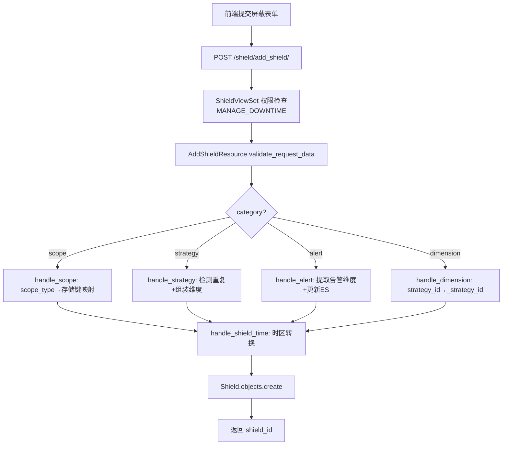
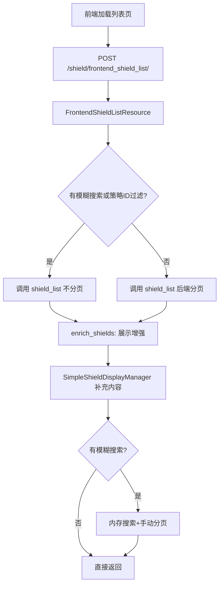
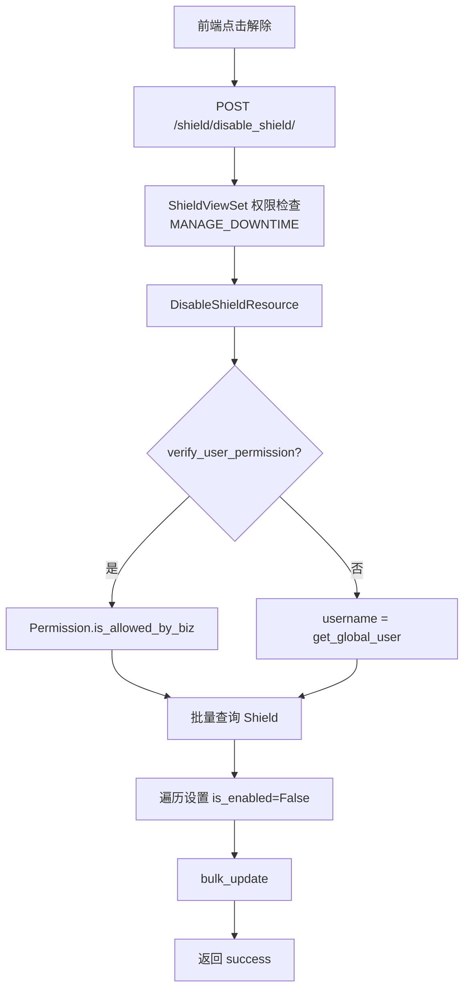
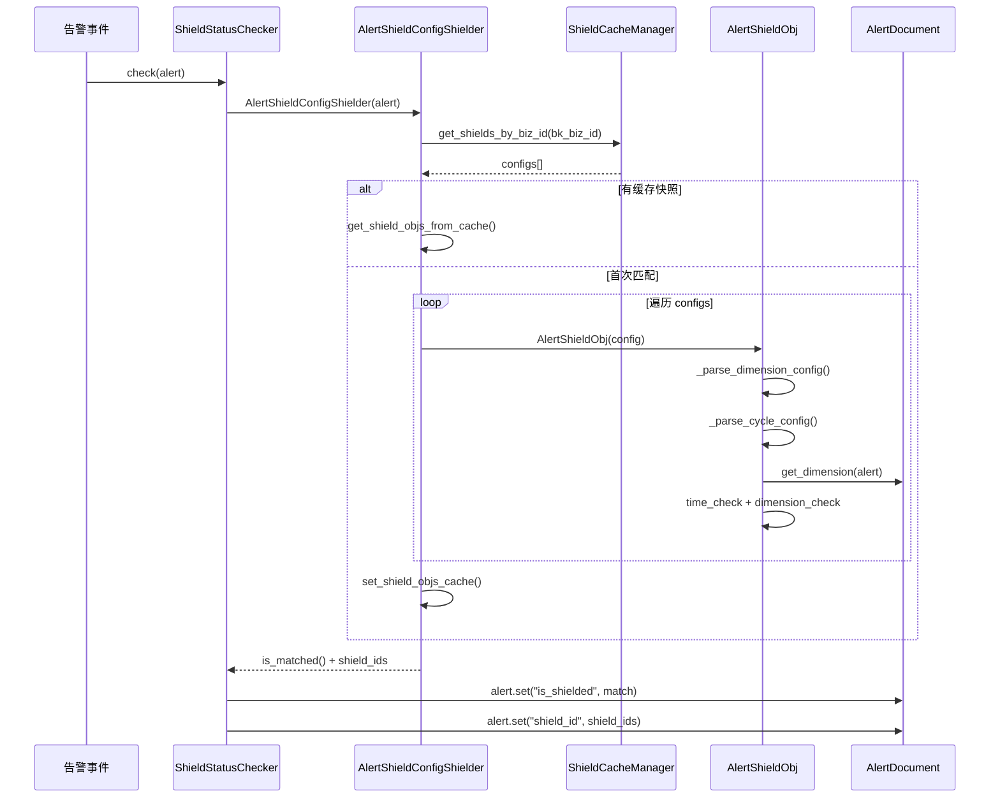
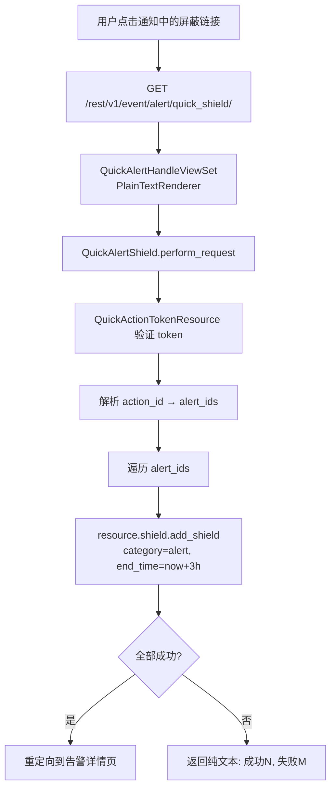
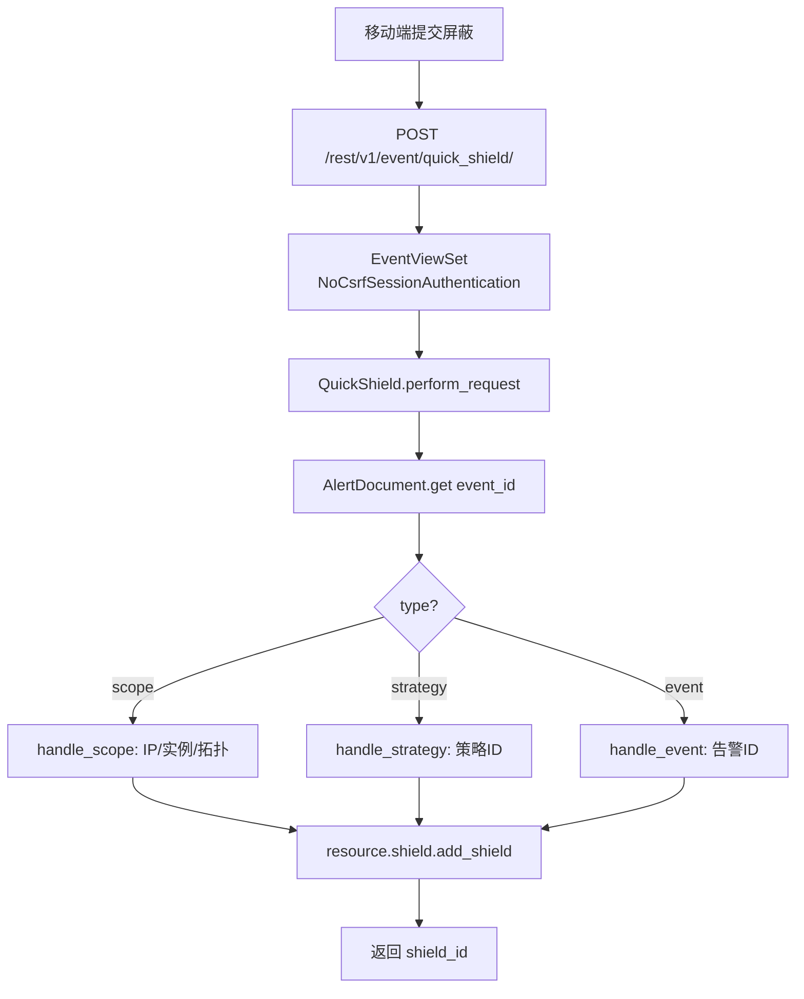
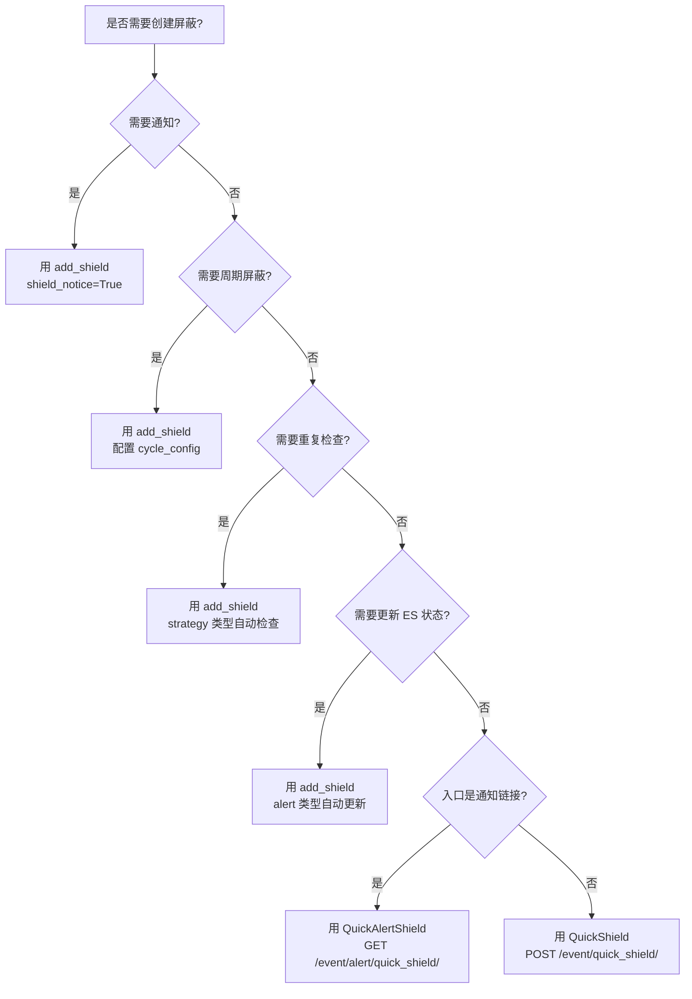

# 告警屏蔽专家 — 使用流程

**本文引用的文件**:
- `bkmonitor/packages/monitor_web/shield/views.py`
- `bkmonitor/packages/monitor_web/shield/resources/backend_resources.py`
- `bkmonitor/packages/monitor_web/shield/resources/frontend_resources.py`
- `bkmonitor/alarm_backends/service/converge/shield/manager.py`
- `bkmonitor/alarm_backends/service/converge/shield/shielder/saas_config.py`
- `bkmonitor/alarm_backends/core/cache/shield.py`
- `bkmonitor/alarm_backends/service/alert/manager/checker/shield.py`
- `bkmonitor/packages/weixin/event/resources.py`
- `bkmonitor/packages/weixin/event/views.py`
- `bkmonitor/packages/fta_web/alert/resources.py`
- `bkmonitor/packages/fta_web/alert/views.py`

## 目录

1. [业务目标：创建屏蔽配置](#1-业务目标创建屏蔽配置)
2. [业务目标：查看屏蔽列表](#2-业务目标查看屏蔽列表)
3. [业务目标：解除屏蔽](#3-业务目标解除屏蔽)
4. [业务目标：告警引擎屏蔽判定](#4-业务目标告警引擎屏蔽判定)
5. [业务目标：屏蔽通知发送](#5-业务目标屏蔽通知发送)

---

## 1. 业务目标：创建屏蔽配置

### 场景：用户要对某个策略创建周期屏蔽



### 调用路径

```
POST /shield/add_shield/
  → ShieldViewSet (权限: MANAGE_DOWNTIME)
    → AddShieldResource.perform_request
      → SHIELD_SERIALIZER[category].is_valid()  # 按 category 分发序列化器
      → handle_scope / handle_strategy / handle_alert / handle_dimension
      → handle_shield_time(bk_biz_id, begin_time, end_time, cycle_config)
      → Shield.objects.create(...)
```

### 关键决策点

| 决策点 | 逻辑 | 文件位置 |
|--------|------|----------|
| 序列化器选择 | `SHIELD_SERIALIZER[request_data["category"]]` | serializers.py#L109 |
| event→alert 转换 | `data["category"] = ALERT if category == EVENT` | backend_resources.py#L290 |
| 重复屏蔽检测 | 仅 strategy 类型检测 | backend_resources.py#L253 |
| 时间时区处理 | SpaceApi 获取业务时区 | backend_resources.py#L640 |

章节来源 [AddShieldResource](file://bkmonitor/packages/monitor_web/shield/resources/backend_resources.py#L218-L330)

---

## 2. 业务目标：查看屏蔽列表

### 场景：前端展示屏蔽列表页



### 调用路径

```
POST /shield/frontend_shield_list/
  → ShieldViewSet (权限: VIEW_DOWNTIME)
    → FrontendShieldListResource.perform_request
      → resource.shield.shield_list(**params)  # 调用通用列表
      → enrich_shields(bk_biz_id, shields, strategy_ids)  # 展示增强
        → SimpleShieldDisplayManager.get_shield_content()
        → StrategyModel.objects.filter(id__in=...).values("name")
        → ThreadPoolExecutor 并行格式化
      → search(search_terms, shields)  # 模糊搜索
      → 手动分页
```

### 展示增强字段来源

| 字段 | 来源 |
|------|------|
| content | `SimpleShieldDisplayManager.get_shield_content()` |
| category_name | `SHIELD_CATEGORY_NAME_MAPPING` |
| status_name | `SHIELD_STATUS_NAME_MAPPING` |
| shield_cycle | `get_shield_cycle()` — 解析周期配置 |
| cycle_duration | `get_cycle_duration()` — 计算时长 |
| current_cycle_ramaining_time | `get_current_cycle_ramaining_time()` — 剩余时间 |

章节来源 [FrontendShieldListResource](file://bkmonitor/packages/monitor_web/shield/resources/frontend_resources.py#L30-L180)

---

## 3. 业务目标：解除屏蔽

### 场景：用户解除一个或多个屏蔽



### 调用路径

```
POST /shield/disable_shield/
  → ShieldViewSet (权限: MANAGE_DOWNTIME)
    → DisableShieldResource.perform_request
      → Shield.objects.filter(pk__in=data["id"])
      → for shield: shield.is_enabled=False, shield.failure_time=now()
      → Shield.objects.bulk_update(fields=["is_enabled", "failure_time", "update_user"])
```

### 注意事项
- 解除后不会立即影响告警引擎缓存，需等下次 `ShieldCacheManager.refresh`
- 不存在的 ID 仅记 warning 日志，不报错
- `id` 参数支持单个 int 或 list

章节来源 [DisableShieldResource](file://bkmonitor/packages/monitor_web/shield/resources/backend_resources.py#L482-L530)

---

## 4. 业务目标：告警引擎屏蔽判定

### 场景：告警引擎检测新告警是否应被屏蔽



### 调用路径

```
告警引擎 AlertManager 循环
  → ShieldStatusChecker.check(alert)
    → AlertShieldConfigShielder(alert)
      → ShieldCacheManager.get_shields_by_biz_id(bk_biz_id)  # 从 Redis 加载
      → AlertShieldObj(config).is_match(alert)  # 逐条匹配
      → 缓存匹配结果到 ALERT_SHIELD_SNAPSHOT
    → alert.set("is_shielded", match_shield)
    → alert.set("shield_id", shield_ids)
    → alert.set("shield_left_time", left_time)
```

### 屏蔽器优先级

| 顺序 | Shielder | 检测内容 | 来源 |
|------|----------|----------|------|
| 0 | GlobalShielder | `settings.GLOBAL_SHIELD_ENABLED` | 全局开关 |
| 0 | HostShielder | 主机 is_shielding/ignore_monitoring | CMDB 主机属性 |
| 1 | AlertShieldConfigShielder | SaaS 配置屏蔽 | ShieldCacheManager |
| 2 | AlarmTimeShielder | Action 时间范围 + 策略告警时间 | ActionInstance.inputs |

章节来源 [ShieldStatusChecker](file://bkmonitor/alarm_backends/service/alert/manager/checker/shield.py#L24-L184)

---

## 5. 业务目标：屏蔽通知发送

### 场景：屏蔽开始/结束时发送通知

```mermaid
flowchart TD
    A[Celery 定时任务] --> B[check_and_send_shield_notice]
    B --> C[查询生效屏蔽配置]
    C --> D[perform_sharding_task 分片]
    D --> E[do_check_and_send_shield_notice]
    E --> F[遍历 shield_configs]
    F --> G[AlertShieldObj(config)]
    G --> H[check_and_send_notice]
    H --> I{can_send_start_notice?}
    I -->|是| J[Redis SET 锁]
    J --> K[send_notice start]
    I -->|否| L{can_send_end_notice?}
    L -->|是| M[Redis DELETE 锁]
    M --> N[send_notice end]
    L -->|否| F
    K --> F
    N --> F
```

### 调用路径

```
Celery 定时任务（celery_cron 队列）
  → check_and_send_shield_notice()
    → Shield.objects.filter(is_enabled=True, failure_time__gte=now())
    → perform_sharding_task(target_ids, do_check_and_send_shield_notice, num_per_task=10)
      → do_check_and_send_shield_notice(ids)  # @app.task
        → for shield_config in shield_configs:
            → AlertShieldObj(shield_config)
            → shield_obj.check_and_send_notice()
              → can_send_start_notice() → send_notice("start")
              → can_send_end_notice() → send_notice("end")
```

### 通知触发条件

| 通知类型 | 条件 | 锁操作 |
|----------|------|--------|
| 开始通知 | notice_time 分钟后在屏蔽范围内 + 无锁 | SET 锁 |
| 结束通知 | notice_time+1 分钟后不在屏蔽范围 + 有锁 | DELETE 锁 |

### 通知发送

```
send_notice(notice_type)
  → parse_notice_receivers()  # 解析 user#xxx / group#xxx
  → get_notice_context(notice_type)  # 构建模板上下文
  → for notice_way in notice_config["notice_way"]:
      → Sender(title_template, content_template, context).send(notice_way, receivers)
```

章节来源 [tasks.py](file://bkmonitor/alarm_backends/service/converge/shield/tasks.py#L27-L73)
章节来源 [ShieldObj.check_and_send_notice](file://bkmonitor/alarm_backends/service/converge/shield/shield_obj.py#L260-L290)

---

## 6. 业务目标：快捷屏蔽（通知链接/移动端）

### 场景 A：通过通知链接快捷屏蔽告警



### 调用路径

```
GET /rest/v1/event/alert/quick_shield/?action_id=xxx&token=yyy&bk_biz_id=2
  → QuickAlertHandleViewSet (PlainTextRenderer, 无权限检查)
    → QuickAlertShield.perform_request
      → QuickActionTokenResource 验证 token → 解析 alert_ids
      → for alert_id in alert_ids:
          → resource.shield.add_shield(category="alert", ...)
      → 成功 → redirect(bk_biz_id, action_id)
      → 失败 → 返回纯文本统计结果
```

### 场景 B：移动端快速屏蔽事件



### 调用路径

```
POST /rest/v1/event/quick_shield/
  → EventViewSet (NoCsrfSessionAuthentication, 无权限检查)
    → QuickShield.perform_request
      → AlertDocument.get(id=event_id)
      → handle_scope / handle_strategy / handle_event
      → resource.shield.add_shield(is_quick=True, shield_notice=False, ...)
```

### 关键决策点

| 决策点 | 逻辑 | 文件位置 |
|--------|------|----------|
| Token 验证 | `QuickActionTokenResource` 父类自动验证 | fta_web/alert/resources.py#L484 |
| 屏蔽时长 | 默认 3 小时，可传 `shield_hours` 覆盖 | fta_web/alert/resources.py#L3085 |
| 目标类型映射 | scope 按 `EventTargetType` 分发到 IP/实例/拓扑 | weixin/event/resources.py#L490-L510 |
| 渲染方式 | `QuickAlertHandleViewSet` 用 `PlainTextRenderer` | fta_web/alert/views.py#L44 |

章节来源 [QuickShield](file://bkmonitor/packages/weixin/event/resources.py#L472-L555)
章节来源 [QuickAlertShield](file://bkmonitor/packages/fta_web/alert/resources.py#L3078-L3126)
章节来源 [QuickAlertHandleViewSet](file://bkmonitor/packages/fta_web/alert/views.py#L44-L50)
---

## 7. 快捷屏蔽接口选择指南

### 两个 quick_shield 接口如何选择

| 场景 | 用哪个 | 原因 |
|------|--------|------|
| 移动端/微信端手动快速屏蔽一个事件 | `POST /event/quick_shield/`（`QuickShield`） | Session 认证，支持 scope/strategy/event 三种类型，返回 JSON |
| 用户点击通知邮件/企微消息中的"屏蔽"链接 | `GET /event/alert/quick_shield/`（`QuickAlertShield`） | Token 验权，无需登录态，自动解析通知关联的告警列表，返回 HTML 重定向 |
| 需要自定义屏蔽时长（非 3 小时） | `POST /event/quick_shield/`（`QuickShield`） | 支持传入任意 `end_time` |
| 需要批量屏蔽多个告警 | `GET /event/alert/quick_shield/`（`QuickAlertShield`） | 自动从 action 中解析所有关联告警并逐条屏蔽 |

### add_shield vs quick_shield 如何选择



> **核心原则**：quick_shield 是 add_shield 的简化包装，牺牲了通知、周期、重复检查、ES 状态同步等能力。如果需要任何这些能力，必须走 add_shield。

---

## 8. 移动端为何有独立 API

移动端 `QuickShield`（`POST /event/quick_shield/`）没有复用 `ShieldViewSet` 的 `add_shield` 端点，而是注册在独立的 `EventViewSet` 中，原因有三：

### 1. 认证方式不同

`ShieldViewSet` 使用默认的 `SessionAuthentication`（要求 CSRF token），而 `EventViewSet` 显式替换为 `NoCsrfSessionAuthentication`。移动端运行在微信 WebView / 企业微信内置浏览器中，CSRF token 机制不可靠，需要绕过。

### 2. 权限模型不同

`ShieldViewSet` 要求 `MANAGE_DOWNTIME` 权限（IAM 管理权限），而 `EventViewSet.get_permissions()` 直接返回 `[]`，把权限交给 Resource 自身（`AlertPermissionResource`）做更宽松的校验。移动端用户通常不具备完整的 IAM 管理权限，但应该能快速屏蔽自己收到的告警。

### 3. 输入复杂度不同——移动端不需要知道 dimension_config

这是最关键的设计差异。`AddShieldResource` 要求调用方构造完整的 `dimension_config`（含 `scope_type`、`target`、`metric_id` 等），移动端无法也不应构造这些复杂参数。`QuickShield` 只需要三个参数（`type` + `event_id` + `end_time`），后端自动从事件数据推导出 dimension_config：

```python
# handle_scope: 根据 event.target_type 自动映射
#   HOST   → scope_type=ip, target=[{ip, bk_cloud_id}]
#   SERVICE → scope_type=instance, target=[bk_service_instance_id]
#   TOPO   → scope_type=topo, target=[{bk_obj_id, bk_inst_id}]
# handle_strategy → dimension_config={id: [strategy_id]}
# handle_event    → dimension_config={alert_id: alert.id}
```

> **本质**：`QuickShield` 是一个**适配层**——把移动端的简单输入翻译成 `add_shield` 需要的复杂参数，同时绕过 CSRF 和 IAM 限制。这不是冗余，而是面向不同客户端的合理抽象。

章节来源 [EventViewSet](file://bkmonitor/packages/weixin/event/views.py#L17-L42)
章节来源 [ShieldViewSet](file://bkmonitor/packages/monitor_web/shield/views.py#L19-L51)
章节来源 [QuickShield](file://bkmonitor/packages/weixin/event/resources.py#L472-L555)
