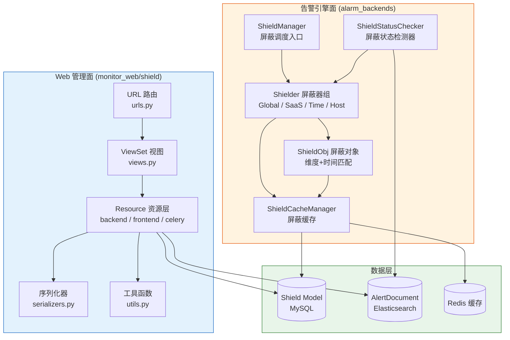
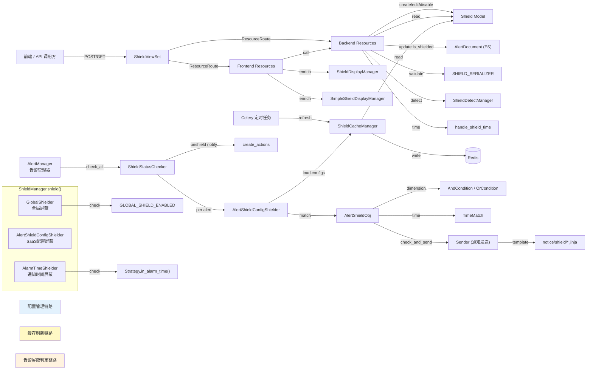

# 告警屏蔽模块 — 架构设计

**本文引用的文件**

- [urls.py](file://bkmonitor/packages/monitor_web/shield/urls.py#L1-L23)
- [views.py](file://bkmonitor/packages/monitor_web/shield/views.py#L1-L51)
- [resources/\_\_init\_\_.py](file://bkmonitor/packages/monitor_web/shield/resources/__init__.py#L1-L15)
- [backend_resources.py](file://bkmonitor/packages/monitor_web/shield/resources/backend_resources.py#L1-L672)
- [frontend_resources.py](file://bkmonitor/packages/monitor_web/shield/resources/frontend_resources.py#L1-L354)
- [celery_resources.py](file://bkmonitor/packages/monitor_web/shield/resources/celery_resources.py#L1-L42)
- [serializers.py](file://bkmonitor/packages/monitor_web/shield/serializers.py#L1-L116)
- [utils.py](file://bkmonitor/packages/monitor_web/shield/utils.py#L1-L253)
- [manager.py](file://bkmonitor/alarm_backends/service/converge/shield/manager.py#L1-L55)
- [saas_config.py](file://bkmonitor/alarm_backends/service/converge/shield/shielder/saas_config.py#L1-L298)
- [base.py](file://bkmonitor/alarm_backends/service/converge/shield/shielder/base.py#L1-L29)
- [shield_obj.py](file://bkmonitor/alarm_backends/service/converge/shield/shield_obj.py#L1-L496)
- [shield.py (cache)](file://bkmonitor/alarm_backends/core/cache/shield.py#L1-L149)
- [shield.py (checker)](file://bkmonitor/alarm_backends/service/alert/manager/checker/shield.py#L1-L184)
- [constants/shield.py](file://bkmonitor/constants/shield.py#L1-L73)

---

## 目录

- [1. 模块整体架构图](#1-模块整体架构图)
- [2. 文件结构与职责说明](#2-文件结构与职责说明)
- [3. 核心组件关系图](#3-核心组件关系图)
- [4. 分层架构说明](#4-分层架构说明)
  - [4.1 Web 层](#41-web-层)
  - [4.2 Resource 层](#42-resource-层)
  - [4.3 Model 与缓存层](#43-model-与缓存层)
  - [4.4 告警引擎层](#44-告警引擎层)

---

## 1. 模块整体架构图

告警屏蔽模块横跨 **Web 管理面** 与 **告警引擎面** 两大子系统。Web 管理面负责屏蔽配置的 CRUD 和前端展示，告警引擎面负责在告警处理流水线中实时执行屏蔽匹配和状态管理。



> 图表来源：基于 [urls.py](file://bkmonitor/packages/monitor_web/shield/urls.py#L1-L23)、[views.py](file://bkmonitor/packages/monitor_web/shield/views.py#L1-L51)、[manager.py](file://bkmonitor/alarm_backends/service/converge/shield/manager.py#L1-L55)、[shield.py (cache)](file://bkmonitor/alarm_backends/core/cache/shield.py#L1-L149)、[shield.py (checker)](file://bkmonitor/alarm_backends/service/alert/manager/checker/shield.py#L1-L184) 综合绘制

章节来源 [整体架构](file://bkmonitor/packages/monitor_web/shield/urls.py#L1-L23)

---

## 2. 文件结构与职责说明

| 层次 | 文件路径 | 职责 |
|------|----------|------|
| Web 路由 | `monitor_web/shield/urls.py` | 通过 `ResourceRouter` 自动注册 `ShieldViewSet` 的所有路由 |
| Web 视图 | `monitor_web/shield/views.py` | `ShieldViewSet`：声明 11 个 `ResourceRoute`，按 action 分配 IAM 权限（查看=VIEW_DOWNTIME / 管理=MANAGE_DOWNTIME） |
| Resource 注册 | `monitor_web/shield/resources/__init__.py` | 聚合导出 backend / celery / frontend 三组资源 |
| 后端 CRUD | `monitor_web/shield/resources/backend_resources.py` | 屏蔽列表、详情、新增、批量新增、编辑、解除、失效内容更新；含 `handle_shield_time` 时间处理函数 |
| 前端展示 | `monitor_web/shield/resources/frontend_resources.py` | 列表富化（含策略名/状态名/周期描述）、详情维度翻译、快照计算、克隆信息 |
| 异步任务 | `monitor_web/shield/resources/celery_resources.py` | `UpdateFailureShieldContentResource`：定时补全已失效屏蔽的 `content` 字段 |
| 序列化器 | `monitor_web/shield/serializers.py` | `BaseSerializer` + 5 个分类序列化器（Scope/Strategy/Event/Alert/Dimension），通过 `SHIELD_SERIALIZER` 字典按 category 分发 |
| 工具函数 | `monitor_web/shield/utils.py` | `ShieldDetectManager`（屏蔽检测）、`ShieldDisplayManager`（详情展示）、`SimpleShieldDisplayManager`（列表简略展示）、`ShieldDisplayHelper`（动态分组名） |
| 引擎调度 | `alarm_backends/service/converge/shield/manager.py` | `ShieldManager.shield()`：依次执行 GlobalShielder → AlertShieldConfigShielder → AlarmTimeShielder |
| 屏蔽器基类 | `alarm_backends/service/converge/shield/shielder/base.py` | `BaseShielder`：定义 `type`、`event`、`detail` 接口和 `is_matched()` 抽象方法 |
| 屏蔽器实现 | `alarm_backends/service/converge/shield/shielder/saas_config.py` | `AlertShieldConfigShielder`（SaaS 配置屏蔽）、`AlarmTimeShielder`（通知时间屏蔽）、`GlobalShielder`（全局屏蔽）、`IncidentShielder`（故障影响屏蔽）、`HostShielder`（主机状态屏蔽） |
| 屏蔽对象 | `alarm_backends/service/converge/shield/shield_obj.py` | `ShieldObj`：解析维度条件（AndCondition/OrCondition）+ 时间匹配（TimeMatch）+ 通知发送；`AlertShieldObj`：告警维度缓存优化 |
| 缓存管理 | `alarm_backends/core/cache/shield.py` | `ShieldCacheManager`：按业务 ID 缓存生效屏蔽配置；`refresh()` 全量刷新；故障事件 publish/get |
| 状态检测 | `alarm_backends/service/alert/manager/checker/shield.py` | `ShieldStatusChecker`：周期性检测告警屏蔽状态，管理解除屏蔽通知推送 + QoS 限流 |
| 常量 | `constants/shield.py` | `ScopeType`、`ShieldStatus`、`ShieldCategory`、`ShieldCycleType`、`ShieldType` 及中文名映射表 |

章节来源 [文件结构](file://bkmonitor/packages/monitor_web/shield/urls.py#L1-L23)

---

## 3. 核心组件关系图

下图展示屏蔽模块核心组件之间的调用关系，覆盖配置写入到告警屏蔽判定的完整链路。



> 图表来源：基于 [views.py](file://bkmonitor/packages/monitor_web/shield/views.py#L27-L51)、[backend_resources.py](file://bkmonitor/packages/monitor_web/shield/resources/backend_resources.py#L189-L330)、[manager.py](file://bkmonitor/alarm_backends/service/converge/shield/manager.py#L27-L55)、[saas_config.py](file://bkmonitor/alarm_backends/service/converge/shield/shielder/saas_config.py#L31-L130)、[shield_obj.py](file://bkmonitor/alarm_backends/service/converge/shield/shield_obj.py#L34-L340)、[shield.py (cache)](file://bkmonitor/alarm_backends/core/cache/shield.py#L33-L130)、[shield.py (checker)](file://bkmonitor/alarm_backends/service/alert/manager/checker/shield.py#L28-L184) 综合绘制

章节来源 [核心组件关系](file://bkmonitor/alarm_backends/service/converge/shield/manager.py#L27-L55)

---

## 4. 分层架构说明

### 4.1 Web 层

**URL 路由** — [urls.py](file://bkmonitor/packages/monitor_web/shield/urls.py#L18-L23) 使用 `ResourceRouter` + `register_module(views)` 自动注册路由，无需手动声明每条 URL：

```python
router = ResourceRouter()
router.register_module(views)
urlpatterns = [re_path(r"^", include(router.urls))]
```

**ViewSet 视图** — [views.py](file://bkmonitor/packages/monitor_web/shield/views.py#L27-L51) 中的 `ShieldViewSet` 继承 `ResourceViewSet`，通过 `resource_routes` 列表声明 11 个端点。权限控制采用 **按 action 分级** 策略：

- 查询类操作（`shield_list`、`frontend_shield_list`、`shield_snapshot` 及所有 GET）→ `BusinessActionPermission([ActionEnum.VIEW_DOWNTIME])`
- 管理类操作（add/edit/disable/bulk_add）→ `BusinessActionPermission([ActionEnum.MANAGE_DOWNTIME])`

每个 `ResourceRoute` 将 HTTP 方法 + endpoint 直接映射到 `resource.shield.xxx` 资源函数，ViewSet 本身不包含业务逻辑，仅做路由分发和权限拦截。

章节来源 [Web 层](file://bkmonitor/packages/monitor_web/shield/views.py#L27-L51)

### 4.2 Resource 层

Resource 层是业务逻辑的核心载体，分为三组：

**后端 CRUD 资源** ([backend_resources.py](file://bkmonitor/packages/monitor_web/shield/resources/backend_resources.py#L1-L672)) 提供与数据库直接交互的通用接口，不关心前端展示格式：

- `ShieldListResource`（L59-L155）：多条件过滤 + 分页，支持 categories / conditions / time_range / is_active 筛选，conditions 支持对 Shield 模型任意字段做 `__in` 匹配，description 支持 `__icontains` 模糊搜索
- `ShieldDetailResource`（L158-L186）：按 ID 查询单条屏蔽详情，返回原始字段
- `AddShieldResource`（L189-L330）：新增屏蔽的核心入口。通过 `shield_handler` 字典按 category 分发到 `handle_scope` / `handle_strategy` / `handle_alert` / `handle_dimension` 四种处理方法，每种方法将前端传入的 dimension_config 转换为引擎可匹配的存储格式。同时调用 `handle_shield_time` 统一处理业务时区
- `BulkAddAlertShieldResource`（L333-L432）：继承 `AddShieldResource`，支持批量告警屏蔽。`handle_alerts` 方法遍历 alert_ids，支持按告警维度裁剪（dimensions 参数）或按拓扑节点转为范围屏蔽（bk_topo_node 参数），最终 `bulk_create` 多条 Shield 记录
- `EditShieldResource`（L435-L484）：编辑屏蔽，仅支持修改时间/周期/通知/描述/等级/标签，不允许修改维度配置
- `DisableShieldResource`（L487-L543）：解除屏蔽，批量操作，设置 `is_enabled=False` + `failure_time=now()`，支持 apigw 额外权限校验
- `handle_shield_time`（L619-L672）：独立函数，通过 `SpaceApi.get_space_detail` 获取业务时区，将前端传入的时间字符串统一转换为业务时区的 datetime。周期屏蔽（type≠1）时，用 cycle_config 中的时分秒覆盖日期部分

**前端展示资源** ([frontend_resources.py](file://bkmonitor/packages/monitor_web/shield/resources/frontend_resources.py#L1-L354)) 在后端资源基础上做展示富化，调用后端资源获取原始数据后补充人类可读信息：

- `FrontendShieldListResource`（L27-L170）：调用 `ShieldListResource` 获取原始数据后，通过 `SimpleShieldDisplayManager` 补充 category_name / status_name / content / cycle_duration 等展示字段。支持 search 模糊搜索（在 Python 层过滤，非数据库层）和 strategy_id 条件过滤。使用 `ThreadPoolExecutor(max_workers=20)` 并行富化
- `FrontendShieldDetailResource`（L173-L310）：调用 `ShieldDetailResource` 获取原始数据后，通过 `ShieldDisplayManager` 将 dimension_config 中的 ID 翻译为名称（服务实例名、拓扑节点路径、动态分组名等），并解析 notice_config 中的通知接收人信息
- `ShieldSnapshotResource`（L313-L340）：继承 `FrontendShieldDetailResource`，接受 config 字典（非数据库查询），计算屏蔽状态后复用父类的维度翻译逻辑
- `FrontendCloneInfoResource`（L343-L354）：继承 `FrontendShieldDetailResource`，获取克隆所需的完整配置信息

**异步任务资源** ([celery_resources.py](file://bkmonitor/packages/monitor_web/shield/resources/celery_resources.py#L20-L42)) — `UpdateFailureShieldContentResource`：查询已失效（`failure_time <= now()`）且 `content` 为空的屏蔽记录，使用 `ShieldDisplayManager` 补全展示内容。此资源通过 Celery 定时任务调用，非用户直接请求。

**序列化器** ([serializers.py](file://bkmonitor/packages/monitor_web/shield/serializers.py#L1-L116)) 采用 **基类 + 分类子类** 模式。`BaseSerializer` 定义公共字段（bk_biz_id / category / begin_time / end_time / cycle_config / shield_notice / notice_config 等），5 个子类各自定义 `DimensionConfig` 内嵌序列化器：

| 序列化器 | category | dimension_config 核心字段 |
|----------|----------|--------------------------|
| `ScopeSerializer` | scope | scope_type, target, metric_id |
| `StrategySerializer` | strategy | id(策略ID列表), level, scope_type, target, dimension_conditions |
| `EventSerializer` | event | id(事件ID) |
| `AlertSerializer` | alert | alert_id/alert_ids, dimensions, bk_topo_node |
| `DimensionSerializer` | dimension | dimension_conditions |

`SHIELD_SERIALIZER` 字典在 [serializers.py#L111-L116](file://bkmonitor/packages/monitor_web/shield/serializers.py#L111-L116) 中按 category 映射到对应序列化器类，`AddShieldResource.validate_request_data` 根据请求中的 category 字段动态选择。

章节来源 [Resource 层](file://bkmonitor/packages/monitor_web/shield/resources/backend_resources.py#L1-L672)

### 4.3 Model 与缓存层

**Shield 模型** — 屏蔽配置持久化在 MySQL 的 `Shield` 表中（定义于 `bkmonitor.models`）。核心字段包括：`bk_biz_id`、`category`（屏蔽类型）、`scope_type`（范围类型）、`dimension_config`（JSON 维度配置）、`cycle_config`（周期配置）、`begin_time`/`end_time`/`failure_time`（时间三元组）、`notice_config`（通知配置 JSON）、`is_enabled`（是否生效）、`is_quick`（快捷屏蔽）、`content`（展示内容缓存）、`source`（来源）、`label`（标签）。

**ShieldCacheManager** ([shield.py (cache)](file://bkmonitor/alarm_backends/core/cache/shield.py#L33-L130)) 是引擎面读取屏蔽配置的唯一入口，避免每条告警都查 MySQL：

- **缓存结构**：Key = `CACHE_KEY_PREFIX.shield.biz_{bk_biz_id}`，Value = 该业务下所有生效屏蔽配置的 JSON 列表
- **刷新机制**（`refresh()`，L94-L130）：拉取所有业务中 `begin_time <= now+10min` 且 `end_time >= now` 且 `is_enabled=True` 的屏蔽配置，按业务分组写入 Redis。多预取 10 分钟是为了让即将生效的屏蔽配置提前进入缓存
- **读取方法**（`get_shields_by_biz_id()`，L66-L89）：从 Redis 读取并反序列化，将时间字段补上 UTC tzinfo
- **故障事件**（`publish_failure` / `get_last_failure_end` / `get_all_failures`）：使用 Redis Hash 结构记录模块级故障事件的预期结束时间，供 `IncidentShielder` 使用

**AlertDocument** — 告警文档存储在 Elasticsearch 中。Web 层在新增告警屏蔽时会通过 `AlertDocument.bulk_create` 更新告警的 `is_shielded` 字段；引擎层 `ShieldStatusChecker` 也会更新告警的 `shield_id` / `is_shielded` / `shield_left_time` 字段。

章节来源 [Model 与缓存层](file://bkmonitor/alarm_backends/core/cache/shield.py#L33-L130)

### 4.4 告警引擎层

告警引擎层是屏蔽模块的运行时核心，在告警处理流水线中执行实时屏蔽判定。

#### 4.4.1 屏蔽调度入口 — ShieldManager

[manager.py](file://bkmonitor/alarm_backends/service/converge/shield/manager.py#L27-L55) 中的 `ShieldManager.shield()` 是屏蔽判定的总入口，按 **优先级链式执行** 屏蔽器：

```
GlobalShielder (全局屏蔽，最高优先级)
  ↓ 未命中
AlertShieldConfigShielder (SaaS 配置屏蔽，逐告警检测)
  ↓ 未命中
AlarmTimeShielder (通知时间屏蔽)
```

任一屏蔽器命中即返回 `True` + 对应 shielder 对象，不再继续执行后续屏蔽器。`AlertShieldConfigShielder` 针对每条告警独立检测（多告警场景下任一命中即屏蔽），`AlarmTimeShielder` 以 ActionInstance 为单位检测。

#### 4.4.2 屏蔽器组 — Shielder

所有屏蔽器继承 [base.py](file://bkmonitor/alarm_backends/service/converge/shield/shielder/base.py#L17-L29) 中的 `BaseShielder`，只需实现 `is_matched()` 方法。5 种屏蔽器按检测维度可分为三类：

| 屏蔽器 | 检测对象 | 数据来源 | 触发条件 |
|--------|----------|----------|----------|
| `GlobalShielder` | 全平台 | `settings.GLOBAL_SHIELD_ENABLED` | 全局开关为 True |
| `HostShielder` | 主机状态 | `HostManager`（CMDB 缓存） | 主机 `is_shielding` 或 `ignore_monitoring` 为 True |
| `AlertShieldConfigShielder` | SaaS 屏蔽配置 | `ShieldCacheManager` | 缓存中的屏蔽配置与告警维度+时间匹配 |
| `AlarmTimeShielder` | 通知时间窗口 | `ActionInstance.inputs` + `Strategy` | 当前时间不在通知时间范围内 |
| `IncidentShielder` | 故障影响 | `get_failure_scope_config()` | 告警命中故障影响范围配置 |

**AlertShieldConfigShielder** ([saas_config.py#L31-L130](file://bkmonitor/alarm_backends/service/converge/shield/shielder/saas_config.py#L31-L130)) 是最核心的屏蔽器，其匹配流程：

1. 从 `ShieldCacheManager.get_shields_by_biz_id()` 加载当前业务所有生效屏蔽配置
2. 先查 `ALERT_SHIELD_SNAPSHOT` 缓存（Key = `strategy_id + alert_id`），命中则直接返回缓存的屏蔽配置 ID 列表
3. 未命中缓存时，遍历所有配置创建 `AlertShieldObj`，调用 `is_match(alert)` 逐条匹配，匹配结果写回缓存
4. 匹配前先检查 `GlobalShielder` 和 `HostShielder`，这两个优先级更高
5. 提供 `get_shield_left_time()` 和 `list_shield_ids()` 供状态检测器使用

#### 4.4.3 屏蔽匹配对象 — ShieldObj / AlertShieldObj

[shield_obj.py](file://bkmonitor/alarm_backends/service/converge/shield/shield_obj.py#L34-L496) 将每条屏蔽配置解析为可执行的条件树，核心是 **双维度匹配**（时间 + 维度）：

**维度匹配**（`_parse_dimension_config`，L90-L150）：
- 清洗维度配置：删除 `_` 开头的内部字段、值为 `"00"` 的字段、category 为 `"all"` 的字段
- 根据屏蔽类型构建条件树：范围屏蔽/策略屏蔽 → `EqualCondition` 逐字段等值匹配；维度屏蔽 → `OrCondition` + `AndCondition` 组合条件树（支持 method/condition 配置）
- 动态分组特殊处理：查询 `DynamicGroupManager` 获取分组下的主机 ID 列表，转为 `bk_host_id` 维度匹配

**时间匹配**（`_parse_cycle_config`，L71-L82）：
- 根据 `cycle_config.type` 选择对应的 `TimeMatch` 子类（单次/每天/每周/每月）
- `is_match(source_time)` 判断当前时间是否在屏蔽周期内

**AlertShieldObj**（L343-L496）继承 `ShieldObj`，增加了告警维度的预处理和类级缓存：
- `_calculate_alert_dimension()`：从 `alert.origin_alarm` 和 `alert.dimensions` 提取维度，补充 strategy_id / level / metric_id / bk_topo_node / bk_host_id，并做 `tags.xxx` → `xxx` 的维度名归一化
- `_alert_dimension_cache`：类级字典缓存（上限 1000 条），避免同一告警重复计算维度

**通知发送**（`check_and_send_notice`，L260-L280）：基于 `NOTICE_SHIELD_KEY_LOCK` Redis 锁实现开始/结束通知的幂等控制。开始通知条件 = X 分钟后仍在屏蔽范围且无锁；结束通知条件 = X 分钟后不在屏蔽范围且有锁。

#### 4.4.4 屏蔽状态检测器 — ShieldStatusChecker

[shield.py (checker)](file://bkmonitor/alarm_backends/service/alert/manager/checker/shield.py#L28-L184) 继承 `BaseChecker`，在告警管理器的周期检测流程中执行，职责是 **检测屏蔽状态变化并触发解除屏蔽通知**：

`check(alert)` 方法（L89-L122）的核心逻辑：

1. 调用 `AlertShieldConfigShielder` 检测告警当前是否被屏蔽
2. 若 **未命中屏蔽** 但告警之前处于屏蔽状态（`alert.is_shielded`）：
   - 告警处于恢复期 → 设置 `ignore_unshield_notice` 标记，抑制通知
   - 否则 → 调用 `add_unshield_action()` 创建解除屏蔽通知动作
3. 若 **未命中屏蔽** 且告警有 `need_unshield_notice` 标记 → 发送一次通知后清除标记
4. 更新告警文档的 `shield_id` / `is_shielded` / `shield_left_time` 字段

`push_actions()` 方法（L142-L184）对收集到的解除屏蔽动作进行 QoS 限流后，通过 `create_actions.delay()` 异步推送。

章节来源 [告警引擎层](file://bkmonitor/alarm_backends/service/converge/shield/manager.py#L27-L55)
