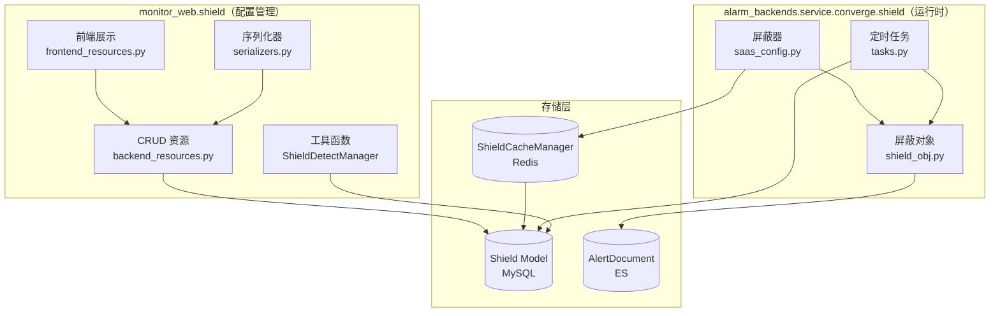
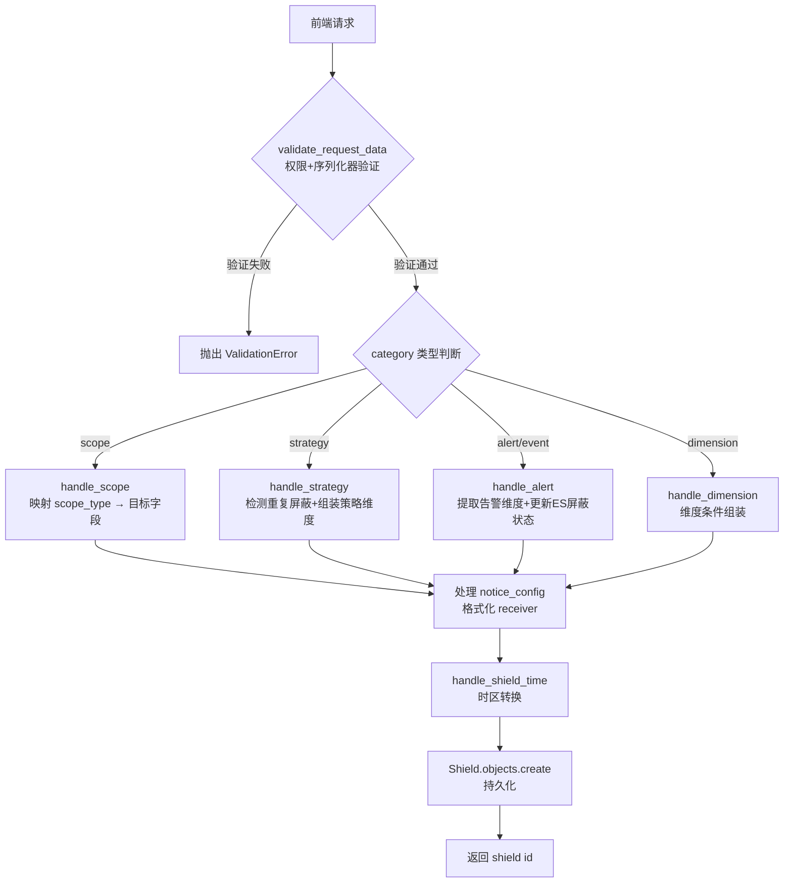
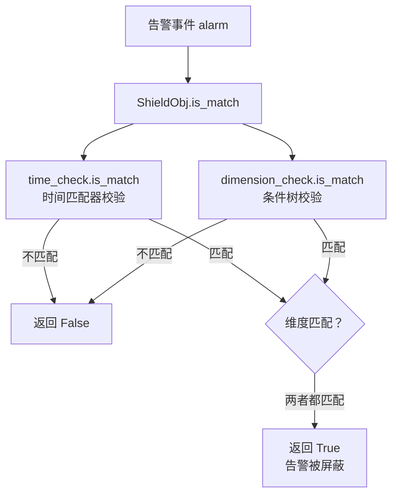
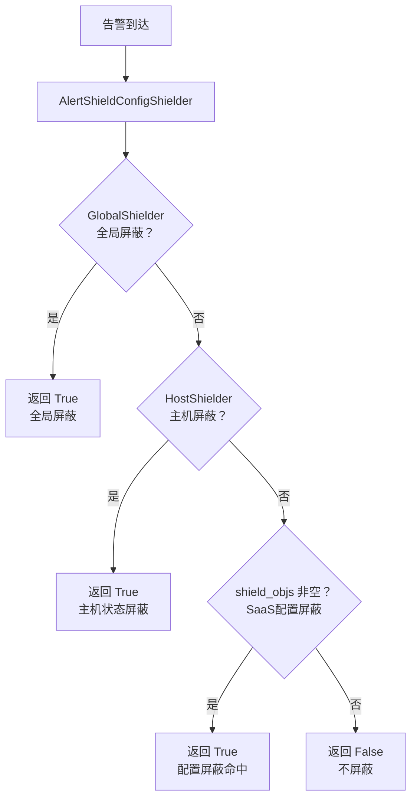
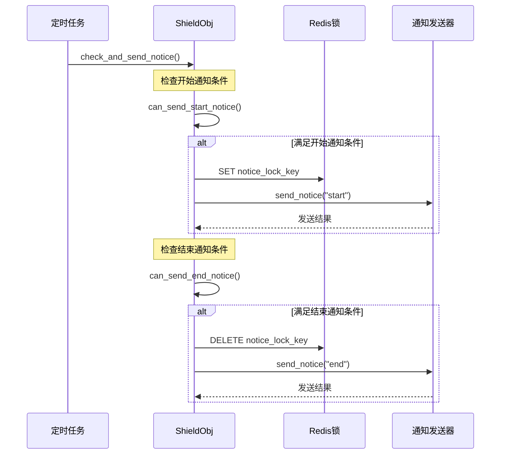
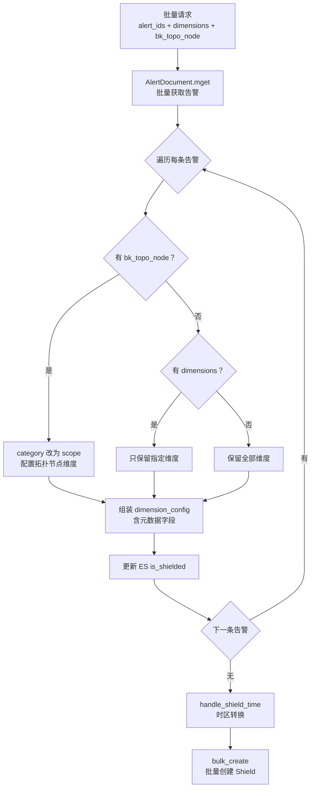

# 告警屏蔽模块实现

**本文引用的文件**
- [backend_resources.py](file://bkmonitor/packages/monitor_web/shield/resources/backend_resources.py) — 后端 CRUD 资源
- [frontend_resources.py](file://bkmonitor/packages/monitor_web/shield/resources/frontend_resources.py) — 前端展示资源
- [celery_resources.py](file://bkmonitor/packages/monitor_web/shield/resources/celery_resources.py) — 异步任务资源
- [serializers.py](file://bkmonitor/packages/monitor_web/shield/serializers.py) — 序列化器
- [shield utils.py](file://bkmonitor/packages/monitor_web/shield/utils.py) — 工具函数（ShieldDetectManager 等）
- [shield_obj.py](file://bkmonitor/alarm_backends/service/converge/shield/shield_obj.py) — 屏蔽匹配核心
- [saas_config.py](file://bkmonitor/alarm_backends/service/converge/shield/shielder/saas_config.py) — 屏蔽器实现
- [tasks.py](file://bkmonitor/alarm_backends/service/converge/shield/tasks.py) — 屏蔽通知定时任务
- [shield.py](file://bkmonitor/bkmonitor/utils/shield.py) — BaseShieldDisplayManager 展示管理器

## 目录

1. [简介](#简介)
2. [屏蔽配置 CRUD 流程](#屏蔽配置-crud-流程)
3. [五种屏蔽类型的维度处理逻辑](#五种屏蔽类型的维度处理逻辑)
4. [屏蔽匹配检测机制](#屏蔽匹配检测机制)
5. [屏蔽通知机制](#屏蔽通知机制)
6. [时间处理逻辑](#时间处理逻辑)
7. [批量告警屏蔽逻辑](#批量告警屏蔽逻辑)
8. [屏蔽展示管理](#屏蔽展示管理)
9. [结论](#结论)

## 简介

告警屏蔽模块是监控平台告警链路中的关键收敛环节，负责在告警到达动作执行前对其进行屏蔽过滤。模块横跨两个代码层：`monitor_web.shield` 提供 CRUD 管理能力（配置的增删改查），`alarm_backends.service.converge.shield` 提供运行时屏蔽检测与通知能力。

屏蔽配置支持五种类型（scope / strategy / event / alert / dimension），四种周期模式（单次 / 每天 / 每周 / 每月），以及屏蔽通知机制（开始/结束通知）。匹配检测采用条件组合树（AndCondition / OrCondition）+ 时间匹配器（TimeMatch）的双重校验，确保只有同时满足维度条件和时间条件的告警才会被屏蔽。



图表来源：基于 [backend_resources.py](file://bkmonitor/packages/monitor_web/shield/resources/backend_resources.py) 与 [shield_obj.py](file://bkmonitor/alarm_backends/service/converge/shield/shield_obj.py) 的模块结构分析

章节来源：[backend_resources.py](file://bkmonitor/packages/monitor_web/shield/resources/backend_resources.py#L1-L50)、[shield_obj.py](file://bkmonitor/alarm_backends/service/converge/shield/shield_obj.py#L1-L50)

## 屏蔽配置 CRUD 流程

### 新增屏蔽（AddShieldResource）

新增屏蔽是模块最核心的写入入口，负责将前端提交的屏蔽配置转化为持久化数据。流程经过权限校验 → 序列化器验证 → 类型分发 → 维度处理 → 时间转换 → 持久化六个阶段。

`AddShieldResource.perform_request(self, data)` 是主入口方法。它首先将 `event` 类型映射为 `alert`（兼容历史数据），然后通过 `shield_handler` 字典按 `category` 分发到对应的处理函数：

- `ShieldCategory.SCOPE` → `handle_scope` — 范围屏蔽
- `ShieldCategory.STRATEGY` → `handle_strategy` — 策略屏蔽
- `ShieldCategory.ALERT` → `handle_alert` — 告警屏蔽（含 event）
- `ShieldCategory.DIMENSION` → `handle_dimension` — 维度屏蔽

处理完维度后，统一处理通知配置（将 `notice_receiver` 格式化为 `{type}#{id}` 字符串），调用 `handle_shield_time` 转换时间，最终 `Shield.objects.create` 写入数据库。



图表来源：[backend_resources.py — AddShieldResource](file://bkmonitor/packages/monitor_web/shield/resources/backend_resources.py#L202-L340)

`AddShieldResource.validate_request_data(self, request_data: dict[str, Any])` 方法负责两层验证：当请求携带 `verify_user_permission` 标志时（API 网关场景），额外调用 `Permission.is_allowed_by_biz` 检查 `MANAGE_DOWNTIME` 权限；随后根据 `category` 从 `SHIELD_SERIALIZER` 映射表中选择对应序列化器进行数据校验。

章节来源：[backend_resources.py — AddShieldResource](file://bkmonitor/packages/monitor_web/shield/resources/backend_resources.py#L202-L340)

### 编辑屏蔽（EditShieldResource）

`EditShieldResource.perform_request(self, data)` 支持编辑屏蔽的时间、周期、通知配置、描述和标签，但不允许修改屏蔽类型和维度配置（策略屏蔽的 `level` 除外）。

编辑流程：查询 Shield → `handle_shield_time` 转换时间 → 更新 `begin_time` / `end_time` / `failure_time` → 策略屏蔽特殊处理 `dimension_config["level"]` → 处理 `notice_config` → 保存。

策略屏蔽编辑时会更新 `dimension_config["level"]`，因为屏蔽等级影响匹配范围，但维度结构本身不变。

章节来源：[backend_resources.py — EditShieldResource](file://bkmonitor/packages/monitor_web/shield/resources/backend_resources.py#L432-L475)

### 解除屏蔽（DisableShieldResource）

`DisableShieldResource.perform_request(self, data)` 通过批量设置 `is_enabled=False` 和 `failure_time=now()` 来解除屏蔽。支持传入 ID 列表进行批量操作。

解除逻辑：权限校验（可选）→ 查询 Shield 列表 → 遍历将 `is_enabled` 设为 `False`，`failure_time` 设为当前时间，记录操作人 → `bulk_update` 批量更新 `["is_enabled", "failure_time", "update_user"]` 三个字段。对不存在的 ID 记录 warning 日志但不报错。

章节来源：[backend_resources.py — DisableShieldResource](file://bkmonitor/packages/monitor_web/shield/resources/backend_resources.py#L477-L525)

### 屏蔽列表（ShieldListResource）

`ShieldListResource.perform_request(self, data)` 提供通用的屏蔽列表查询，支持按业务、类型、来源、条件和时间范围过滤。

查询逻辑要点：
- 无 `bk_biz_id` 时自动获取当前用户可见的业务 ID 列表
- `categories` 中包含 `event` 时自动追加 `alert`（兼容查询）
- `conditions` 支持多条件匹配，`description` 字段使用 `icontains` 模糊搜索
- `is_active=True` 时筛选 `SHIELDED` 状态且按 `begin_time` 过滤时间范围；`is_active=False` 时筛选非屏蔽状态且按 `failure_time` 过滤
- 分页在内存中进行（先全量查询再切片）

章节来源：[backend_resources.py — ShieldListResource](file://bkmonitor/packages/monitor_web/shield/resources/backend_resources.py#L66-L165)

### 屏蔽详情（ShieldDetailResource）

`ShieldDetailResource.perform_request(self, data)` 直接从数据库读取 Shield 对象并组装详情字典返回。时间字段使用 `utc2biz_str` 转换为业务时区字符串展示。

章节来源：[backend_resources.py — ShieldDetailResource](file://bkmonitor/packages/monitor_web/shield/resources/backend_resources.py#L167-L200)

## 五种屏蔽类型的维度处理逻辑

每种屏蔽类型对应不同的 `dimension_config` 结构，在新增时由各自的 `handle_*` 方法组装，在运行时由 `ShieldObj._parse_dimension_config` 解析为条件树。

### 范围屏蔽（scope）

`AddShieldResource.handle_scope(data)` 是静态方法，将前端传入的 `scope_type` 和 `target` 映射为存储字段：

| scope_type | 存储键 | 说明 |
|---|---|---|
| `INSTANCE` | `service_instance_id` | 服务实例 |
| `IP` | `bk_target_ip` | IP（前端 `ip`/`bk_cloud_id` 转为 `bk_target_ip`/`bk_target_cloud_id`） |
| `NODE` | `bk_topo_node` | 拓扑节点 |
| `DYNAMIC_GROUP` | `dynamic_group` | 动态分组 |

如果 `dimension_config` 中包含 `metric_id`，也会保留到存储配置中。

章节来源：[backend_resources.py — handle_scope](file://bkmonitor/packages/monitor_web/shield/resources/backend_resources.py#L227-L245)

### 策略屏蔽（strategy）

`AddShieldResource.handle_strategy(self, data)` 是最复杂的维度处理，流程为：

1. 提取 `strategy_ids` 列表
2. 调用 `ShieldDetectManager.check_shield_status` 检测是否已被快捷屏蔽，若已屏蔽则抛出 `DuplicateQuickShieldError`
3. 获取屏蔽等级 `level`（默认为 `[FATAL, WARNING, REMIND]`）
4. 组装 `dimension_config`：`strategy_id` + `level` + `dimension_conditions`（可选）
5. 如果有 `target`，调用 `handle_scope` 追加范围维度

策略屏蔽的 `dimension_config` 结构：
```python
{
    "strategy_id": [1, 2],
    "level": [1, 2, 3],
    "dimension_conditions": [...],  # 可选的额外维度条件
    # 如果有范围配置，还会有 service_instance_id / bk_target_ip / bk_topo_node 等
}
```

章节来源：[backend_resources.py — handle_strategy](file://bkmonitor/packages/monitor_web/shield/resources/backend_resources.py#L247-L270)

### 告警屏蔽（alert/event）

`AddShieldResource.handle_alert(data)` 是静态方法，从 `AlertDocument` 提取维度信息生成屏蔽配置：

1. 从 `dimension_config.alert_id` 或 `alert_ids[0]` 获取告警 ID
2. 调用 `AlertDocument.get(alert_id)` 获取告警文档
3. 遍历 `alert.dimensions`，如果传入了 `dimension_keys` 则只保留指定维度（移动端快捷屏蔽支持动态删除维度）
4. 组装带下划线前缀的元数据字段：`_alert_id` / `strategy_id` / `_severity` / `_alert_message` / `_dimensions`
5. 更新 ES 中告警的 `is_shielded=True` 状态

`_dimensions` 字段通过 `AlertDimensionFormatter.get_dimensions_str` 生成人类可读的维度字符串，用于展示。

`event` 类型在 `perform_request` 中被映射为 `alert`，复用同一处理逻辑。

章节来源：[backend_resources.py — handle_alert](file://bkmonitor/packages/monitor_web/shield/resources/backend_resources.py#L272-L295)

### 维度屏蔽（dimension）

`AddShieldResource.handle_dimension(data)` 是静态方法，将前端传入的 `strategy_id` 重命名为 `_strategy_id`（下划线前缀表示不参与屏蔽匹配，仅用于展示），其余维度条件直接保留。

维度屏蔽的 `dimension_config` 结构：
```python
{
    "_strategy_id": 123,
    "dimension_conditions": [
        {"key": "bk_target_ip", "value": ["1.1.1.1"], "method": "eq", "condition": "and"}
    ]
}
```

章节来源：[backend_resources.py — handle_dimension](file://bkmonitor/packages/monitor_web/shield/resources/backend_resources.py#L297-L301)

### 序列化器结构

`SHIELD_SERIALIZER` 映射表在 [serializers.py](file://bkmonitor/packages/monitor_web/shield/serializers.py#L113-L116) 中定义，每种类型的序列化器继承 `BaseSerializer`，各自定义 `DimensionConfig` 内部类：

| 类型 | 序列化器 | DimensionConfig 关键字段 |
|---|---|---|
| scope | `ScopeSerializer` | `scope_type`, `target`, `metric_id` |
| strategy | `StrategySerializer` | `id`, `level`, `scope_type`, `target`, `dimension_conditions` |
| event | `EventSerializer` | `id`（事件 ID） |
| alert | `AlertSerializer` | `alert_id`/`alert_ids`, `dimensions`, `bk_topo_node` |
| dimension | `DimensionSerializer` | `dimension_conditions`（必填） |

`BaseSerializer` 定义了公共字段：`bk_biz_id`, `category`, `begin_time`, `end_time`, `dimension_config`, `cycle_config`（嵌套 `CycleConfigSlz`），`shield_notice`, `notice_config`（嵌套 `NoticeConfigSlz`），`description`, `is_quick`, `label`。

`CycleConfigSlz` 定义了周期配置结构：`type`（1=单次/2=每天/3=每周/4=每月）、`week_list`、`day_list`、`begin_time`、`end_time`。

`NoticeConfigSlz` 定义了通知配置结构：`notice_way`（通知方式列表）、`notice_receiver`（通知接收人列表）、`notice_time`（提前通知分钟数）。

章节来源：[serializers.py](file://bkmonitor/packages/monitor_web/shield/serializers.py#L17-L116)

## 屏蔽匹配检测机制

屏蔽匹配检测分为两层：管理层的 `ShieldDetectManager`（用于策略列表页快速检测）和运行时的 `ShieldObj` + `AlertShieldObj`（用于告警收敛阶段的精确匹配）。

### ShieldDetectManager — 管理层快速检测

`ShieldDetectManager` 位于 [utils.py](file://bkmonitor/packages/monitor_web/shield/utils.py#L36-L170)，用于策略列表页和告警事件列表页判断是否已被屏蔽。

`ShieldDetectManager.__init__(self, bk_biz_id, category)` 在初始化时调用 `get_shield_list` 加载屏蔽配置。加载逻辑因 `category` 而异：
- `STRATEGY`：查询 `is_enabled=1` 且 `end_time >= now()` 的策略屏蔽
- `ALERT`：额外过滤 `begin_time <= now()` 并调用 `check_time` 校验周期时间

`ShieldDetectManager.check_shield_status(self, match_info)` 遍历所有屏蔽配置，调用 `is_shielded` 逐条匹配，返回 `{"is_shielded": bool, "shield_ids": list, "id": first_id}`。

`ShieldDetectManager.is_shielded(self, shield_obj, match_info)` 的匹配逻辑：
1. 遍历 `dimension_config` 的每个键值对
2. 跳过以 `_` 开头的键（元数据字段）
3. 跳过空值
4. 遇到 `dimension_conditions` 时 break（由专门的条件匹配器处理）
5. 对 `bk_target_ip`、`bk_topo_node`、`dynamic_group` 做格式归一化
6. 用集合交集判断是否匹配：`alarm_set & shield_set` 非空则该维度匹配
7. 所有维度都匹配（for-else 的 else 分支）则返回 `True`

`ShieldDetectManager.check_time(shield)` 静态方法处理复合周期屏蔽的时间判断：对非单次屏蔽（`type != 1`），根据 `week_list` / `day_list` 判断当天是否在周期内，再判断当前时间是否在 `begin_time` ~ `end_time` 范围内。

章节来源：[utils.py — ShieldDetectManager](file://bkmonitor/packages/monitor_web/shield/utils.py#L36-L170)

### ShieldObj — 运行时精确匹配

`ShieldObj` 位于 [shield_obj.py](file://bkmonitor/alarm_backends/service/converge/shield/shield_obj.py#L30-L345)，是运行时屏蔽匹配的核心。每条屏蔽配置对应一个 `ShieldObj` 实例，在初始化时将 `dimension_config` 解析为条件树、将 `cycle_config` 解析为时间匹配器。

#### 维度解析

`ShieldObj._parse_dimension_config(self)` 将原始 `dimension_config` 转换为 `AndCondition` 条件树，流程：

1. 调用 `_clean_dimension()` 清理无效维度
2. 如果是 `DIMENSION` 类型，调用 `_parse_dimension_conditions` 解析维度条件后返回
3. 如果是 `STRATEGY` 类型，先解析 `dimension_conditions`，再处理 `bk_topo_node`（业务级节点屏蔽特殊处理）
4. 如果 `scope_type` 是 `DYNAMIC_GROUP`，查询动态分组对应的主机 ID 列表，转换为 `bk_host_id` 维度
5. 其余维度通过 `load_field_instance` 加载为字段实例，包装为 `EqualCondition` 加入 `dimension_check`

`ShieldObj._clean_dimension(self)` 清理三类无效维度：
- `category` 值为 `all` 的维度（表示全量，无需匹配）
- 值包含 `00` 的维度（历史兼容）
- 以 `_` 开头的键（元数据字段，如 `_alert_id`、`_severity`）

`ShieldObj._parse_dimension_conditions(self, clean_dimension)` 将 `dimension_conditions` 列表解析为 `OrCondition` 嵌套 `AndCondition` 的条件树，支持 `and`/`or` 组合逻辑和多种匹配方法（`eq`/`gte`/`gt`/`lt`/`lte`/`neq`，通过 `CONDITION_CLASS_MAP` 映射）。

#### 时间解析

`ShieldObj._parse_cycle_config(self)` 将 `cycle_config` 转换为 `TimeMatch` 实例：
- 从 `TIME_MATCH_CLASS_MAP` 按 `type` 选择时间匹配器类
- `type=-1` 或不存在时使用 `TimeMatchBySingle`（单次匹配）

#### 匹配入口

`ShieldObj.is_match(self, alarm)` 是匹配入口，执行时间匹配和维度匹配的 AND 逻辑：
1. 从告警事件提取维度（`dimensions` + `strategy_id` + `level` + `metric_id`）
2. 兼容 `bk_target_ip` / `ip` 和 `bk_target_cloud_id` / `bk_cloud_id` 的双向映射
3. 返回 `self.time_check.is_match(source_time) and self.dimension_check.is_match(dimension)`



图表来源：[shield_obj.py — ShieldObj.is_match](file://bkmonitor/alarm_backends/service/converge/shield/shield_obj.py#L177-L195)

### AlertShieldObj — 告警级匹配

`AlertShieldObj` 继承 `ShieldObj`，重写了 `is_match` 方法以适配 `AlertDocument` 的数据结构。它使用类级缓存 `_alert_dimension_cache` 避免重复计算告警维度。

`AlertShieldObj._calculate_alert_dimension(alert)` 静态方法负责从 `AlertDocument` 提取完整维度：
1. 从 `alert.origin_alarm["data"]["dimensions"]` 深拷贝基础维度
2. 合并 `alert.dimensions`（ES 文档维度）
3. 补充 `strategy_id`、`level`、`bk_topo_node`、`bk_host_id`、`bk_biz_id`、`metric_id`
4. 如果有 `strategy_id`，从 `Strategy` 缓存获取 `metric_id` 列表
5. 执行 `bk_target_ip`/`ip`、`bk_target_cloud_id`/`bk_cloud_id`、`service_instance_id` 系列的双向字段映射
6. 将 `tags.` 前缀的维度去除前缀，扩大搜索范围

缓存策略：当缓存超过 1000 条时，删除最旧的 500 条。

`AlertShieldObj.is_match(self, alert)` 调用 `get_dimension(alert)` 获取维度（带缓存），然后执行与父类相同的时间和维度双重校验。

章节来源：[shield_obj.py — ShieldObj & AlertShieldObj](file://bkmonitor/alarm_backends/service/converge/shield/shield_obj.py#L30-L496)

### AlertShieldConfigShielder — 屏蔽器入口

`AlertShieldConfigShielder` 位于 [saas_config.py](file://bkmonitor/alarm_backends/service/converge/shield/shielder/saas_config.py#L33-L145)，是告警收敛阶段调用屏蔽的入口。

`AlertShieldConfigShielder.__init__(self, alert)` 在初始化时完成全部匹配工作：
1. 通过 `ShieldCacheManager.get_shields_by_biz_id` 从 Redis 缓存加载业务的所有屏蔽配置
2. 先查 `ALERT_SHIELD_SNAPSHOT` 缓存（按 `strategy_id + alert_id` 缓存已匹配的屏蔽 ID 列表）
3. 缓存未命中时，遍历所有配置创建 `AlertShieldObj` 并调用 `is_match`，将命中的写入缓存
4. 缓存命中时直接从配置列表中筛选对应的 `AlertShieldObj`

`AlertShieldConfigShielder.is_matched(self)` 的优先级链：
1. `GlobalShielder().is_matched()` — 全局屏蔽（发布/变更场景的 `GLOBAL_SHIELD_ENABLED` 开关）
2. `HostShielder(self.alert).is_matched()` — 主机屏蔽（主机 `is_shielding` 或 `ignore_monitoring` 状态）
3. `self.shield_objs` — SaaS 配置屏蔽（非空则匹配）



图表来源：[saas_config.py — AlertShieldConfigShielder.is_matched](file://bkmonitor/alarm_backends/service/converge/shield/shielder/saas_config.py#L87-L100)

其他屏蔽器：
- `AlarmTimeShielder` — 根据事件配置的告警时间范围和策略的生效时间判断是否在告警时间段内
- `IncidentShielder` — 故障影响判定，使用 `get_failure_scope_config` 获取平台链路层抖动配置
- `HostShielder` — 通过 `HostManager` 查询主机状态，支持 HOST 类型告警和容器场景告警（BCS 集群）

章节来源：[saas_config.py](file://bkmonitor/alarm_backends/service/converge/shield/shielder/saas_config.py#L33-L298)

## 屏蔽通知机制

屏蔽通知由定时任务驱动，通过 Redis 锁保证开始/结束通知各只发送一次。

### 定时任务调度

`check_and_send_shield_notice()` 位于 [tasks.py](file://bkmonitor/alarm_backends/service/converge/shield/tasks.py#L26-L40)，是 Celery 定时任务入口：

1. 查询所有 `is_enabled=True`、`is_deleted=False`、`failure_time >= now()` 且属于当前集群业务的屏蔽配置
2. 调用 `perform_sharding_task` 进行分片，每片 10 条配置
3. 分片任务 `do_check_and_send_shield_notice(ids)` 对每条配置创建 `AlertShieldObj` 并调用 `check_and_send_notice`

### 通知触发条件

`ShieldObj.check_and_send_notice(self)` 位于 [shield_obj.py](file://bkmonitor/alarm_backends/service/converge/shield/shield_obj.py#L247-L265)，是通知发送的协调方法，依次检查开始通知和结束通知：

**开始通知** — `can_send_start_notice(self)`：
1. 无 `notice_config` 则返回 `False`
2. 计算 `notice_time` 分钟后的时间点，检查该时间点是否在屏蔽时间范围内（`time_check.is_match`）
3. 检查 Redis 锁 `NOTICE_SHIELD_KEY_LOCK`：如果锁存在说明已发送过，刷新过期时间后返回 `False`；锁不存在则返回 `True`

**结束通知** — `can_send_end_notice(self)`：
1. 无 `notice_config` 则返回 `False`
2. 计算 `notice_time + 1` 分钟后的时间点，检查该时间点是否**不在**屏蔽范围内
3. 检查 Redis 锁：锁不存在说明屏蔽未发生（无需结束通知），返回 `False`；锁存在则返回 `True`



图表来源：[shield_obj.py — check_and_send_notice](file://bkmonitor/alarm_backends/service/converge/shield/shield_obj.py#L247-L295)

### 通知发送

`ShieldObj.send_notice(self, notice_type)` 负责实际发送通知：

1. `parse_notice_receivers()` 解析通知接收人：`user#username` 提取用户名，其他类型（如 `group#role`）通过 `get_business_roles` 展开为用户列表，去重后返回
2. `get_notice_context(notice_type)` 构建通知模板上下文：`notice_type`（开始/结束）、`shield_id`、`start_time`、`category_name`、`cycle_duration`、`shield_content`、`description`
3. 遍历 `notice_way`（通知方式列表），为每种方式创建 `Sender` 实例，使用 `notice/shield/{notice_way}_title.jinja` 和 `notice/shield/{notice_way}_content.jinja` 模板
4. 调用 `sender.send(notice_way, notice_receivers)` 发送，收集所有方式的结果

章节来源：[shield_obj.py — 通知机制](file://bkmonitor/alarm_backends/service/converge/shield/shield_obj.py#L197-L345)、[tasks.py](file://bkmonitor/alarm_backends/service/converge/shield/tasks.py#L26-L73)

## 时间处理逻辑

### handle_shield_time — 时区转换

`handle_shield_time(bk_biz_id, begin_time_str, end_time_str, cycle_config)` 是模块级函数，位于 [backend_resources.py](file://bkmonitor/packages/monitor_web/shield/resources/backend_resources.py#L527-L570)，负责将前端传入的时间字符串统一转换为业务时区的 datetime。

处理流程：
1. 通过 `SpaceApi.get_space_detail(bk_biz_id)` 获取业务空间信息，取 `time_zone`，不存在则使用 `settings.TIME_ZONE`
2. 定义内部函数 `_parse_with_timezone(value)`：
   - 使用 `dateutil_parser.parse` 解析时间字符串
   - 如果时间带有时区信息（`tzinfo` 非空且 `utcoffset` 非空），转换到业务时区
   - 如果不带时区信息，按业务时区解释（`replace(tzinfo=timezone)`）
3. 对 `begin_time` 和 `end_time` 分别执行时区转换
4. 如果是周期屏蔽（`cycle_config.type != 1`），用周期的 `begin_time` / `end_time`（`HH:MM:SS` 格式）替换日期的时间部分

这种设计确保了：跨时区用户提交的屏蔽时间会被正确转换到业务所在时区，周期屏蔽的每日触发时间也以业务时区为准。

章节来源：[backend_resources.py — handle_shield_time](file://bkmonitor/packages/monitor_web/shield/resources/backend_resources.py#L527-L570)

### 时间匹配器

运行时的时间匹配由 `ShieldObj._parse_cycle_config` 初始化的 `TimeMatch` 实例负责。`TIME_MATCH_CLASS_MAP` 按 `cycle_config.type` 映射不同的匹配器类：

| type | 含义 | 匹配器 |
|---|---|---|
| 1 | 单次 | `TimeMatchBySingle`（默认） |
| 2 | 每天 | 每日时间范围匹配 |
| 3 | 每周 | 指定星期 + 时间范围 |
| 4 | 每月 | 指定日期 + 时间范围 |

`ShieldObj.time_check.is_match(source_time)` 判断当前时间是否在屏蔽周期内，`shield_left_time(current_time)` 计算剩余屏蔽时间。

章节来源：[shield_obj.py — _parse_cycle_config](file://bkmonitor/alarm_backends/service/converge/shield/shield_obj.py#L48-L62)

## 批量告警屏蔽逻辑

`BulkAddAlertShieldResource` 继承 `AddShieldResource`，位于 [backend_resources.py](file://bkmonitor/packages/monitor_web/shield/resources/backend_resources.py#L342-L430)，支持为多条告警批量创建屏蔽配置。

### handle_alerts — 批量维度提取

`BulkAddAlertShieldResource.handle_alerts(self, data)` 是核心方法，处理流程：

1. 从 `dimension_config.alert_ids` 获取告警 ID 列表
2. 从 `dimension_config.dimensions` 获取每个告警的保留维度配置（`{alert_id: [dim_key1, dim_key2]}`）
3. 从 `dimension_config.bk_topo_node` 获取每个告警的拓扑节点配置
4. 调用 `AlertDocument.mget(ids=alert_ids)` 批量获取告警文档
5. 遍历每条告警，按优先级生成 `dimension_config`：
   - **有 `bk_topo_node`**：将 `category` 改为 `scope`，配置 `bk_topo_node` 维度，移除 `strategy_id`
   - **有 `dimensions`（保留维度列表）**：只保留指定维度的键值对
   - **无 `dimensions`**：保留所有维度
6. 每条告警的 `dimension_config` 都包含元数据字段：`_alert_id`、`_severity`、`_alert_message`、`_dimensions`
7. 批量更新 ES 中告警的 `is_shielded=True` 状态

### perform_request — 批量创建

`BulkAddAlertShieldResource.perform_request(self, data)` 在 `handle_alerts` 之后：

1. 处理 `notice_config`（与单条新增相同）
2. 调用 `handle_shield_time` 转换时间
3. 遍历所有 `dimension_configs`，为每条创建 `Shield` 对象（未持久化）
4. 如果 `category` 被改为 `scope`（因 `bk_topo_node`），设置 `scope_type="node"`
5. `Shield.objects.bulk_create(shields)` 批量写入数据库



图表来源：[backend_resources.py — BulkAddAlertShieldResource](file://bkmonitor/packages/monitor_web/shield/resources/backend_resources.py#L342-L430)

批量屏蔽与单条屏蔽的关键差异：批量支持每个告警独立配置保留维度和拓扑节点，且当告警配置了 `bk_topo_node` 时会自动将屏蔽类型从 `alert` 降级为 `scope`（范围屏蔽），因为拓扑节点屏蔽不需要匹配具体维度。

章节来源：[backend_resources.py — BulkAddAlertShieldResource](file://bkmonitor/packages/monitor_web/shield/resources/backend_resources.py#L342-L430)

## 屏蔽展示管理

### BaseShieldDisplayManager

`BaseShieldDisplayManager` 位于 [shield.py](file://bkmonitor/bkmonitor/utils/shield.py#L34-L333)，是屏蔽内容展示的抽象基类，提供四类展示能力：

**屏蔽内容生成** — `get_shield_content(self, shield, strategy_id_to_name=None)`：
- `EVENT`/`ALERT` 类型：返回策略名 + 维度字符串（`_dimensions`）
- `DIMENSION` 类型：将 `dimension_conditions` 拼接为 `key = value and key2 >= value2` 格式
- `STRATEGY` 类型：策略名 + 范围目标（服务实例/IP/节点/动态分组/业务名）
- `SCOPE` 类型：根据 `scope_type` 查询目标名称

**周期时长计算** — `get_cycle_duration(self, shield)`：
- 单次：计算 `end_time - begin_time` 的小时差
- 周期：计算每日时间差 × 天数，转小时
- 格式化为 `{hours}小时/{unit}` 或 `<1小时/{unit}`

**屏蔽周期描述** — `get_shield_cycle(self, shield) -> str`：
- 使用 Python 3.10 `match-case` 语法，返回如 `每周二/四 (00:00 ~ 23:00)` 的可读字符串

**当前周期剩余时间** — `get_current_cycle_ramaining_time(self, shield) -> str | None`：
- 判断当前是否在屏蔽周期内，计算剩余时间并格式化为 `X 天 Y 小时 Z 分`

### ShieldDisplayManager vs SimpleShieldDisplayManager

两个子类位于 [utils.py](file://bkmonitor/packages/monitor_web/shield/utils.py#L173-L253)：

| 特性 | `ShieldDisplayManager` | `SimpleShieldDisplayManager` |
|---|---|---|
| 用途 | 详情页（完整展示） | 列表页（简化展示） |
| 服务实例名 | 调用 CMDB API 获取真实名称 | 返回 `N 服务实例` 计数 |
| 拓扑节点路径 | 调用 CMDB API 获取完整路径 | 返回 `N 集群, M 模块` 计数 |
| 业务名 | 调用 CMDB API 获取 | 返回空字符串 |
| 动态分组名 | 调用 CMDB API 获取 | 调用 CMDB API 获取 |
| 缓存 | `get_business_name` 使用 `@lru_cache` | 无 |

`SimpleShieldDisplayManager` 的设计目标是在列表页避免大量 CMDB API 调用，用计数代替名称查询，提升列表加载性能。

### 前端资源增强

`FrontendShieldListResource.enrich_shields(self, bk_biz_id, shields, strategy_ids)` 位于 [frontend_resources.py](file://bkmonitor/packages/monitor_web/shield/resources/frontend_resources.py#L117-L165)，使用 `ThreadPoolExecutor(max_workers=20)` 并行处理屏蔽列表的展示增强，包括策略名查询、屏蔽内容生成、周期描述等。

`FrontendShieldDetailResource.handle_dimension_config(self, shield)` 方法负责详情页的维度配置展示转换，根据 `scope_type` 和 `category` 调用不同的 CMDB 查询方法获取目标名称。

章节来源：[shield.py — BaseShieldDisplayManager](file://bkmonitor/bkmonitor/utils/shield.py#L34-L333)、[utils.py — DisplayManagers](file://bkmonitor/packages/monitor_web/shield/utils.py#L173-L253)、[frontend_resources.py](file://bkmonitor/packages/monitor_web/shield/resources/frontend_resources.py#L117-L354)

## 结论

告警屏蔽模块的实现核心可归纳为三条链路：

**配置链路**（`monitor_web.shield`）：`AddShieldResource` 按 `category` 分发到 `handle_scope` / `handle_strategy` / `handle_alert` / `handle_dimension` 组装 `dimension_config`，经 `handle_shield_time` 时区转换后持久化到 `Shield` 模型。五种类型的维度结构差异集中在下划线前缀字段（`_alert_id`、`_severity` 等元数据）和 `dimension_conditions`（条件树）的使用方式上。

**匹配链路**（`alarm_backends.service.converge.shield`）：`AlertShieldConfigShielder` 按 全局 → 主机 → SaaS配置 的优先级链判断屏蔽，SaaS 配置屏蔽由 `AlertShieldObj.is_match` 执行时间匹配（`TimeMatch`）和维度匹配（`AndCondition`/`OrCondition` 条件树）的双重校验。匹配结果按 `strategy_id + alert_id` 缓存到 Redis 避免重复计算。

**通知链路**（`tasks.py` + `ShieldObj`）：Celery 定时任务分片遍历生效屏蔽配置，`check_and_send_notice` 通过 Redis 锁（`NOTICE_SHIELD_KEY_LOCK`）保证开始/结束通知各只发送一次，通知内容由 `DisplayManager` 生成上下文、`Sender` 按通知方式发送。

关键设计决策：维度清理（`_clean_dimension`）统一处理 `all`/`00`/`_` 前缀三类无效维度；动态分组屏蔽在运行时展开为主机 ID 列表；批量屏蔽支持按告警独立配置维度且可降级为范围屏蔽；`SimpleShieldDisplayManager` 用计数替代 CMDB 查询优化列表性能。
