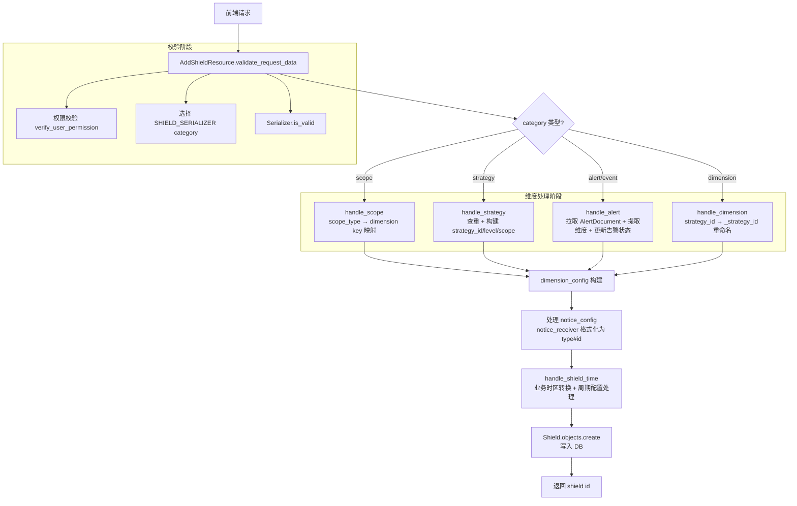
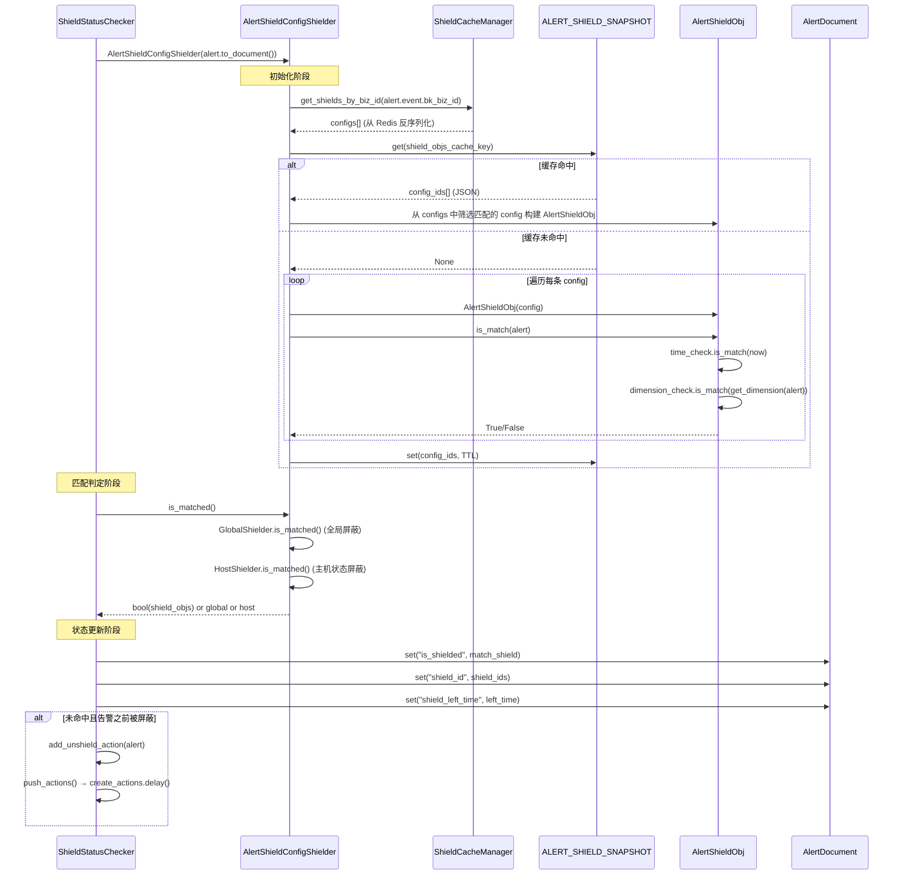
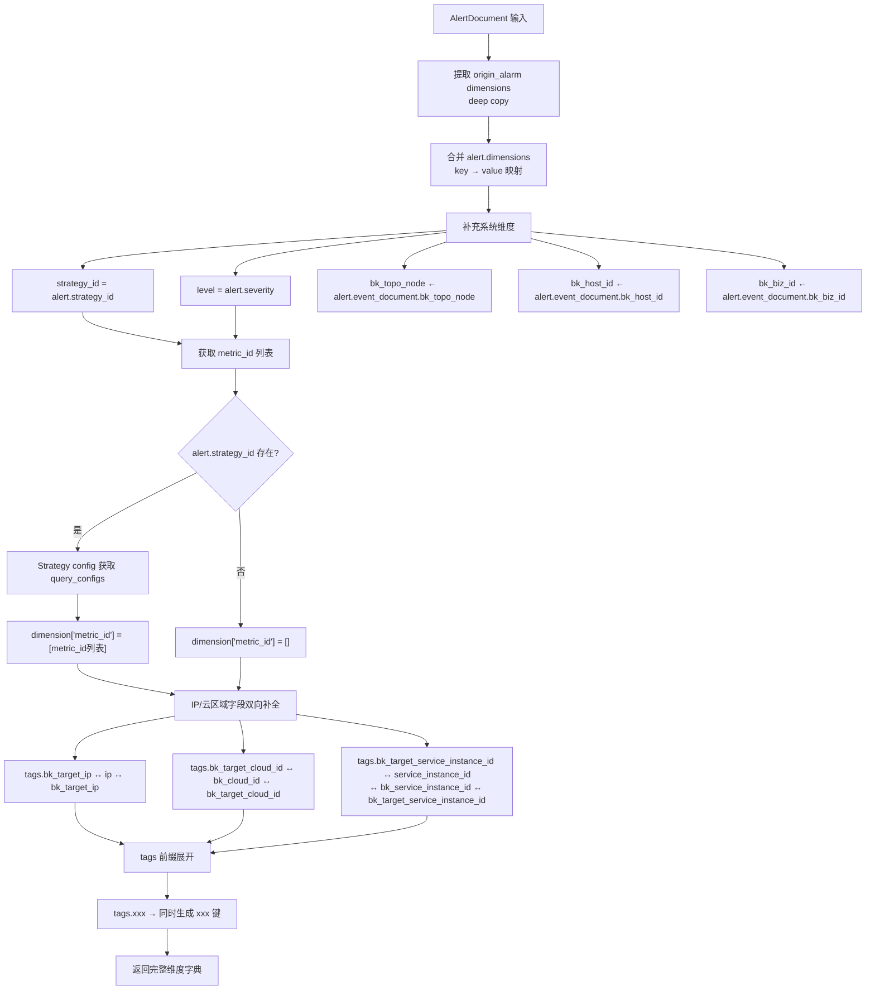
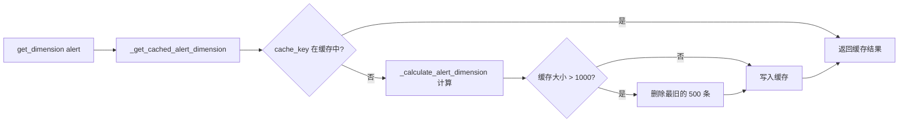
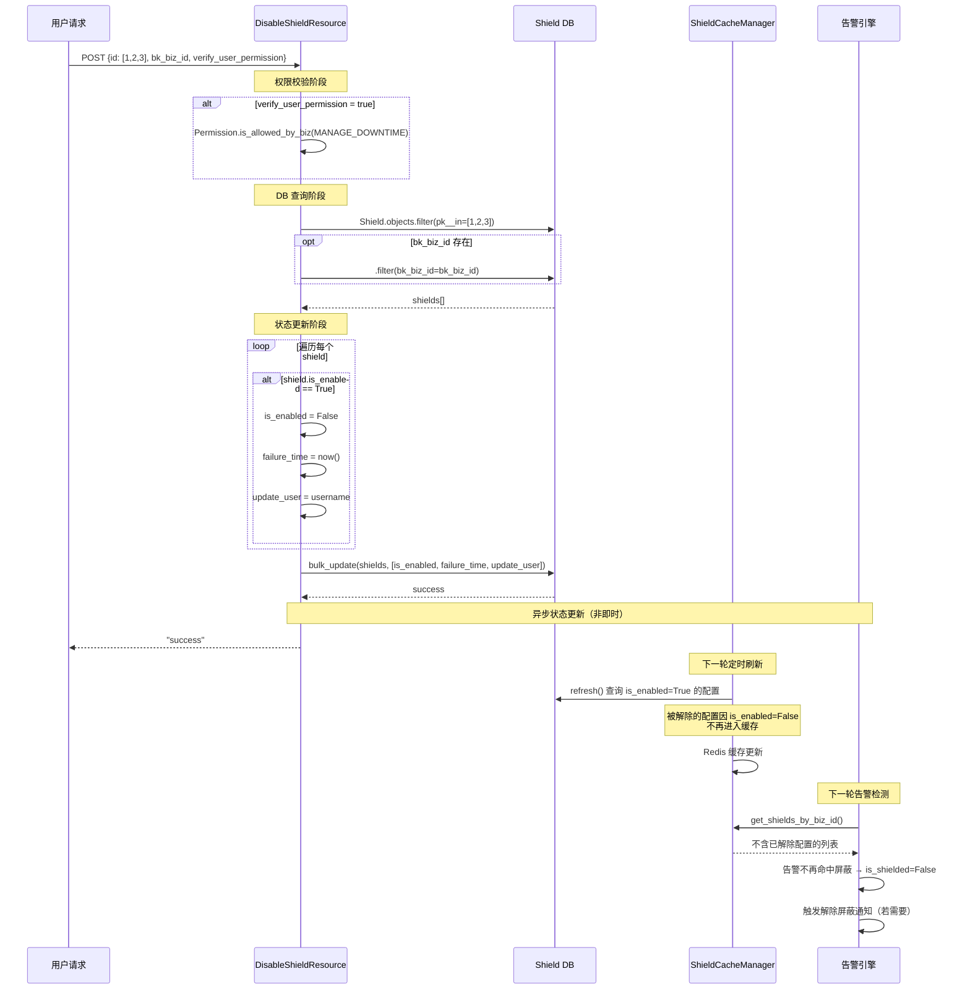
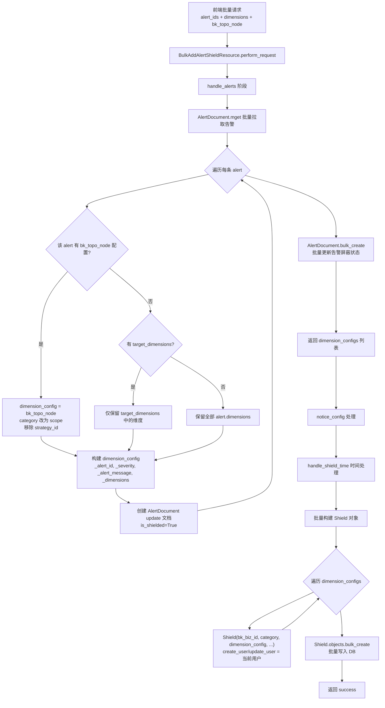

# 告警屏蔽模块 - 数据流转

> **层级**：实现层文档（Implementation）
> **模块**：告警屏蔽（Shield）
> **关注点**：数据在各组件之间的流转路径、格式变换与状态变迁

**本文引用的文件**

- [backend_resources.py](file://bkmonitor/packages/monitor_web/shield/resources/backend_resources.py) — 后端 CRUD 资源（创建/编辑/解除/批量屏蔽）
- [serializers.py](file://bkmonitor/packages/monitor_web/shield/serializers.py) — 序列化器（请求校验与维度配置解析）
- [cache/shield.py](file://bkmonitor/alarm_backends/core/cache/shield.py) — 屏蔽缓存管理器（DB→Redis 同步）
- [shield_obj.py](file://bkmonitor/alarm_backends/service/converge/shield/shield_obj.py) — ShieldObj 屏蔽匹配核心（维度解析/时间匹配/通知）
- [saas_config.py](file://bkmonitor/alarm_backends/service/converge/shield/shielder/saas_config.py) — SaaS 配置屏蔽器（缓存加载/匹配调度）
- [tasks.py](file://bkmonitor/alarm_backends/service/converge/shield/tasks.py) — 屏蔽通知定时任务
- [checker/shield.py](file://bkmonitor/alarm_backends/service/alert/manager/checker/shield.py) — 告警屏蔽状态检测器
- [models/base.py](file://bkmonitor/bkmonitor/models/base.py) — Shield 模型定义
- [constants/shield.py](file://bkmonitor/constants/shield.py) — 屏蔽常量定义

---

## 目录

- [1. 屏蔽配置创建数据流](#1-屏蔽配置创建数据流)
- [2. 告警屏蔽匹配数据流](#2-告警屏蔽匹配数据流)
- [3. 屏蔽配置缓存同步机制](#3-屏蔽配置缓存同步机制)
- [4. 告警维度到屏蔽维度的转换流程](#4-告警维度到屏蔽维度的转换流程)
- [5. 屏蔽解除数据流](#5-屏蔽解除数据流)
- [6. 批量屏蔽的数据流转](#6-批量屏蔽的数据流转)
- [附录：核心数据结构](#附录核心数据结构)

---

## 1. 屏蔽配置创建数据流

### 1.1 流程概述

屏蔽配置创建由 `AddShieldResource` 处理，支持五种屏蔽类型（`scope`/`strategy`/`event`/`alert`/`dimension`），每种类型有独立的维度处理逻辑。数据从前端请求进入，经序列化器校验、维度转换、时间处理，最终写入 `Shield` 数据库表。

### 1.2 数据流图



图表来源：[backend_resources.py](file://bkmonitor/packages/monitor_web/shield/resources/backend_resources.py) `AddShieldResource` 类

### 1.3 关键数据变换

**序列化器选择**：根据 `category` 字段从 `SHIELD_SERIALIZER` 字典中选择对应的序列化器：

| category | 序列化器 | 维度配置校验重点 |
|----------|----------|------------------|
| `scope` | `ScopeSerializer` | `scope_type` + `target` + 可选 `metric_id` |
| `strategy` | `StrategySerializer` | `id`(策略ID列表) + `level` + `dimension_conditions` |
| `event`/`alert` | `AlertSerializer` | `alert_id` 或 `alert_ids` + 可选 `dimensions`/`bk_topo_node` |
| `dimension` | `DimensionSerializer` | `dimension_conditions`(条件列表) |

**维度处理逻辑**（`handle_*` 方法）：

- `handle_scope`：将 `scope_type` 映射为维度键名（`instance`→`service_instance_id`、`ip`→`bk_target_ip`+`bk_target_cloud_id`、`node`→`bk_topo_node`、`dynamic_group`→`dynamic_group`），IP 类型会做字段名转换（`ip`→`bk_target_ip`、`bk_cloud_id`→`bk_target_cloud_id`）。
- `handle_strategy`：先通过 `ShieldDetectManager.check_shield_status` 查重（若已存在快捷屏蔽则抛 `DuplicateQuickShieldError`），再构建包含 `strategy_id`、`level`、`dimension_conditions` 和 scope 信息的 `dimension_config`。`level` 默认为 `[1, 2, 3]`（致命/预警/提醒）。
- `handle_alert`：从 `AlertDocument.get(alert_id)` 拉取告警文档，遍历 `alert.dimensions` 提取维度键值对（可被 `dimension_keys` 过滤），同时补充 `_alert_id`、`strategy_id`、`_severity`、`_alert_message`、`_dimensions` 等下划线元信息字段，并立即更新该告警的 `is_shielded=True`。
- `handle_dimension`：将 `strategy_id` 重命名为 `_strategy_id`（下划线前缀表示不参与屏蔽匹配逻辑）。

**时间处理**（`handle_shield_time`）：获取业务空间时区（`SpaceApi.get_space_detail`），判断时间字符串是否带时区信息——带时区则转换到业务时区，不带则按业务时区解释。若周期类型非单次（`type != 1`），则用 `cycle_config` 中的 `begin_time`/`end_time` 覆盖日期中的时分秒部分。

**DB 写入**：`Shield.objects.create()` 写入 `alarm_shield` 表，关键字段包括 `bk_biz_id`、`category`、`begin_time`/`end_time`/`failure_time`、`scope_type`、`dimension_config`(JSON)、`cycle_config`(JSON)、`notice_config`(JSON)、`is_quick`、`source`、`label`。

章节来源 [AddShieldResource](file://bkmonitor/packages/monitor_web/shield/resources/backend_resources.py#L203-L330)、[SHIELD_SERIALIZER](file://bkmonitor/packages/monitor_web/shield/serializers.py#L116)、[Shield 模型](file://bkmonitor/bkmonitor/models/base.py#L730-L770)

---

## 2. 告警屏蔽匹配数据流

### 2.1 流程概述

告警屏蔽匹配发生在告警引擎的检测周期中。`ShieldStatusChecker` 对每条告警执行屏蔽检测，通过 `AlertShieldConfigShielder` 加载业务屏蔽缓存、构建 `AlertShieldObj` 进行维度+时间双重匹配，最终更新告警文档的屏蔽状态。

### 2.2 数据流图



图表来源：[checker/shield.py](file://bkmonitor/alarm_backends/service/alert/manager/checker/shield.py) `ShieldStatusChecker.check` + [saas_config.py](file://bkmonitor/alarm_backends/service/converge/shield/shielder/saas_config.py) `AlertShieldConfigShielder`

### 2.3 匹配判定优先级

`AlertShieldConfigShielder.is_matched()` 按以下优先级判定：

1. **全局屏蔽**（`GlobalShielder`）：检查 `settings.GLOBAL_SHIELD_ENABLED`，若为 `True` 则直接屏蔽所有告警。
2. **主机状态屏蔽**（`HostShielder`）：从 `HostManager` 获取主机信息，若主机处于 `is_shielding` 或 `ignore_monitoring` 状态则屏蔽。支持 HOST 类型告警和容器场景告警（通过维度补全 IP 后查询）。
3. **SaaS 配置屏蔽**（`shield_objs`）：通过 `AlertShieldObj` 进行的维度+时间匹配。

### 2.4 匹配快照缓存

为避免每轮检测都重新遍历所有屏蔽配置，系统引入了 `ALERT_SHIELD_SNAPSHOT` 缓存：

- **缓存键**：`strategy_id + alert_id` 组合（无策略的第三方告警不缓存）。
- **缓存值**：匹配到的屏蔽配置 ID 列表（JSON 字符串）。
- **写入时机**：首次匹配完成后写入，带 TTL 过期。
- **读取逻辑**：命中缓存时直接从 `self.configs` 中筛选对应 ID 的配置构建 `AlertShieldObj`，跳过全量匹配。

### 2.5 解除屏蔽通知触发

当告警从"被屏蔽"变为"未屏蔽"时，`ShieldStatusChecker.check` 会触发解除屏蔽通知：

- 告警处于屏蔽中（`alert.is_shielded=True`）且本轮未命中屏蔽 → 调用 `add_unshield_action`。
- 若告警处于恢复期（`is_recovering()`）→ 设置 `ignore_unshield_notice=True` 抑制通知。
- `push_actions` 中对解除通知动作执行 QoS 限流，通过后调用 `create_actions.delay()` 异步推送。

章节来源 [ShieldStatusChecker.check](file://bkmonitor/alarm_backends/service/alert/manager/checker/shield.py#L87-L115)、[AlertShieldConfigShielder](file://bkmonitor/alarm_backends/service/converge/shield/shielder/saas_config.py#L33-L155)

---

## 3. 屏蔽配置缓存同步机制

### 3.1 流程概述

`ShieldCacheManager.refresh` 是一个定时任务入口（文件末尾 `main()` 函数直接调用），负责将 DB 中生效的屏蔽配置全量同步到 Redis 缓存，供告警引擎高速读取。同步窗口包含当前生效的配置及未来 10 分钟内即将生效的配置。

### 3.2 数据流图

```mermaid
flowchart TD
    A[定时任务触发] --> B[ShieldCacheManager.refresh]
    B --> C[获取当前时间 now]
    C --> D[BusinessManager.all 获取全部业务列表]
    D --> E[DB 查询: Shield.objects.filter<br/>bk_biz_id IN biz_list<br/>begin_time <= now + 10min<br/>end_time >= now<br/>is_enabled = True]
    E --> F[按 bk_biz_id 分组<br/>shield_configs defaultdict]
    
    F --> G[Redis Pipeline 批量操作]
    G --> H{该业务有屏蔽配置?}
    H -->|是| I[pipeline.set<br/>key = shield.biz_{bk_biz_id}<br/>value = extended_json.dumps(shields)<br/>ttl = CACHE_TIMEOUT]
    H -->|否| J[pipeline.delete<br/>删除该业务的缓存 key]
    I --> K[pipeline.execute]
    J --> K
    K --> L[同步完成]
```

图表来源：[cache/shield.py](file://bkmonitor/alarm_backends/core/cache/shield.py) `ShieldCacheManager.refresh`

### 3.3 缓存键与数据格式

| 项目 | 值 |
|------|-----|
| 缓存键模板 | `CACHE_KEY_PREFIX.shield.biz_{bk_biz_id}` |
| 序列化方式 | `extended_json.dumps`（支持 datetime 等自定义类型） |
| 反序列化 | `extended_json.loads`，并对 `begin_time`/`end_time`/`failure_time` 补充 UTC 时区信息 |
| TTL | `CACHE_TIMEOUT`（继承自 `CacheManager` 基类） |

### 3.4 读取路径

告警引擎通过 `ShieldCacheManager.get_shields_by_biz_id(bk_biz_id)` 读取缓存：

1. `cls.cache.get(key)` 从 Redis 获取 JSON 字符串。
2. `extended_json.loads(data)` 反序列化为 Python dict 列表。
3. 遍历每条屏蔽配置，将 `begin_time`/`end_time`/`failure_time` 字段补充 `pytz.UTC` 时区信息。
4. 返回屏蔽配置列表（缓存不存在时返回空列表 `[]`）。

### 3.5 故障屏蔽缓存

除常规屏蔽配置外，`ShieldCacheManager` 还维护了一套故障屏蔽（Failure）缓存，使用 Redis Hash 结构：

| 方法 | 作用 | Redis 操作 |
|------|------|------------|
| `publish_failure(module, target, duration)` | 发布故障事件 | `HSET shield.failure.{module} target expected_end_timestamp` |
| `get_last_failure_end(module, target)` | 查询最近故障结束时间 | `HGET shield.failure.{module} target` |
| `get_all_failures(module)` | 获取模块下所有故障 | `HGETALL shield.failure.{module}` |

章节来源 [ShieldCacheManager.refresh](file://bkmonitor/alarm_backends/core/cache/shield.py#L102-L140)、[get_shields_by_biz_id](file://bkmonitor/alarm_backends/core/cache/shield.py#L64-L100)

---

## 4. 告警维度到屏蔽维度的转换流程

### 4.1 流程概述

`AlertShieldObj._calculate_alert_dimension` 是屏蔽匹配的核心数据转换方法。它将告警文档（`AlertDocument`）中的多源维度信息统一展开为一个扁平的维度字典，供 `dimension_check.is_match` 进行条件匹配。该方法还通过类级缓存 `_alert_dimension_cache` 避免重复计算。

### 4.2 数据流图



图表来源：[shield_obj.py](file://bkmonitor/alarm_backends/service/converge/shield/shield_obj.py) `AlertShieldObj._calculate_alert_dimension`

### 4.3 维度来源与合并策略

维度数据来自三个来源，按优先级合并：

| 来源 | 字段路径 | 说明 |
|------|----------|------|
| 原始告警维度 | `alert.origin_alarm["data"]["dimensions"]` | 检测引擎产生的原始维度，deep copy 避免污染 |
| 告警文档维度 | `alert.dimensions` (list of Dimension objects) | 经收敛后的告警维度，`to_dict()` 后取 `key`/`value` |
| 系统补充维度 | `alert.event_document` / `Strategy` config | `strategy_id`、`level`、`bk_topo_node`、`bk_host_id`、`bk_biz_id`、`metric_id` |

合并规则：原始维度先入，告警文档维度覆盖（`dimension.update`），系统补充维度仅在原维度不存在时填入（`dimension.get("xxx") or fallback`）。

### 4.4 字段别名双向补全

屏蔽配置和告警维度可能使用不同的字段名表示同一概念。`_calculate_alert_dimension` 做了以下双向补全：

```
tags.bk_target_ip  ↔  ip  ↔  bk_target_ip
tags.bk_target_cloud_id  ↔  bk_cloud_id  ↔  bk_target_cloud_id
tags.bk_target_service_instance_id  ↔  service_instance_id  ↔  bk_target_service_instance_id  ↔  bk_service_instance_id
```

补全逻辑：若任一别名存在而另一别名不存在，则将值复制到缺失的别名键上。

### 4.5 tags 前缀展开

对于以 `tags.` 为前缀的维度键，方法会额外生成一个不带前缀的同名键（如 `tags.device_name` → `device_name`），条件是不带前缀的键尚未存在。这扩大了屏蔽匹配的维度搜索范围。

### 4.6 维度缓存机制



图表来源：[shield_obj.py](file://bkmonitor/alarm_backends/service/converge/shield/shield_obj.py) `AlertShieldObj._get_cached_alert_dimension`

缓存键为 `{alert.id}_{alert.strategy_id}`，采用简单的 LRU 策略：当缓存超过 1000 条时，删除前 500 条（最旧的）。

章节来源 [AlertShieldObj._calculate_alert_dimension](file://bkmonitor/alarm_backends/service/converge/shield/shield_obj.py#L392-L465)、[_get_cached_alert_dimension](file://bkmonitor/alarm_backends/service/converge/shield/shield_obj.py#L365-L390)

---

## 5. 屏蔽解除数据流

### 5.1 流程概述

屏蔽解除由 `DisableShieldResource` 处理，支持批量操作。解除操作仅更新 DB 中的 `is_enabled`/`failure_time`/`update_user` 字段，告警的屏蔽状态更新依赖下一轮缓存刷新后告警引擎的重新匹配（屏蔽配置因 `is_enabled=False` 不再进入缓存，告警自然不再命中）。

### 5.2 数据流图



图表来源：[backend_resources.py](file://bkmonitor/packages/monitor_web/shield/resources/backend_resources.py) `DisableShieldResource` + [cache/shield.py](file://bkmonitor/alarm_backends/core/cache/shield.py) `refresh`

### 5.3 关键设计要点

- **非即时生效**：解除操作不直接更新告警状态，而是通过缓存刷新间接生效。这意味着从解除到告警状态变更存在一个刷新周期的时间差。
- **幂等性**：仅对 `is_enabled=True` 的配置执行更新，已解除的配置不会被重复操作。
- **缺失检测**：方法会检查请求 ID 与实际查询到的 ID 的差集，对不存在的 ID 记录 warning 日志但不报错。
- **操作人记录**：`update_user` 记录最后操作人，API 网关场景使用请求用户名，其他场景使用 `get_global_user()` 或 `"unknown"`。

章节来源 [DisableShieldResource](file://bkmonitor/packages/monitor_web/shield/resources/backend_resources.py#L493-L540)

---

## 6. 批量屏蔽的数据流转

### 6.1 流程概述

`BulkAddAlertShieldResource` 继承自 `AddShieldResource`，支持对多条告警一次性创建屏蔽配置。与单条屏蔽不同，批量屏蔽需要为每条告警独立构建 `dimension_config`，并支持按告警维度自定义屏蔽范围和拓扑节点。

### 6.2 数据流图



图表来源：[backend_resources.py](file://bkmonitor/packages/monitor_web/shield/resources/backend_resources.py) `BulkAddAlertShieldResource`

### 6.3 与单条屏蔽的差异

| 维度 | 单条屏蔽（AddShieldResource） | 批量屏蔽（BulkAddAlertShieldResource） |
|------|------|------|
| 告警拉取 | `AlertDocument.get(alert_id)` 单条 | `AlertDocument.mget(ids=alert_ids)` 批量 |
| 维度配置 | 一个 `dimension_config` | 每条告警一个 `dimension_configs[]` |
| 告警状态更新 | `AlertDocument.bulk_create([single], UPDATE)` | `AlertDocument.bulk_create([all], UPDATE)` |
| DB 写入 | `Shield.objects.create()` 单条 | `Shield.objects.bulk_create(shields)` 批量 |
| 拓扑节点支持 | 不支持按告警单独配置 | 支持 `bk_topo_node` 字典按 alert_id 配置 |
| category 动态变更 | 不涉及 | 若任一告警有 `bk_topo_node`，全局 `category` 改为 `"scope"` |
| 维度自定义 | `dimension_keys` 全局过滤 | `dimensions` 字典按 alert_id 独立过滤 |

### 6.4 维度配置构建规则

批量屏蔽中每条告警的 `dimension_config` 构建遵循以下分支：

1. **有 `bk_topo_node`**（`target_bk_topo_node.get(str(alert.id))` 非空）：
   - `dimension_config["bk_topo_node"] = bk_topo_node`
   - `data["category"]` 全局改为 `"scope"`
   - 移除 `strategy_id`（范围屏蔽不需要策略维度）

2. **无 `bk_topo_node`，有 `target_dimensions`**：
   - 遍历 `alert.dimensions`，仅保留 `target_dimensions` 列表中指定的维度键

3. **无 `bk_topo_node`，无 `target_dimensions`**：
   - 保留 `alert.dimensions` 的全部维度

所有分支都会补充元信息字段：`_alert_id`、`strategy_id`（scope 分支除外）、`_severity`、`_alert_message`、`_dimensions`（维度字符串描述）。

章节来源 [BulkAddAlertShieldResource.handle_alerts](file://bkmonitor/packages/monitor_web/shield/resources/backend_resources.py#L350-L400)、[perform_request](file://bkmonitor/packages/monitor_web/shield/resources/backend_resources.py#L402-L430)

---

## 附录：核心数据结构

### Shield 模型字段

| 字段 | 类型 | 说明 |
|------|------|------|
| `bk_biz_id` | IntegerField | 业务 ID |
| `category` | CharField | 屏蔽类型：scope/strategy/event/alert/dimension |
| `scope_type` | CharField | 范围类型：instance/ip/node/biz/dynamic_group |
| `dimension_config` | JsonField | 屏蔽维度配置（核心匹配条件） |
| `cycle_config` | JsonField | 周期配置（type/week_list/day_list/begin_time/end_time） |
| `notice_config` | JsonField | 通知配置（notice_way/notice_receiver/notice_time） |
| `begin_time` | DateTimeField | 屏蔽开始时间 |
| `end_time` | DateTimeField | 屏蔽结束时间 |
| `failure_time` | DateTimeField | 屏蔽失效时间（解除时更新为 now） |
| `is_enabled` | BooleanField | 是否启用（继承自 AbstractRecordModel） |
| `is_quick` | BooleanField | 是否快捷屏蔽 |
| `source` | CharField | 来源系统 |
| `label` | CharField | 标签 |

### Shield 状态计算

`Shield.status` 属性根据 `is_enabled` 和 `end_time` 动态计算：

```python
if not self.is_enabled:
    return ShieldStatus.REMOVED       # 3 - 被解除
if time_tools.now() > self.end_time:
    return ShieldStatus.EXPIRED       # 2 - 已过期
return ShieldStatus.SHIELDED          # 1 - 屏蔽中
```

### 屏蔽类型常量

| 常量类 | 值 | 说明 |
|--------|-----|------|
| `ShieldCategory.SCOPE` | `"scope"` | 范围屏蔽 |
| `ShieldCategory.STRATEGY` | `"strategy"` | 策略屏蔽 |
| `ShieldCategory.EVENT` | `"event"` | 事件屏蔽（兼容旧版，实际按 alert 处理） |
| `ShieldCategory.ALERT` | `"alert"` | 告警屏蔽 |
| `ShieldCategory.DIMENSION` | `"dimension"` | 维度屏蔽 |
| `ShieldType.SAAS_CONFIG` | `"saas_config"` | SaaS 配置屏蔽（引擎侧类型） |
| `ShieldCycleType.ONCE` | `1` | 单次屏蔽 |
| `ShieldCycleType.EVERYDAY` | `2` | 每天周期 |
| `ShieldCycleType.EVERY_WEEK` | `3` | 每周周期 |
| `ShieldCycleType.EVERY_MONTH` | `4` | 每月周期 |

章节来源 [Shield 模型](file://bkmonitor/bkmonitor/models/base.py#L730-L770)、[constants/shield.py](file://bkmonitor/constants/shield.py#L1-L73)
