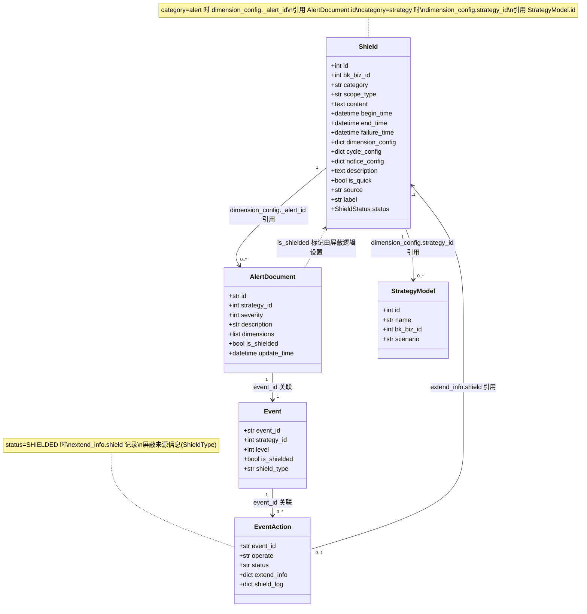

# 告警屏蔽模块 — 数据模型

**本文引用的文件**
- [bkmonitor/models/base.py](file://bkmonitor/bkmonitor/models/base.py) — Shield 模型定义
- [constants/shield.py](file://bkmonitor/constants/shield.py) — 常量定义
- [monitor_web/shield/serializers.py](file://bkmonitor/packages/monitor_web/shield/serializers.py) — 序列化器（dimension_config 结构参考）
- [monitor_web/shield/resources/backend_resources.py](file://bkmonitor/packages/monitor_web/shield/resources/backend_resources.py) — 后端资源（dimension_config 实际构造逻辑）
- [alarm_backends/core/cache/shield.py](file://bkmonitor/alarm_backends/core/cache/shield.py) — 缓存管理器（缓存结构参考）

## 目录

1. [Shield 模型字段定义](#shield-模型字段定义)
2. [dimension_config 五种类型结构](#dimension_config-五种类型结构)
3. [cycle_config 四种周期类型结构](#cycle_config-四种周期类型结构)
4. [notice_config 结构定义](#notice_config-结构定义)
5. [常量定义](#常量定义)
6. [模型关系图](#模型关系图)

## Shield 模型字段定义

Shield 是告警屏蔽模块的核心数据模型，继承自 `AbstractRecordModel`（提供 `create_time`、`update_time`、`create_user`、`update_user`、`is_enabled`、`is_deleted` 等审计字段）。对应数据库表 `alarm_shield`。

| 字段名 | 类型 | 说明 | 是否索引 |
|--------|------|------|----------|
| `id` | AutoField (继承自 Model) | 主键 | 是（PK） |
| `bk_biz_id` | IntegerField | 业务ID，默认0 | 是（db_index + index_together） |
| `category` | CharField(32) | 屏蔽类型，choices=SHIELD_CATEGORY | 否 |
| `scope_type` | CharField(32) | 屏蔽范围类型，choices=SCOPE_TYPE | 否 |
| `content` | TextField | 屏蔽内容快照（用于列表展示） | 否 |
| `begin_time` | DateTimeField | 屏蔽开始时间 | 否（index_together） |
| `end_time` | DateTimeField | 屏蔽结束时间 | 否 |
| `failure_time` | DateTimeField | 屏蔽失效时间（解除时更新为当前时间） | 否 |
| `dimension_config` | JsonField | 屏蔽维度配置（JSON，结构因 category 而异） | 否 |
| `cycle_config` | JsonField | 屏蔽周期配置（JSON） | 否 |
| `notice_config` | JsonField | 通知配置（JSON） | 否 |
| `description` | TextField | 屏蔽原因 | 否 |
| `is_quick` | BooleanField | 是否快捷屏蔽，默认False | 否 |
| `source` | CharField(32) | 来源系统，默认当前app code | 否（index_together） |
| `label` | CharField(255) | 标签，默认空字符串 | 是（db_index） |
| `create_time` | DateTimeField (继承) | 创建时间 | 否 |
| `update_time` | DateTimeField (继承) | 更新时间 | 否 |
| `create_user` | CharField (继承) | 创建人 | 否 |
| `update_user` | CharField (继承) | 更新人 | 否 |
| `is_enabled` | BooleanField (继承) | 是否启用，默认True | 否 |
| `is_deleted` | BooleanField (继承) | 是否软删除，默认False | 否 |

**联合索引**：
- `index_together = (("bk_biz_id", "source"), ("begin_time", "bk_biz_id"))`

**计算属性**：
- `status`：根据 `is_enabled`、`end_time` 与当前时间比较，返回 `ShieldStatus.SHIELDED`（屏蔽中）、`ShieldStatus.EXPIRED`（已过期）、`ShieldStatus.REMOVED`（被解除）

章节来源：[Shield 模型定义](file://bkmonitor/bkmonitor/models/base.py#L780-L826)

## dimension_config 五种类型结构

`dimension_config` 是 JSON 字段，其结构根据 `category` 不同有五种形态。以下结构基于序列化器定义和后端资源中的实际构造逻辑。

### scope（范围屏蔽）

```json
{
    "service_instance_id": [1, 2, 3],
    "bk_target_ip": [
        {"bk_target_ip": "127.0.0.1", "bk_target_cloud_id": 0}
    ],
    "bk_topo_node": [
        {"bk_obj_id": "set", "bk_inst_id": 1}
    ],
    "dynamic_group": ["group_1", "group_2"],
    "metric_id": ["metric_a", "metric_b"]
}
```

根据 `scope_type` 取值，dimension_config 中只包含对应的键。各 scope_type 到键名的映射：

| scope_type | dimension_config 键名 | 说明 |
|------------|----------------------|------|
| `instance` | `service_instance_id` | 服务实例ID列表 |
| `ip` | `bk_target_ip` | 主机IP列表（含云区域） |
| `node` | `bk_topo_node` | 拓扑节点列表 |
| `biz` | （无额外键） | 整业务屏蔽 |
| `dynamic_group` | `dynamic_group` | 动态分组ID列表 |

`metric_id` 为可选字段，用于限定屏蔽的指标范围。

章节来源：[ScopeSerializer + handle_scope](file://bkmonitor/packages/monitor_web/shield/serializers.py#L44-L52)、[handle_scope 方法](file://bkmonitor/packages/monitor_web/shield/resources/backend_resources.py#L172-L191)

### strategy（策略屏蔽）

```json
{
    "strategy_id": [101, 102],
    "level": [1, 2, 3],
    "dimension_conditions": [
        {
            "key": "bk_target_ip",
            "value": ["127.0.0.1"],
            "method": "eq",
            "condition": "and",
            "name": "IP"
        }
    ],
    "service_instance_id": [1, 2],
    "bk_target_ip": [{"bk_target_ip": "127.0.0.1", "bk_target_cloud_id": 0}],
    "bk_topo_node": [{"bk_obj_id": "set", "bk_inst_id": 1}],
    "dynamic_group": ["group_1"]
}
```

`strategy_id` 为策略ID列表，`level` 为告警级别列表（默认 `[1, 2, 3]` 即致命/预警/提醒），`dimension_conditions` 为维度条件列表（可选）。若传入了 `target`，会同时追加 scope 维度键（同 scope 类型逻辑）。

章节来源：[StrategySerializer](file://bkmonitor/packages/monitor_web/shield/serializers.py#L55-L78)、[handle_strategy 方法](file://bkmonitor/packages/monitor_web/shield/resources/backend_resources.py#L193-L213)

### event（事件屏蔽）

> 注意：在 `AddShieldResource.perform_request` 中，`category == "event"` 会被转换为 `"alert"` 存储。因此数据库中实际不存在 `category == "event"` 的记录，事件屏蔽统一以 alert 类型存储。

原始序列化器定义的结构：

```json
{
    "id": "event_id_string"
}
```

`id` 为事件ID字符串。

章节来源：[EventSerializer](file://bkmonitor/packages/monitor_web/shield/serializers.py#L81-L86)、[category 转换逻辑](file://bkmonitor/packages/monitor_web/shield/resources/backend_resources.py#L236)

### alert（告警屏蔽）

```json
{
    "_alert_id": "alert_id_string",
    "strategy_id": 101,
    "_severity": 2,
    "_alert_message": "告警描述文本",
    "_dimensions": "key1=val1,key2=val2",
    "dimension_key_1": "value1",
    "dimension_key_2": "value2"
}
```

以 `_` 开头的键为元数据，不参与屏蔽匹配逻辑。实际参与匹配的是告警维度键值对（从 `AlertDocument.dimensions` 提取）。批量告警屏蔽（`BulkAddAlertShieldResource`）支持通过 `bk_topo_node` 转为 scope 类型屏蔽。

章节来源：[AlertSerializer](file://bkmonitor/packages/monitor_web/shield/serializers.py#L89-L104)、[handle_alert 方法](file://bkmonitor/packages/monitor_web/shield/resources/backend_resources.py#L215-L234)

### dimension（维度屏蔽）

```json
{
    "_strategy_id": 101,
    "dimension_conditions": [
        {
            "key": "bk_target_ip",
            "value": ["127.0.0.1"],
            "method": "eq",
            "condition": "and",
            "name": "IP"
        }
    ]
}
```

`_strategy_id` 为关联策略ID（可选，存储时从 `strategy_id` 改名为 `_strategy_id`），`dimension_conditions` 为维度条件列表。

章节来源：[DimensionSerializer](file://bkmonitor/packages/monitor_web/shield/serializers.py#L107-L119)、[handle_dimension 方法](file://bkmonitor/packages/monitor_web/shield/resources/backend_resources.py#L236-L240)

## cycle_config 四种周期类型结构

`cycle_config` 是 JSON 字段，通过 `type` 字段区分四种周期类型。对应常量定义在 `ShieldCycleType`。

### ONCE（一次，type=1）

```json
{
    "type": 1,
    "begin_time": "",
    "end_time": "",
    "day_list": [],
    "week_list": []
}
```

单次屏蔽，使用 Shield 记录的 `begin_time` / `end_time` 作为起止时间，`cycle_config` 内的时间字段为空。

章节来源：[CycleConfigSlz](file://bkmonitor/packages/monitor_web/shield/serializers.py#L19-L25)、[ShieldCycleType.ONCE](file://bkmonitor/constants/shield.py#L57)

### EVERYDAY（每天，type=2）

```json
{
    "type": 2,
    "begin_time": "09:00:00",
    "end_time": "18:00:00",
    "day_list": [],
    "week_list": []
}
```

每天在 `begin_time` ~ `end_time` 时间段内屏蔽。时间格式为 `HH:MM:SS`。

章节来源：[CycleConfigSlz](file://bkmonitor/packages/monitor_web/shield/serializers.py#L19-L25)、[ShieldCycleType.EVERYDAY](file://bkmonitor/constants/shield.py#L58)

### EVERY_WEEK（每周，type=3）

```json
{
    "type": 3,
    "begin_time": "09:00:00",
    "end_time": "18:00:00",
    "day_list": [],
    "week_list": [1, 2, 3, 4, 5]
}
```

`week_list` 指定星期几（1=周一，7=周日），在指定星期的 `begin_time` ~ `end_time` 时间段内屏蔽。

章节来源：[CycleConfigSlz](file://bkmonitor/packages/monitor_web/shield/serializers.py#L19-L25)、[ShieldCycleType.EVERY_WEEK](file://bkmonitor/constants/shield.py#L59)

### EVERY_MONTH（每月，type=4）

```json
{
    "type": 4,
    "begin_time": "09:00:00",
    "end_time": "18:00:00",
    "day_list": [1, 15],
    "week_list": []
}
```

`day_list` 指定每月几号，在指定日期的 `begin_time` ~ `end_time` 时间段内屏蔽。

章节来源：[CycleConfigSlz](file://bkmonitor/packages/monitor_web/shield/serializers.py#L19-L25)、[ShieldCycleType.EVERY_MONTH](file://bkmonitor/constants/shield.py#L60)

## notice_config 结构定义

`notice_config` 是 JSON 字段，当 `shield_notice=True` 时填写。结构由 `NoticeConfigSlz` 定义：

```json
{
    "notice_way": ["mail", "phone"],
    "notice_receiver": ["user#admin", "group#bk_biz_developer"],
    "notice_time": 5
}
```

| 字段 | 类型 | 说明 |
|------|------|------|
| `notice_way` | ListField | 通知方式列表（如 `mail`、`phone`、`wechat` 等） |
| `notice_receiver` | ListField | 通知接收人列表，格式为 `{type}#{id}`（如 `user#admin`、`group#bk_biz_developer`） |
| `notice_time` | IntegerField | 通知时间（分钟），默认5 |

> 存储到数据库时，`notice_receiver` 中的对象会被转换为 `{type}#{id}` 格式字符串。读取展示时（`FrontendShieldDetailResource`）再拆解回 `{id, type}` 对象。

章节来源：[NoticeConfigSlz](file://bkmonitor/packages/monitor_web/shield/serializers.py#L27-L31)、[notice_receiver 格式化](file://bkmonitor/packages/monitor_web/shield/resources/backend_resources.py#L248-L251)

## 常量定义

### ShieldCategory（屏蔽类型）

| 常量 | 值 | 中文名 | 说明 |
|------|----|--------|------|
| `SCOPE` | `"scope"` | 范围屏蔽 | 按范围（实例/IP/节点/业务/动态分组）屏蔽 |
| `STRATEGY` | `"strategy"` | 策略屏蔽 | 按策略屏蔽，可指定级别和维度条件 |
| `EVENT` | `"event"` | 事件屏蔽 | 事件级别屏蔽（存储时转为 alert） |
| `ALERT` | `"alert"` | 告警屏蔽 | 告警级别屏蔽 |
| `DIMENSION` | `"dimension"` | 维度屏蔽 | 按维度条件屏蔽 |

`CHOICES = [SCOPE, STRATEGY, EVENT, ALERT, DIMENSION]`

章节来源：[ShieldCategory](file://bkmonitor/constants/shield.py#L42-L50)

### ShieldStatus（屏蔽状态）

| 常量 | 值 | 中文名 | 说明 |
|------|----|--------|------|
| `SHIELDED` | `1` | 屏蔽中 | 启用且未过期 |
| `EXPIRED` | `2` | 已过期 | 超过 end_time |
| `REMOVED` | `3` | 被解除 | is_enabled=False |

章节来源：[ShieldStatus](file://bkmonitor/constants/shield.py#L28-L33)

### ShieldCycleType（周期类型）

| 常量 | 值 | 说明 |
|------|----|------|
| `ONCE` | `1` | 一次 |
| `EVERYDAY` | `2` | 每天 |
| `EVERY_WEEK` | `3` | 每周 |
| `EVERY_MONTH` | `4` | 每月 |

章节来源：[ShieldCycleType](file://bkmonitor/constants/shield.py#L55-L60)

### ScopeType（范围类型）

| 常量 | 值 | 中文名 |
|------|----|--------|
| `INSTANCE` | `"instance"` | 服务实例 |
| `IP` | `"ip"` | 主机 |
| `NODE` | `"node"` | 节点 |
| `BIZ` | `"biz"` | 业务 |
| `DYNAMIC_GROUP` | `"dynamic_group"` | 动态分组 |

章节来源：[ScopeType](file://bkmonitor/constants/shield.py#L16-L22)

### ShieldType（屏蔽来源类型）

| 常量 | 值 | 说明 |
|------|----|------|
| `SAAS_CONFIG` | `"saas_config"` | SaaS 配置屏蔽（来自监控平台 UI） |
| `HOST_STATUS` | `"host_status"` | 主机状态屏蔽 |
| `HOST_TARGET` | `"host_target"` | 主机目标屏蔽 |
| `ALARM_TIME` | `"alarm_time"` | 告警时间屏蔽 |

> ShieldType 用于 `EventAction.shield_log` 中区分屏蔽来源，与 Shield 模型的 `category` 字段不同维度。

章节来源：[ShieldType](file://bkmonitor/constants/shield.py#L63-L67)

## 模型关系图



图表来源：[模型定义与引用关系](file://bkmonitor/bkmonitor/models/base.py#L780-L826)、[AlertDocument 引用](file://bkmonitor/packages/monitor_web/shield/resources/backend_resources.py#L215-L234)、[EventAction.shield_log](file://bkmonitor/bkmonitor/models/base.py#L520-L538)

## 结论

Shield 模型通过 `category` 字段区分五种屏蔽类型，每种类型对应不同的 `dimension_config` 结构。`dimension_config` 中以 `_` 开头的字段（如 `_alert_id`、`_severity`、`_dimensions`）为元数据，不参与屏蔽匹配逻辑，仅用于展示和关联。

模型与 `AlertDocument`、`StrategyModel` 的关系是**逻辑引用**而非外键关联——通过 JSON 字段中的 ID 进行关联。屏蔽状态由 `is_enabled`、`begin_time`、`end_time` 三个字段动态计算，不单独存储。`event` 类型的屏蔽在写入时会被转换为 `alert` 类型，数据库中不保留 `event` 类别。
