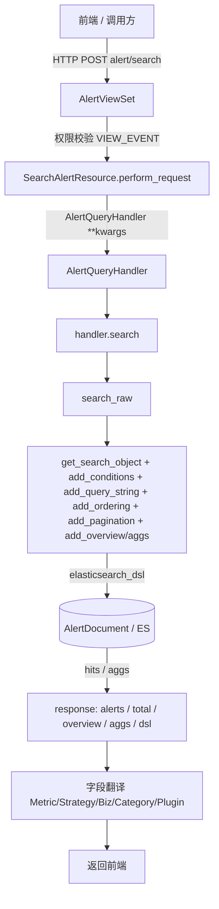

# 架构：告警查询专家 / fta_web.alert

**本文引用的文件**
- [路由](file://bkmonitor/packages/fta_web/alert/urls.py)
- [视图](file://bkmonitor/packages/fta_web/alert/views.py)
- [资源](file://bkmonitor/packages/fta_web/alert/resources.py)
- [序列化器](file://bkmonitor/packages/fta_web/alert/serializers.py)
- [告警查询处理器](file://bkmonitor/packages/fta_web/alert/handlers/alert.py)
- [查询基类](file://bkmonitor/packages/fta_web/alert/handlers/base.py)
- [翻译器](file://bkmonitor/packages/fta_web/alert/handlers/translator.py)

## 目录
1. [简介](#简介)
2. [项目结构](#项目结构)
3. [核心组件](#核心组件)
4. [架构总览](#架构总览)
5. [组件详细分析](#组件详细分析)
6. [依赖关系分析](#依赖关系分析)
7. [结论](#结论)

## 简介
`fta_web.alert` 是告警域后端包，对外暴露 30+ 接口（告警 / 事件 / 处理记录 / 反馈 / 指标推荐等）。本专家聚焦其中的**查询（读）路径**：告警列表、趋势、TopN、导出、关联事件等，全部以 ES 文档 `AlertDocument` 为数据源，经统一的 `Resource → Handler → ES` 三层结构完成。

章节来源：[views.py](file://bkmonitor/packages/fta_web/alert/views.py#L29-L229)

## 项目结构
```
fta_web/alert/
├── urls.py            # ResourceRouter 注册，挂载 AlertViewSet / QuickAlertHandleViewSet / SearchFavoriteViewSet
├── views.py           # AlertViewSet：resource_routes 声明所有对外端点 + 权限钩子
├── serializers.py     # AlertSearchSerializer 等请求契约；space_uids→bk_biz_ids 转换
├── resources.py       # 各 Resource 实现（SearchAlertResource / ExportAlertResource / AlertTopNResource ...）
├── utils.py           # 工具函数
└── handlers/          # 查询/处理核心逻辑
    ├── base.py        # BaseQueryHandler / BaseBizQueryHandler：查询对象构建、条件/排序/分页/聚合/全文本
    ├── alert.py       # AlertQueryHandler：告警查询；EventQueryHandler 等
    ├── action.py      # 处理记录查询
    ├── event.py       # 事件查询
    ├── translator.py  # 字段翻译（指标/策略/业务/分类/插件名）
    ├── fulltext.py    # 全字段模糊检索（白名单）
    ├── incident.py / alert_log.py / action.py / alert.py
    └── __init__.py
```
章节来源：[目录](file://bkmonitor/packages/fta_web/alert)

## 核心组件
| 组件 | 位置 | 职责 |
|------|------|------|
| `AlertViewSet` | [views.py](file://bkmonitor/packages/fta_web/alert/views.py#L29-L229) | 端点路由 + 权限（VIEW_EVENT / 负责人可见性） |
| `SearchAlertResource` | [resources.py](file://bkmonitor/packages/fta_web/alert/resources.py#L1552-L1591) | 告警列表入口，构造 `AlertQueryHandler` 并 `search()` |
| `AlertQueryHandler` | [alert.py](file://bkmonitor/packages/fta_web/alert/handlers/alert.py#L604-L829) | 告警查询核心：时间切片、状态语义、合并告警展开、字段翻译 |
| `BaseBizQueryHandler` | [base.py](file://bkmonitor/packages/fta_web/alert/handlers/base.py#L810-L900) | 业务鉴权（`bk_biz_ids=-1` 展开、`authorized_bizs`）、`add_biz_condition` |
| `BaseQueryHandler` | [base.py](file://bkmonitor/packages/fta_web/alert/handlers/base.py#L309-L607) | 查询对象构建：`add_conditions` / `add_query_string` / `add_ordering` / `add_pagination` / 聚合 |
| `AlertQueryTransformer` | [alert.py](file://bkmonitor/packages/fta_web/alert/handlers/alert.py#L609) | `query_string` / `conditions` 字段名 → ES 字段映射与语法转换 |

章节来源：[resources.py](file://bkmonitor/packages/fta_web/alert/resources.py#L1552-L1591)

## 架构总览

图表来源：[resources.py](file://bkmonitor/packages/fta_web/alert/resources.py#L1552-L1591)、[alert.py](file://bkmonitor/packages/fta_web/alert/handlers/alert.py#L792-L829)

## 组件详细分析

### AlertQueryHandler（告警查询核心）
- 设计要点：继承 `BaseBizQueryHandler`，通过 `query_transformer = AlertQueryTransformer` 将前端字段名映射为 ES 字段；`FULLTEXT_SEARCH_FIELDS` 定义全字段模糊检索白名单（id / alert_name / event.description / labels / appointee / follower / event.bk_biz_id）。
- 关键流程：`__init__` 默认排序 `["status", "-create_time", "-seq_id"]`，并调用 `_expand_merged_issue_conditions()` 在构造期原地改写 `issue_id` 过滤条件（见下）。
- 错误处理：`search()` 对 `search_raw()` 整体 try/except，异常时返回空响应并在 `exc.data` 附带已收集结果后重新抛出（fail-open 思路，避免整页 500）。
章节来源：[alert.py](file://bkmonitor/packages/fta_web/alert/handlers/alert.py#L604-L700)

### 合并告警（Issue Merge）展开
- 设计要点：按 `issue_id` 过滤时，把查询值扩展为「主 Issue + 全部 active member」，使被并入 Issue 的告警在列表 / 趋势 / TopN 中聚合展示。
- 关键约束：必须用 `self.authorized_bizs`（已解析 `-1`）而非原始 `bk_biz_ids` 查 `IssueMergeRelation`，否则全业务场景漏掉成员；关系层异常时 fail-open 保持原条件。
章节来源：[alert.py](file://bkmonitor/packages/fta_web/alert/handlers/alert.py#L666-L700)

### 业务鉴权（BaseBizQueryHandler）
- 设计要点：`bk_biz_ids` 可能含 `-1`（"全部授权业务"哨兵），**禁止直接用于 ES terms 过滤**（不存在 `bk_biz_id=-1` 的数据会查空）。`parse_biz_item()` 将 `-1` 展开为用户实际授权业务集 `authorized_bizs`，`unauthorized_bizs` 用于负责人条件下的有限可见。
- 不变量：告警可见性统一走 `add_biz_condition`，而非裸 `bk_biz_ids`。
章节来源：[base.py](file://bkmonitor/packages/fta_web/alert/handlers/base.py#L810-L850)

## 依赖关系分析
- 内部依赖：`bkmonitor.documents.AlertDocument`（ES 文档定义）、`core.drf_resource`（Resource/路由）、`bkmonitor.iam`（权限）、`fta_web.alert.handlers.*`、`resource.space.get_bk_biz_ids_by_user`（业务鉴权）、`bkmonitor.issue_merge`（合并告警）。
- 外部依赖：`elasticsearch_dsl`（查询构建与执行）、`luqum`（query_string 解析）、`bkmonitor.utils.elasticsearch.handler.BaseTreeTransformer`（字段转换）。
- 被依赖：前端告警列表 / 趋势 / TopN 页面、其他模块经 `resource.alert.*` 复用。
章节来源：[base.py](file://bkmonitor/packages/fta_web/alert/handlers/base.py#L20-L54)、[alert.py](file://bkmonitor/packages/fta_web/alert/handlers/alert.py#L690-L700)

## 结论
- 告警查询是高度统一的 `Resource → Handler → ES` 三层结构，所有查询变体（列表 / 趋势 / TopN / 导出）共享 `BaseQueryHandler` 的查询构建管线。
- 两个易错点：**`bk_biz_ids=-1` 必须展开**、`issue_id` 过滤必须展开合并成员——二者处理不当都会导致"查不到/数量对不上"。
- 无 Django ORM 模型参与查询（数据在 ES），见 `06-测试.md` 的测试缺口说明。

## 专家导航与索引
- 契约层（黑盒使用，无需读实现）：[C0-使用总览.md](../C0-使用总览.md) · [C1-能力契约.md](../C1-能力契约.md) · [C2-使用流程.md](../C2-使用流程.md)
- 实现层切面：[02-实现.md](02-实现.md) · [03-数据流转.md](03-数据流转.md) · [05-接口.md](05-接口.md) · [06-测试.md](06-测试.md)

### 关键发现 / 主要风险
- `bk_biz_ids=-1` 必须展开，否则 ES 查空（`parse_biz_item` 在构造期完成）。
- `issue_id` 过滤须展开合并成员，否则合并告警遗漏（基于已解析的 `authorized_bizs`）。
- 查询异常 fail-open：ES 异常时 `search()` 返回空响应并 `exc.data` 携带部分结果后重抛。
- `track_total_hits=10000`：`total` 超 1 万不精确。
- 读路径无单测（见 `06-测试.md`），改动前应先补 P0 场景单测。

### 术语表
- **Issue Merge**：合并告警；`issue_id` 过滤时展开「主 + active members」。
- **FULLTEXT_SEARCH_FIELDS**：全字段模糊检索白名单（id / alert_name / event.description / labels / appointee / follower / event.bk_biz_id）。
- **authorized_bizs / unauthorized_bizs**：`bk_biz_ids` 经 `parse_biz_item` 展开后的授权 / 未授权业务集。

> 出处：重建日期 2026-07-27；实现层基于 git commit 310f13e 源码快照，章节来源行号见各篇。
