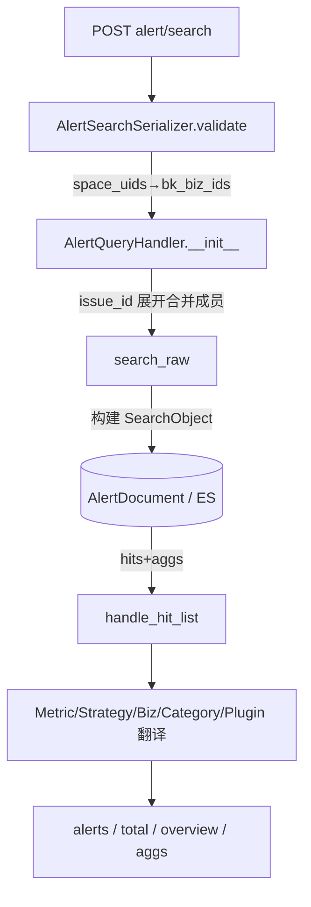

# 数据流转：告警查询专家 / fta_web.alert

**本文引用的文件**
- [资源](file://bkmonitor/packages/fta_web/alert/resources.py)
- [告警查询处理器](file://bkmonitor/packages/fta_web/alert/handlers/alert.py)
- [查询基类](file://bkmonitor/packages/fta_web/alert/handlers/base.py)
- [序列化器](file://bkmonitor/packages/fta_web/alert/serializers.py)
- [视图](file://bkmonitor/packages/fta_web/alert/views.py)

## 目录
1. [简介](#简介)
2. [数据生命周期](#数据生命周期)
3. [请求参数变换](#请求参数变换)
4. [响应结构](#响应结构)
5. [异步与分片](#异步与分片)
6. [结论](#结论)

## 简介
告警查询是一个**同步请求-响应**读路径：请求参数经序列化器校验/转换 → `AlertQueryHandler` 构建 ES 查询 → 执行 → 命中结果后处理（字段翻译）→ 返回。数据源头为 ES 中的 `AlertDocument`，无写路径、无消息队列。

章节来源：[resources.py](file://bkmonitor/packages/fta_web/alert/resources.py#L1552-L1591)

## 数据生命周期

图表来源：[serializers.py](file://bkmonitor/packages/fta_web/alert/serializers.py#L24-L140)、[alert.py](file://bkmonitor/packages/fta_web/alert/handlers/alert.py#L633-L829)

## 请求参数变换
- `space_uids → bk_biz_ids`：`BaseSearchSerializer.validate` 将空间 UID 转换为业务 ID 并去重合并（`serializers.py:36-57`）。
- `bk_biz_ids=-1`：`BaseBizQueryHandler.parse_biz_item` 在构造期展开为 `authorized_bizs`（用户实际授权业务集），不进入 ES 过滤原值（`base.py:833-850`）。
- `issue_id`：`_expand_merged_issue_conditions` 在 `__init__` 内原地改写 `self.conditions`，把单 Issue 展开为「主 + active members」（`alert.py:666-700`）。
- `ordering` / `conditions`：经 `AlertQueryTransformer` 将展示字段名映射为 ES 字段名（字段白名单、嵌套 KV、`assign_tags` 回退、值翻译、`action_id`/`converge_id` 改写详见 [02-实现.md「查询字符串翻译器」](02-实现.md#查询字符串翻译器alertquerytransformer)，`base.py:331-334`）。
章节来源：[serializers.py](file://bkmonitor/packages/fta_web/alert/serializers.py#L36-L57)、[base.py](file://bkmonitor/packages/fta_web/alert/handlers/base.py#L833-L850)、[alert.py](file://bkmonitor/packages/fta_web/alert/handlers/alert.py#L666-L700)

## 响应结构
`SearchAlertResource` 返回 `handler.search()` 的结果，结构为：
- `alerts`：当前页命中（已翻译字段名）
- `total`：`search_result.hits.total.value`（`track_total_hits=10000` 上限）
- `overview`（当 `show_overview`）：`handle_overview` 汇总
- `aggs`（当 `show_aggs`）：`handle_aggs` 维度聚合
- `dsl`（当 `show_dsl`）：`search_object.to_dict()`，用于调试

异常时 `search()` 返回空响应并 `exc.data = result` 后重抛（`alert.py:792-827`）。
章节来源：[alert.py](file://bkmonitor/packages/fta_web/alert/handlers/alert.py#L792-L829)

## 异步与分片
- 趋势 `date_histogram`：同步执行 `search_object[:0].execute()` 仅取聚合，按 begin/end/init 三段时间桶分别计算（`alert.py:854-919`）。
- TopN：`AlertTopNResource` 在 `need_time_partition=True` 时将时间区间切片，经 `resource.alert.alert_top_n_result.bulk_request` 并行分片查询后合并（`resources.py:2165-2200`）。
- 导出：`ExportAlertResource` 用 `handler.export_with_docs()` 全量扫描（`scan()`），再补 `alert_related_info` 后交 `export_import.export_package` 打包（`resources.py:1750-1769`）。
章节来源：[alert.py](file://bkmonitor/packages/fta_web/alert/handlers/alert.py#L854-L919)、[resources.py](file://bkmonitor/packages/fta_web/alert/resources.py#L1750-L1769)、[resources.py](file://bkmonitor/packages/fta_web/alert/resources.py#L2165-L2200)

## 结论
- 数据为**单向同步流**（请求 → ES → 响应），无状态机、无异步落库，排查重点在「参数变换是否正确」与「ES 查询是否命中」。
- 三处易致数量偏差的变换：`bk_biz_ids=-1` 展开、`issue_id` 合并展开、时间切片交叠过滤——任一处理不当都会让 `total` 与预期不符。
- `track_total_hits=10000` 意味着超过 1 万的精确总数会被 ES 截断，超大业务量下 `total` 可能不精确。
