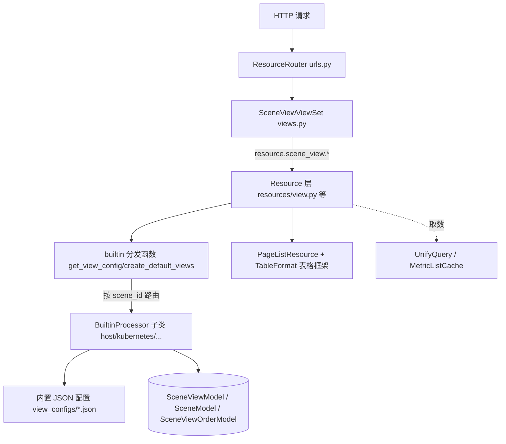

# 架构：场景视图专家 / monitor_web.scene_view

**本文引用的文件**
- [urls.py](file://bkmonitor/packages/monitor_web/scene_view/urls.py)
- [views.py](file://bkmonitor/packages/monitor_web/scene_view/views.py)
- [resources/__init__.py](file://bkmonitor/packages/monitor_web/scene_view/resources/__init__.py)
- [resources/view.py](file://bkmonitor/packages/monitor_web/scene_view/resources/view.py)
- [resources/base.py](file://bkmonitor/packages/monitor_web/scene_view/resources/base.py)
- [resources/host.py](file://bkmonitor/packages/monitor_web/scene_view/resources/host.py)
- [builtin/__init__.py](file://bkmonitor/packages/monitor_web/scene_view/builtin/__init__.py)
- [base.py](file://bkmonitor/packages/monitor_web/scene_view/base.py)
- [table_format.py](file://bkmonitor/packages/monitor_web/scene_view/table_format.py)
- [serializers.py](file://bkmonitor/packages/monitor_web/scene_view/serializers.py)
- [models/scene_view.py](file://bkmonitor/packages/monitor_web/models/scene_view.py)

## 目录
1. [简介](#简介)
2. [项目结构](#项目结构)
3. [核心组件](#核心组件)
4. [架构总览](#架构总览)
5. [组件详细分析](#组件详细分析)
6. [依赖关系分析](#依赖关系分析)
7. [契约层与实现层索引](#契约层与实现层索引)
8. [结论](#结论)

## 简介
`scene_view` 是蓝鲸监控主应用（monitor_web）的「场景视图」后端模块。它把监控页面抽象为「场景(scene) → 视图(view) → 面板(panel)」三级结构：场景是一类监控对象（如主机监控、Kubernetes 监控、服务拨测），视图是场景下的一个页签（overview 概览 / detail 详情），面板是视图内的单个图表。模块对外通过一个 `ResourceViewSet` 暴露 76 条路由，向内依据内置场景处理器（`BuiltinProcessor`）把「数据库视图行 + 内置 JSON 配置」合并渲染成前端可用的视图配置。
章节来源：[views.py](file://bkmonitor/packages/monitor_web/scene_view/views.py#L27-L299) · [builtin/__init__.py](file://bkmonitor/packages/monitor_web/scene_view/builtin/__init__.py#L20-L55)

## 项目结构
```
bkmonitor/packages/monitor_web/scene_view/
├── urls.py            # ResourceRouter.register_module(views) 注册全部路由
├── views.py           # SceneViewViewSet：76 条 ResourceRoute（读写接口入口）
├── serializers.py     # SceneViewSerializer / DataSourceSerializer 等序列化契约
├── base.py            # Panel 数据类（面板输出结构 to_dict）
├── table_format.py    # TableFormat 列格式化体系（15+ 子类）
├── tasks.py           # （空占位，无异步任务）
├── resources/         # Resource 实现层（perform_request 业务逻辑）
│   ├── __init__.py    #   星号导出所有 Resource 类
│   ├── view.py        #   场景/视图 CRUD 核心：GetScene* / UpdateSceneView 等
│   ├── base.py        #   PageListResource 表格资源基类
│   ├── host.py        #   主机场景接口（进程列表/端口状态/拓扑详情 + 4 个拆分接口）
│   ├── kubernetes.py / custom_metric.py / custom_event.py / log.py
│   ├── observation_scene.py / uptime_check.py / serializers.py
├── builtin/           # 内置场景处理器层（BuiltinProcessor 子类）
│   ├── __init__.py    #   BuiltinProcessor 抽象基类 + NormalProcessorMixin + 分发函数
│   ├── host.py / kubernetes.py / uptime_check.py / apm.py / alert.py
│   ├── collect.py / custom_metric.py / custom_metric_v2.py / custom_event.py
│   ├── observation_scene.py / utils.py
│   ├── view_configs/  #   *.json 内置视图骨架配置（47 个）
│   └── constants/     #   apm_host.py / kubernetes.py 常量
```
各子模块职责：`views.py` 为路由入口；`resources/` 承载业务逻辑；`builtin/` 承载各场景差异化的视图生成策略；`view_configs/*.json` 是内置视图的静态骨架；`table_format.py` 提供列表类接口的通用列格式化框架。
章节来源：[urls.py](file://bkmonitor/packages/monitor_web/scene_view/urls.py#L13-L21) · [builtin/__init__.py](file://bkmonitor/packages/monitor_web/scene_view/builtin/__init__.py#L29-L55)

## 核心组件
| 组件 | 位置 | 职责 |
|---|---|---|
| `SceneViewViewSet` | [views.py](file://bkmonitor/packages/monitor_web/scene_view/views.py#L27-L299) | 路由聚合，把 endpoint 绑定到 `resource.scene_view.*` 与 4 个拆分 Resource 类 |
| `BuiltinProcessor`（抽象基类） | [builtin/__init__.py](file://bkmonitor/packages/monitor_web/scene_view/builtin/__init__.py#L58-L162) | 定义场景处理器契约：4 个抽象方法 + 钩子方法 |
| `NormalProcessorMixin` | [builtin/__init__.py](file://bkmonitor/packages/monitor_web/scene_view/builtin/__init__.py#L165-L217) | 提供「从 JSON 文件名加载内置视图 + 差异同步」的默认实现 |
| 分发函数 | [builtin/__init__.py](file://bkmonitor/packages/monitor_web/scene_view/builtin/__init__.py#L220-L324) | `get_view_config`/`create_default_views`/`is_builtin_scene` 等按 scene_id 路由 |
| `PageListResource` | [resources/base.py](file://bkmonitor/packages/monitor_web/scene_view/resources/base.py#L23-L243) | 列表类接口的分页/排序/筛选/格式化流水线 |
| `TableFormat` / `DefaultTableFormat` | [table_format.py](file://bkmonitor/packages/monitor_web/scene_view/table_format.py#L22-L680) | 单列格式化、排序键、筛选键定义（15+ 子类） |
| `Panel` | [base.py](file://bkmonitor/packages/monitor_web/scene_view/base.py#L14-L53) | 面板输出结构（`to_dict` → id/title/targets/options/grid_pos） |
章节来源：[views.py](file://bkmonitor/packages/monitor_web/scene_view/views.py#L27-L299) · [builtin/__init__.py](file://bkmonitor/packages/monitor_web/scene_view/builtin/__init__.py#L58-L217)

## 架构总览

图表来源：[views.py](file://bkmonitor/packages/monitor_web/scene_view/views.py#L33-L299) · [builtin/__init__.py](file://bkmonitor/packages/monitor_web/scene_view/builtin/__init__.py#L220-L324)

## 组件详细分析
### SceneViewViewSet（路由聚合）
- 设计要点：所有 endpoint 集中在 `resource_routes` 列表；权限统一为 `BusinessActionPermission([ActionEnum.VIEW_BUSINESS])`（读写方法均相同）。
- 关键流程：多数路由指向 `resource.scene_view.*`（由 `resources/__init__.py` 星号导出后自动注册）；主机场景 4 个拆分接口直接绑定 Resource 类（`GetHostViewsPanelsResource` 等）。
- 风险控制：`get_custom_ts_metric_groups` 用 `gzip_page` 装饰器压缩大响应。
章节来源：[views.py](file://bkmonitor/packages/monitor_web/scene_view/views.py#L27-L299)

### BuiltinProcessor 契约与 NormalProcessorMixin
- 设计要点：模板方法模式。抽象基类声明 4 个 `abstractmethod`（`create_default_views`/`create_or_update_view`/`get_view_config`/`is_builtin_scene`）与若干可选钩子（`handle_view_config`/`is_custom_view_list`/`is_custom_sort`）。
- 关键流程：`NormalProcessorMixin.create_default_views` 以 `filenames` 声明的 JSON 骨架为准，对 DB 做「差集补建（bulk_create）+ 差集删除」的双向同步，保证 DB 视图集合与内置配置一致。
- 错误处理：所有分发函数在无匹配 Processor 时 `raise TypeError("not scene processor")`。
章节来源：[builtin/__init__.py](file://bkmonitor/packages/monitor_web/scene_view/builtin/__init__.py#L58-L324)

### PageListResource 表格框架
- 设计要点：把列表接口的通用处理拆成可组合步骤——`handle_filter`→`handle_sort`→`handle_pagination`→`handle_format`，由 `get_pagination_data` 编排。
- 关键流程：排序用 `cmp_to_key` 支持多字段、反向、None 兜底；筛选支持关键字模糊与 `filter_dict` 精确匹配；列元信息由 `TableFormat.column()` 输出。
- 风险控制：`get_response_columns` 遍历全量数据构造筛选项（`filterable` 列），数据量大时是 O(N×列数) 热点。
章节来源：[resources/base.py](file://bkmonitor/packages/monitor_web/scene_view/resources/base.py#L56-L243) · [table_format.py](file://bkmonitor/packages/monitor_web/scene_view/table_format.py#L22-L680)

## 依赖关系分析
- **内部依赖**：
  - `bkmonitor.data_source.UnifyQuery`/`load_data_source`（面板取数）
  - `bkmonitor.models.MetricListCache`（指标元信息）
  - `monitor_web.models.scene_view`（DB 模型）
  - `core.drf_resource`（Resource/ViewSet 框架）
  - `bkmonitor.iam`（权限）
  - `apm_web.constants`（APM 常量）
  - `bkmonitor.share.api_auth_resource.ApiAuthResource`
  - `bkmonitor.utils.tenant`（租户 ID 转换）
  - `monitor_web.strategies.metric_cache.process_dimensions`（进程维度扩展）
- **被依赖**：`urls.py` 经 `ResourceRouter.register_module(views)` 注册进主应用路由；`builtin/host.py` 等子处理器依赖 `builtin/__init__.py` 的 `BuiltinProcessor` 基类。
章节来源：[resources/view.py](file://bkmonitor/packages/monitor_web/scene_view/resources/view.py#L11-L45) · [builtin/host.py](file://bkmonitor/packages/monitor_web/scene_view/builtin/host.py#L15-L21) · [urls.py](file://bkmonitor/packages/monitor_web/scene_view/urls.py#L13-L21)

## 契约层与实现层索引
- **契约层**（黑盒使用文档，根目录）：
  - [C0-使用总览.md](../C0-使用总览.md) — 能力清单 + 边界 + 已知问题
  - [C1-能力契约.md](../C1-能力契约.md) — 类/方法契约 + 真实代码示例
  - [C2-使用流程.md](../C2-使用流程.md) — 业务目标调用路径 + 真实代码示例
- **实现层**（白盒导航文档，本目录）：
  - [01-架构.md](./01-架构.md) — 本文件
  - [02-实现.md](./02-实现.md) — 核心流程、设计模式、关键类
  - [03-数据流转.md](./03-数据流转.md) — 数据生命周期、状态流转
  - [04-模型.md](./04-模型.md) — 数据模型、DB schema、序列化契约

## 结论
模块采用清晰的三层结构：ViewSet 路由聚合 → Resource 业务逻辑 → BuiltinProcessor 场景策略，配合静态 JSON 骨架实现「配置驱动 + 差异化处理」。核心扩展点是 `BuiltinProcessor` 抽象契约与 `get_builtin_processors` 注册列表；新增场景只需实现子类并加入注册表。主要复杂度集中在 `builtin/` 各子处理器的 `get_view_config` 与 `view_configs/*.json` 的组织，以及 `PageListResource` 的表格流水线。主要风险在默认视图的删除同步逻辑与 JSON 无缓存的重复 IO。
