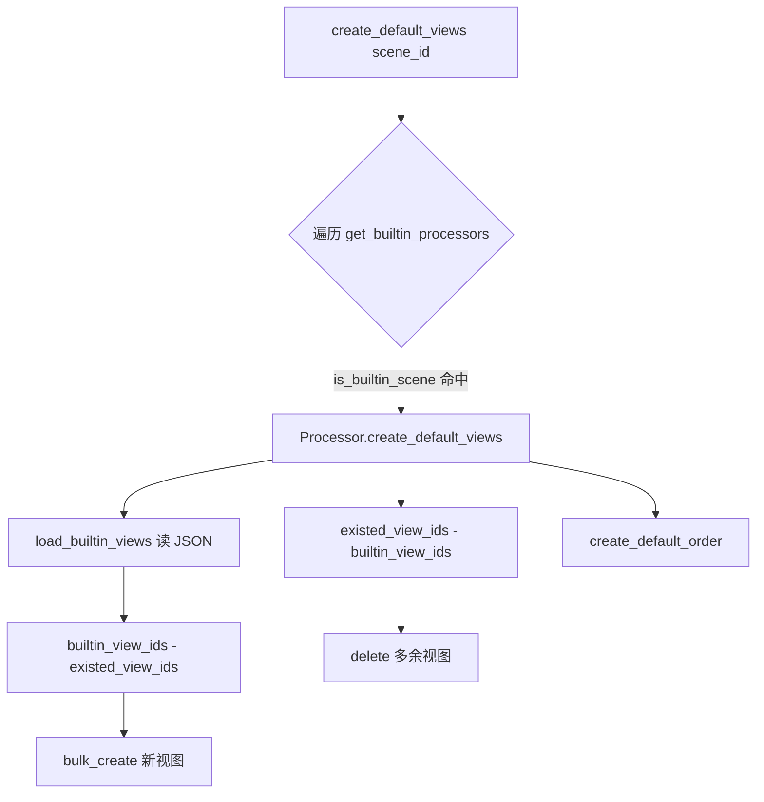

# 实现：场景视图专家 / monitor_web.scene_view

**本文引用的文件**
- [resources/view.py](file://bkmonitor/packages/monitor_web/scene_view/resources/view.py)
- [resources/base.py](file://bkmonitor/packages/monitor_web/scene_view/resources/base.py)
- [resources/host.py](file://bkmonitor/packages/monitor_web/scene_view/resources/host.py)
- [builtin/__init__.py](file://bkmonitor/packages/monitor_web/scene_view/builtin/__init__.py)
- [table_format.py](file://bkmonitor/packages/monitor_web/scene_view/table_format.py)
- [views.py](file://bkmonitor/packages/monitor_web/scene_view/views.py)
- [base.py](file://bkmonitor/packages/monitor_web/scene_view/base.py)

## 目录
1. [简介](#简介)
2. [核心流程](#核心流程)
3. [设计模式](#设计模式)
4. [关键类与函数](#关键类与函数)
5. [热点路径](#热点路径)
6. [技术债](#技术债)
7. [结论](#结论)

## 简介
实现层围绕两条主线：一是「场景/视图配置的读写」，由 `resources/view.py` 的 Resource + `builtin/` 的 Processor 协作完成；二是「列表类接口的通用处理」，由 `table_format.py` 的 `PageListResource` 提供分页/排序/筛选/格式化流水线。两者通过 `SceneViewViewSet` 统一暴露。
章节来源：[views.py](file://bkmonitor/packages/monitor_web/scene_view/views.py#L27-L299)

## 核心流程

`get_view_config(view, params)` 同样遍历 `get_builtin_processors()`，命中 `is_builtin_scene(view.scene_id)` 的第一个 Processor，调用其 `get_view_config`（先 `convert_custom_params` 转参），未命中则 `raise TypeError`。
图表来源：[builtin/__init__.py](file://bkmonitor/packages/monitor_web/scene_view/builtin/__init__.py#L177-L232)

## 设计模式
| 模式 | 位置 | 用途 |
|---|---|---|
| 模板方法 | [builtin/__init__.py](file://bkmonitor/packages/monitor_web/scene_view/builtin/__init__.py#L58-L217) | `BuiltinProcessor` 定契约，`NormalProcessorMixin` 给默认实现 |
| 注册表 + 分发 | [builtin/__init__.py](file://bkmonitor/packages/monitor_web/scene_view/builtin/__init__.py#L29-L55) | `get_builtin_processors()` 列表 + `BUILTIN_SCENES` 字典，按 scene_id 路由 |
| 流水线/责任链 | [resources/base.py](file://bkmonitor/packages/monitor_web/scene_view/resources/base.py#L227-L243) | `get_pagination_data`：筛选→排序→分页→格式化 |
| 策略（列格式化） | [table_format.py](file://bkmonitor/packages/monitor_web/scene_view/table_format.py#L22-L680) | 每种 `TableFormat` 子类定义自己的 `format`/`get_sort_key`/`get_filter_key` |
| 数据类 | [base.py](file://bkmonitor/packages/monitor_web/scene_view/base.py#L14-L53) | `Panel` 封装面板输出结构 |
| 并发线程池 | [resources/host.py](file://bkmonitor/packages/monitor_web/scene_view/resources/host.py#L410-L470) | `GetHostProcessListResource` 用 `ThreadPool` 并发 4 次 TSDB 查询 |

章节来源：[builtin/__init__.py](file://bkmonitor/packages/monitor_web/scene_view/builtin/__init__.py#L29-L217)

## 关键类与函数
| 名称 | 路径 | 职责 |
|---|---|---|
| `get_builtin_processors()` | [builtin/__init__.py](file://bkmonitor/packages/monitor_web/scene_view/builtin/__init__.py#L29-L55) | 返回全部 Processor 类（含顺序，先命中先用） |
| `NormalProcessorMixin.create_default_views()` | [builtin/__init__.py](file://bkmonitor/packages/monitor_web/scene_view/builtin/__init__.py#L177-L212) | JSON 骨架 ↔ DB 差异双向同步 |
| `get_view_config()`（模块函数） | [builtin/__init__.py](file://bkmonitor/packages/monitor_web/scene_view/builtin/__init__.py#L220-L232) | 按 scene_id 分发生成视图配置 |
| `GetSceneViewListResource.get_panel_count()` | [resources/view.py](file://bkmonitor/packages/monitor_web/scene_view/resources/view.py#L100-L112) | 递归统计面板数（row 类型下钻、排除 tag-chart） |
| `validate_scene_type()` | [resources/view.py](file://bkmonitor/packages/monitor_web/scene_view/resources/view.py#L49-L54) | apm/kubernetes/alert 场景忽略 `type` |
| `PageListResource.sort()` | [resources/base.py](file://bkmonitor/packages/monitor_web/scene_view/resources/base.py#L56-L112) | 多字段/反向/None 兜底排序 |
| `PageListResource.get_pagination_data()` | [resources/base.py](file://bkmonitor/packages/monitor_web/scene_view/resources/base.py#L227-L243) | 列表处理主编排 |
| `GetHostProcessListResource` | [resources/host.py](file://bkmonitor/packages/monitor_web/scene_view/resources/host.py#L370-L470) | 进程列表聚合（CMDB + 4 路并发 TSDB 查询） |
| `GetHostViewsPanelsResource` | [resources/host.py](file://bkmonitor/packages/monitor_web/scene_view/resources/host.py#L575-L595) | 主机场景视图 panels 拆分接口 |
| `TableFormat.column()` | [table_format.py](file://bkmonitor/packages/monitor_web/scene_view/table_format.py#L77-L105) | 输出列元信息（sortable/filterable/type 等） |

章节来源：[resources/view.py](file://bkmonitor/packages/monitor_web/scene_view/resources/view.py#L49-L112) · [resources/base.py](file://bkmonitor/packages/monitor_web/scene_view/resources/base.py#L56-L243) · [resources/host.py](file://bkmonitor/packages/monitor_web/scene_view/resources/host.py#L370-L595)

## 热点路径
- `get_scene_view` / `get_scene_view_list`：每次读取都会先 `create_default_views` 保证默认视图存在，再遍历 Processor 生成配置；视图数多时递归 `get_panel_count` 与 JSON 加载有一定开销。
- 内置视图 JSON 加载：`_read_builtin_view_config` 每次 `load_builtin_views` 都读文件并 `_translate_config` 递归国际化，属重复 IO 热点。
- 表格接口：`get_response_columns` 遍历全量数据构造筛选项（`filterable` 列），数据量大时是 O(N×列数) 热点。
- `GetHostProcessListResource`：4 路 TSDB 查询虽然并发，但每路均有网络 IO 延迟；`ThreadPool` 默认大小由系统决定。
章节来源：[builtin/__init__.py](file://bkmonitor/packages/monitor_web/scene_view/builtin/__init__.py#L61-L85) · [resources/base.py](file://bkmonitor/packages/monitor_web/scene_view/resources/base.py#L150-L175) · [resources/host.py](file://bkmonitor/packages/monitor_web/scene_view/resources/host.py#L410-L470)

## 技术债
- `create_default_views` 中「删除多余视图」（`existed_view_ids - builtin_view_ids`）会物理删除 DB 行；若某场景 JSON 骨架临时缺失，可能误删用户数据，属高风险点。
- `_translate_config` 仅识别 `_(...)` 包裹的字符串做国际化，约定隐式、易漏。
- `SceneViewViewSet.get_permissions` 读写分支返回完全相同的权限，分支冗余。
- 内置 JSON 每次读盘无缓存（`_BUILTIN_VIEWS` 模块级缓存变量已声明但 `NormalProcessorMixin.load_builtin_views` 未使用它），存在优化空间。
- `GetHostProcessListResource` 的 `runtime_metric_map` 硬编码 UI 字段名→TSDB 字段名映射，前端字段变更时需同步维护。
章节来源：[builtin/__init__.py](file://bkmonitor/packages/monitor_web/scene_view/builtin/__init__.py#L26-L26) · [builtin/__init__.py](file://bkmonitor/packages/monitor_web/scene_view/builtin/__init__.py#L207-L210) · [views.py](file://bkmonitor/packages/monitor_web/scene_view/views.py#L28-L31) · [resources/host.py](file://bkmonitor/packages/monitor_web/scene_view/resources/host.py#L430-L445)

## 结论
实现以「模板方法 + 注册表分发」支撑多场景差异化，以「流水线」支撑列表接口通用化，扩展性好。主要风险在默认视图的删除同步逻辑与 JSON 无缓存的重复 IO；改动 `builtin/__init__.py` 的分发/同步逻辑前需评估对所有场景的影响。`GetHostProcessListResource` 的并发 TSDB 查询模式值得在其他聚合接口中复用。
