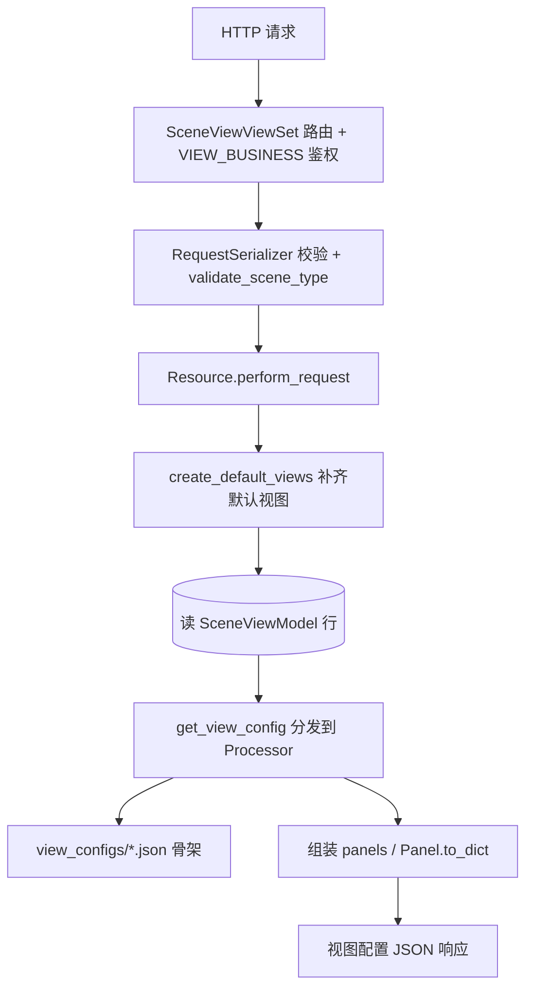

# 数据流转：场景视图专家 / monitor_web.scene_view

**本文引用的文件**
- [views.py](file://bkmonitor/packages/monitor_web/scene_view/views.py)
- [resources/view.py](file://bkmonitor/packages/monitor_web/scene_view/resources/view.py)
- [resources/host.py](file://bkmonitor/packages/monitor_web/scene_view/resources/host.py)
- [builtin/__init__.py](file://bkmonitor/packages/monitor_web/scene_view/builtin/__init__.py)
- [serializers.py](file://bkmonitor/packages/monitor_web/scene_view/serializers.py)
- [base.py](file://bkmonitor/packages/monitor_web/scene_view/base.py)
- [table_format.py](file://bkmonitor/packages/monitor_web/scene_view/table_format.py)
- [tasks.py](file://bkmonitor/packages/monitor_web/scene_view/tasks.py)
- [models/scene_view.py](file://bkmonitor/packages/monitor_web/models/scene_view.py)

## 目录
1. [简介](#简介)
2. [数据生命周期](#数据生命周期)
3. [状态与数据变换关键节点](#状态与数据变换关键节点)
4. [异步流](#异步流)
5. [结论](#结论)

## 简介
场景视图的数据流有两条主干：读路径「DB 视图行 + 内置 JSON 骨架 → 合并渲染 panel 列表」，写路径「请求参数 → 落库 `SceneViewModel` / `SceneViewOrderModel`」。请求经 `SceneViewViewSet` 进入，出口是 `SceneViewSerializer` 描述的视图配置 JSON。
章节来源：[views.py](file://bkmonitor/packages/monitor_web/scene_view/views.py#L33-L299) · [serializers.py](file://bkmonitor/packages/monitor_web/scene_view/serializers.py#L37-L61)

## 数据生命周期

读路径要点：`perform_request` 先按 `(bk_biz_id, scene_id, type)` 拉视图集合并 `create_default_views` 补齐，再取目标 `SceneViewModel` 行（缺失抛 `Http404`），最后 `get_view_config(view, params)` 分发到对应 Processor 生成最终配置。响应结构为 `bk_biz_id/scene_id/id/name/variables/type/mode/order/panels/options`，panel 由 `Panel.to_dict` 输出 `{id,title,sub_title,targets,options,grid_pos}`。
图表来源：[builtin/__init__.py](file://bkmonitor/packages/monitor_web/scene_view/builtin/__init__.py#L220-L232) · [base.py](file://bkmonitor/packages/monitor_web/scene_view/base.py#L42-L50)

## 状态与数据变换关键节点
- **JSON 骨架加载与国际化**：`_read_builtin_view_config` 读 `view_configs/{filename}.json`，`_translate_config` 递归把 `_(...)` 字符串替换为翻译结果。
- **DB↔骨架差异同步**：`create_default_views` 计算 `builtin_view_ids - existed_view_ids` 做 `bulk_create`，`existed_view_ids - builtin_view_ids` 做 `delete`，实现幂等对齐。
- **视图排序**：`SceneViewModel.update_order` 在事务内 `select_for_update` 锁 `SceneViewOrderModel` 行，对 `config` 列表做移除/插入，保证并发下顺序一致。
- **表格数据变换**：列表接口经 `PageListResource.get_pagination_data` 做「筛选→排序→分页→格式化（deepcopy + column.format）」。
- **进程列表聚合**：`GetHostProcessListResource` 并发执行 4 路 TSDB 查询（端口健康/运行时指标/启动时间/实例数），结果按进程名索引合并到 CMDB 进程数据中。
章节来源：[builtin/__init__.py](file://bkmonitor/packages/monitor_web/scene_view/builtin/__init__.py#L61-L212) · [models/scene_view.py](file://bkmonitor/packages/monitor_web/models/scene_view.py#L70-L96) · [table_format.py](file://bkmonitor/packages/monitor_web/scene_view/table_format.py#L22-L60) · [resources/host.py](file://bkmonitor/packages/monitor_web/scene_view/resources/host.py#L410-L470)

## 异步流
模块 `tasks.py` 为空占位，本模块自身无 Celery 定时任务/队列/回调。列表接口的 `PageListResource` 支持 `CONCURRENT_NUMBER = 5` 并发（用于异步取列值），`TableFormat` 的 `asyncable` 列标记某列的值由前端二次异步拉取，但这些均为同请求内的处理，非独立异步任务。`GetHostProcessListResource` 使用 `ThreadPool` 做 4 路并发 TSDB 查询，也是同请求内并发。
章节来源：[tasks.py](file://bkmonitor/packages/monitor_web/scene_view/tasks.py#L1-L11) · [resources/base.py](file://bkmonitor/packages/monitor_web/scene_view/resources/base.py#L23-L24) · [resources/host.py](file://bkmonitor/packages/monitor_web/scene_view/resources/host.py#L410-L420)

## 结论
读路径的一致性依赖「每次读取前先 `create_default_views` 对齐」这一约定，代价是删除同步可能误删；写路径的排序更新用行级锁保证并发安全。数据变换关键在 JSON 骨架与 DB 行的合并，理解某场景视图为何长这样，须同时看 `view_configs/*.json` 与对应 Processor 的 `get_view_config`。进程列表接口的 4 路并发聚合模式是本模块中最复杂的实时数据流。
