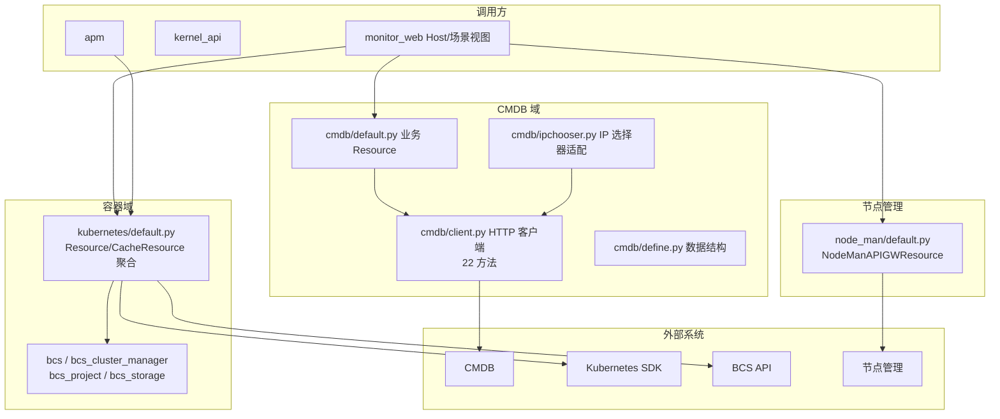

# 01-架构：CMDB 与容器资源专家

**本文引用的文件**
- [api/cmdb/](file://bkmonitor/api/cmdb/)
- [api/kubernetes/default.py](file://bkmonitor/api/kubernetes/default.py)
- [api/bcs/default.py](file://bkmonitor/api/bcs/default.py)
- [api/node_man/default.py](file://bkmonitor/api/node_man/default.py)

## 目录

1. [简介](#简介)
2. [架构分层](#架构分层)
3. [kubernetes 数据四路](#kubernetes-数据四路)
4. [批量拉取与缓存](#批量拉取与缓存)
5. [依赖关系](#依赖关系)
6. [关键发现与风险](#关键发现与风险)

## 简介

本专家覆盖 `api/` 下 7 个子目录：cmdb（网关封装 + 本地聚合）、kubernetes（本地聚合，非网关）、bcs 系列（4 个网关）、node_man（网关）。封装形态差异显著：从纯 APIResource 网关（bcs/node_man）到纯本地 Resource 聚合（kubernetes）。

章节来源：[api/cmdb/client.py](file://bkmonitor/api/cmdb/client.py)（关键符号：`CMDBBaseResource`）

## 架构分层

图表来源：[api/cmdb/default.py](file://bkmonitor/api/cmdb/default.py)（关键符号：`GetHostByTopoNode`）；[api/kubernetes/default.py](file://bkmonitor/api/kubernetes/default.py)（关键符号：`FetchKubernetesConsistencyCheckResource`）

## kubernetes 数据四路

`FetchKubernetesConsistencyCheckResource` 为代表（源码 confirmed），`perform_request` 依次：
1. `fetch_from_bk_storages`：BCS storage（`api.bcs_storage.fetch`）。
2. `fetch_from_api_server`：K8s SDK（`BCSCluster.api_client` → `core_v1_api`/`apps_v1_api`/`batch_v1_api`，如 `list_pod_for_all_namespaces()`）。
3. `fetch_from_db`：本地 DB（BCSBase/BCSCluster 模型）。
4. `compare_third_part`：三方数据比对。
- promql 指标：`UnifyQuery`/`load_data_source(DataSourceLabel.PROMETHEUS, DataTypeLabel.TIME_SERIES)` + `ThreadPool` 多线程。
- JSON 解析：SDK 对象 `to_dict()` → `bkmonitor.utils.kubernetes.Kubernetes*JsonParser` 系列。

章节来源：[api/kubernetes/default.py](file://bkmonitor/api/kubernetes/default.py)（关键符号：`FetchKubernetesConsistencyCheckResource` / `BCSCluster`）

## 批量拉取与缓存

- **batch_request**（`bkmonitor/commons/tools.py`）：通用分页批量拉取，`page.start/limit` 分页 + `thread_num=20` 并发，`get_data`/`get_count` 回调。cmdb 的 `get_host_dict_by_biz`、`ExecuteDynamicGroup` 等使用。
- **缓存**：
  - `CacheResource` + `cache_type`：cmdb 用 `CacheType.CC_BACKEND`（10min）/`CC_CACHE_ALWAYS`（1h）；kubernetes/bcs_storage 用 `CacheType.BCS`（5min）。
  - `@using_cache`：函数级缓存（`get_host_dict_by_biz` 用 DEVOPS、`get_service_instance_by_biz` 用 CC_CACHE_ALWAYS）。
  - `mem_cache.clear()`：default.py 中手动清理以规避缓存干扰。
  - bcs 系列用 `backend_cache_type=None` 显式关闭后端缓存。

章节来源：[api/cmdb/default.py](file://bkmonitor/api/cmdb/default.py)（关键符号：`get_host_dict_by_biz` / `@using_cache`）

## 依赖关系

- `core.drf_resource`（APIResource / CacheResource / Resource / api 全局入口）
- `bkmonitor.models`（BCSCluster/BCSNode/BCSPod/BCSWorkload 等 BCS 模型 + MetricListCache）
- `kubernetes.client`（SDK，exceptions.ApiException / stream）
- `bkm_space`（SpaceApi / bk_biz_id_to_space_uid）
- `bkmonitor.utils.kubernetes`（K8s JsonParser 系列 + BcsClusterType）
- `bkmonitor.utils.tenant` / `thread_backend` / `cache`（CacheType）
- `metadata.models`（kubernetes 依赖）

章节来源：[api/kubernetes/default.py](file://bkmonitor/api/kubernetes/default.py)（关键符号：`BCSCluster` / `UnifyQuery`）

## 关键发现与风险

1. **kubernetes 非网关封装**：108KB 的 kubernetes 是本地资源聚合层，排查其问题需理解 promql/SDK/DB 四路，而非认证/URL。
2. **CMDB 数据量大**：依赖 batch_request 分页并发 + 多层缓存，缓存一致性（`CC_CACHE_ALWAYS` 1h）可能导致变更延迟可见。
3. **bcs 系列网关分散**：4 个模块 base_url 各自独立（clustermanager/bcsproject/storage/api-gateway），token 均为 `BCS_API_GATEWAY_TOKEN` 系。
4. **node_man 36 接口**：订阅/插件/任务域接口多且相互关联，调用顺序需按业务流程（注册→订阅→运行→查结果）。

**出处行**：生成日期 2026-08-07，git commit：未提交（工作区）
