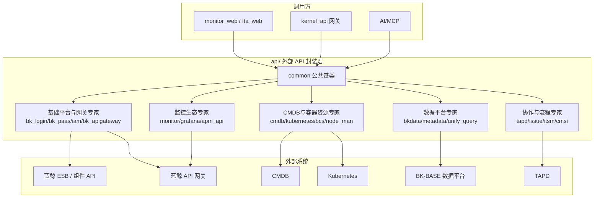

# T0-专题总览：外部 API 集成专题

**本文引用的文件**
- [api/__init__.py](file://bkmonitor/api/__init__.py)
- [api/common/default.py](file://bkmonitor/api/common/default.py)
- [api/bk_apigateway/default.py](file://bkmonitor/api/bk_apigateway/default.py)
- [api/tapd/default.py](file://bkmonitor/api/tapd/default.py)
- [api/bkdata/default.py](file://bkmonitor/api/bkdata/default.py)
- [api/cmdb/default.py](file://bkmonitor/api/cmdb/default.py)

## 目录

1. [简介](#简介)
2. [专题能力清单](#专题能力清单)
3. [专题边界](#专题边界)
4. [统一封装模式](#统一封装模式)
5. [跨专家架构图](#跨专家架构图)
6. [专家导航](#专家导航)
7. [测试状态](#测试状态)

## 简介

`api/` 目录是 BK-Monitor 的**外部 API 统一封装层**：每个外部系统一个子目录，子目录内 `default.py` 定义该系统的 `APIResource` 子类集合。业务代码通过全局入口 `resource.xxx.yyy()` / `api.xxx.yyy()` 或直接实例化 `SomeResource().request(params)` 调用，由 `core.drf_resource.contrib.api.APIResource` 基类完成 HTTP 发送、序列化、认证注入与错误处理。

章节来源：[api/common/default.py](file://bkmonitor/api/common/default.py)（关键符号：`CommonBaseResource`）

## 专题能力清单

| 能力域 | 覆盖系统 | 用途 |
|--------|----------|------|
| 蓝鲸 PaaS 基础 | bk_login / bk_paas / bk_plugin / iam / bk_apigateway / docs | 用户/租户查询、应用信息、插件、权限中心、网关公钥、ESB 文档 |
| 资源与容器 | cmdb / kubernetes / bcs / bcs_cluster_manager / bcs_project / bcs_storage / node_man | 主机/拓扑、K8s 资源、容器集群、节点管理 |
| 数据平台 | bkdata / metadata / unify_query / log_search / aiops_sdk | 数据计算、元数据、统一查询、日志检索、AIops SDK |
| 协作与流程 | tapd / issue / itsm / cmsi / sops / job / devops / bkchat / bk_incident | 缺陷/工单/消息/作业/流程/通知 |
| 监控生态 | monitor / grafana / apm_api / rum_api / aidev / bmw | 监控数据、Grafana、APM/RUM、AI dev、大屏 |

## 专题边界

- **只做"外呼"**：本专题封装对外部系统的出站请求，不处理入站 API（入站内核 API 见 `kernel_api` 网关专家）。
- **不实现业务逻辑**：`api/` 下的 Resource 是薄封装（URL/认证/响应适配），复杂业务逻辑在调用方（monitor_web/fta_web/kernel_api）。
- **不包含 `adapter/`**：平台差异覆盖走 `adapter` 全局入口（不在本模块范围）。
- **`common/` 是共享基类位**：`CommonBaseResource` 提供动态 URL 渲染 + 错误包装模板，但多数系统自建基类。

## 统一封装模式

每个 `api/{system}/default.py` 遵循同一骨架：

```python
# 标准模板（以 api/bk_apigateway/default.py 为例，源码 confirmed）
from core.drf_resource import APIResource
from rest_framework import serializers

class XxxSystemResource(APIResource, metaclass=abc.ABCMeta):
    base_url = settings.XXX_API_BASE_URL or f"{settings.BK_COMPONENT_API_URL}/api/xxx/prod/"
    module_name = "xxx"

    def get_request_url(self, validated_request_data):
        return super().get_request_url(validated_request_data).format(**validated_request_data)

class GetFooResource(XxxSystemResource):
    action = "/api/v1/foos/{foo_id}/"
    method = "GET"

    class RequestSerializer(serializers.Serializer):
        foo_id = serializers.IntegerField(label="ID")
```

**关键覆写点**（各系统按需差异）：
| 覆写点 | 用途 | 典型系统 |
|--------|------|----------|
| `base_url` | 远端基地址（settings 环境变量或 ESB 组件路径） | 全部 |
| `get_request_url` | URL 动态 `format(**params)` | bk_apigateway / bkdata / bk_login |
| `get_headers` | 自定义认证头（Basic/Bearer/apigw authorization） | tapd / bkdata |
| `full_request_data` | 注入应用认证信息 | bkdata（SAAS_APP_CODE/SECRET） |
| `render_response_data` | 非标准响应格式适配 | tapd（status/info/data） |
| `perform_request` | 错误包装/参数弹出 | common / tapd（access_token 弹出） |
| `use_apigw` | 按环境切换 ESB/apigw 路径 | bk_login |
| `cache_type` / `CacheResource` | 结果缓存 | bk_apigateway / cmdb |
| `batch_request` | 分页批量拉取 | cmdb / bk_login |

章节来源：[api/bk_apigateway/default.py](file://bkmonitor/api/bk_apigateway/default.py)（关键符号：`BkApiGatewayResource` / `GetPublicKeyResource`）；[api/tapd/default.py](file://bkmonitor/api/tapd/default.py)（关键符号：`TapdAPIResource`）

## 跨专家架构图



图表来源：[api/common/default.py](file://bkmonitor/api/common/default.py)（关键符号：`CommonBaseResource`）；[api/bkdata/default.py](file://bkmonitor/api/bkdata/default.py)（关键符号：`BkDataAPIGWResource`）

## 专家导航

| 专家 | 职责 | 契约层 | 实现层 |
|------|------|--------|--------|
| [基础平台与网关专家](基础平台与网关专家/C0-使用总览.md) | 蓝鲸 PaaS 基础能力与认证基座 | C0/C1 | implementation/ |
| [CMDB 与容器资源专家](CMDB与容器资源专家/C0-使用总览.md) | 资源与容器监控数据源 | C0/C1 | implementation/ |
| [数据平台专家](数据平台专家/C0-使用总览.md) | 数据计算/存储/查询链路 | C0/C1 | implementation/ |
| [协作与流程专家](协作与流程专家/C0-使用总览.md) | 协作办公与流程 | C0/C1 | implementation/ |
| [监控生态专家](监控生态专家/C0-使用总览.md) | 监控周边系统 | C0/C1 | implementation/ |

## 测试状态

- `api/` 目录**无测试目录**（`search_file` 仅 77 个 py，无 tests）——各专家 06-测试 标注「该模块无测试」。
- PROJECT.md 中 bkmonitor 核心标注 ⚠️ 依赖外部环境。

**出处行**：生成日期 2026-08-07，git commit：未提交（工作区）
