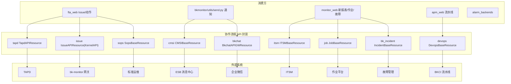

# 01-架构：协作与流程专家

**本文引用的文件**
- [api/tapd/default.py](file://bkmonitor/api/tapd/default.py)
- [api/cmsi/default.py](file://bkmonitor/api/cmsi/default.py)
- [api/bk_incident/default.py](file://bkmonitor/api/bk_incident/default.py)
- [api/devops/default.py](file://bkmonitor/api/devops/default.py)

## 目录

1. [简介](#简介)
2. [架构分层](#架构分层)
3. [认证与特殊机制](#认证与特殊机制)
4. [依赖关系](#依赖关系)
5. [关键发现与风险](#关键发现与风险)

## 简介

本专家覆盖 `api/` 下 9 个子目录（tapd/issue/itsm/cmsi/sops/job/devops/bkchat/bk_incident），统一基于 APIResource 封装协作与流程系统。

章节来源：[api/tapd/default.py](file://bkmonitor/api/tapd/default.py)（关键符号：`TapdAPIResource`）

## 架构分层

图表来源：[api/cmsi/default.py](file://bkmonitor/api/cmsi/default.py)（关键符号：`CMSIBaseResource`）；[api/issue/default.py](file://bkmonitor/api/issue/default.py)（关键符号：`IssueAPIResource`）

## 认证与特殊机制

| 模块 | 认证/机制 | 说明 |
|------|-----------|------|
| tapd | Basic/Bearer 切换 + contextvar | `tapd_access_token` ContextVar 隔离；`get_headers` 按 token 判空切换 |
| itsm | 用户名注入 | `full_request_data` 注入 `_origin_user` + `bk_username=COMMON_USERNAME` |
| cmsi | apigw/esb 动态切换 | `use_apigw/switch_apigw/switch_esb` + `gateway_type` 实例态 |
| devops | Cookie bk_ticket | `request` 取 Cookie；未部署抛 `DevopsNotDeployedError` |
| bk_incident | 参数转换 | `bk_biz_id→scope_value`、`bk_biz_id_list→scope_id_list` |
| sops/job | 权限重试 | 权限码 3599999 / `APIPermissionDeniedError` 重试 + assignee 兜底 |

章节来源：[api/devops/default.py](file://bkmonitor/api/devops/default.py)（关键符号：`DevopsBaseResource`）；[api/bk_incident/default.py](file://bkmonitor/api/bk_incident/default.py)（关键符号：`IncidentBaseResource`）

## 依赖关系

- `core.drf_resource`（APIResource / KernelAPIResource）
- `bkmonitor.utils.request`（get_request 取用户）
- settings：`TAPD_API_BASE_URL`/`TAPD_APP_ID`/`TAPD_APP_SECRET`、`BKCHAT_API_BASE_URL`、`DEVOPS_API_BASE_URL`、`NEW_MONITOR_API_BASE_URL`、`COMMON_USERNAME`、`APIGW_STAGE`

章节来源：[api/tapd/default.py](file://bkmonitor/api/tapd/default.py)（关键符号：`TapdAPIResource`）

## 关键发现与风险

1. **tapd contextvar 隔离**：`access_token` 经 ContextVar 传递，需 try/finally `reset`；并发/异步场景 token 隔离依赖 context 传播正确。
2. **cmsi 通道差异大**：8 通道参数/返回各不相同，`SendMail` 有内外部用户 `@tai` 分流，扩展通道需维护 `GetMsgType` 虚拟通道。
3. **Issue 专有错误码**：`api.issue.rename` 重名走专有错误码链路（3327001），web 端识别转 409。
4. **devops 依赖 bk_ticket**：无 Cookie 场景（后台任务）无法用用户态接口，需应用态。

**出处行**：生成日期 2026-08-07，git commit：未提交（工作区）
