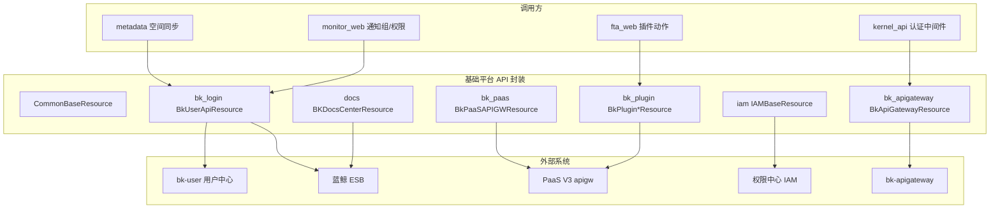

# 01-架构：基础平台与网关专家

**本文引用的文件**
- [api/common/default.py](file://bkmonitor/api/common/default.py)
- [api/bk_login/default.py](file://bkmonitor/api/bk_login/default.py)
- [api/bk_plugin/default.py](file://bkmonitor/api/bk_plugin/default.py)
- [api/bk_apigateway/default.py](file://bkmonitor/api/bk_apigateway/default.py)
- [api/iam/default.py](file://bkmonitor/api/iam/default.py)

## 目录

1. [简介](#简介)
2. [架构分层](#架构分层)
3. [基类模式对比](#基类模式对比)
4. [认证与错误处理](#认证与错误处理)
5. [依赖关系](#依赖关系)
6. [关键发现与风险](#关键发现与风险)

## 简介

本专家覆盖 `api/` 下 7 个子目录（common/bk_login/bk_paas/bk_plugin/iam/bk_apigateway/docs），统一基于 `core.drf_resource.contrib.api.APIResource` 封装蓝鲸 PaaS 基础能力。

章节来源：[api/common/default.py](file://bkmonitor/api/common/default.py)（关键符号：`CommonBaseResource`）

## 架构分层

图表来源：[api/bk_login/default.py](file://bkmonitor/api/bk_login/default.py)（关键符号：`BkUserApiResource` / `use_apigw`）

## 基类模式对比

| 维度 | CommonBaseResource | 各系统自建基类 |
|------|-------------------|----------------|
| base_url | 动态（__init__ 内 Jinja2 渲染占位符） | 类级常量（settings）或 property（bk_login） |
| module_name | common（plugin_key 动态重写） | 固定（bk-user/bk-paas/bk_plugin/iam/bk-apigateway/bk_docs_center） |
| URL 生成 | get_request_url 返回完整 base_url | 多数重写做 `format(**params)` 填充路径参数 |
| 认证覆写 | 无（沿用基类 get_headers） | BkPluginSystemResource 换插件凭证 |
| 双模式 | 无 | bk_login 用 use_apigw 切换 ESB/apigw |

章节来源：[api/bk_plugin/default.py](file://bkmonitor/api/bk_plugin/default.py)（关键符号：`BkPluginSystemResource`）

## 认证与错误处理

- **统一认证头**（APIResource.get_headers 基类）：组装 `x-bkapi-authorization`（含 `bk_app_code`/`bk_app_secret` + 可选 `bk_username`），附 `X-Bk-Tenant-Id`、语言头；code 命中 `APIPermissionDeniedCodeList`（9900403 等）抛 `APIPermissionDeniedError`。
- **插件特例**：`BkPluginSystemResource.get_headers` 替换 authorization 中的 app_code/secret 为 `settings.BK_PLUGIN_APP_INFO`。
- **错误包装**：`CommonBaseResource.perform_request` 捕获 `BKAPIError` 重写 `system_name=plugin_key, url=url_path`。

章节来源：[api/common/default.py](file://bkmonitor/api/common/default.py)（关键符号：`CommonBaseResource.perform_request`）

## 依赖关系

- `core.drf_resource.contrib.api.APIResource`（基类）
- `bkmonitor.utils.template.Jinja2Renderer`（URL 渲染）
- `bkmonitor.utils.user.get_global_user`（_origin_user 注入）
- `core.errors.api.BKAPIError`
- settings：`BK_COMPONENT_API_URL` / `BK_PAAS_HOST` / `BK_ITSM_V4_API_URL` / `BK_PLUGIN_APP_INFO` / `BK_IAM_APIGATEWAY_URL` / `APIGATEWAY_API_BASE_URL` / `ENABLE_MULTI_TENANT_MODE`

章节来源：[api/bk_apigateway/default.py](file://bkmonitor/api/bk_apigateway/default.py)（关键符号：`BkApiGatewayResource`）

## 关键发现与风险

1. **bk_login 双模式复杂度**：`use_apigw()` 下 base_url 与 action 整套切换，消费方需留意 `ENABLE_MULTI_TENANT_MODE`。
2. **插件凭证独立**：`BK_PLUGIN_APP_INFO` 未配置时插件调用将鉴权失败——部署依赖。
3. **缓存普遍存在**：`GetAllUserResource`/`BatchQueryUserDisplayInfoResource`/`GetPublicKeyResource` 均带 cache（CacheType.USER），缓存键与租户相关，多租户下注意一致性。
4. **`CommonBaseResource` 未广泛采用**：多数系统自建基类，公共模板价值主要体现在"动态 URL + 统一异常"两点。

**出处行**：生成日期 2026-08-07，git commit：未提交（工作区）
