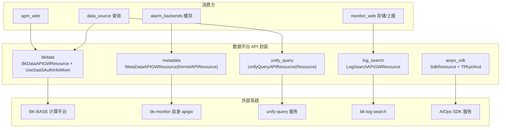

# 01-架构：数据平台专家

**本文引用的文件**
- [api/bkdata/default.py](file://bkmonitor/api/bkdata/default.py)
- [api/metadata/default.py](file://bkmonitor/api/metadata/default.py)
- [api/unify_query/default.py](file://bkmonitor/api/unify_query/default.py)
- [api/log_search/default.py](file://bkmonitor/api/log_search/default.py)
- [api/aiops_sdk/default.py](file://bkmonitor/api/aiops_sdk/default.py)

## 目录

1. [简介](#简介)
2. [架构分层](#架构分层)
3. [封装形态差异](#封装形态差异)
4. [认证与路由](#认证与路由)
5. [依赖关系](#依赖关系)
6. [关键发现与风险](#关键发现与风险)

## 简介

本专家覆盖 `api/` 下 5 个子目录，是数据链路的封装层：bkdata（计算平台）、metadata（监控元数据）、unify_query（统一查询）、log_search（日志检索）、aiops_sdk（AI 推理）。

章节来源：[api/bkdata/default.py](file://bkmonitor/api/bkdata/default.py)（关键符号：`BkDataAPIGWResource`）

## 架构分层

图表来源：[api/metadata/default.py](file://bkmonitor/api/metadata/default.py)（关键符号：`MetaDataAPIGWResource`）；[api/unify_query/default.py](file://bkmonitor/api/unify_query/default.py)（关键符号：`UnifyQueryAPIResource`）

## 封装形态差异

| 模块 | 基类 | 走 APIGW？ | 认证/路由特征 |
|------|------|-----------|---------------|
| bkdata | `BkDataAPIGWResource` | 是（bk-base） | UseSaaSAuthInfoMixin 注入 SaaS 凭证；QueryDataResource token/user 双鉴权 |
| metadata | `MetaDataAPIGWResource(KernelAPIResource)` | 是（自身网关） | action `/app/metadata/...`；backend_cache_type=METADATA |
| unify_query | `UnifyQueryAPIResource(Resource)` | **否**（requests 直连） | 按 space_uid 路由 + 空间/租户请求头 |
| log_search | `LogSearchAPIGWResource` | 是（bk-log-search/compapi） | base_url property 多模式；index_set_id pop 进 URL |
| aiops_sdk | `SdkResource` | 是（AIOPS_*_SDK） | Tf/Kpi/Acd 三分支 + BKFara 灰度 |

章节来源：[api/aiops_sdk/default.py](file://bkmonitor/api/aiops_sdk/default.py)（关键符号：`SdkResource` / `BKFaraGrayMixin`）

## 认证与路由

- **SaaS 认证注入**（bkdata `UseSaaSAuthInfoMixin`）：`full_request_data` 注入 `bk_app_code=SAAS_APP_CODE`；`get_headers` 解析 `x-bkapi-authorization` 注入 `SAAS_APP_CODE`/`SAAS_SECRET_KEY`。
- **双鉴权**（QueryDataResource）：`_user_request=True` → user 模式（`bk_username=COMMON_USERNAME`）；否则有 `BKDATA_DATA_TOKEN` → token 模式（`bkdata_authentication_method=token`），无则回退 user。
- **空间路由**（unify_query）：`get_unify_query_url` 按 `UNIFY_QUERY_ROUTING_RULES` 路由；请求头 `Bk-Query-Source`/`X-Bk-Scope-Space-Uid`/`X-Bk-Scope-Skip-Space`/`X-Bk-Tenant-Id`。

章节来源：[api/bkdata/default.py](file://bkmonitor/api/bkdata/default.py)（关键符号：`UseSaaSAuthInfoMixin` / `QueryDataResource`）

## 依赖关系

- `core.drf_resource`（APIResource / Resource / CacheResource / api）
- `bkmonitor.utils.cache`（CacheType.METADATA / DB_CACHE / LOG_SEARCH）
- `bkmonitor.utils.request`（get_request）
- `constants.dataflow`（AutoOffsetResets）
- settings：`BKDATA_*` / `SAAS_APP_CODE` / `SAAS_SECRET_KEY` / `BKDATA_DATA_TOKEN` / `BKLOGSEARCH_*` / `UNIFY_QUERY_URL` / `AIOPS_*` / `APIGW_STAGE`

章节来源：[api/bkdata/default.py](file://bkmonitor/api/bkdata/default.py)（关键符号：`BkDataAPIGWResource`）

## 关键发现与风险

1. **认证体系多样**：同一模块内混用 SaaS 凭证注入、token/user 双鉴权、自身网关 token——排查鉴权失败先确定走哪条认证路径。
2. **unify_query 非 APIGW**：无 APIResource 标准封装，无自动认证头/错误转换，直接 requests + 自定义头，错误处理需自行处理。
3. **缓存策略**：metadata 批量类用 `CacheResource` + `batch_request` 分包；`backend_cache_type` 差异（METADATA/DB_CACHE/LOG_SEARCH）影响缓存命中。
4. **灰度风险**：aiops_sdk 的 `BKFaraGrayMixin` 灰度切换会影响请求地址，灰度配置变更需回归。

**出处行**：生成日期 2026-08-07，git commit：未提交（工作区）
