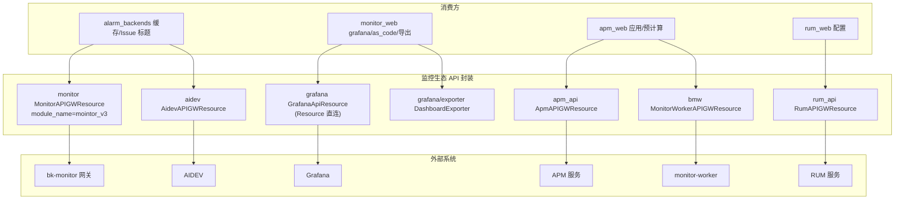

# 01-架构：监控生态专家

**本文引用的文件**
- [api/monitor/default.py](file://bkmonitor/api/monitor/default.py)
- [api/grafana/default.py](file://bkmonitor/api/grafana/default.py)
- [api/grafana/exporter.py](file://bkmonitor/api/grafana/exporter.py)
- [api/aidev/default.py](file://bkmonitor/api/aidev/default.py)

## 目录

1. [简介](#简介)
2. [架构分层](#架构分层)
3. [封装形态差异](#封装形态差异)
4. [依赖关系](#依赖关系)
5. [关键发现与风险](#关键发现与风险)

## 简介

本专家覆盖 `api/` 下 6 个子目录（monitor/grafana/apm_api/rum_api/aidev/bmw），封装监控周边系统。

章节来源：[api/monitor/default.py](file://bkmonitor/api/monitor/default.py)（关键符号：`MonitorAPIGWResource`）

## 架构分层

图表来源：[api/grafana/default.py](file://bkmonitor/api/grafana/default.py)（关键符号：`GrafanaApiResource`）；[api/aidev/default.py](file://bkmonitor/api/aidev/default.py)（关键符号：`AidevAPIGWResource`）

## 封装形态差异

| 模块 | 基类 | 形态 | 认证/特殊 |
|------|------|------|-----------|
| monitor | `KernelAPIResource` | APIGW（bk-monitor 自身） | module_name=`mointor_v3`（拼写注意） |
| grafana | `Resource` | **直连**（requests → GRAFANA_URL） | `X-WEBAUTH-USER`/`X-Grafana-Org-Id` 头 |
| apm_api | `KernelAPIResource` | APIGW | `backend_cache_type=CacheType.APM` |
| rum_api | `KernelAPIResource` | APIGW | 生命周期为主 |
| aidev | `APIResource` | APIGW（AIDEV） | 凭证替换 + OpenAI 直通 + 流式 |
| bmw | `APIResource` | APIGW（BMW） | `base_url=BMW_API_URL` |

章节来源：[api/grafana/default.py](file://bkmonitor/api/grafana/default.py)（关键符号：`GrafanaApiResource.perform_request`）

## 依赖关系

- `core.drf_resource`（APIResource / KernelAPIResource / Resource）
- `core.drf_resource.contrib.nested_api.KernelAPIResource`（自身网关基类）
- `bkmonitor.utils.cache`（CacheType.APM）
- settings：`NEW_MONITOR_API_BASE_URL`/`APIGW_STAGE`、`GRAFANA_URL`、`AIDEV_API_BASE_URL`/`AIDEV_AGENT_APP_CODE`/`BK_PLUGIN_APP_INFO`、`BMW_API_URL`

章节来源：[api/apm_api/default.py](file://bkmonitor/api/apm_api/default.py)（关键符号：`ApmAPIGWResource`）

## 关键发现与风险

1. **module_name 拼写陷阱**：`api.monitor` 的 module_name 是 `mointor_v3`，调用方易写错。
2. **grafana 直连模式**：无 APIResource 认证/错误封装，需自行处理 Grafana 返回结构。
3. **aidev 流式特殊**：`CreateKnowledgebaseQueryResource` 返回 `StreamingHttpResponse`，与普通 Resource 返回契约不同。
4. **exporter 是工具类非 API**：`DashboardExporter` 为模板化导出，供 as_code/导出导入复用。

**出处行**：生成日期 2026-08-07，git commit：未提交（工作区）
