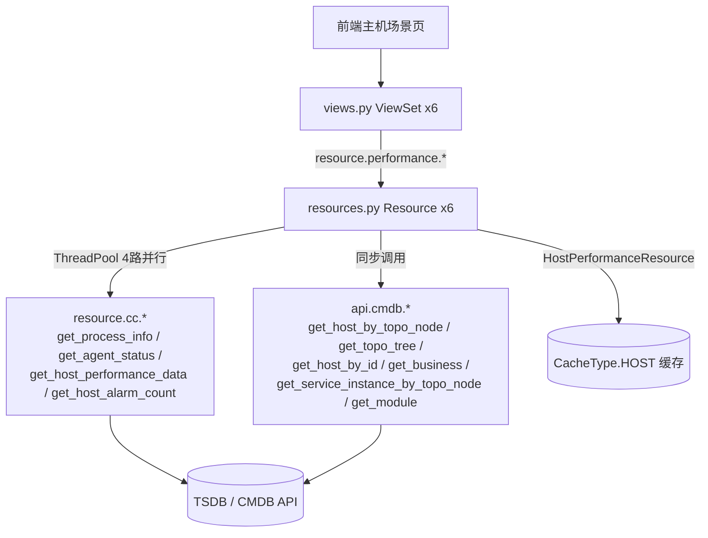

# 架构：性能场景专家 / monitor_web.performance

**本文引用的文件**
- [urls.py](file://bkmonitor/packages/monitor_web/performance/urls.py)
- [views.py](file://bkmonitor/packages/monitor_web/performance/views.py)
- [resources.py](file://bkmonitor/packages/monitor_web/performance/resources.py)
- [models.py](file://bkmonitor/packages/monitor_web/performance/models.py)
- [__init__.py](file://bkmonitor/packages/monitor_web/performance/__init__.py)

## 目录
1. [简介](#简介)
2. [项目结构](#项目结构)
3. [核心组件](#核心组件)
4. [架构总览](#架构总览)
5. [组件详细分析](#组件详细分析)
6. [依赖关系分析](#依赖关系分析)
7. [契约层与实现层索引](#契约层与实现层索引)
8. [结论](#结论)

## 简介
`performance` 模块是蓝鲸监控「主机性能 / 拓扑 / 进程」场景的**后端聚合层**：以 Django DRF Resource 形式对外暴露 6 个接口，内部通过线程池并行聚合 CMDB、Agent 状态、TSDB 性能指标、告警计数等多源数据。**自身不含持久化**，`models.py` 已迁空（注释「迁移至 monitor_api 中的 model」）。
章节来源：[resources.py](file://bkmonitor/packages/monitor_web/performance/resources.py#L1-L472) · [models.py](file://bkmonitor/packages/monitor_web/performance/models.py#L11-L13)

## 项目结构
```
bkmonitor/packages/monitor_web/performance/
├── __init__.py     # 版权声明（空逻辑）
├── models.py       # 空（模型已迁移至 monitor_api）
├── resources.py    # 6 个 Resource 类（聚合逻辑核心，472 行）
├── urls.py         # ResourceRouter 自动注册
└── views.py        # 6 个 ViewSet，绑定 Resource 路由 + IAM 权限
```
各文件职责：`urls.py` 通过 `ResourceRouter.register_module(performance_views)` 注册路由；`views.py` 定义 6 个 ViewSet + `PermissionMixin`（统一 `VIEW_HOST` 权限）；`resources.py` 承载全部聚合业务逻辑。
章节来源：[urls.py](file://bkmonitor/packages/monitor_web/performance/urls.py#L17-L22) · [views.py](file://bkmonitor/packages/monitor_web/performance/views.py#L25-L74)

## 核心组件
| 组件 | 位置 | 职责 |
|---|---|---|
| `HostPerformanceResource` | [resources.py](file://bkmonitor/packages/monitor_web/performance/resources.py#L43-L127) | 主机列表聚合（指标/进程/告警/状态），继承 `CacheResource` 走 `HOST` 缓存 |
| `HostPerformanceDetailResource` | [resources.py](file://bkmonitor/packages/monitor_web/performance/resources.py#L130-L178) | 单主机详情（基础信息 + 拓扑 + Agent 状态 + 业务名） |
| `HostTopoNodeDetailResource` | [resources.py](file://bkmonitor/packages/monitor_web/performance/resources.py#L181-L245) | 拓扑节点详情（主机数/告警/策略/负责人） |
| `TopoNodeProcessStatusResource` | [resources.py](file://bkmonitor/packages/monitor_web/performance/resources.py#L248-L277) | 拓扑节点下进程名列表（status 置灰 UNKNOWN） |
| `SearchHostInfoResource` | [resources.py](file://bkmonitor/packages/monitor_web/performance/resources.py#L280-L340) | 主机基础信息 + 模块拓扑链 |
| `SearchHostMetricResource` | [resources.py](file://bkmonitor/packages/monitor_web/performance/resources.py#L343-L472) | 指定主机的 agent 状态 + 性能指标 + 进程（实时，无缓存） |
| `PermissionMixin` | [views.py](file://bkmonitor/packages/monitor_web/performance/views.py#L25-L31) | 统一 `VIEW_HOST` 权限（5/6 个 ViewSet 继承；`SearchHostInfoViewSet` 未继承） |

章节来源：[resources.py](file://bkmonitor/packages/monitor_web/performance/resources.py#L43-L472) · [views.py](file://bkmonitor/packages/monitor_web/performance/views.py#L25-L74)

## 架构总览

图表来源：[resources.py](file://bkmonitor/packages/monitor_web/performance/resources.py#L95-L127) · [urls.py](file://bkmonitor/packages/monitor_web/performance/urls.py#L17-L22)

## 组件详细分析
### HostPerformanceResource（主机列表，最重接口）
- 设计要点：继承 `CacheResource`，`cache_type = CacheType.HOST`，缓存整份主机列表降低 CMDB/TSDB 压力。
- 关键流程：`api.cmdb.get_host_by_topo_node` 拉全量主机 → 构造 `host_dict` 默认值（指标/状态/进程/告警均为 `None`/`[]`/`UNKNOWN`）→ `ThreadPool` 并行 4 路填充（`get_agent_status` / `get_performance_data` / `get_process_status` / `get_alarm_count`）→ 返回 `{hosts, update_time}`。
- 错误处理：各 fetch 静态方法对 `data` 中缺失 `bk_host_id` 做 `continue` 跳过，单主机缺失不影响整体聚合。
章节来源：[resources.py](file://bkmonitor/packages/monitor_web/performance/resources.py#L43-L127)

### SearchHostMetricResource（指定主机实时指标）
- 设计要点：与 `HostPerformanceResource` 同构，但按 `bk_host_ids` 精确查询、**无缓存**，支持 `start_time`/`end_time` 时间范围。
- 关键流程：`ThreadPool` 并行 4 路（`get_agent_status` / `get_performance_data` / `get_process_status` / `get_alarm_count`），`get_alarm_count` 包裹 `try/except` 降级。
- 错误处理：`get_alarm_count` 捕获所有异常并 `logger.exception` 降级为空列表，不影响其他指标返回。
章节来源：[resources.py](file://bkmonitor/packages/monitor_web/performance/resources.py#L343-L472)

### HostTopoNodeDetailResource（拓扑节点详情）
- 设计要点：聚合拓扑节点信息 + 下属主机数 + 告警数 + 策略数 + 负责人。
- 关键流程：`api.cmdb.get_topo_tree().get_all_nodes_with_relation()` 查节点 → `api.cmdb.get_host_by_topo_node` 查下属主机 → `resource.cc.get_topo_strategy_count` 查策略 → `get_alarm_count` 静态方法统计告警。
- 注意：`child_count` 在 `bk_obj_id == "module"` 时取 `len(hosts)`，否则取 `len(node.child)`。
章节来源：[resources.py](file://bkmonitor/packages/monitor_web/performance/resources.py#L181-L245)

### SearchHostInfoResource.get_module_info（跨类复用）
- 设计要点：静态方法 `get_module_info` 被 `HostPerformanceResource` **跨类直接调用**（`SearchHostInfoResource.get_module_info`），构造模块到拓扑根的路径链。
- 关键流程：按 `bk_module_ids` 在 `topo_links` 中查找，输出 `topo_link`（`bk_obj_id|bk_inst_id` 列表）和 `topo_link_display`（节点名列表），均 `reversed` 使根节点在前。
章节来源：[resources.py](file://bkmonitor/packages/monitor_web/performance/resources.py#L286-L310)

## 依赖关系分析
- **内部依赖**（`resource.cc.*`，实现在 `cc/resources/cmdb.py`）：
  - `get_process_info` — 进程信息
  - `get_agent_status` — Agent 状态
  - `get_host_performance_data` — TSDB 性能指标
  - `get_host_alarm_count` — 告警计数
  - `get_topo_strategy_count` — 拓扑节点策略数
- **内部依赖**（`api.cmdb.*`）：
  - `get_host_by_topo_node` — 按拓扑节点拉主机
  - `get_topo_tree` — 拓扑树（含 `convert_to_topo_link` / `get_all_nodes_with_relation`）
  - `get_host_by_id` — 按 ID 拉主机
  - `get_business` — 业务信息
  - `get_service_instance_by_topo_node` — 服务实例（进程）
  - `get_module` — 模块详情（含负责人）
- **框架依赖**：`core.drf_resource`（Resource / CacheResource / ResourceRouter / ResourceRoute / ViewSet）、`bkmonitor.utils.thread_backend.ThreadPool`、`bkmonitor.utils.cache.CacheType`、`bkmonitor.utils.time_tools`、`bkm_space.validate.validate_bk_biz_id`、`monitor_web.constants.AGENT_STATUS`、`bkmonitor.iam`（权限）
- **被依赖**：前端主机场景页（主机列表/详情/拓扑树/进程）；`scene_view` 模块间接消费主机拓扑信息
章节来源：[resources.py](file://bkmonitor/packages/monitor_web/performance/resources.py#L16-L22) · [views.py](file://bkmonitor/packages/monitor_web/performance/views.py#L25-L31)

## 契约层与实现层索引
- **契约层**（黑盒使用文档，根目录）：
  - [C0-使用总览.md](../C0-使用总览.md) — 能力清单 + 边界 + 已知问题
  - [C1-能力契约.md](../C1-能力契约.md) — 6 个 Resource 类的方法契约 + 真实代码示例
  - [C2-使用流程.md](../C2-使用流程.md) — 业务目标调用路径 + 真实代码示例
- **实现层**（白盒导航文档，本目录）：
  - [01-架构.md](./01-架构.md) — 本文件
  - [02-实现.md](./02-实现.md) — 核心流程、设计模式、关键类、热点路径、技术债
  - [03-数据流转.md](./03-数据流转.md) — 数据生命周期、状态变换
  - [04-模型.md](./04-模型.md) — 数据模型（本模块无持久化）

## 结论
模块是纯聚合层、**无 DB**；扩展返回字段需同步改 `host_dict` 默认值 + 新增 fetch 静态方法 + `ThreadPool` 注册。列表接口走 `HOST` 缓存，详情/指标接口实时查询——新增实时字段需评估缓存一致性。主要风险在 `ThreadPool` 并行调用无超时熔断（单源慢拖慢整体）和两处 `get_process_status` 代码重复。
