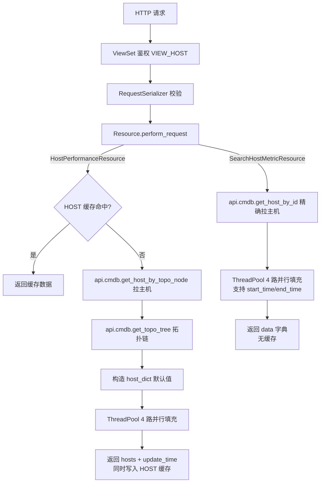

# 数据流转：性能场景专家 / monitor_web.performance

**本文引用的文件**
- [resources.py](file://bkmonitor/packages/monitor_web/performance/resources.py)
- [views.py](file://bkmonitor/packages/monitor_web/performance/views.py)
- [urls.py](file://bkmonitor/packages/monitor_web/performance/urls.py)

## 目录
1. [简介](#简介)
2. [数据生命周期](#数据生命周期)
3. [状态与数据变换关键节点](#状态与数据变换关键节点)
4. [异步流](#异步流)
5. [结论](#结论)

## 简介
性能场景模块是纯聚合层，自身无持久化，数据流为「请求 → 多源拉取 → 内存聚合 → 响应」的单向管道。两条主干：列表路径走 `HOST` 缓存 → 缓存未命中时全量拉取；详情/指标路径为实时查询无缓存。
章节来源：[resources.py](file://bkmonitor/packages/monitor_web/performance/resources.py#L43-L472)

## 数据生命周期

读路径要点：`HostPerformanceResource` 走缓存，缓存 key 为 `CacheType.HOST` + `bk_biz_id`；`SearchHostMetricResource` 每次实时查。聚合结果在内存中以 `host_dict`（`dict[int, dict]`）为容器，各 fetch 静态方法原地 `update` 填充。
图表来源：[resources.py](file://bkmonitor/packages/monitor_web/performance/resources.py#L95-L127) · [resources.py](file://bkmonitor/packages/monitor_web/performance/resources.py#L445-L472)

## 状态与数据变换关键节点
- **host_dict 初始化**：每台主机默认值 `status=AGENT_STATUS.UNKNOWN`、`cpu_usage/mem_usage/io_util/disk_in_use/cpu_load/psc_mem_usage=None`、`component=[]`、`alarm_count=[]`，保证缺失数据有兜底值。
- **Agent 状态填充**：`get_agent_status` 调 `resource.cc.get_agent_status` 获取 `{bk_host_id: status}` 映射，按 ID 匹配覆盖 `data[bk_host_id]["status"]`。
- **性能指标填充**：`get_performance_data` 调 `resource.cc.get_host_performance_data` 获取 `{bk_host_id: {cpu_usage, mem_usage, ...}}`，按 ID 匹配 `data[bk_host_id].update(metrics)` 原地覆盖 `None` 值。
- **进程信息填充**：`get_process_status` 调 `resource.cc.get_process_info` 获取 `{bk_host_id: [process_dict]}`，映射为 `component` 列表。
- **告警计数填充**：`get_alarm_count` 调 `resource.cc.get_host_alarm_count` 获取 `{bk_host_id: {level: count}}`，转为 `[{level, count}]` 按 level 排序。
- **拓扑链构造**：`SearchHostInfoResource.get_module_info` 按 `bk_module_ids` 在 `topo_links` 中查找，输出 `topo_link`（`bk_obj_id|bk_inst_id` 列表，reversed 根节点在前）和 `topo_link_display`（节点名列表）。
- **缓存写入**：`HostPerformanceResource` 继承 `CacheResource`，`perform_request` 返回后自动写入 `HOST` 缓存。
章节来源：[resources.py](file://bkmonitor/packages/monitor_web/performance/resources.py#L79-L127) · [resources.py](file://bkmonitor/packages/monitor_web/performance/resources.py#L286-L310)

## 异步流
模块自身无 Celery 定时任务/队列/回调。`ThreadPool` 并行是同请求内的线程级并发（非异步任务），4 路并行填充 `host_dict` 后 `pool.join()` 汇合。`SearchHostMetricResource` 的 `get_alarm_count` 有 `try/except` 异常降级，其他 3 路无异常保护。
章节来源：[resources.py](file://bkmonitor/packages/monitor_web/performance/resources.py#L104-L112) · [resources.py](file://bkmonitor/packages/monitor_web/performance/resources.py#L415-L432)

## 结论
数据流简洁清晰：请求 → 多源拉取 → 内存聚合 → 响应，无中间状态持久化。一致性依赖 `HOST` 缓存刷新周期与实时接口的 TSDB 查询时间范围。`host_dict` 的默认值兜底设计保证了部分数据缺失时仍能返回完整结构。主要风险在 `HostPerformanceResource.get_alarm_count` 无异常降级，告警查询异常会中断整个聚合。
