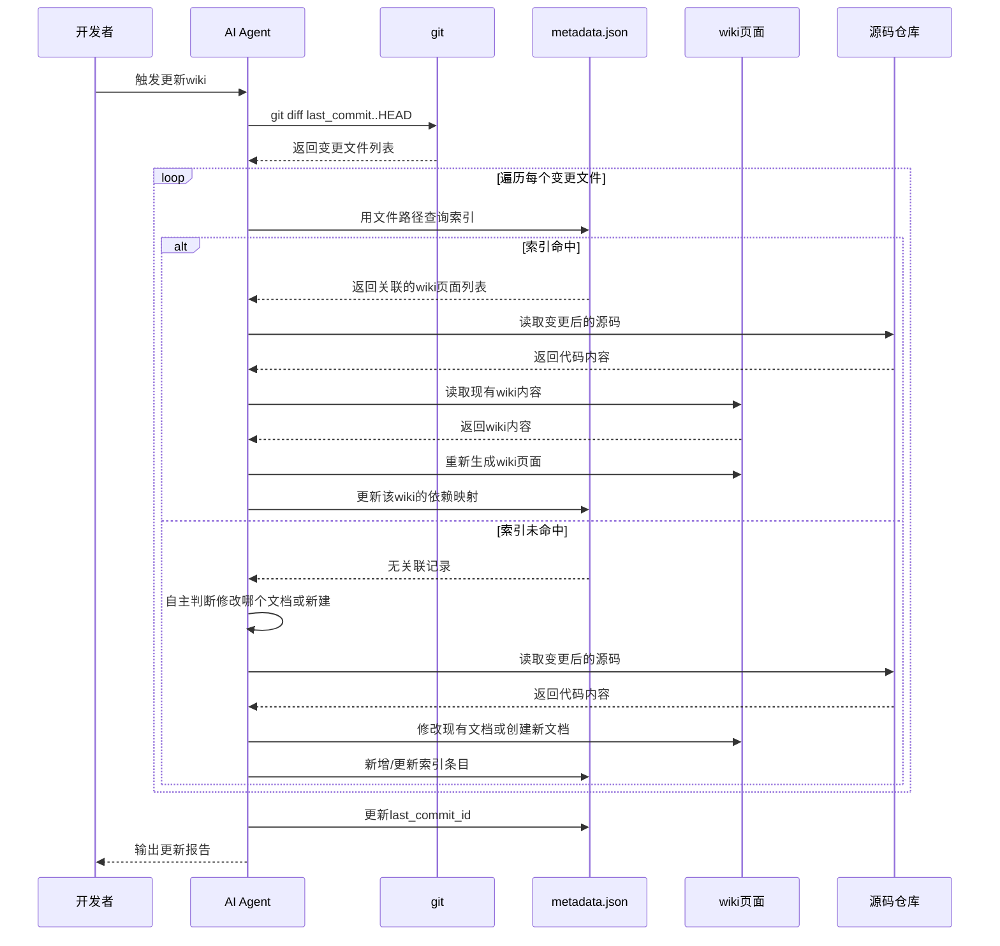

# 需求摘要：Wiki增量更新Skill

## 核心诉求
当代码库发生变更时，能智能识别受影响的wiki页面并只更新这些页面，避免全量重新生成的资源浪费。需要一个Qoder Skill来指导AI Agent完成增量更新流程。

## 需求形态
真实需求。包含两部分：
1. **metadata.json**：知识库索引文件，记录源文件到wiki页面的映射关系，独立于增量更新存在
2. **Wiki增量更新Skill**（SKILL.md）：metadata.json的消费者之一，引导AI Agent完成增量更新流程

## 核心场景
- **场景 1（索引命中）**：代码变更后，AI获取变更文件列表，通过metadata.json索引快速定位关联的wiki页面，读取变更后源码重新生成这些页面
- **场景 2（索引未命中）**：变更文件在索引中找不到映射，AI自主判断应修改哪个现有wiki文档或生成新文档，然后同步更新metadata.json索引
- **场景 3（首次初始化）**：用户指定wiki存储位置，AI扫描现有wiki并生成metadata.json（暂不实现）

## 根本性分析结论
- **核心问题**：如何在没有原系统支持的情况下，设计一个独立的skill来检测代码变更并智能更新受影响的wiki页面？
- **根因链**：
  1. wiki文档基于特定commit的代码生成
  2. 代码持续演进，wiki逐渐过时
  3. 缺乏代码变更与wiki页面的映射关系追踪
  4. 全量重新生成成本过高
- **方案评估**：情况A（方案对症）。metadata.json作为知识库索引，存储源文件到wiki页面的正向映射；增量更新时通过索引快速定位受影响页面，索引缺失时AI自主判断并补全索引。
- **建议**：短期实现核心功能（变更检测、影响分析、页面更新），后续扩展体验优化（状态报告、错误处理）。

## 需求清单

| 优先级 | 需求 ID | 需求描述 | 验收标准 |
|--------|---------|----------|----------|
| P0 | REQ-01 | 设计metadata.json索引结构，定义知识库元数据格式（源文件→wiki页面映射） | 包含：wiki_path、last_commit_id、source_file_index（源文件到wiki页面的映射）、wiki_catalogs |
| P0 | REQ-02 | 实现首次初始化，用户指定wiki路径后扫描现有wiki并生成metadata.json | 生成metadata.json，记录wiki目录、依赖文件映射、当前commit |
| P0 | REQ-03 | 实现代码变更检测，对比last_commit_id与当前commit输出变更文件列表 | git diff准确识别新增、修改、删除的文件 |
| P0 | REQ-04 | 实现变更影响分析：通过索引查找变更文件关联的wiki页面；未命中时AI自主判断 | 命中时输出关联wiki列表；未命中时AI决策修改现有文档或新建文档 |
| P0 | REQ-05 | 实现wiki页面更新，AI读取变更后源码重新生成受影响页面 | 页面内容更新，格式与原wiki一致 |
| P0 | REQ-06 | 更新metadata.json，同步更新last_commit_id、dependent_files等字段 | metadata.json字段更新正确 |
| P1 | REQ-07 | 编写Skill文档，SKILL.md指导AI完成增量更新流程 | Skill能引导AI正确执行更新流程 |
| P2 | REQ-08 | 更新状态报告，展示本次更新的影响范围和结果 | 输出：更新页面数、跳过页面数、失败页面数 |

## 交互时序图

## 关键假设

| 假设 | 验证状态 |
|------|----------|
| 原metadata.json已废弃，新方案自主管理 | 已确认 |
| metadata.json是知识库索引，增量更新只是其消费者之一 | 已确认 |
| wiki页面顶部cite标签包含准确的依赖文件列表 | 已确认 |
| git diff能准确识别文件变更 | 已验证（git标准功能） |
| AI Agent能按skill指令重新生成wiki页面 | 待验证 |
| 索引未命中时AI能自主判断合理的更新策略 | 待验证 |

## 非功能性约束
- **性能**：增量更新耗时 < 全量更新的30%
- **准确性**：受影响页面识别准确率 > 95%
- **可维护性**：Skill设计应清晰，便于后续维护

## 潜在风险
| 风险 | 影响 | 缓解措施 |
|------|------|----------|
| `<cite>`标签格式变化 | 依赖解析失败 | 解析逻辑需容错，支持多种格式 |
| 大量文件变更 | 更新耗时过长 | 支持分批更新或指定范围 |
| 新模块/目录无映射 | 遗漏相关wiki页面 | 更新后提示用户确认 |

## 迭代建议
- **第一阶段**：核心功能（变更检测、影响分析、页面更新）
- **第二阶段**：体验优化（状态报告、错误处理）
- **第三阶段**：功能扩展（支持新增wiki页面、删除过期页面）

## 相关资源
- 原metadata.json参考：`/root/bk-monitor/.qoder/repowiki/zh/meta/repowiki-metadata.json`
- 现有wiki内容：`/root/bk-monitor/.qoder/repowiki/zh/content/`
- wiki基准commit：`1ab1522c6240866b6f7f8c7d9af170b43b28efb0`
