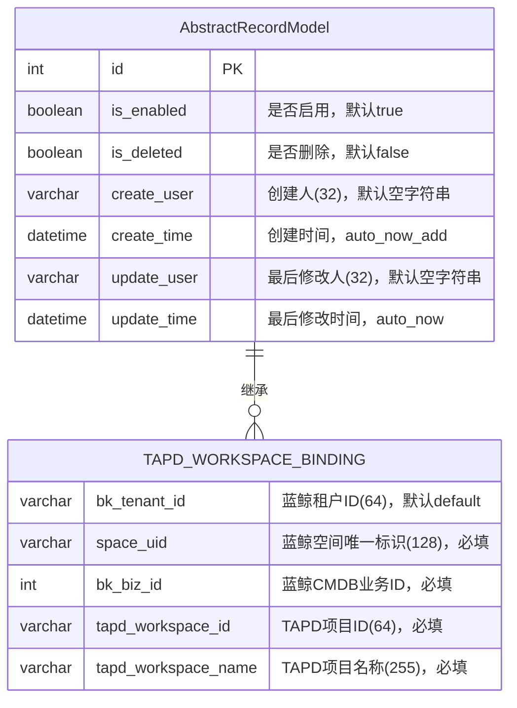
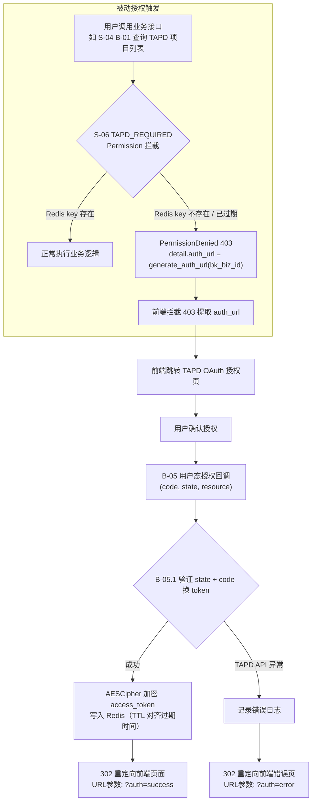
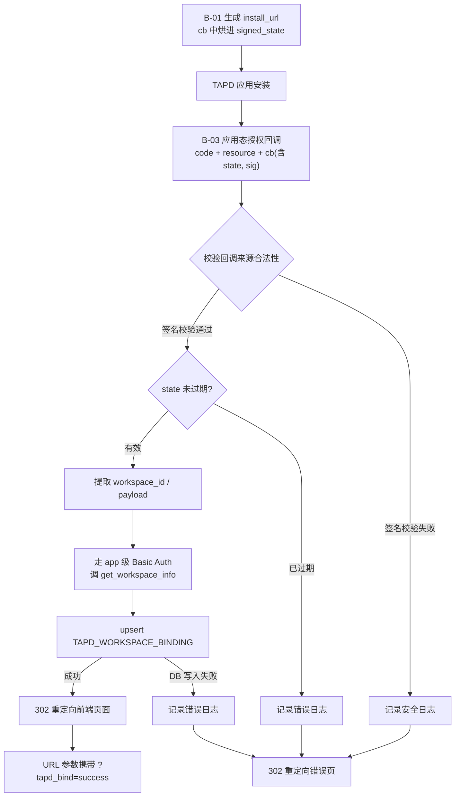
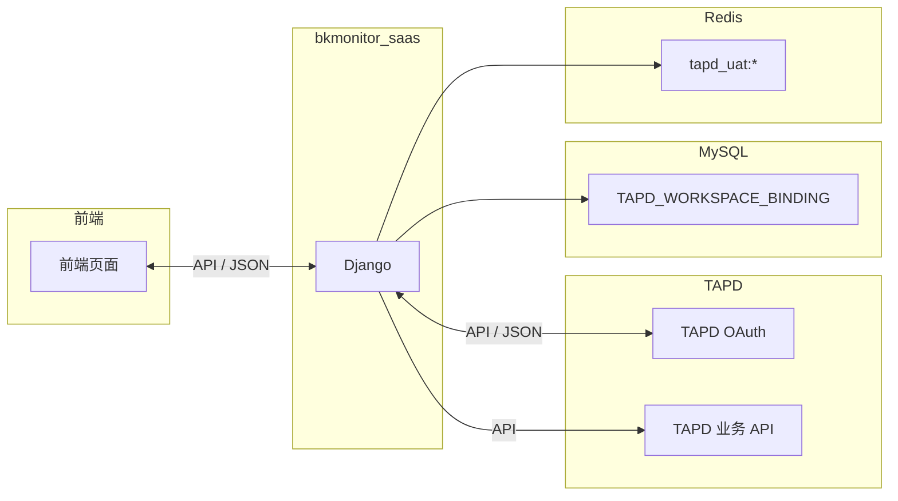

# TAPD 授权与建单 — 数据模型与数据流

> 基于 `requirement.md` 生成，聚焦授权部分的数据建模。
> 
> **已按设计评审结论（v1，2026-06-17）修订。**

---

## 1. 场景类型

**简单 CRUD** — 单条写入/更新，无并发冲突，单机部署，数据量级低。满足快速通道条件。

---

## 2. 核心实体

| 实体 | 说明 | 来源 | 存储 |
|------|------|------|------|
| **TAPD 项目关联** | `space_uid` 与 `tapd_workspace_id` 的多对多映射，一次关联全空间共享 | 需求 D-01（修订后） | MySQL |

**非持久化实体（仅 Redis）**：

| 实体 | 说明 | 存储 |
|------|------|------|
| **用户 TAPD Token** | 用户维度的 TAPD OAuth access_token，AESCipher 加密后写入 Redis，TTL 自动过期 | Redis（key: `tapd_uat:{tenant}:{user}`） |

**外部实体（非持久化，参与数据流）**：

| 外部实体 | 说明 |
|----------|------|
| TAPD OAuth 服务 | 用户态/应用态授权、code 换 token |
| TAPD 业务 API | 获取用户项目列表、get_granted_workspaces、get_workspace_info |
| 前端页面 | 重定向目标 |

> **【评审后】**：`USER_TAPD_TOKEN` 不再作为持久化实体（已删除 MySQL 表），改为 Redis 非持久化存储。

---

## 3. ER 图



> **【评审后变更】**：
> - 删除 `USER_TAPD_TOKEN` 实体（token 不落 DB）
> - `space_id` → `space_uid`
> - 新增 `bk_tenant_id`
> - 唯一约束改为 `(bk_tenant_id, space_uid, tapd_workspace_id)`

### 字段清单

#### AbstractRecordModel 基础字段（自动继承）

| 字段 | 类型 | 约束 | 说明 |
|------|------|------|------|
| `id` | int | PK, 自增 | 主键 |
| `is_enabled` | boolean | 默认 `true` | 是否启用 |
| `is_deleted` | boolean | 默认 `false` | 是否删除（软删标记） |
| `create_user` | varchar(32) | 默认 `''` | 创建人 username，由 `save()` 自动填充当前用户 |
| `create_time` | datetime | auto_now_add | 创建时间 |
| `update_user` | varchar(32) | 默认 `''` | 最后修改人，由 `save()` 自动填充当前用户 |
| `update_time` | datetime | auto_now | 最后修改时间 |

> 继承来源：`bkmonitor/utils/model_manager.py` → `class AbstractRecordModel(models.Model)`
> 配套 Manager：`RecordModelManager`，默认过滤 `is_deleted=True` 的记录；原始查询器为 `origin_objects`

#### TapdWorkspaceBinding（新增表）

| 字段 | 类型 | 约束 | 说明 |
|------|------|------|------|
| `bk_tenant_id` | varchar(64) | 默认 `'default'` | 蓝鲸租户 ID，对齐仓内多租户惯例 |
| `space_uid` | varchar(128) | 必填 | 蓝鲸空间唯一标识（全局唯一，替代裸 `space_id`） |
| `bk_biz_id` | int | 必填 | 蓝鲸 CMDB 业务 ID，冗余加索引 |
| `tapd_workspace_id` | varchar(64) | 必填 | TAPD 项目 ID |
| `tapd_workspace_name` | varchar(255) | 必填 | TAPD 项目名称 |
| `create_user` | varchar(32) | 默认 `''` | 发起关联的用户（AbstractRecordModel 自动审计） |
| `(bk_tenant_id, space_uid, tapd_workspace_id)` | - | **唯一约束** | 保证关联幂等 |

> **代码位置**：`bkmonitor/bkmonitor/models/tapd.py` → `class TapdWorkspaceBinding(AbstractRecordModel)`
> **导出声明**：`__all__` 列表包含该模型，并在 `bkmonitor/bkmonitor/models/__init__.py` 中统一导入
> **创建人审计注意**：应用态授权回调中 `request.user` 是管理员，真实发起人需从 `signed_state.initiator` 显式覆盖 `create_user`

### 设计说明

- **TAPD_WORKSPACE_BINDING**：唯一约束 `(bk_tenant_id, space_uid, tapd_workspace_id)` 实现关联幂等，重复授权无副作用
- **【评审后删除】**：~~USER_TAPD_TOKEN 表~~ → token 写 Redis（AESCipher 加密 + TTL），不持久化
- **空间主键变更**：`space_id`（仅 space_type 内唯一）→ `space_uid`（全局唯一）
- **多租户**：`bk_tenant_id` 对齐仓内 13 个模型惯例

### 安全策略

| 项目 | 策略 | 说明 |
|------|------|------|
| `access_token` 存储 | **Redis + AESCipher 加密 + TTL** | `AESCipher(key=SECRET_KEY, iv=None)` 每次生成随机 IV，加密后写入 Redis，TTL 对齐 token 过期时间 | |
| ~~数据库访问控制~~ | ~~最小权限原则~~ | ~~仅 bkmonitor_saas 应用账号可访问 USER_TAPD_TOKEN 表~~ → **已删除** |
| 日志脱敏 | `access_token` 禁止明文落日志 | 日志中仅记录 token 前 8 位 + `***` |

> **【评审后】加密方案变更**：Fernet → AESCipher（`bkmonitor/utils/cipher.py`），不传固定 IV。

### ~~Token 存储方案评估~~ → **已删除**

> 评审结论：一期直接使用 Redis + AESCipher + TTL，无需 MySQL 持久化。

### 接口鉴权方案

**说明**：`TAPD_REQUIRED` Permission 为 DRF `BasePermission` 子类，挂载在 `TapdViewSet` 上。请求到达时从 **Redis** 检查用户 token 的有效性；无效时抛出 `PermissionDenied(detail={"auth_url": "..."})`，DRF 返回 403 携参，前端拦截后跳转 TAPD 授权页面。

| 接口 | 鉴权方式 | 说明 |
|------|----------|------|
| B-01 查询用户可见 TAPD 项目 | **TAPD_REQUIRED + IAM** | `TAPD_REQUIRED` 确保用户已授权 TAPD（Redis 检查）；`IAM` 校验当前 space 操作权限 |
| B-07 查询 app 已授权 TAPD 项目 | **IAM** | 仅校验 space 操作权限，无需用户态 OAuth |
| B-03 应用态授权回调 | **HMAC 签名校验 + 验过期** | `signed_state` 验签，不碰 session |
| B-05 用户态授权回调 | **TAPD 回调（含 Session state）** | 验证 Session state 后换取 token 写 Redis |

> **【评审后】绑定类接口权限**：B-03（生成安装链接 / 发起绑定）走 `MANAGE_EVENT`（写语义），不继承只读 `VIEW_EVENT`（参见 `issue/views.py:85`）。

---

## 4. 数据流图

### 4.1 用户态授权流程（Token 获取）



**涉及实体**：Redis（写入 `tapd_uat:{tenant}:{user}`）

**异常处理**：
- code 无效/过期：返回前端提示「授权失败，请重试」
- TAPD API 不可用：记录错误日志，返回前端提示「服务暂时不可用，请稍后重试」
- Redis 写入失败：记录错误日志，返回前端错误提示

### 4.2 应用态授权流程（项目关联）



**涉及实体**：`TAPD_WORKSPACE_BINDING`（写入）

**异常处理**：
- 签名校验失败 / state 过期：302 重定向到前端，URL 带 `?tapd_bind=error&reason=invalid_signature`
- 重复回调（幂等）：唯一约束保证 upsert 无副作用，正常返回成功
- 前端状态感知：重定向 URL 携带 `?tapd_bind=success`，前端检测该参数后刷新关联列表

**【评审后关键变更】**：
- state 从 Session 态 → signed_state（HMAC 签名，烘进 cb query）
- workspace_info 从 Bearer Token（用户态）→ Basic Auth（app 级）
- create_user 从 `request.user`（管理员）→ `signed_state.initiator`（真实发起人）

### 4.3 查询用户 TAPD 项目列表

```mermaid
flowchart TD
    A["前端'选择TAPD项目'或'查看已关联项目'"] --> A1["TAPD_REQUIRED Permission 拦截"]
    A1 --> A2{检查 Redis tapd_uat:{tenant}:{user}}
    A2 -->|key 不存在或已过期| A3["PermissionDenied 403\n附带 auth_url\n前端跳转授权"]
    A2 -->|key 存在| B["B-01 查询用户可见项目\n(Bearer Token, 分页)"]
    B --> C["从 Redis 读取并解密 access_token"]
    C --> D["调用 TAPD 用户态 API 获取项目列表"]
    D -->|API 成功| E["按 bk_tenant_id + space_uid 查 TAPD_WORKSPACE_BINDING"]
    E --> E2["调 get_granted_workspaces（app 级 Basic，带缓存）"]
    E2 --> F["交叉标记四态: bound/stale/importable/unbound"]
    F --> G["返回带四态的项目列表 + install_url"]
    D -->|API 权限不足| H["返回'无TAPD项目权限'\n前端提示联系管理员"]
    D -->|API 服务异常| I["返回'TAPD服务暂时不可用'\n前端提示稍后重试"]
```

**涉及实体**：Redis（读取解密）、`TAPD_WORKSPACE_BINDING`（读取，比对标记）、TAPD API

**异常处理**：
- Token 不存在 / 已过期：`TAPD_REQUIRED` Permission 拦截 → `PermissionDenied(403)` → 前端跳转授权
- TAPD API 超时 / 异常：返回友好错误码，不影响已关联项目展示
- 用户无 TAPD 项目：返回空列表，前端展示「暂无项目」

**【评审后变更】**：
- 单接口 → 双接口（B-01 用户态 + B-07 app 级）
- `is_bound` 布尔值 → 四态
- Token 从 DB 读取解密 → Redis 读取解密

### ~~4.4 异步刷新 Token~~ → **已删除**

> **评审结论**：删除整套异步刷新机制。Token 过期即重走 OAuth（一次廉价重定向）。

### 数据流总览



> **【评审后】**：删除 `USER_TAPD_TOKEN` MySQL 表，token 存储移至 Redis。

---

## 5. 数据流汇总

| 流程 | 触发 | 读 | 写 | 外部依赖 | 异常处理 |
|------|------|----|----|----------|----------|
| 用户态授权 | 用户点击授权按钮 | - | **Redis** `tapd_uat:*` | TAPD OAuth | code 无效/token 换失败/Redis 写入失败 |
| 应用态授权 | TAPD 回调 | - | `TAPD_WORKSPACE_BINDING` | TAPD 回调 + get_workspace_info | 签名校验失败/state 过期/DB 写入失败 |
| 查询用户可见项目 | 前端选择 / 查看项目 | Redis + `TAPD_WORKSPACE_BINDING` | - | TAPD 用户态 API | Permission 拦截(未授权) / TAPD API 不可用 / 空列表 |
| ~~异步刷新 Token~~ | ~~用户访问时触发~~ | ~~USER_TAPD_TOKEN~~ | ~~USER_TAPD_TOKEN~~ | ~~TAPD refresh_token 接口~~ | ~~已删除~~ |

> **【评审后】**：删除异步刷新 Token 行，用户态授权写目标改为 Redis。

---

## 6. 关键设计决策

1. **存储选型**：MySQL（持久化关联关系）+ Redis（非持久化 token，TTL 自动过期）
2. **模型基类**：统一继承 `AbstractRecordModel`（`bkmonitor/utils/model_manager.py`），复用内部约定的审计字段与软删逻辑
3. **幂等策略**：唯一约束 + upsert（MySQL `INSERT ... ON DUPLICATE KEY UPDATE`）
4. **【评审后】Token 管理**：Redis 存储（AESCipher 加密 + TTL），不存储 refresh_token，不实现异步刷新
5. **【评审后】空间主键**：`space_uid` 替代 `space_id`（全局唯一性）
6. **【评审后】多租户**：`bk_tenant_id` 对齐仓内惯例
7. **【评审后】模块边界**：全部承载在 `fta_web/issue/` 下，不新建 `fta_web/tapd/`
8. **【评审后】状态管理**：用户态 callback 用 Session state，应用态 callback 用 signed_state（HMAC）
9. **【评审后】is_bound**：四态（bound/stale/importable/unbound）替代布尔值

---

## 7. 待确认项

| # | 内容 | 阶段 | 状态 |
|---|---|------|------|
| 1 | `bk_biz_id → space_uid` 映射前置依赖（`get_space_map`） | 设计 | 待实施 |
| 2 | `open_app_install` 的 `cb` 回调结果 resource 的具体结构 | 设计 | 外部，不阻塞 |
| 3 | `bkmonitor/utils/cipher.py` 中 AESCipher 的具体用法确认 | 实施 | 已对照源码（cipher.py:77/87） |
