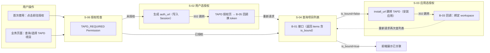
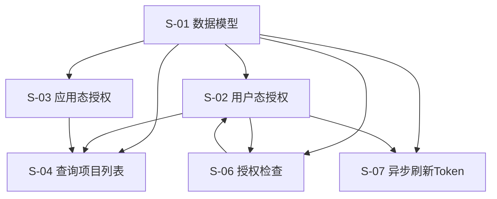

# TAPD 授权与建单 — 技术设计文档

> 状态：设计中

---

## 1. 需求背景 & 目标

### 背景

TAPD 存在两套独立的 OAuth 授权流程：用户态授权（获取用户 access_token）和应用态授权（关联 TAPD 项目）。监控平台需要整合这两套流程，让用户感知为线性操作。

### 目标

1. 实现用户态 OAuth 授权，获取用户 TAPD access_token
2. 实现应用态 OAuth 授权，关联 TAPD 项目到蓝鲸业务空间
3. 提供项目查询、关联查询、授权状态查询等接口
4. 支持异步刷新 Token，提升用户体验

### 不在范围内

- Issue 单据创建功能（本期不涉及）
- TAPD 项目详情查询（仅需项目列表）
- 用户权限管理（使用现有 IAM）

---

## 2. 关键环节一览图

> **说明**：
> - **U1 → S-06**：用户首次使用 TAPD 功能时，`TAPD_REQUIRED` 校验无有效 Token → 返回 403 + `auth_url` → 前端跳转 S-02 授权。
> - **U2 → S-04**：用户态已授权后，业务页面调 B-01 查项目列表。
> - **S-04 → S-03**：B-01 返回的 `items` 中，`is_bound=false` 的项目表示**应用态未关联**。前端可通过 `install_url` 引导用户跳转到 TAPD 安装应用 → B-03 回调完成绑定 → 重新拉取 B-01 列表验证 `is_bound` 变为 `true`。

---

## 3. 总体方案设计

### 子需求节点图

### 共享术语速查

| 术语 | 定义 | 所属子需求 |
|------|------|-----------|
| `space_id` | 蓝鲸业务空间 ID（内部用，接口统一使用 `bk_biz_id`） | S-01 |
| `bk_biz_id` | 蓝鲸 CMDB 业务 ID（接口统一参数） | S-01~S06 |
| `tapd_workspace_id` | TAPD 项目 ID | S-01 |
| `access_token` | TAPD 用户态访问令牌 | S-01, S-02 |
| `refresh_token` | TAPD 刷新令牌 | S-01, S-07 |
| `expires_at` | Token 过期时间 | S-01, S-07 |

### 代码模块路径

> **重点说明**：本期 TAPD 集成相关资源（Resource、Permission、Tool 函数、URL 路由等）统一放置于 `fta_web/tapd/` 模块下，**不混入 `fta_web/issue/`**。

| 模块路径 | 说明 |
|---------|------|
| `fta_web/tapd/` | TAPD 授权、项目查询、Token 管理、回调处理等全部后端资源 |
| `fta_web/issue/` | Issue 单创建、查询等（本期不涉及） |

此隔离保证 TAPD 集成作为独立功能模块，避免与现有 issue 逻辑耦合，后续 Issue 建单功能可在同一目录下复用基础资源（如授权检查、Token 获取等）。

---

## 4. 全局风险 & 跨子需求依赖

### 跨子需求风险

| 风险 | 影响子需求 | 缓解措施 |
|------|-----------|----------|
| TAPD OAuth 服务不可用 | S-02, S-03, S-07 | 错误重试 + 降级提示 |
| Token 加密方案不一致 | S-01, S-02, S-07 | 统一使用 Fernet 加密 |
| 数据库表结构变更 | 所有子需求 | Migration 版本控制 |

### 接口契约变化风险

| 接口 | 变更类型 | 影响范围 | 说明 |
|------|----------|----------|------|
| B-01 查询项目列表 | 新增 | S-04 | 返回结果中携带 `is_bound` 标记，前端本地筛选即可展示"已关联项目" |
| B-01 (install_url) 生成安装 URL | 新增 | S-03 | 由 B-01 内部调用，非独立对外接口 |
| B-03 应用态授权回调 | 新增 | S-03 | |
| B-05 用户态授权回调 | 新增 | S-02 | |

### 共享术语变更风险

| 术语 | 变更风险 | 影响子需求 |
|------|----------|-----------|
| `access_token` | 加密算法变更 | S-01, S-02, S-07 |
| `refresh_token` | 存储方式变更 | S-01, S-07 |
| `expires_at` | 时区处理变更 | S-01, S-07 |
