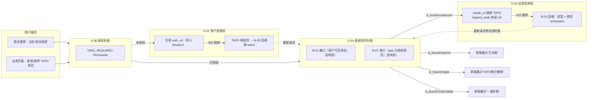
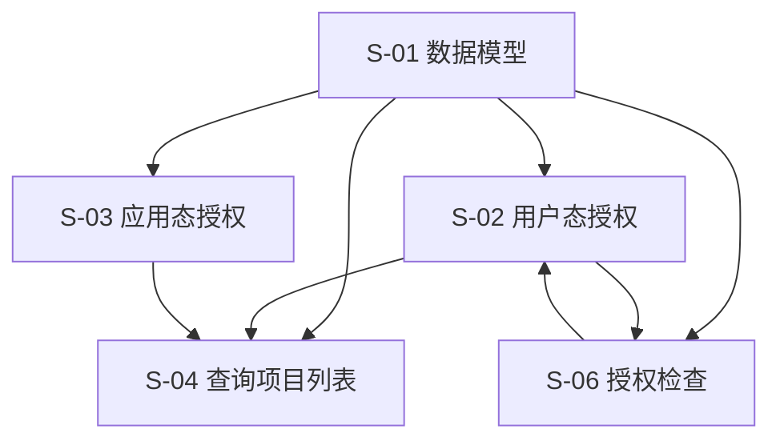

# TAPD 授权与建单 — 技术设计文档

> 状态：设计中（已按设计评审结论 v1，2026-06-17 修订）

---

## 1. 需求背景 & 目标

### 背景

TAPD 存在两套独立的 OAuth 授权流程：用户态授权（获取用户 access_token）和应用态授权（关联 TAPD 项目）。监控平台需要整合这两套流程，让用户感知为线性操作。

### 目标

1. 实现用户态 OAuth 授权，获取用户 TAPD access_token
2. 实现应用态 OAuth 授权，关联 TAPD 项目到蓝鲸业务空间
3. 提供项目查询、关联查询、授权状态查询等接口
4. ~~支持异步刷新 Token，提升用户体验~~ → **【评审后】删除，token 过期即重走 OAuth**

### 不在范围内

- Issue 单据创建功能（本期不涉及）
- TAPD 项目详情查询（仅需项目列表）
- 用户权限管理（使用现有 IAM）

---

## 2. 关键环节一览图

> **说明**：
> - **U1 → S-06**：用户首次使用 TAPD 功能时，`TAPD_REQUIRED` 校验无有效 Token → 返回 403 + `auth_url` → 前端跳转 S-02 授权。
> - **U2 → S-04**：用户态已授权后，业务页面调 B-01/B-07 查项目列表。
> - **S-04 → S-03**：B-01 返回的 `items` 中，`is_bound=unbound` 的项目表示**应用态未关联**。前端可通过 `install_url` 引导用户跳转到 TAPD 安装应用 → B-03 回调完成绑定 → 重新拉取 B-01 列表验证 `is_bound` 变为 `bound`。
> - **`is_bound` 四态**：`bound`（已关联）、`stale`（TAPD 侧已解绑）、`importable`（TAPD 已装应用但未本地绑定）、`unbound`（未关联）。
> - **`install_url` 的 `cb`** 中烘进 `signed_state`（HMAC 签名），TAPD 回调时原样返回，解决管理员在另一浏览器/账号完成授权的场景。

---

## 3. 总体方案设计

### 子需求节点图

> **【评审后】**：删除 S-07 异步刷新 Token 节点。

### 共享术语速查

| 术语 | 定义 | 所属子需求 |
|------|------|-----------|
| `space_uid` | 蓝鲸空间唯一标识（全局唯一，替代裸 `space_id`） | S-01 |
| `bk_biz_id` | 蓝鲸 CMDB 业务 ID（接口统一参数） | S-01~S-06 |
| `bk_tenant_id` | 蓝鲸租户 ID，多租户惯例字段 | S-01 |
| `tapd_workspace_id` | TAPD 项目 ID | S-01 |
| `access_token` | TAPD 用户态访问令牌（加密存储于 Redis） | S-01, S-02 |
| `signed_state` | HMAC 签名状态串（`base64url(json).hmac`），用于应用态授权 cb | S-03 |
| `is_bound` | 关联四态：`bound`/`stale`/`importable`/`unbound` | S-04 |
| `initiator` | 关联动作真实发起人（从 signed_state 提取，覆盖 create_user） | S-03 |

> **【评审后删除】**：`refresh_token`、`expires_at` 从共享术语中移除（S-07 已删除）。

### 代码模块路径

> **【评审后】重点说明**：本期 TAPD 集成相关资源（Resource、Permission、Tool 函数、URL 路由等）统一放置于 **`fta_web/issue/`** 模块下。**不新建 `fta_web/tapd/`**。

| 模块路径 | 说明 |
|---------|------|
| `fta_web/issue/` | TAPD 授权、项目查询、回调处理、Token 管理等**全部后端资源**（最终拍板，TAPD 是 Issues 的子功能） |
| `bkmonitor/api/tapd/` | TAPD API 调用封装（如 `get_workspace_info`、`get_granted_workspaces` 等） |

> **【评审前已被否】**：原设计将 TAPD 资源放 `fta_web/tapd/`，评审结论（N1）要求统一在 `issue/` 下承载。

此设计保证 TAPD 集成作为 Issue 的子功能模块，在 issue 模块内做清晰内部分层，不新建独立目录。

---

## 4. 全局风险 & 跨子需求依赖

### 跨子需求风险

| 风险 | 影响子需求 | 缓解措施 |
|------|-----------|----------|
| TAPD OAuth 服务不可用 | S-02, S-03 | 错误重试 + 降级提示 |
| ~~Token 加密方案不一致~~ | ~~S-01, S-02, S-07~~ | ~~统一使用 Fernet 加密~~ → **【评审后】统一使用 AESCipher（不传 IV）** |
| 数据库表结构变更 | 所有子需求 | Migration 版本控制 |

### 接口契约变化风险

| 接口 | 变更类型 | 影响范围 | 说明 |
|------|----------|----------|------|
| B-01 查询用户可见项目 | 新增（改名） | S-04 | 返回结果中携带 `is_bound` **四态**标记 |
| B-07 查询 app 已授权项目 | 新增 | S-04 | 从 `get_granted_workspaces` 获取，与用户态 B-01 区分 |
| B-01 (install_url) 生成安装 URL | 新增 | S-03 | `cb` 中烘进 `signed_state`（HMAC 签名） |
| B-03 应用态授权回调 | 新增 | S-03 | 验签 + 验过期，不走 session |
| B-05 用户态授权回调 | 新增 | S-02 | token 写 Redis（AESCipher 加密 + TTL） |

### 共享术语变更风险

| 术语 | 变更风险 | 影响子需求 |
|------|----------|-----------|
| `access_token` | 加密算法变更（Fernet → AESCipher） | S-01, S-02 |
| `is_bound` | 布尔值 → 四态 | S-04 |
| `space_id` | 废弃，全局迁移到 `space_uid` | S-01, S-03, S-04 |

---

## 5. 设计评审定稿摘要

本设计已按 2026-06-17 设计评审结论修订，关键决策点如下：

| 编号 | 决策 | 结论 | 来源 |
|------|------|------|------|
| A1 | Token 存储 | Redis + AESCipher + TTL，不落 DB，删除 `UserTapdToken` 表 | 评审结论 |
| A2 | 应用态 state | `signed_state = base64url(json).hmac` 烘进 `cb`，验签不验 session | 评审结论（修复 C1） |
| A3 | 回调取 workspace 信息 | app 级 Basic Auth，不用用户态 Bearer | 评审结论（修复 C2） |
| B1 | 唯一键 | `(bk_tenant_id, space_uid, tapd_workspace_id)` | 评审结论 |
| N1 | 模块边界 | 全部承载在 `fta_web/issue/` 下，不新建 `fta_web/tapd/` | 评审结论 |
| N2 | 多租户 | 表加 `bk_tenant_id` 字段 | 评审结论 |
| — | 表名 | 裸 snake_case，不加 `bkmonitor_` 前缀 | 评审否决 |
| — | S-07 | **整套删除**（异步刷新 Token） | 评审结论 |
