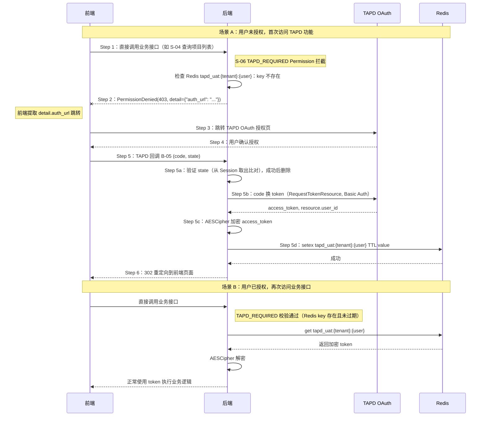

# S-02 用户态授权（Token 获取与存储）

> 状态：已按设计评审结论（v1，2026-06-17）修订。
>
> **评审核心结论**：Token 用 AESCipher 加密后写 Redis（TTL 对齐过期时间），不落 DB。删除 `refresh_token`、删除 S-07 异步刷新。用户态 session state 保留。

---

## ★ 1. 术语

| 术语 | 含义 | 引用 |
|------|------|------|
| `code` | TAPD OAuth 授权码，有效期 10 分钟 | — |
| `access_token` | TAPD 用户态访问令牌，有效期 2 小时 | 见父文档 §4.3 |
| `state` | OAuth 防 CSRF 参数，格式 `{nonce}:{bk_biz_id}`，nonce 格式 `{user_name}:{random_str}` | — |
| `auth_url` | TAPD OAuth 授权页 URL，由后端内部生成，拼入 state 后通过 403 `detail.auth_url` 通知前端跳转 | — |
| `AESCipher` | `bkmonitor/utils/cipher.py` 的对称加密类 | `utils/cipher.py:67` |
| `tapd_user_id` | TAPD OAuth 返回的 `resource.user_id`，随 token 存入 Redis value | S-01 §4c |

---

## ★ 2. 现状（AS-IS）

### 2.1 现状描述

当前蓝鲸监控平台无 TAPD 用户态授权功能。用户需要在 TAPD 系统中手动操作，无法在监控平台中获取 TAPD access_token。

### 2.2 痛点

- 痛点 1：用户无法在监控平台中直接访问 TAPD 项目数据
- 痛点 2：无 Token 存储机制，每次访问都需要重新授权
- 痛点 3：Token 过期后用户无感知，导致功能不可用

---

## ★ 3. 方案（TO-BE）

### 3.1 方案概述

用户态授权采用**被动触发模式** + **Redis 加密存储**：

1. 前端**不主动**生成授权 URL，而是**直接调用业务接口**（如 S-04 查询项目列表）
2. S-06 `TAPD_REQUIRED` Permission 拦截请求，若用户未授权，则**内部生成 `auth_url`** → `PermissionDenied(403, detail={"auth_url": ...})`
3. 前端拦截 403，提取 `detail.auth_url` 跳转至 TAPD OAuth 授权页
4. 用户确认授权后，TAPD 调用 **B-05 回调** URL，后端用 `code` 换取 `access_token`
5. **`access_token` 用 AESCipher 加密后写入 Redis**（key：`tapd_uat:{bk_tenant_id}:{username}`，TTL = token 过期时间），不存 DB
6. 如果前端已经持有 `auth_url`，也可独立点击「前往授权」按钮跳转（复用最近一次 403 响应中的 `auth_url`，或重新请求业务接口获取）

> **关键变更（评审后）**：
> - Token 存储从 MySQL（`UserTapdToken` 表）→ **Redis + AESCipher**
> - 删除 `refresh_token`、删除异步刷新机制——token 过期即重走 OAuth（一次廉价重定向）
> - Token 所在 Redis key TTL 到期自动淘汰，无需清理逻辑

### 3.2 关键决策点

| 决策 | 选择 | 理由 | 备选方案 | 否决原因 |
|------|------|------|----------|----------|
| auth_url 生成位置 | Permission 内部生成 | 减少接口数量，授权流程更紧凑 | 保留独立 B-04 接口（前端主动调用） | 前端多一次请求，流程冗余 |
| Token 存储 | **Redis + AESCipher + TTL** | 评审结论 A1：加密后写 Redis，到期自动淘汰 | MySQL 持久化 + 异步刷新 | 比例失衡，过度设计 |
| 刷新机制 | **无（过期重走 OAuth）** | 一次重定向成本低，无需复杂刷新 | 异步刷新（S-07） | 评审删除 S-07 |
| 加密方案 | **AESCipher（不传固定 IV）** | 复用仓内现有工具，`SECRET_KEY` 作 key | Fernet | 评审结论 m1 |
| state 管理 | Django Session | 用户态 callback 是同人同浏览器，session 够用 | 签名 state | 用户态场景可用 session |

> **State 存储说明**：OAuth state 为明文随机 nonce + timestamp，通过 `request.session[f'tapd_oauth_state_{bk_biz_id}']` 读写。验证成功（B-05 callback）后**立即删除**（`del request.session[key]`），防止重放攻击。一期不额外加密，与既有微信 OAuth 实现模式一致。

> **AESCipher IV 注意**：实例化 `AESCipher(key=settings.SECRET_KEY)` 时**不传 iv 参数**。`AESCipher` 在 `iv` 为空时每次生成随机 IV 并前置到密文、解密时从首块读回；传固定 IV 会泄露相等性。

### 3.3 行为差异对照表

| 场景 | AS-IS | TO-BE | 影响 |
|------|-------|-------|------|
| 用户授权触发 | 无 | 调用业务接口 → 被 Permission 拦截 → 跳授权页 → 回调 | 新增被动授权能力 |
| Token 存储 | 无存储 | **Redis 加密存储，TTL 自动过期** | 新增功能 |
| 授权状态检查 | 无 | Permission 层自动拦截 | 新增功能 |
| Token 刷新 | 无 | **无刷新，过期重走 OAuth** | 简化设计 |
| 前端授权按钮 | 无 | 可以直接使用最近一次业务接口 403 返回的 `auth_url` | 减少接口依赖 |

---

## ★ 4a. 接口设计

### 4a.1 对外接口

#### B-05 用户态授权回调

```python
class UserAuthCallbackResource(Resource):
    """TAPD 用户态授权回调"""
    
    class RequestSerializer(serializers.Serializer):
        code = serializers.CharField(label="授权码")
        state = serializers.CharField(label="防 CSRF 状态码")
        resource = serializers.JSONField(label="授权用户信息", required=False)
    
    class ResponseSerializer(serializers.Serializer):
        status = serializers.CharField(label="授权状态")
        message = serializers.CharField(label="提示信息")
    
    def perform_request(self, validated_request_data):
        # 1. 从 state 中解析 bk_biz_id（state = f"{nonce}:{bk_biz_id}")
        # 2. 验证 state 参数（从 Session 取出比对）
        # 3. 验证通过后删除 Session 中的 state，防止重放攻击
        # 4. 用 code 换取 access_token（RequestTokenResource，Basic Auth）
        # 5. 若 resource 存在，记录 tapd_user_id
        # 6. 【评审后】AESCipher 加密 access_token → 写入 Redis
        #    key: tapd_uat:{bk_tenant_id}:{username}
        #    value: {access_token(密文), tapd_user_id, token_type, expires_at}
        #    TTL: 与 token 过期时间对齐
        # 7. 302 重定向到前端页面
        pass
```

> **说明**：该接口为 TAPD OAuth 回调接口，实际返回 **302 重定向**，无 JSON 响应体。成功时重定向到前端页面（URL 参数：`?auth=success`），失败时重定向到错误页（URL 参数：`?auth=error`）。

| 接口 | 输入 | 输出 | 异常 |
|------|------|------|------|
| B-05 用户态授权回调 | `code, state, resource` | `302 重定向` | `code 无效, state 不匹配, TAPD API 异常` |

### 4a.2 内部协作接口

| 接口 | 调用方 | 被调用方 | 说明 |
|------|--------|----------|------|
| `generate_auth_url(bk_biz_id)` | `TAPD_REQUIRED` Permission (S-06) | 工具函数 | 构造 OAuth URL，state 写入 Session（含 nonce + bk_biz_id） |
| `validate_state(state_str)` | B-05 | 工具函数 | 从 Session 读取并比对 state，比对成功后删除，防止重放攻击 |
| `exchange_token(code)` | B-05 | TAPD API | `POST /tokens/request_token`，用 code 换 access_token；（Basic Auth） |
| `save_tapd_token(bk_tenant_id, username, token_data)` | B-05 | Redis 操作 | AESCipher 加密后写入 Redis，TTL 对齐 expires_at |

> **【评审后删除】**：`encrypt_token()` → 改为 `AESCipher`（不传 IV）
> **【评审后删除】**：`upsert_user_token()` → 已删除，不再写 DB

### 4a.3 契约变更声明

| 变更类型 | 接口 | 变更内容 | 影响的子需求 |
|---------|------|---------|------------|
| 新增 | B-05 用户态授权回调 | 全新接口（对外公开的 callback URL） | S-04 |

### 4a.4 外部依赖（TAPD API）

#### `RequestTokenResource`

```python
class RequestTokenResource(Resource):
    """TAPD 用户态 OAuth：用 code 换取 access_token"""
    
    class RequestSerializer(serializers.Serializer):
        code = serializers.CharField(label="授权码")
        grant_type = serializers.CharField(label="授权类型", default="authorization_code")
        redirect_uri = serializers.URLField(label="回调地址")
    
    class ResponseSerializer(serializers.Serializer):
        access_token = serializers.CharField(label="用户态访问令牌")
        expires_in = serializers.IntegerField(label="有效期（秒）")
        token_type = serializers.CharField(label="令牌类型")
        scope = serializers.CharField(label="授权范围")
        resource = serializers.JSONField(label="授权用户信息")
        # 【评审后】refresh_token 不存储，但 TAPD 可能返回；收到后忽略即可
    
    def perform_request(self, validated_request_data):
        # POST http://apiv2.tapd.woa.com/tokens/request_token
        # Header: Authorization: Basic base64(client_id:client_secret)
        pass
```

> **Demo API 返回示例**：
> ```json
> {
>   "status": 1,
>   "data": {
>     "access_token": "access_token_abc123def456",
>     "expires_in": 7200,
>     "token_type": "Bearer",
>     "scope": "read",
>     "resource": {
>       "type": "user",
>       "user_id": "user123"
>     }
>   },
>   "info": "success"
> }
> ```
> **注意**：TAPD 可能返回 `refresh_token`，但一期**不存储**（评审结论）。收到后忽略即可，token 过期后重走 OAuth。

| 属性 | 值 |
|------|-----|
| URL | `POST http://apiv2.tapd.woa.com/tokens/request_token` |
| 鉴权 | **Basic Auth**（`base64(client_id:client_secret)`） |
| 返回格式 | `{"status": 1, "data": {...}, "info": "success"}` |

> 说明：`RequestTokenResource` 不属于蓝鲸体系，不携带 `x-bkapi-authorization`。建议统一放到 `bkmonitor/api/tapd/default.py`，继承自定义 `TapdBaseResource`（占位基类，适配 TAPD 非标准返回格式）。

---

## +5. 时序图



> - **Step 1~2**：授权 URL 生成不再由前端主动调 B-04，而是在请求拦截时内部完成（S-06 `TAPD_REQUIRED` → `generate_auth_url(bk_biz_id)`）。
> - **Step 3~6**：标准的 OAuth 2.0 授权跳转 + callback 换取 token 流程不变。
> - **【评审后】Step 5d**：token 写 Redis（加密 + TTL），不写 DB。
> - 前端如需「前往授权」按钮：优先复用最近一次 403 返回的 `auth_url`（有效期内），如无则重新调用业务接口触发 Step 1~2。

---

## +6. 异常处理

| 场景 | 行为 | 是否对外暴露 |
|------|------|:----------:|
| state 不匹配 | 返回错误页「授权失败，请重试」（CSRF 攻击或 Session 过期）；记录安全日志，**不重定向到业务页面**（避免重定向循环） | 是 |
| code 无效/过期 | 返回错误页「授权失败，请重试」 | 是 |
| TAPD API 不可用 | 记录错误日志，返回前端「服务暂时不可用」 | 是 |
| Redis 写入失败 | 记录错误日志，返回前端「授权失败」 | 是 |

---

## +10. 影响范围

| 影响对象 | 影响类型 | 影响描述 | 是否破坏性变更 |
|---------|---------|---------|:----------:|
| `fta_web/tapd/` | 接口变更 | 新增 1 个 Resource（B-05），1 个工具函数 | 否 |
| `urls.py` | 接口变更 | 新增 1 个 URL 路由（B-05 回调） | 否 |
| Redis | 新增 | 新增 token 缓存 key（`tapd_uat:*`） | 否 |
| 前端页面 | 行为变更 | OAuth 授权由「主动准备 URL」改为「被动跳转」 | 否 |

---

## +11. 待定问题

| 编号 | 问题 | 影响范围 | 建议决策时间 | 负责人 |
|------|------|---------|------------|--------|
| T-01 | Redis key 删除策略 | S-02 | 实施阶段 | 后端开发 |
