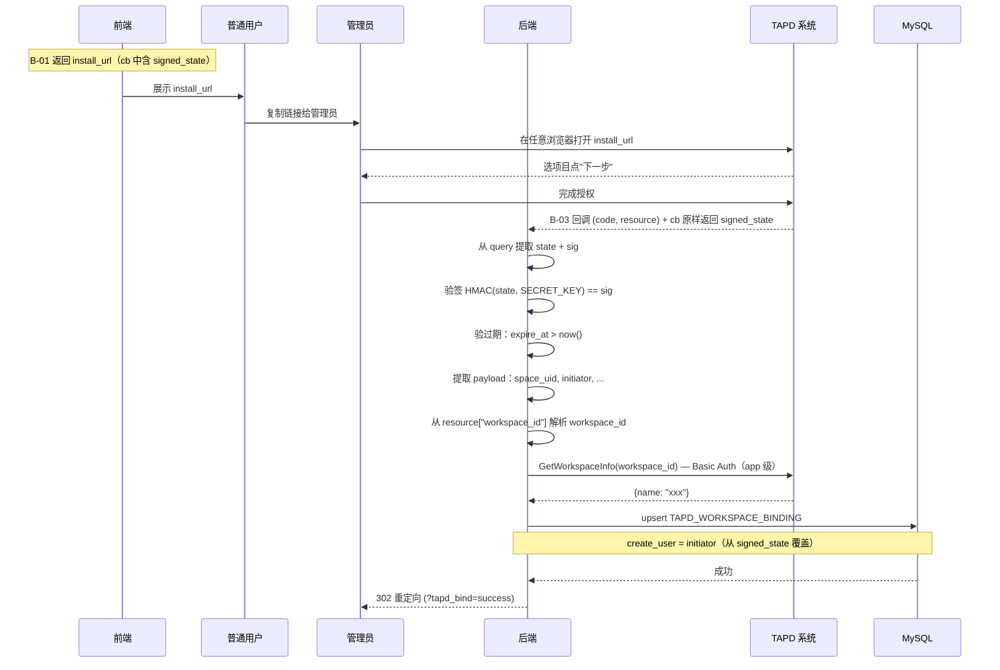

# S-03 应用态授权

> 状态：已按设计评审结论（v1，2026-06-17）修订。
>
> **评审核心结论**：
> - **A2**：应用态 state 改为 `signed_state = base64url(json).hmac`，作为 `cb` 回调 URL 自身的 query 参数烘进去。回调只验签 + 验过期，不碰 session。
> - **A3**：回调取 workspace 信息走 app 级 Basic Auth，不用用户态 Bearer（与现网 `TapdAPIResource` 对齐）。

---

## ★ 1. 术语

| 术语 | 含义 | 引用 |
|------|------|------|
| `workspace_id` | TAPD 项目 ID | 见父文档 §4.3 |
| `workspace_name` | TAPD 项目名称 | 见父文档 §4.3 |
| `upsert` | MySQL 的 INSERT ... ON DUPLICATE KEY UPDATE 语法 | 见 S-01 §1 |
| `signed_state` | 签名状态串，`base64url(json_payload).hmac`，含 `bk_tenant_id/space_uid/bk_biz_id/initiator/nonce/expire_at` | 本设计 §4a |
| `cb` | TAPD `open_app_install` 的回调地址参数，由我们完全控制 | 本设计 §4a |
| `initiator` | 关联动作的真实发起人（普通用户 username），用于回调时覆盖 `create_user` | A2 |
| `nonce` | 随机值，仅作签名盐，不实现「一次性」假承诺 | A2 |
| `install_url` | TAPD OAuth 跳转 URL，用于打开项目安装页面 | 本设计 §4a |

---

## ★ 2. 现状（AS-IS）

### 2.1 现状描述

当前蓝鲸监控平台无法与 TAPD 项目关联。用户需要在 TAPD 系统中手动配置应用授权，无法在监控平台中自动关联项目。

### 2.2 痛点

- 痛点 1：用户需要在 TAPD 系统中手动配置应用授权，操作复杂
- 痛点 2：无法在监控平台中查看已关联的 TAPD 项目
- 痛点 3：关联关系需要手动维护，容易出现数据不一致

---

## ★ 3. 方案（TO-BE）

### 3.1 方案概述

实现 TAPD 应用态授权回调接口（B-03），当用户在 TAPD 中安装蓝鲸监控应用时，TAPD 会回调该接口。

**【评审后核心变更】**：
1. `install_url` 的 `cb` 参数中，将 `signed_state` 作为 query 参数烘进去（如 `cb=https://monitor/api/tapd/app_install_callback/?state=xxx&sig=yyy`）
2. TAPD 回调时，`cb` URL 原样返回，`signed_state` 随之回到我们手中
3. 回调**只验签 + 验过期**，不碰 session——解决管理员在另一浏览器/账号完成授权的场景
4. 从 `resource["workspace_id"]` 解析 workspace_id，走 **app 级 Basic Auth** 调用 `get_workspace_info` 获取名称
5. upsert `TAPD_WORKSPACE_BINDING`，从 `signed_state.initiator` 显式写入 `create_user`

### 3.2 关键决策点

| 决策 | 选择 | 理由 | 备选方案 | 否决原因 |
|------|------|------|----------|----------|
| state 格式 | **`signed_state = base64url(json).hmac`** | A2：签名串烘进 cb，不依赖 session | Session 态 state | C1：破坏「转链接给管理员」核心场景 |
| state 校验方式 | **HMAC 验签 + 验过期** | A2：回调只验签，不碰 session | Session 比对 | 管理员在另一浏览器/账号完成授权时 session 无 state |
| nonce 语义 | **仅签名盐，不防重放** | A2：B-03 重放是良性的（upsert 幂等 + 授权由 TAPD 项目管理员把关） | 一次性 nonce | 实现「一次性」是假承诺 |
| 身份获取 | `signed_state.initiator` | A2：`request.user` 是管理员，需从 state 中记录真实发起人 | 不记录发起人 | 审计需要 |
| 项目信息获取 | **app 级 Basic Auth** | A3：与现网 `TapdAPIResource` 对齐，回调操作者拿不到发起人 token | Bearer Token（用户态） | 与现网代码冲突 |
| 关联幂等策略 | 唯一约束 + upsert | 数据库层面保证，简单可靠 | 应用层去重 | 并发时可能重复插入 |

> **【评审前已被否】**：`state` 格式统一为 `{nonce}:{bk_biz_id}` 从 Session 取出比对 → **已废弃**。应用态授权与用户态授权 state 方案不一致（用户态仍为 Session，应用态改为签名串）。

### 3.3 行为差异对照表

| 场景 | AS-IS | TO-BE | 影响 |
|------|-------|-------|------|
| 项目关联 | 无关联关系 | 自动关联 TAPD 项目 | 新增功能 |
| 关联查询 | 无查询接口 | 可查询已关联项目 | 新增功能 |
| 重复关联 | 无处理 | 幂等处理，无副作用 | 新增功能 |
| 非管理员转发 | 无 | 管理员在任意浏览器/账号完成授权均可成功 | 新增核心场景支持 |
| 发起人记录 | 无 | 从 signed_state.initiator 记录真实发起人 | 新增审计能力 |

---

## ★ 4a. 接口设计

### 4a.1 对外接口

#### B-03 应用态授权回调

```python
class AppInstallCallbackResource(Resource):
    """TAPD 应用态授权回调
    
    由 TAPD OAuth 跳转流程发起，用户点击"下一步"后，
    TAPD 自动回调该接口，携带 code + resource。
    
    cb（回调地址）示例：
        https://monitor.bk.example.com/api/tapd/app_install_callback/
    
    实际 env 中替换域名，路径由 urls.py 路由规则决定。
    
    【评审后】cb URL 的 query 中携带 signed_state：
        cb=https://monitor.bk.example.com/api/tapd/app_install_callback/
           ?state=eyJ0ZW5hbnRfaWQiOiJkZWZhdWx0Iiwic3BhY2VfdWlkIjoiY...&sig=abc123
    """
    
    class RequestSerializer(serializers.Serializer):
        code = serializers.CharField(label="授权码")
        resource = serializers.JSONField(label="授权项目信息", default={})
        state = serializers.CharField(label="签名状态串", required=False)
        sig = serializers.CharField(label="HMAC 签名", required=False)
        # 【评审后】state 和 sig 从 cb URL 的 query 中提取，TAPD 会将 cb 原样返回
        
        # resource JSON 结构示例（TAPD 回调注入）:
        # {
        #     "type": "workspace",
        #     "workspace_id": "69990779"
        # }
        # 一期直接取 resource["workspace_id"] 作为项目 ID
    
    class ResponseSerializer(serializers.Serializer):
        # 302 重定向到前端，无 JSON 响应体
        pass
    
    def perform_request(self, validated_request_data):
        # 【评审后】Step 1：从 request.query_params 提取 state + sig
        # Step 2：验签 HMAC(state, SECRET_KEY) == sig，失败 → 错误页
        # Step 3：验过期：json.loads(base64url_decode(state))["expire_at"] > now()，失败 → 错误页
        # Step 4：提取 payload：bk_tenant_id, space_uid, bk_biz_id, initiator, nonce
        # Step 5：从 resource["workspace_id"] 解析 workspace_id
        # Step 6：若 resource 缺失或 workspace_id 为空，返回错误页
        # Step 7：【A3】走 app 级 Basic Auth 调 GetWorkspaceInfoResource 获取 workspace_name
        #          （不复用用户态 token，与现网 TapdAPIResource 对齐）
        # Step 8：upsert TAPD_WORKSPACE_BINDING
        #          - bk_tenant_id, space_uid, bk_biz_id, tapd_workspace_id, tapd_workspace_name
        #          - create_user = initiator（从 signed_state 显式覆盖）
        # Step 9：302 重定向到前端
        pass
```

> **Demo API 示例**（TAPD 回调请求参数）：
> ```json
> {
>   "code": "4f9b2fab25a7c69715d426295a66717769666a0c",
>   "resource": {
>     "type": "workspace",
>     "workspace_id": "69990779"
>   }
> }
> ```
> 同时 query string 携带：`state=eyJ0ZW5hbnRfaWQiOiJkZWZhdWx0Iiwic3BhY2VfdWlkIjoiY...&sig=abc123`
>
> **成功响应**（302 重定向）：
> ```http
> HTTP/1.1 302 Found
> Location: https://monitor.bk.example.com/tapd/bind?tapd_bind=success
> ```
> **失败响应**（302 重定向到错误页）：
> ```http
> HTTP/1.1 302 Found
> Location: https://monitor.bk.example.com/tapd/bind?tapd_bind=error&reason=invalid_signature
> ```

| 接口 | 输入 | 输出 | 异常 |
|------|------|------|------|
| B-03 应用态授权回调 | `code, resource` + `state, sig`（query 中） | `302 重定向` | `签名校验失败, state 过期, code 无效, 获取项目信息失败, DB写入失败` |

### 4a.2 内部协作接口

| 接口 | 调用方 | 被调用方 | 说明 |
|------|--------|----------|------|
| `generate_signed_state(payload)` | B-01（生成 install_url 时） | 工具函数 | 构造 `signed_state = base64url(json).hmac`，payload 含 bk_tenant_id/space_uid/bk_biz_id/initiator/nonce/expire_at |
| `verify_signed_state(state, sig)` | B-03 | 工具函数 | 验签 HMAC + 验过期 |
| `get_workspace_info()` | B-03 | TAPD API | `GET /workspaces/get_workspace_info?workspace_id=xxx`，**Basic Auth**（与现网 `TapdAPIResource` 对齐） |
| `upsert_binding()` | B-03 | 数据库操作 | 插入或更新关联记录，create_user 从 initiator 显式覆盖 |

> **【评审前已废弃】**：`validate_state()` 从 Session 取出比对 → 已废弃，应用态不再使用 Session state。

### 4a.3 外部依赖（TAPD API）

| 接口 | 位置 | 入参 | 返回 | 鉴权 |
|------|------|------|------|------|
| `GetWorkspaceInfoResource` | `bkmonitor/api/tapd/default.py` | `workspace_id` | `{Workspace: {id, name, pretty_name, ...}}` | **Basic Auth**（`client_id:client_secret`） |

> **【评审后 A3 关键变更】**：
> - B-03 **不再调用**用户态 Bearer Token 获取 workspace 信息
> - 直接复用现网 `TapdAPIResource`（`api/tapd/default.py:20`）的 app 级 Basic Auth
> - 回调操作者可能是管理员，根本拿不到发起人的 token

### 4a.4 契约变更声明

| 变更类型 | 接口 | 变更内容 | 影响的子需求 |
|---------|------|---------|------------|
| 新增 | B-03 应用态授权回调 | 全新接口 | S-03 |
| 修改 | B-01 生成 install_url | 将 signed_state 烘进 cb 的 query | S-04 |

---

## +5. 时序图



> **说明**：
> 1. `signed_state` 在 **B-01 生成 install_url 时**构造，作为 `cb` URL 的 query 参数烘进去。
> 2. TAPD 会将 `cb` URL **原样返回**，`signed_state` 随之回到我们手中。
> 3. 回调**只验签 + 验过期**，不碰 session——管理员在任意浏览器/账号均可完成授权。
> 4. `initiator` 记录真实发起人，用于审计归属。
> 5. `get_workspace_info` 走 **app 级 Basic Auth**，不与用户态 token 绑定。

---

## +6. 异常处理

| 场景 | 行为 | 是否对外暴露 |
|------|------|:----------:|
| 签名校验失败 | 记录安全日志，302 重定向错误页「授权失败，请重试」 | 是 |
| state 已过期 | 同上 | 是 |
| resource 缺失或 workspace_id 为空 | 记录错误日志，302 重定向错误页 | 是 |
| 获取项目信息失败 | 记录错误日志，302 重定向错误页 | 是 |
| 数据库写入失败 | 记录错误日志，302 重定向错误页 | 是 |
| 重复回调（幂等） | 正常返回成功，无副作用 | 否 |

---

## +10. 影响范围

| 影响对象 | 影响类型 | 影响描述 | 是否破坏性变更 |
|---------|---------|---------|:----------:|
| `fta_web/tapd/` | 接口变更 | 新增 1 个 Resource | 否 |
| `urls.py` | 接口变更 | 新增 1 个 URL 路由 | 否 |
| TAPD 系统 | 行为变更 | 需要配置回调 URL | 否 |
| HMAC 工具 | 新增 | 新增签名/验签工具函数 | 否 |

---

## +11. 待定问题

| 编号 | 问题 | 影响范围 | 建议决策时间 | 负责人 |
|------|------|---------|------------|--------|
| T-01 | `open_app_install` 的 `cb` 回调结果 resource 的具体结构 | S-03 | 实施前 | 后端开发 |
| T-02 | TAPD OAuth 跳转链接配置（回调 URL 格式、client_id、test 参数） | S-03 | 实施前 | 运维 |
| T-03 | `install_url` 的 `cb=` 整体 urlencode 策略 | S-03 | 实施前 | 后端开发 |
