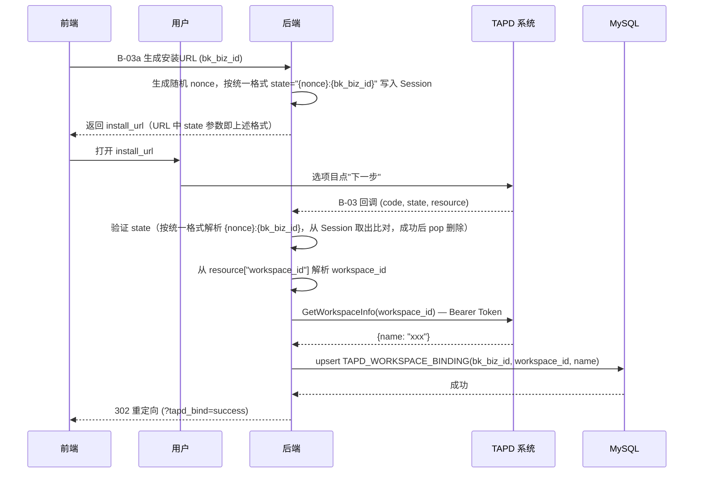

# S-03 应用态授权

> 状态：设计中

---

## ★ 1. 术语

| 术语 | 含义 | 引用 |
|------|------|------|
| `workspace_id` | TAPD 项目 ID | 见父文档 §4.3 |
| `workspace_name` | TAPD 项目名称 | 见父文档 §4.3 |
| `upsert` | MySQL 的 INSERT ... ON DUPLICATE KEY UPDATE 语法 | 见 S-01 §1 |
| `state` | 防 CSRF 随机串，后端生成后写入 Session，跳转时拼入 URL | S-03 §4a |
| `install_url` | TAPD OAuth 跳转 URL，用于打开项目安装页面 | S-03 §4a |

---

## ★ 2. 现状（AS-IS）

### 2.1 现状描述

当前蓝鲸监控平台无法与 TAPD 项目关联。用户需要在 TAPD 系统中手动配置应用授权，无法在监控平台中自动关联项目。

### 2.2 痛点

- 痛点 1：用户需要在 TAPD 系统中手动配置应用授权，操作复杂
- 痛点 2：无法在监控平台中查看已关联的 TAPD 项目
- 痛点 3：关联关系需要手动维护，容易出现数据不一致

---

## ★ 3. 方案（TO-BE）

### 3.1 方案概述

实现 TAPD 应用态授权回调接口（B-03），当用户在 TAPD 中安装蓝鲸监控应用时，TAPD 会回调该接口，后端校验回调合法性后，将 `workspace_id` 和 `workspace_name` 存储到 `TAPD_WORKSPACE_BINDING` 表，实现项目关联。

### 3.2 关键决策点

| 决策 | 选择 | 理由 | 备选方案 | 否决原因 |
|------|------|------|----------|----------|
| state 格式 | 统一为 `{nonce}:{bk_biz_id}` | 与 S-02 用户态授权共用同一套 Session 管理与验证工具函数 `validate_state()`，减少重复实现 | 各自独立编码 | 增加维护成本，易出 bug |
| state 校验方式 | 统一工具函数 `validate_state(state_str)` 从 Session 取出比对（成功后 `pop` 删除） | 简单可靠，防 CSRF，与 S-02 复用同一套逻辑 | 各子需求独立实现 | 重复代码，维护成本高 |
| 关联幂等策略 | 唯一约束 + upsert | 数据库层面保证，简单可靠 | 应用层去重 | 并发时可能重复插入 |
| 业务 ID 映射 | 查 CMDB 获取 space_id | 复用现有数据 | 手动映射 | 维护成本高 |
| 项目名称获取 | 回调后调 TAPD API 获取 | 回调只带 `workspace_id`，不附带名称 | 前端传入 | 回调中无法从前端获取 |

### 3.3 行为差异对照表

| 场景 | AS-IS | TO-BE | 影响 |
|------|-------|-------|------|
| 项目关联 | 无关联关系 | 自动关联 TAPD 项目 | 新增功能 |
| 关联查询 | 无查询接口 | 可查询已关联项目 | 新增功能 |
| 重复关联 | 无处理 | 幂等处理，无副作用 | 新增功能 |

---

## ★ 4a. 接口设计

### 4a.1 对外接口

#### B-03 应用态授权回调

```python
class AppInstallCallbackResource(Resource):
    """TAPD 应用态授权回调
    
    由 TAPD OAuth 跳转流程发起，用户点击"下一步"后，
    TAPD 自动回调该接口，携带 code + state + resource。
    """
    
    class RequestSerializer(serializers.Serializer):
        code = serializers.CharField(label="授权码")
        state = serializers.CharField(label="防 CSRF 状态码")
        resource = serializers.JSONField(label="授权项目信息",
            default={})
        
        # resource JSON 结构示例（TAPD 回调注入）:
        # {
        #     "type": "workspace",
        #     "workspace_id": "69990779"
        # }
        # 一期直接取 resource["workspace_id"] 作为项目 ID
    
    class ResponseSerializer(serializers.Serializer):
        # 302 重定向到前端，无 JSON 响应体
        pass
    
    def perform_request(self, validated_request_data):
        # 1. 验证 state 参数（从 Session 取出比对）
        # 2. 验证通过后删除 Session 中的 state，防止重放攻击
        # 3. 从 resource["workspace_id"] 解析 workspace_id（TAPD 回调格式固定）
        # 4. 若 resource 缺失或 workspace_id 为空，返回错误页
        # 5. 调 GetWorkspaceInfoResource 获取 workspace_name
        # 6. upsert TAPD_WORKSPACE_BINDING（写入 bk_biz_id, workspace_id, workspace_name）
        # 7. 302 重定向到前端
        pass
```

| 接口 | 输入 | 输出 | 异常 |
|------|------|------|------|
| B-03 应用态授权回调 | `code, state, resource`（TAPD 回调注入） | `302 重定向` | `state 不匹配, code 无效, 获取项目信息失败, DB写入失败` |

### 4a.2 内部协作接口

| 接口 | 调用方 | 被调用方 | 说明 |
|------|--------|----------|------|
| `validate_state()` | B-03 | 工具函数 | 从 Session 读取并比对 state（由 B-01 调用 generate_state() 时写入），比对成功后删除 |
| `get_workspace_info()` | B-03 | TAPD API | `GET /workspaces/get_workspace_info?workspace_id=xxx`，查询空间详情（Bearer Auth，复用 S-02 用户态 token） |
| `get_workspace_name()` | B-03 | TAPD API | `GET /workspaces/get_workspace_info`，根据 `workspace_id` 获取项目名称 |
| `upsert_binding()` | B-03 | 数据库操作 | 插入或更新关联记录 |

### 4a.3 外部依赖（TAPD API）

| 接口 | 位置 | 入参 | 返回 | 鉴权 |
|------|------|------|------|------|
| `GetWorkspaceInfoResource` | `bkmonitor/api/tapd/default.py` | `workspace_id` | `{Workspace: {id, name, pretty_name, ...}}` | Bearer Auth（复用 S-02 用户态 access_token） |

> 说明：
> - B-03 **不调用** `RequestTokenResource`（不复用 code 换 token），而是复用 `USER_TAPD_TOKEN` 表中的 access_token。
> - `GetWorkspaceInfoResource` 用于从 `workspace_id` 反查 `workspace_name`。支持 Basic Auth（`client_id:secret`）或 Bearer Token（用户态 access_token）。本期建议复用刚换得的 access_token 走 Bearer 方式。

### 4a.4 契约变更声明

| 变更类型 | 接口 | 变更内容 | 影响的子需求 |
|---------|------|---------|------------|
| 新增 | B-03a 生成安装 URL | 全新接口 | S-03 |
| 新增 | B-03 应用态授权回调 | 全新接口 | S-03 |

---

## +5. 时序图



---

## +6. 异常处理

| 场景 | 行为 | 是否对外暴露 |
|------|------|:----------:|
| state 不匹配 | 记录安全日志，返回 403 或错误页「授权失败，请重试」；**不重定向到业务页面**（避免重定向循环） | 是 |
| resource 缺失或 workspace_id 为空 | 记录错误日志，302 重定向错误页 | 是 |
| 获取项目信息失败 | 记录错误日志，302 重定向错误页 | 是 |
| 数据库写入失败 | 记录错误日志，302 重定向错误页 | 是 |
| 重复回调（幂等） | 正常返回成功，无副作用 | 否 |

---

## +10. 影响范围

| 影响对象 | 影响类型 | 影响描述 | 是否破坏性变更 |
|---------|---------|---------|:----------:|
| `fta_web/tapd/` | 接口变更 | 新增 1 个 Resource | 否 |
| `urls.py` | 接口变更 | 新增 1 个 URL 路由 | 否 |
| TAPD 系统 | 行为变更 | 需要配置回调 URL | 否 |

---

## +11. 待定问题

| 编号 | 问题 | 影响范围 | 建议决策时间 | 负责人 |
|------|------|---------|------------|--------|
| T-01 | `state` 编码 `bk_biz_id` 的方式（统一写入 Session，通过 `request.session` 关联） | S-03 | 实施前 | 后端开发 |
| T-02 | TAPD OAuth 跳转链接配置（回调 URL 格式、client_id、test 参数） | S-03 | 实施前 | 运维 |
