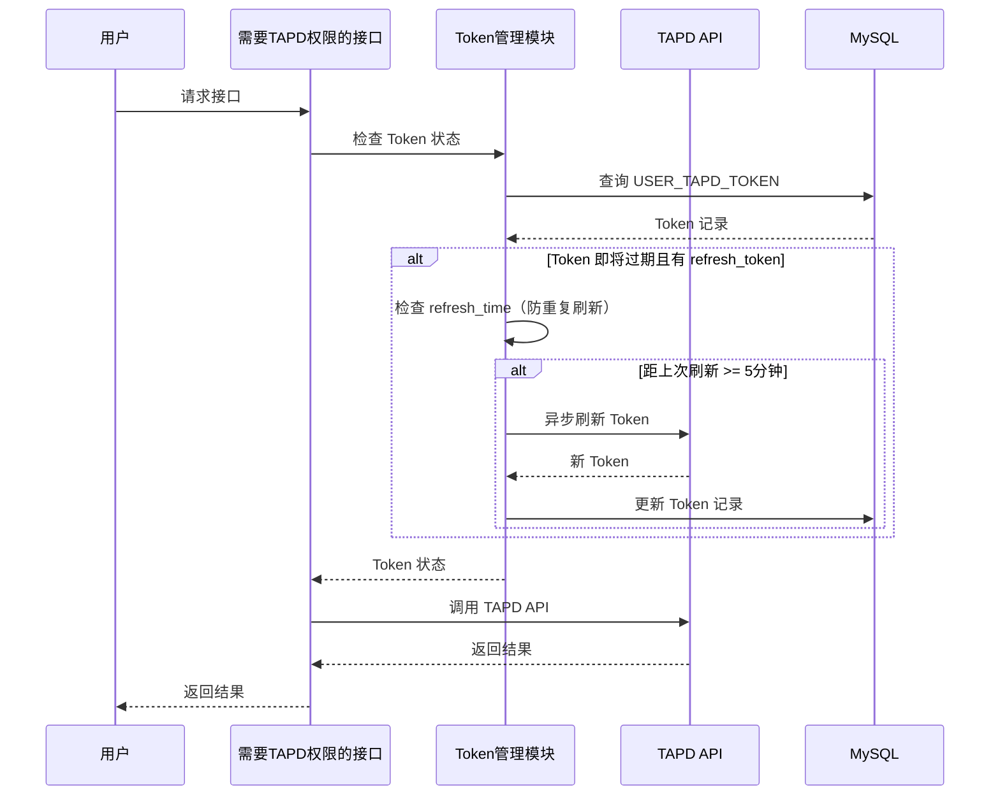

# S-07 异步刷新 Token

> 状态：设计中

---

## ★ 1. 术语

| 术语 | 含义 | 引用 |
|------|------|------|
| `refresh_token` | TAPD 刷新令牌，用于获取新的 access_token | 见父文档 §4.3 |
| `expires_at` | Token 过期时间 | 见父文档 §4.3 |
| `refresh_time` | 上次刷新时间，用于防重复刷新 | 见 S-01 §4b.1 |

---

## ★ 2. 现状（AS-IS）

### 2.1 现状描述

当前蓝鲸监控平台无 Token 刷新机制。用户 access_token 过期后需要重新授权，体验差。

### 2.2 痛点

- 痛点 1：Token 过期后用户需要手动重新授权，体验差
- 痛点 2：无法自动刷新 Token，导致功能中断
- 痛点 3：用户无感知 Token 过期，直到功能不可用才发现

---

## ★ 3. 方案（TO-BE）

### 3.1 方案概述

实现异步刷新 Token 机制：当用户访问需要 TAPD 权限的接口时，检查 Token 是否即将过期（剩余 <= 30 分钟），如果即将过期且有 refresh_token，则在后台异步调用 TAPD 刷新接口，更新 Token 后继续使用。

### 3.2 关键决策点

| 决策 | 选择 | 理由 | 备选方案 | 否决原因 |
|------|------|------|----------|----------|
| 刷新触发方式 | 用户访问时触发 | 利用用户访问时机，避免额外定时任务 | 定时任务 | 增加系统复杂度 |
| 刷新提前量 | 过期前 30 分钟 | 避免用户感知中断 | 过期时刷新 | 可能导致功能中断 |
| 防重复刷新策略 | 检查 refresh_time | 准确记录上次刷新时间，与 update_time 解耦（update_time 可能因其他更新而变） | update_time | update_time 可能因非刷新操作更新，导致误判 |
| 刷新失败处理 | 保留原 token | 刷新失败原因多样，保留 token 可用于重试 | 清除 token | 可能导致用户重新授权 |

### 3.3 行为差异对照表

| 场景 | AS-IS | TO-BE | 影响 |
|------|-------|-------|------|
| Token 过期 | 用户重新授权 | 自动刷新 Token | 体验优化 |
| 刷新失败 | 无处理 | 保留原 Token，下次重试 | 健壮性提升 |
| 并发刷新 | 无处理 | 防重复刷新机制 | 并发安全 |

---

## ★ 4a. 接口设计

### 4a.1 对外接口

本子需求无新增对外接口，但会影响以下接口的行为：

| 接口 | 影响 | 说明 |
|------|------|------|
| B-01 查询项目列表 | 调用前检查 Token 状态 | 如果即将过期，触发异步刷新 |
| 其他需要 TAPD 权限的接口 | 调用前检查 Token 状态 | 同上 |

### 4a.2 内部协作接口

| 接口 | 调用方 | 被调用方 | 说明 |
|------|--------|----------|------|
| `check_token_status()` | 需要 TAPD 权限的接口 | Token 管理模块 | 检查 Token 状态 |
| `async_refresh_token()` | Token 管理模块 | TAPD API | 异步刷新 Token（调用 `/tokens/refresh_token`） |
| `update_token()` | Token 管理模块 | 数据库操作 | 更新 Token 记录 |

### 4a.3 外部依赖（TAPD API）

#### `RefreshTokenResource`

```python
class RefreshTokenResource(Resource):
    """TAPD 刷新用户态 access_token"""
    
    class RequestSerializer(serializers.Serializer):
        refresh_token = serializers.CharField(label="刷新令牌")
        grant_type = serializers.CharField(label="授权类型", default="refresh_token")
    
    class ResponseSerializer(serializers.Serializer):
        access_token = serializers.CharField(label="新的用户态访问令牌")
        expires_in = serializers.IntegerField(label="有效期（秒）")
        token_type = serializers.CharField(label="令牌类型")
        scope = serializers.CharField(label="授权范围")
        refresh_token = serializers.CharField(label="新的刷新令牌", required=False)
        resource = serializers.JSONField(label="授权用户信息")
    
    def perform_request(self, validated_request_data):
        # POST http://apiv2.tapd.woa.com/tokens/refresh_token
        # Header: Authorization: Basic base64(client_id:client_secret)
        pass
```

> **Demo API 返回示例**：
> ```json
> {
>   "status": 1,
>   "data": {
>     "access_token": "new_access_token_abc123def456",
>     "expires_in": 7200,
>     "token_type": "Bearer",
>     "scope": "read",
>     "refresh_token": "new_refresh_token_xyz789",
>     "resource": {
>       "type": "user",
>       "user_id": "user123"
>     }
>   },
>   "info": "success"
> }
> ```

| 属性 | 值 |
|------|-----|
| URL | `POST http://apiv2.tapd.woa.com/tokens/refresh_token` |
| 鉴权 | **Basic Auth**（`base64(client_id:client_secret)`） |
| 返回格式 | `{"status": 1, "data": {...}, "info": "success"}` |

> 说明：与 S-02 的 `RequestTokenResource` 共用 `TapdBaseResource`（占位基类），鉴权方式、返回格式完全一致。

### 4a.4 契约变更声明

| 变更类型 | 接口 | 变更内容 | 影响的子需求 |
|---------|------|---------|------------|
| 修改 | B-01 查询项目列表 | 调用前检查 Token 状态 | S-04 |
| 修改 | 其他需要 TAPD 权限的接口 | 调用前检查 Token 状态 | S-04, S-06 |

---

## +5. 时序图



---

## +6. 异常处理

| 场景 | 行为 | 是否对外暴露 |
|------|------|:----------:|
| TAPD API 刷新失败 | 记录错误日志，保留原 Token | 否 |
| refresh_token 无效 | 记录错误日志，保留原 Token | 否 |
| 数据库更新失败 | 事务回滚，不影响用户当前请求 | 否 |
| 并发刷新冲突 | 使用数据库行锁，避免重复刷新 | 否 |
| 多次重试失败 | Token 最终过期后，用户需重新授权 | 是 |

---

## +10. 影响范围

| 影响对象 | 影响类型 | 影响描述 | 是否破坏性变更 |
|---------|---------|---------|:----------:|
| Token 管理模块 | 行为变更 | 新增异步刷新逻辑 | 否 |
| 需要 TAPD 权限的接口 | 行为变更 | 调用前检查 Token 状态 | 否 |
| 数据库操作 | 数据变更 | 更新 Token 记录 | 否 |

---

## +11. 待定问题

| 编号 | 问题 | 影响范围 | 建议决策时间 | 负责人 |
|------|------|---------|------------|--------|
| T-01 | TAPD refresh_token 接口地址和参数 | S-07 | 实施前 | 后端开发 |
| T-02 | 异步刷新的实现方式（线程/协程/消息队列） | S-07 | 实施前 | 后端开发 |
| T-03 | Token 过期后的清理策略 | S-07 | 实施前 | 后端开发 |
