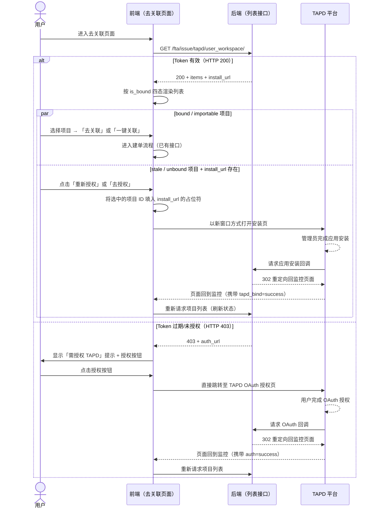

# 场景：加载 TAPD 项目列表

> 所属功能：TAPD 授权与建单
> 角色：普通用户 / 蓝鲸监控业务管理员
> 前置条件：用户已进入监控告警处理页面，正在执行「去关联 TAPD 工单」操作

---

## 调用序列

### 步骤 1：页面加载，请求 TAPD 项目列表

→ 触发时机：去关联页面的生命周期挂载时
→ 调用接口：`GET /fta/issue/tapd/user_workspace/`
→ 请求参数：

```json
{
  "bk_biz_id": 2,
  "page": 1,
  "page_size": 20
}
```

| 参数名 | 类型 | 必填 | 默认值 | 说明 |
|--------|------|:----:|:------:|------|
| `bk_biz_id` | `integer` | 是 | — | 蓝鲸业务 ID，从当前 URL 或状态管理中读取 |
| `page` | `integer` | 否 | 1 | 页码，必须 ≥ 1 |
| `page_size` | `integer` | 否 | 20 | 每页数量，范围 1~100 |

→ 成功响应（HTTP 200）：

```json
{
  "result": true,
  "code": 200,
  "message": "OK",
  "data": {
    "total": 42,
    "items": [
      {
        "workspace_id": "69990779",
        "workspace_name": "蓝鲸监控项目",
        "is_bound": "bound"
      },
      {
        "workspace_id": "69990780",
        "workspace_name": "运维自动化项目",
        "is_bound": "importable"
      },
      {
        "workspace_id": "69990781",
        "workspace_name": "测试项目",
        "is_bound": "stale"
      },
      {
        "workspace_id": "69990782",
        "workspace_name": "新项目",
        "is_bound": "unbound"
      }
    ],
    "has_more": true,
    "install_url": "https://tapd.woa.com/oauth/open_app_install?client_id=bkmonitor_tapd&test=1&cb=https%3A%2F%2Fmonitor.example.com%2Fapi%2Fv4%2Fissue%2Ftapd%2Fapp_install_callback%2F%3Fsigned_state%3DeyJ4e...#selected_workspace_id={workspace_id}",
    "method": "GET"
  }
}
```

| 字段 | 类型 | 说明 |
|------|------|------|
| `total` | `integer` | 项目总数（不分页统计） |
| `items` | `WorkspaceItem[]` | 项目列表，按四态标记 |
| `has_more` | `boolean` | 是否还有更多数据 |
| `install_url` | `string`（可能缺失） | 当列表中存在 `stale` 或 `unbound` 项目时返回，否则为空或不返回 |
| `method` | `string` | `install_url` 的请求方式，固定为 `GET` |

→ 成功后：按 `is_bound` 四态渲染每个项目的操作按钮
→ 失败时：
  - HTTP 403，响应体含 `auth_url`：跳转 OAuth 授权（见 [tapd-oauth-authorization.md](tapd-oauth-authorization.md)）
  - HTTP 500：显示 TAPD 服务异常提示  
  - HTTP 401（蓝鲸登录过期）：清除本地登录态，跳转统一登录

---

### 步骤 2：按项目四态渲染可操作按钮

每个项目根据其 `is_bound` 值展示不同的状态标签和操作按钮：

| `is_bound` | 状态标签文案 | 标签颜色建议 | 操作按钮 | 按钮点击行为 |
|-----------|------------|------------|---------|------------|
| `bound` | 已关联 | 绿色 | 「去关联」 | 进入 TAPD 工单建单流程（调用已有接口，不在本文档范围内） |
| `importable` | 可关联 | 蓝色 | 「一键关联」 | 先完成项目与当前业务的绑定，再进入建单流程 |
| `stale` | 授权失效 | 橙色/黄色 | 「重新授权」 | 打开应用安装页，让 TAPD 管理员重新安装授权 |
| `unbound` | 未授权 | 灰色 | 「去授权」 | 打开应用安装页，让 TAPD 管理员完成首次安装授权 |

→ 触发时机：列表接口返回 200，渲染列表项时
→ 按钮显示条件除状态外，还受 `install_url` 字段存在性影响。当 `install_url` 不存在时，`stale` / `unbound` 状态的项目可仅显示文字提示，不提供跳转按钮。

---

## 调用流程图



---

## 空状态

- `items` 为空数组 → 展示「暂无 TAPD 项目」
- `install_url` 不存在 → 不展示「去授权」引导区（全部项目已处于 `bound` 或 `importable` 状态）
- `total === 0` → 隐藏分页组件

---

## 常见问题

### Q1：`importable` 状态的「一键关联」与 `bound` 状态的「去关联」有什么区别？

`bound` 表示该项目已完成与当前蓝鲸监控业务的绑定，且 TAPD 侧应用授权有效，用户可直接进入建单流程。

`importable` 表示 TAPD 侧已授权蓝鲸监控应用，但尚未与当前蓝鲸业务建立一对一的绑定关系。点击「一键关联」后，前端需先调用后端完成绑定，绑定成功后再进入建单流程。

> ⚠️ **已知问题**：当前 API 设计中缺少独立的「创建绑定」接口。一期实现中曾设想将绑定动作合并进入建单接口处理（建单时自动完成绑定），但该方案存在隐式行为、错误不透明等缺陷。详见 [../TODO-待办事项.md](../TODO-待办事项.md) —— **待后续迭代补充绑定接口设计后，本文档将同步更新**。在前端预留 `importable` 状态的处理逻辑即可。

### Q2：为什么 `stale` / `unbound` 的项目需要打开新窗口（`window.open`）？

这两个状态说明 TAPD 侧尚未（或已失效）授权蓝鲸监控应用。授权安装操作需要在 TAPD 平台内由拥有管理员权限的用户完成，通常在另一个页面或另一个浏览器中操作。前端打开新窗口跳转到 TAPD 的安装页即可，安装完成后 TAPD 会自动回调后端，后端再跳回监控页面。

### Q3：`install_url` 什么时候有、什么时候没有？

当用户可见的 TAPD 项目列表中，包含至少一个 `stale` 或 `unbound` 状态的项目时，后端在响应中会返回 `install_url`。如果全部项目都是 `bound` 或 `importable` 状态，`install_url` 字段为空或不返回。

### Q4：列表加载后，用户操作授权按钮（`stale`/`unbound`），授权完成后页面如何刷新？

安装授权完成后，TAPD 会回调后端，后端 302 重定向回到监控前端页面。前端页面加载时，应检测 URL 是否带有 `tapd_bind=success` 参数。若带此参数，说明授权刚完成，自动重新请求列表接口刷新状态。之前 `stale` / `unbound` 的项目应变为 `bound` 状态。
