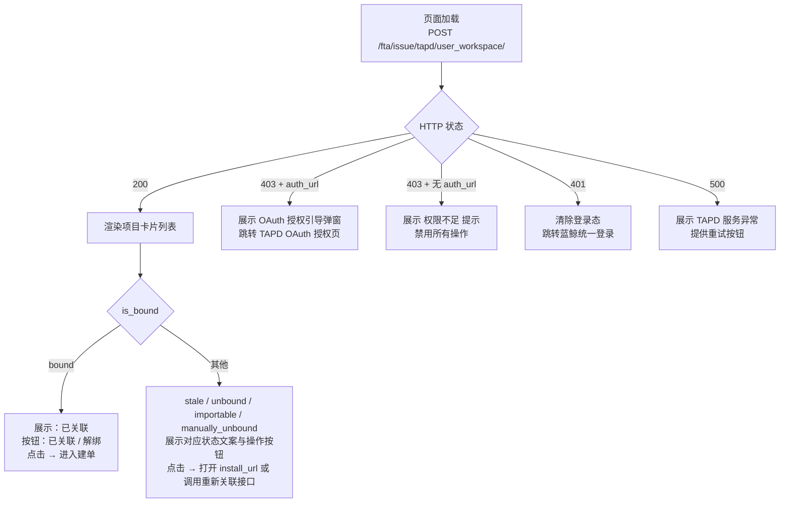

## 简要的调用流程图

用户进入此页面前，授权状态检查可能已发现以下情况，但**本场景仅处理列表接口调用本身**：



---

## 调用序列

### 步骤 1：页面加载，请求 TAPD 项目列表

→ 触发时机：去关联页面（P-03）生命周期挂载时
→ 调用接口：`POST /fta/issue/tapd/user_workspace/`
→ Content-Type: `application/json`
→ 请求 Body：

```json
{
  "bk_biz_id": 2,
  "success_url": "https://monitor.example.com/#/tapd/workspace",
  "error_url": "https://monitor.example.com/error/tapd"
}
```

| 参数名 | 类型 | 必填 | 默认值 | 说明 |
|--------|------|:----:|:------:|------|
| `bk_biz_id` | `integer` | 是 | — | 蓝鲸业务 ID，从当前 URL 或状态管理中读取 |
| `success_url` | `string` | 是 | — | 含 `#` 的前端页面地址，OAuth 或应用态授权回调成功后（或失败后），后端 302 重定向到该地址 |
| `error_url` | `string` | 否 | `success_url` | 授权失败时的回退地址，未传时回退到 `success_url`。建议前端传与 `success_url` 不同的地址以区分成功/失败；若传相同地址，需通过 sessionStorage 标记明确区分 |

> `success_url` / `error_url` 替代了老版 `redirect_uri_real` / `redirect_uri_verify` 双地址，由后端自行生成传给 TAPD 的校验地址。

→ 成功响应（HTTP 200）：

```json
{
  "result": true,
  "code": 200,
  "message": "OK",
  "data": {
    "total": 42,
    "items": [
      {
        "workspace_id": "69990779",
        "workspace_name": "IEG-登录服务",
        "is_bound": "bound"
      },
      {
        "workspace_id": "69990780",
        "workspace_name": "平台中台",
        "is_bound": "importable"
      },
      {
        "workspace_id": "69990781",
        "workspace_name": "游戏运营平台",
        "is_bound": "stale"
      },
      {
        "workspace_id": "69990782",
        "workspace_name": "新项目",
        "is_bound": "unbound"
      },
      {
        "workspace_id": "69990783",
        "workspace_name": "历史已解绑项目",
        "is_bound": "manually_unbound"
      }
    ],
    "install_url": "https://tapd.woa.com/oauth/open_app_install?client_id=bkmonitor_tapd&test=1&cb=https%3A%2F%2Fmonitor.example.com%2Ffta%2Fissue%2Ftapd%2Fapp_install_callback%2F%3Fsigned_state%3DeyJ4e...#selected_workspace_id={workspace_id}"
  }
}
```

| 字段 | 类型 | 说明 |
|------|------|------|
| `total` | `integer` | 项目总数（不分页统计） |
| `items` | `WorkspaceItem[]` | 项目列表，按五态标记 |
| `install_url` | `string`（可能缺失） | 当列表中存在 `stale` 或 `unbound` 项目时返回，否则为空或不返回 |

→ 成功后：按 `is_bound` 五态渲染每个项目的操作按钮

→ 失败响应示例：

**403 — 个人 Token 缺失/过期（含 `auth_url`）**

```json
{
  "result": false,
  "code": 403,
  "message": "TAPD 用户态授权未生效",
  "data": {
    "auth_url": "https://tapd.woa.com/oauth/authorize?client_id=bkmonitor_tapd&response_type=code&redirect_uri=https%3A%2F%2Fmonitor.example.com%2Ffta%2Fissue%2Ftapd%2Foauth_callback%2F&scope=story%23read+story%23write+bug%23read+bug%23write&state=eyJub25jZSI6ImFiYzEyMyIsImJrX2Jpel9pZCI6MiwiYmtfdGVuYW50X2lkIjoiZGVmYXVsdCIsInNwYWNlX3VpZCI6ImJrY2NfXzIiLCJpbml0aWF0b3IiOiJhcnRlbWlzIiwiZXhwIjoxNzE5MDcyMDAwLCJzdWNjZXNzX3VybCI6Imh0dHBzOi8vbW9uaXRvci5leGFtcGxlLmNvbS8jL3RhcGQvd29ya3NwYWNlIiwiZXJyb3JfdXJsIjoiaHR0cHM6L21vbml0b3IuZXhhbXBsZS5jb20vLi4uIiwiYmFja2VuZF9jYWxsYmFjayI6Imh0dHBzOi8vbW9uaXRvci5leGFtcGxlLmNvbS9mdGEvaXNzdWUvdGFwZC9vYXV0aF9jYWxsYmFjay8ifQ==...
  }
}
```
→ 含 `auth_url` 字段，前端需展示 OAuth 授权引导弹窗（见 ui-mockup.md P-02），点击跳转 `auth_url`。

**403 — IAM 权限不足（无 `auth_url`）**

```json
{
  "result": false,
  "code": 403,
  "message": "权限不足"
}
```
→ 无 `auth_url` 字段，前端展示「您没有权限访问该业务的 TAPD 关联功能」，禁用所有操作按钮。

**401 — 蓝鲸登录态过期**

```json
{
  "result": false,
  "code": 401,
  "message": "用户未登录或登录态已过期"
}
```
→ 清除本地 token，跳转蓝鲸统一登录页。

**500 — TAPD API 异常或后端内部错误**

```json
{
  "result": false,
  "code": 500,
  "message": "TAPD 服务暂时不可用，请稍后重试"
}
```
→ 展示错误提示 + [重试] 按钮。

> **关键：区分两种 403** —— 响应体中是否包含 `auth_url` 字段。含 `auth_url` = Token 过期需重新 OAuth；不含 `auth_url` = IAM 权限不足无操作权限。

---

### 步骤 2：按项目五态渲染可操作按钮

每个项目根据其 `is_bound` 值展示不同的**状态文案**和**操作按钮**。

状态文案与操作按钮严格对应 UI 设计稿 P-03：

| `is_bound` | 状态文案（灰色小字） | 操作按钮  | 按钮行为 | 对应 UI 设计稿 |
|------------|---------------------|-------|---------|--------------|
| `bound` | 已关联 | [已关联] / [解绑] | 点击「已关联」进入建单流程；点击「解绑」取消本地关联 | P-03 |
| `importable` | TAPD 侧已安装应用 · 后端自动尝试关联中 | [去关联] | 跳转应用安装页重新安装 | P-03 |
| `stale` | TAPD 侧已解绑，需重新关联 | [去关联] | 跳转应用安装页重新安装| P-03 |
| `unbound` | 用户态授权已拉取 · 需完成蓝鲸监控关联项目授权 | [去关联] | 跳转应用安装页重新安装| P-03 |
| `manually_unbound` | 已手动解绑，但 TAPD 侧授权未撤，可重新关联 | [重新关联] | 调用重新关联接口，成功后项目变为 `bound` | P-03 |

→ 前端布局参考（来自设计稿）：

```

┌──────────────────────────────────────────┐
│  游戏运营平台                               │
│  用户态授权已拉取 · 需完成蓝鲸监控关联项目授权 │
│                                   [去关联]  │
└──────────────────────────────────────────┘

全部卡片以列表形式纵向排列，每项之间有间距。
```
---

## 空状态

| 条件 | 前端行为 | 对应 UI |
|------|---------|---------|
| `items` 为空数组 | 展示「暂无 TAPD 项目」 | P-03 空白态 |
| `install_url` 不存在 | 不展示「去关联」引导区（全部项目已处于 `bound` 或 `importable` 状态） | — |
| `total === 0` | 隐藏分页组件 | — |

---

## 失败态（参考 ui-mockup.md P-02）

| 场景 | 前端展示 | 交互 |
|------|---------|------|
| 403 + `auth_url` | 弹窗：「蓝鲸监控需要先拉取您在 TAPD 有权限的项目列表」+ [同意授权并拉取项目] [取消授权] | 点击主按钮跳转 TAPD OAuth |
| 403 + 无 `auth_url` | 页面内区域：「您没有权限访问该业务的 TAPD 关联功能」，所有卡片置灰，操作按钮禁用 | 用户无法继续操作 |
| 401 | 统一登录页 | 登录后返回 |
| 500 | 页面内区域：「TAPD 服务暂时不可用，请稍后重试」+ [重试] 按钮 | 点击重试重新请求列表 |

---

## 常见问题

### Q1：`install_url` 什么时候有、什么时候没有？

当用户可见的 TAPD 项目列表中，包含至少一个 `stale` 或 `unbound` 状态的项目时，后端在响应中会返回 `install_url`。如果全部项目都是 `bound` 或 `importable` 状态，`install_url` 字段为空或不返回。

---

## 解绑 TAPD 项目

### 接口地址

```
POST /fta/issue/tapd/unbind_workspace
```

### 请求 Body

```json
{
    "bk_biz_id": 2,
    "workspace_id": "69990779"
}
```

| 字段 | 类型 | 必填 | 说明 |
|------|------|:----:|------|
| `bk_biz_id` | `integer` | 是 | 蓝鲸业务 ID |
| `workspace_id` | `string` | 是 | 要解绑的 TAPD 项目 ID |

### 请求头

```
X-CSRFToken: {{csrf_token}}
Content-Type: application/json
Cookie: {{蓝鲸登录态 Cookie}}
```

### 成功响应（HTTP 200）

```json
{
  "result": true,
  "code": 200,
  "message": "OK",
  "data": {
    "success": true
  }
}
```

### 前端交互

- 点击 `bound` 状态卡片上的「解绑」按钮（仅对有 MANAGE_EVENT 权限的用户展示）
  > 前端可通过列表接口的 HTTP 状态码或业务导航/菜单权限接口判断当前用户是否拥有 `MANAGE_EVENT` 权限。若用户无此权限，则隐藏「解绑」按钮仅展示「已关联」。如无法前置判断权限，可始终展示按钮但用户无权限时后端返回 403 并提示「无操作权限」
- 弹出二次确认弹窗：「取消后，TAPD 侧授权不会被撤销，但蓝鲸侧不再与该 TAPD 项目关联。确认解绑吗？」
- 用户确认后发送 POST 请求
- 接口成功后刷新列表，该项目状态变为 `manually_unbound`（TAPD 侧授权仍在，随时可重新关联）
- 项目转台变为manually_unbound 时，页面展示依然为 “去关联”  但是不用走“install_url” ，而是直接走“/fta/issue/tapd/rebind_workspace”重新关联即可。

### 错误码（HTTP ≠ 200）

| HTTP Code | `code` | `message` | 触发条件 |
|-----------|--------|-----------|---------|
| 400 | `MISSING_KEY_FIELD` | missing bk_biz_id or workspace_id | Body 中 `bk_biz_id` 或 `workspace_id` 缺失 |
| 403 | `PERMISSION_DENIED` | No permission for this action | 当前用户对该业务无 MANAGE_EVENT 权限 |
| 404 | `RESOURCE_NOT_FOUND` | Workspace not found for this biz | `workspace_id` 不是当前业务下的关联项目 |

---

## 重新关联 TAPD 项目

### 接口地址

```
POST /fta/issue/tapd/rebind_workspace
```

### 请求 Body

```json
{
    "bk_biz_id": 2,
    "workspace_id": "69990779"
}
```

| 字段 | 类型 | 必填 | 说明 |
|------|------|:----:|------|
| `bk_biz_id` | `integer` | 是 | 蓝鲸业务 ID |
| `workspace_id` | `string` | 是 | 要重新关联的 TAPD 项目 ID（仅限 `manually_unbound` 状态的项目） |

### 请求头

```
Cookie: {{蓝鲸登录态 Cookie}}
X-CSRFToken: {{csrf_token}}
Content-Type: application/json
```

### 成功响应（HTTP 200）

```json
{
  "result": true,
  "code": 200,
  "message": "OK",
  "data": {
    "success": true,
    "workspace": {
      "id": "69990779",
      "name": "IEG-登录服务"
    }
  }
}
```

### 前端交互

- 点击 `manually_unbound` 状态卡片上的「去关联」按钮（仅对有 MANAGE_EVENT 权限的用户展示）。权限判断同解绑按钮。
- 发送 POST 请求。
- 接口成功后刷新列表，该项目状态变为 `bound`（进入可用状态）。

### 错误码（HTTP ≠ 200）

| HTTP Code | `code` | `message` | 触发条件 |
|-----------|--------|-----------|---------|
| 400 | `MISSING_KEY_FIELD` | missing bk_biz_id or workspace_id | Body 中 `bk_biz_id` 或 `workspace_id` 缺失 |
| 403 | `PERMISSION_DENIED` | No permission for this action | 当前用户对该业务无 MANAGE_EVENT 权限 |
| 403 | `USER_AUTH_EXPIRED` | TAPD 用户态授权已失效或未授权，请先完成授权 | 当前用户的 TAPD 用户态 Token 已过期或未授权（OAuth 未做过） |
| 403 | `USER_AUTH_INVALID_422` | TAPD 用户态授权已失效（422），请重新完成授权 | 用户态 Token 刚被 TAPD 返回 422 拒绝，后端已清理该 Token |
| 404 | `RESOURCE_NOT_FOUND` | Workspace not found for this biz | `workspace_id` 不是当前业务下已解绑的项目（无双绑记录） |

---

## 版本记录

| 版本 | 日期 | 作者 | 变更 |
|------|------|------|------|
| 1 | 2026-06-22 | AI | 初始创建 |
| 2 | 2026-06-23 | AI | 增加权限判断说明；修正 `importable` 状态描述 |
| 3 | 2026-06-29 | AI | B-01 接口由 GET 改为 POST，参数改为 `success_url`/`error_url`；删除 `method` 返回字段 |
| 4 | 2026-07-01 | AI | 项目状态扩展为五态，新增 `manually_unbound`；增加重新关联接口文档；解绑成功后状态更新为 `manually_unbound` |
